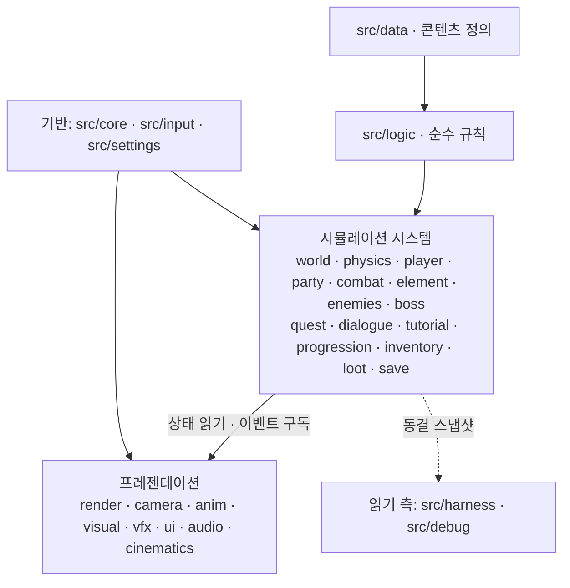
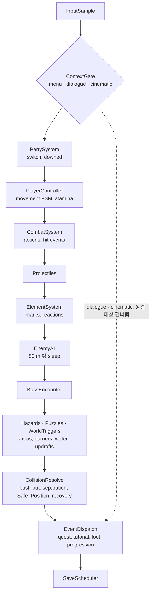
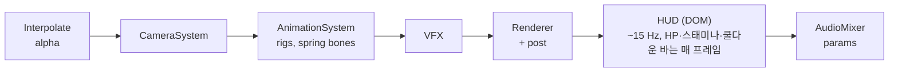
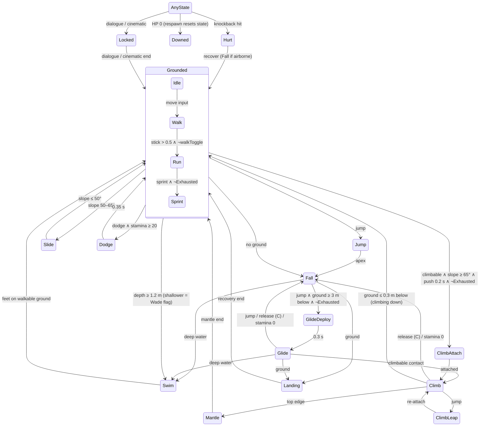
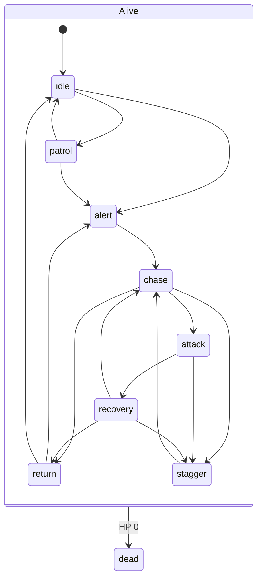
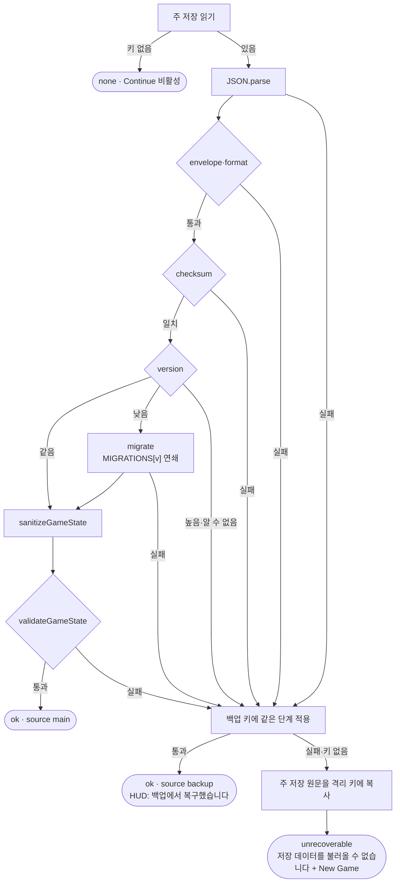

# Design Document

## Overview

이 문서는 `Skyshard: Echoes of the Wild`의 구현 설계로, requirements.md의 Req 1–43과 표 A–D를 충족하기 위한 아키텍처, 컴포넌트 인터페이스, 데이터 모델, 정확성 속성, 오류 처리, 테스트 전략을 정의한다. 대상은 설치 없이 브라우저에서 실행되는 20~30분 분량의 3D stylized anime-fantasy 오픈월드 액션 RPG다. 방랑자 Kairen은 변경 마을 Thistlewick에 도착해 Isla(Tide 궁수), Wren(Gale 글레이브, 광역 제어), Talus(Terra 방패, 지원)를 동료로 맞고, Verdant Reach·Ember Ravine·Azure Highlands의 Challenge_Area인 Hollowroot Shrine·Cinderspire·Starfall Observatory를 차례로 돌파해 Skyshard 3개를 모은다. 이어 Shardfall Crater의 Resonance_Altar를 활성화하고 Starlit_Stair를 올라 부유 성소 Astral Sanctum에서 3단계 보스 Caelith를 쓰러뜨리면 모험이 끝난다. 수치는 요구사항의 초기 목표값을 따르고, 설계 중 조정한 항목은 요구사항 수치 조정 기록에 모은다.

### 설계 원칙

- **안정성 우선**: 캐릭터 이동은 동역학 물리 시뮬레이션이 아닌 예측 가능한 kinematic character controller로 처리하고, 충돌은 캡슐·구·박스 같은 단순 primitive로 구성해 끼임·관통·튕김을 구조적으로 줄인다.
- **순수 로직 계층 분리**: `src/logic`과 `src/data`는 three.js와 DOM에 의존하지 않는 순수 TypeScript로 작성해 Vitest와 fast-check로 단위 테스트·속성 기반 테스트를 수행하고, 렌더링·UI·오디오 계층은 이 계층의 상태를 읽어 표현한다.
- **데이터 주도 콘텐츠**: 캐릭터, 속성 반응, 적, 퀘스트, 대사, POI, 보상표를 `src/data`의 선언적 데이터로 정의하고 시스템 코드는 이를 해석해 실행한다. 수치·콘텐츠 조정은 데이터 수정만으로 가능하며, ID 참조와 수치 범위의 무결성은 테스트로 검증한다.
- **자체 절차적 제작**: 캐릭터·적·보스는 외부 에셋 없이 코드로 절차적으로 제작한다. CC0 에셋은 환경 소품과 일부 효과음에만 선택적으로 쓰고 Credits 파일에 기록하며, 로드에 실패하면 절차적 생성이나 Web Audio 합성으로 대체해 에셋 유무와 관계없이 동작한다. 캐릭터·적·보스·NPC의 시각 모델은 Visual_Manifest 기반 교체 구조(Visual_Provider) 뒤에 두어, 기본 절차적 모델을 나중에 glTF/GLB·FBX·VRM 파일로 manifest만 바꿔 교체할 수 있다(Req 43).
- **최소 전체 경로 우선**: Title→Village→Open World→Combat→Skyshard×3→Boss→Victory 경로를 먼저 끝까지 동작시킨 뒤 시스템과 비주얼을 확장한다(Req 2.9, A18). 일정이 부족하면 시스템이 아니라 콘텐츠 양을 먼저 줄인다.
- **실제 실행 검증**: Playwright 봇이 키보드·마우스 입력 이벤트만으로 Title부터 Victory까지 완주하며, 진행 확인은 읽기 전용 Test_Harness로만 하고 주요 지점마다 스크린샷을 남긴다.

### 핵심 기술 결정

- **런타임·빌드**: TypeScript strict 모드 + Vite + Three.js(WebGL2)를 사용하고, 하이브리드 GPU 환경에서 고성능 GPU가 선택되도록 `powerPreference: 'high-performance'`를 지정한다(A1, A17). `npm run dev`로 개발 서버를, `npm run build`·`npm run preview`로 정적 빌드를 실행한다(A2).
- **게임 루프**: 시뮬레이션은 고정 60 Hz 스텝으로 진행하고 렌더링은 이전·현재 상태를 보간해 표시하므로, 프레임률이 달라져도 이동·전투 판정은 같은 스텝 단위로 일관되게 동작한다.
- **입력**: 키보드+마우스(pointer lock)를 우선하고 Gamepad API를 기본 지원하며 터치·모바일은 지원하지 않는다(A3). 방향키 카메라 회전을 제공해 pointer lock 없이도 모든 조작이 가능하다(ADJ-02).
- **UI**: HUD·메뉴·대화창은 캔버스 위 DOM 오버레이로 구현하고, 게임 전용 CSS와 시스템 한국어 폰트 스택을 사용한다(A4).
- **시각 모델 교체**: 엔티티 시각 모델은 `VisualProvider` 인터페이스로 만들고, 포즈 클립은 VRM humanoid bone 이름 기반 공통 골격(Humanoid_Skeleton)으로 정의해 외부 humanoid 모델에 retarget한다. glTF/GLB·FBX는 three.js 기본 로더, VRM은 `@pixiv/three-vrm`을 필요할 때만 불러온다(Req 43).
- **오디오**: 음악과 효과음은 Web Audio API로 절차적으로 합성하고, 선택적 CC0 효과음은 로드에 성공했을 때만 함께 쓴다.
- **저장**: localStorage에 스키마 버전을 포함해 Milestone마다 자동 저장하고, 스키마 검증에 실패하거나 데이터가 손상되면 백업 슬롯으로 복구한다(A7).
- **검증·디버그**: 읽기 전용 Test_Harness는 게임 상태 조회만 허용해 테스트가 진행에 개입하지 못하게 하고, 상태를 변경하는 Debug_Tools는 `?debug=1`로 실행했을 때만 활성화한다.
- **backend 없음**: 서버 API나 계정 없이 정적 파일만으로 동작하며, 진행 데이터는 브라우저에만 저장된다.

### 문서 구성

- 요구사항 수치 조정 기록: 요구사항 대비 수치·키·동작 조정 내역과 근거
- Architecture: 계층 구조, 모듈 의존 방향, 게임 루프, 상태 흐름
- Components and Interfaces: 시스템별 책임과 인터페이스
  - World·Terrain·Collision
  - Player Controller
  - Camera
  - Party·Combat
  - Element·Reactions
  - Enemies·AI
  - Boss Caelith
  - Quest·Dialogue·Tutorial
  - Challenge Areas·Puzzles
  - NPC·Village·Side Quests·Map
  - Progression·Inventory·Loot
  - World Density·POI
  - Rendering·Art·Assets
  - Visual Construction·Animation·VFX
  - UI·HUD
  - Audio·Save·Settings
  - Cinematics·Debug·Test Harness
- Data Models: 콘텐츠 데이터 정의와 저장 데이터 스키마
- Correctness Properties: 속성 기반 테스트로 검증할 불변식
- Error Handling: 오류 감지, 대체 동작, 복구 절차
- Testing Strategy: Vitest·fast-check 로직 검증과 Playwright 완주·스크린샷 검증

## 요구사항 수치 조정 기록

설계 과정에서 요구사항의 의도는 유지하되 수치·키·동작을 조정한 항목과 그 근거를 기록한다.

| ID | 요구사항 | 원래 | 조정 | 이유 |
|---|---|---|---|---|
| ADJ-01 | Req 16.1, 35.1 | 걷기 토글 Ctrl | 걷기 토글 X | W(전진)·Shift(질주)와 함께 누르면 Ctrl+W / Ctrl+Shift+W가 되어 브라우저 탭·창이 닫히며, 이 단축키는 페이지에서 막을 수 없음 |
| ADJ-02 | Req 35.1 (추가) | 카메라 조작은 마우스·게임패드 | 방향키(←→↑↓)로도 카메라 회전, 항상 사용 가능 | pointer lock 없이도 완전한 조작 가능, 키보드 전용 플레이 접근성 확보, E2E 봇이 입력 이벤트만으로 카메라 조작 |
| ADJ-03 | Req 31.5, 31.9 | Esc로 Pause 열기 | pointer lock 중 Esc는 브라우저가 lock 해제에 사용하므로, 게임플레이 중 lock 해제를 감지하면 Pause를 연다. lock이 없을 때는 Esc keydown으로 Pause를 토글한다. 재잠금은 캔버스 클릭으로만 요청하며, Chrome의 재잠금 대기(약 1초) 때문에 실패하면 "클릭하여 계속" 안내를 유지한다 | 브라우저 pointer lock 보안 정책 |
| ADJ-04 | Req 7.2, 21.11 | Esc로 연출 건너뛰기 | 연출 시작 시 pointer lock을 해제해 Esc가 페이지에 전달되게 하고, Esc 또는 Space를 1초 유지하면 건너뛴다 | pointer lock 중에는 Esc 전달이 보장되지 않음 |
| ADJ-05 | Req 38.7, 35.1 | F3 성능 표시 | F3 keydown에 `preventDefault`를 적용해 브라우저 찾기를 막고, Alt·Tab·F5·F11은 사용하지 않으며, 우클릭 메뉴·휠 스크롤·가운데 버튼 자동 스크롤을 차단한다 | 브라우저 기본 동작과의 충돌 방지 |
| ADJ-06 | Req 20.1, 22.5 | 캐릭터별 체형 | 충돌 캡슐은 4명 공통(반지름 0.4 m, 높이 1.75 m), 체형 차이는 시각 모델에만 적용 | 좁은 공간에서 캐릭터 교체 시 끼임·관통 방지 |
| ADJ-07 | Req 4.5, 4.6, 4.9, 5.2 | 진입로의 Blight_Barrier로 다음 Region을 막음 | 입구 Blight_Barrier에 더해 잠긴 Region 경계 전체에 등반 불가 Blight 장막(`veil_ember`, `veil_azure`, 높이 260 m까지 충돌)을 두고, Astral Sanctum은 활성화 전 봉인 구체 `seal_sanctum`으로 막음 | 자유 등반·활강으로 게이트를 우회해 진행 순서가 깨지는 것을 방지 |
| ADJ-08 | Req 25.5, 25.8 | 반응 시 기존 표식 소모, 같은 반응은 1초에 1회 | 반응을 일으킨 Element는 새 표식으로 남지 않으며, 빈도 제한에 걸린 적용은 반응 없이 기존 표식을 유지 | 표식 상태를 예측 가능하게 하고 무한 연쇄를 방지 |
| ADJ-09 | Req 6.4, 6.5 | Starshell에 속성 배율 적용 | Starshell이 있는 동안 Caelith HP 대신 방어막이 피해를 흡수하고, 파괴 후 6초 무력화와 vulnerable window(Phase 1 연속기 후 Stagger, Astral Sweep 후) 동안에는 방어막을 억제하고 받는 피해 150% | Phase 2에서 교체·반응이 필요한 이유를 분명히 함 |
| ADJ-10 | 표 A(Talus Skill) | Party 보호막(최대 HP 20%) | 보호막은 파티 단위 1개로 현재 Active_Character에 적용되고 교체해도 8초 동안 유지 | 교체 연계를 살리면서 규칙을 단순화 |
| ADJ-11 | Req 42.2 | 자동 테스트용 읽기 전용 인터페이스 | 상태 변경 기능이 없는 `window.__SKYSHARD_HARNESS__`를 모든 빌드에 설치(Debug_Tools 아님)하고 오디오 버스 상태 필드를 포함 | 배포 빌드 그대로 입력 전용 완주와 Music/SFX 독립성을 검증 |
| ADJ-12 | Req 40.1, 40.4, Req 43(추가) | 캐릭터·적·보스는 항상 자체 제작 | 기본 제공 모델은 자체 절차적 모델로 유지하고, Visual_Manifest로 glTF/GLB·FBX·VRM 모델로 교체할 수 있는 구조를 추가한다. 교체 모델은 CREDITS.md에 기록한다 | 스펙 검토 후 사용자 요청: 추후 외부 모델로 간편하게 교체 |

## Architecture

Skyshard는 백엔드 없이 정적 파일만으로 동작하는 단일 페이지 게임이며, 고정 스텝 시뮬레이션과 가변 프레임 렌더링을 분리한다. 모듈은 `data → logic → 시뮬레이션 → 프레젠테이션`의 단방향 계층으로 나눠 규칙은 브라우저 없이 테스트하고, 표현 계층은 진행 상태를 바꾸지 못하게 한다.

### 기술 스택과 의존성

| package | 용도 | 비고 |
|---|---|---|
| `three` | WebGL2 렌더링, 씬 그래프, 머티리얼, 후처리·로더 애드온 | runtime |
| `@pixiv/three-vrm` | VRM 모델 로더(humanoid 골격, MToon, spring bone, expression) | runtime, Visual_Manifest에 VRM 항목이 있을 때만 dynamic import로 불러오는 별도 chunk (Req 43.2) |
| `typescript` | strict 모드 타입 검사(`tsc --noEmit`) | dev |
| `vite` | 개발 서버, ES 모듈 번들링, 정적 빌드 | dev |
| `@types/three` | `three` 타입 정의 | dev |
| `vitest` | 단위·속성 테스트 러너(Node 환경) | dev |
| `fast-check` | 속성 기반 테스트의 입력 생성과 반례 축소 | dev, Vitest 안에서 실행 |
| `@playwright/test` | 실제 브라우저 E2E 완주·스크린샷 테스트 | dev |

| script | 명령 | 용도 |
|---|---|---|
| `dev` | `vite` | 로컬 개발 서버 실행 (Req 1.1) |
| `build` | `tsc --noEmit && vite build` | 타입 검사를 통과하면 서버 로직 없는 정적 번들을 `dist/`에 생성 (Req 1.2) |
| `preview` | `vite preview` | `dist/`를 로컬에서 제공해 개발 서버와 같은 동작 확인 (Req 1.3) |
| `test` | `vitest run` | `tests/unit`, `tests/property`를 1회 실행 |
| `test:e2e` | `playwright test` | `tests/e2e`의 브라우저 시나리오 실행 |

- 그 밖의 런타임 의존성은 없다(UI는 순수 DOM, 물리는 자체 구현). glTF/GLB·FBX 로더, `SkeletonUtils`, 검증용 `GLTFExporter`는 `three/addons`를 쓴다. 모든 패키지는 `npm install --save-exact`로 설치해 정확한 버전을 고정한다.
- 코드·에셋·폰트는 모두 동일 출처(Vite 번들 또는 `public/`)에서 불러오고 외부 CDN과 웹 폰트는 쓰지 않으며, 글꼴은 시스템 폰트 스택만 사용한다 (Req 1.4).
- Playwright 브라우저는 번들 Chromium(`npx playwright install chromium`)을 기본으로 쓰고, 설치할 수 없는 환경에서는 시스템 Edge(`channel: 'msedge'`)로 대체한다.

### 디렉터리 구조

```text
index.html                    # 단일 진입 HTML: WebGL2 캔버스 + DOM UI 루트
model-lab.html                # 개발·검증용 모델 교체 실험 페이지(게임과 별도 Vite entry)
vite.config.ts                # dev 서버·dist/ 빌드·Vitest include(unit·property) 설정
tsconfig.json                 # strict 모드 컴파일 옵션
playwright.config.ts          # E2E 설정: 번들 Chromium, msedge 채널 폴백
CREDITS.md                    # CC0 에셋 출처·라이선스 기록
public/assets/{models,audio}/ # 선택적 CC0 환경 소품 모델·효과음
src/                          # 게임 소스
├── main.ts                   # composition root: 시스템 조립, 루프 시작
├── core/                     # loop, time, rng, eventBus, math
├── input/                    # 키보드·마우스(pointer lock)·Gamepad 샘플링, 키 바인딩
├── data/                     # 콘텐츠 정의: characters, elements, reactions, enemies, boss, quests, dialogue, items, loot, world layout, pois, tutorials, cinematics, visual manifest
├── logic/                    # 순수 규칙: damage, element, stamina, questReducer, progression, inventory, save schema/sanitize/migrate, boss phase, AI 전이
├── world/                    # 지형 생성, Region, 구조물, 식생 배치, 물, 배리어, 시간대
├── physics/                  # heightfield, colliders, spatial hash, 레이·겹침 질의
├── player/                   # 이동 FSM, Stamina, Safe_Position 기록
├── camera/                   # 3인칭 카메라, 가림 회피, camera impulse
├── party/                    # 파티 교체, 캐릭터별 HP·Downed 상태
├── combat/                   # 공격·Skill·Burst 액션, 히트 판정, 투사체
├── element/                  # Element_Mark 부여, Reaction 판정·효과, Element_Shield
├── enemies/                  # 적·Elite 스폰, AI 상태 머신, 80 m 밖 sleep
├── boss/                     # Caelith Phase·패턴·arena hazard
├── quest/                    # 퀘스트 진행: 이벤트 → questReducer
├── dialogue/                 # 대화 진행, 선택지, 퀘스트 이벤트 발행
├── tutorial/                 # 튜토리얼 트리거·표시 조건
├── progression/              # 경험치·레벨업, 능력 강화 적용
├── inventory/                # 아이템 보관, 장비·소모품 사용
├── loot/                     # 드롭 추첨(시드 RNG), 보상 지급
├── ui/                       # DOM 오버레이: HUD, 메뉴, 대화창
│   └── styles/               # 게임 전용 CSS, 시스템 한국어 폰트 스택
├── audio/                    # Web Audio 믹서, 절차적 음악·효과음 합성
├── render/                   # renderer, materials, post, quality 단계
├── vfx/                      # 파티클, 히트·Reaction 이펙트
├── anim/                     # rig kit, pose tracks, spring bones
├── visual/                   # VisualProvider, Visual_Manifest 해석, humanoid retarget, glTF/FBX/VRM 어댑터
├── cinematics/               # 연출 타임라인 재생, 건너뛰기
├── save/                     # SaveScheduler, localStorage 입출력, 백업 슬롯
├── settings/                 # 그래픽·오디오·조작 설정 저장·적용
├── debug/                    # F3 성능 표시, ?debug=1 전용 Debug_Tools
└── harness/                  # 읽기 전용 Test_Harness 스냅샷
tests/                        # 테스트 루트
├── unit/                     # Vitest 단위 테스트(의존 규칙 스캔 포함)
├── property/                 # fast-check 속성 기반 테스트
├── fixtures/models/          # 교체 경로 검증용 CC0 샘플(배포 빌드 미포함)
└── e2e/                      # Playwright 완주·스크린샷 시나리오
```

### 모듈 의존 규칙



- 화살표는 허용된 import 방향(하위 계층 → 이를 사용하는 상위 계층)이다. 상위 계층은 더 아래 계층도 직접 import할 수 있지만 역방향·순환 import는 금지하며, 모든 계층을 조립하는 곳은 composition root인 `src/main.ts`뿐이다.
- `src/logic`과 `src/data`는 `three`, DOM, Web Audio를 import하거나 참조하지 않고, `src/core`에서는 순수 모듈(`rng`, `math`)만 가져온다. `tests/unit`의 Vitest 테스트가 두 디렉터리의 import 구문과 `window`·`document`·`AudioContext`·`Math.random` 참조를 스캔해 위반 시 실패한다.
- `GameState`(저장 대상 진행 상태)와 `RuntimeState`(쿨다운·AI 상태·투사체 같은 비저장 상태)는 시뮬레이션 시스템의 메서드로만 변경하고, 다른 계층에는 `Readonly` 뷰만 넘긴다.
- 프레젠테이션은 상태를 읽고 `eventBus` 이벤트를 구독해 표현만 만들며 진행 상태를 직접 바꾸지 않는다. 메뉴·대화창의 플레이어 조작(장비 변경, 선택지 선택 등)은 해당 시뮬레이션 시스템의 공개 메서드로 전달한다.
- `src/harness`는 `Object.freeze`로 동결한 깊은 복사 스냅샷만 노출해 테스트가 진행에 개입하지 못하게 한다. `src/debug`의 표시 기능도 같은 스냅샷을 읽고, `?debug=1`에서만 켜지는 상태 변경 Debug_Tools는 시뮬레이션 시스템의 공개 메서드를 거친다.
- 시뮬레이션 시스템과 `src/logic`·`src/data`는 `src/visual`·`src/anim`·`src/render`를 import하지 않는다. 시각 모델 교체가 충돌·이동·판정·규칙에 영향을 주지 않는 구조적 근거이며(Req 43.3), 의존 규칙 스캔 테스트가 함께 검사한다.

### 게임 루프와 시간

- 시뮬레이션은 고정 스텝 `SIM_DT = 1/60`초로 진행한다. 매 프레임 `realDt × timeScale`을 accumulator에 더해 `SIM_DT` 단위로 소비하되 한 프레임에 최대 5스텝만 실행하고, 그래도 남은 누적분은 `SIM_DT` 미만으로 잘라낸다(spiral-of-death 방지). 렌더링은 `alpha = acc / SIM_DT`로 플레이어·적·보스·카메라 타깃의 직전·현재 틱 상태를 보간하며, 30–144 fps에서 같은 입력의 이동 거리·점프 높이 차이를 5% 이내로 유지한다 (Req 1.9).
- `timeScale`은 출처(`TimeScaleSource`)별 요청을 실시간 만료 시각과 함께 보관하고, 요청이 겹치면 가장 강한(가장 작은) 값을 적용한다. Hit_Stop은 50–90 ms 동안 시뮬레이션 `timeScale`을 0으로 두지만 렌더·camera impulse·UI는 실시간으로 계속 갱신하고 (Req 26.3), Perfect_Dodge는 실시간 0.5초 동안 시뮬레이션 `timeScale`을 0.3으로 낮춘다 (Req 24.9).
- `PauseMode`: `none`은 일반 게임플레이, `menu`는 시뮬레이션 정지(Title·Pause·메뉴 화면)다. `cinematic`은 적·위험 요소·데미지를 동결한 채 연출 타임라인만 진행하고 (Req 21.10), `dialogue`는 적을 동결하고 대화 입력만 처리한다.
- 플레이 시간 `playTimeSec`은 게임플레이(`none`, `dialogue`)와 연출(`cinematic`) 상태에서만 실시간으로 누적하고, Pause·메뉴·Title Screen(`menu`) 체류 시간은 제외한다 (Req 7.8).
- 난수는 서브시스템별 `mulberry32(seed)` 스트림(combat 치명타, loot 드롭, AI 결정)으로 분리해, 한 시스템의 난수 소비량이 바뀌어도 다른 시스템 결과는 달라지지 않고 같은 시드·입력이면 결과가 재현된다.
- `document.visibilitychange`로 탭이 숨겨지면 Pause 메뉴를 연다 (Req 31.8). 탭 복귀나 디버거 정지로 생긴 큰 프레임 간격은 `realDt`를 0.25초로 잘라 실시간 타이머와 accumulator에 반영한다.

```ts
type PauseMode = 'none' | 'menu' | 'cinematic' | 'dialogue';
type TimeScaleSource = 'hitStop' | 'perfectDodge';
interface GameLoop {
  start(): void;
  stop(): void;
  setTimeScale(source: TimeScaleSource, scale: number, realSeconds: number): void;
  readonly simTime: number;     // 누적 시뮬레이션 시간(초)
  readonly playTimeSec: number; // Req 7.8 기준 누적 플레이 시간(초)
}
interface SimSystem { update(dt: number, ctx: TickContext): void } // ctx: InputSample, PauseMode, RNG 스트림, 이벤트 큐
interface RenderSystem { render(alpha: number, realDt: number): void }
```

### Tick 갱신 순서

첫 번째 흐름은 시뮬레이션 틱 1회(`SIM_DT`), 두 번째 흐름은 렌더 프레임 1회(`requestAnimationFrame`)의 호출 순서다.





- 입력은 프레임마다 모았다가 틱 시작 시 InputSample로 고정한다. 눌림(edge) 입력은 그 뒤 첫 틱에서 한 번만 소비하므로, 틱이 없는 144 fps 프레임에서도 사라지지 않고 틱이 2회인 30 fps 프레임에서도 중복 발동하지 않는다.
- ContextGate는 `menu`에서 틱을 실행하지 않고, `dialogue`에서는 입력을 대화 진행에만 전달하며, `cinematic`에서는 적·위험 요소·데미지 계열을 건너뛴다. 두 모드에서도 EventDispatch와 SaveScheduler는 실행해 대화 선택 같은 진행 이벤트를 처리한다.
- CombatSystem → Projectiles → ElementSystem 순서라서 같은 틱의 히트가 곧바로 Element_Mark를 부여하거나 Reaction을 판정하고, EnemyAI와 BossEncounter는 그 결과(Stagger, Phase 전환 조건)를 같은 틱에 반영한다.
- CollisionResolve는 이동·넉백·상승 기류·물 같은 모든 변위를 적용한 뒤 한 번만 실행해, 밀어내기·캐릭터 간 분리·Safe_Position 갱신·끼임/낙하 복구가 최종 위치 기준으로 일어난다.
- 틱 중 발행된 이벤트는 큐에 모았다가 EventDispatch에서 발행 순서대로 한 번만 전달하므로 퀘스트·튜토리얼·드롭·성장 반응이 결정적이다. SaveScheduler는 마지막에 실행해 그 결과까지 반영된 상태만 저장한다.

### 이벤트 버스

```ts
type GameEvents = {
  'area:entered': { regionId: RegionId; areaId: string; first: boolean };
  'element:applied': { targetId: EntityId; element: ElementId; source: CharacterId | 'reaction' | 'environment' };
  'reaction': { reaction: ReactionId; targetId: EntityId; position: Vec3; chainDepth: number };
  'enemy:defeated': { entityId: EntityId; kind: EnemyId | EliteId; campId: string | null };
  'party:switched': { from: CharacterId; to: CharacterId };
  'skyshard:acquired': { index: 1 | 2 | 3; regionId: RegionId };
  'boss:phaseChanged': { bossId: BossId; from: 1 | 2; to: 2 | 3 };
  'save:request': { reason: SaveReason }; // 나머지 이벤트도 아래 카탈로그의 payload를 같은 방식으로 선언한다
};
interface EventBus {
  emit<K extends keyof GameEvents>(k: K, p: GameEvents[K]): void;
  on<K extends keyof GameEvents>(k: K, h: (p: GameEvents[K]) => void): () => void;
}
```

- 전달 순서: `emit`은 큐에 추가만 하고, 이벤트는 고정 틱의 EventDispatch 단계에서 발행 순서(FIFO)대로 한 번에 전달된다. 구독자는 부팅 때 정해진 시스템 등록 순서대로 호출되므로 같은 입력이면 같은 순서가 재현된다.
- 연쇄와 경계: 전달 중 `emit`된 이벤트는 큐 끝에 붙어 같은 단계에서 처리된다(예: `enemy:defeated` → `camp:cleared` → `quest:objectiveCompleted` → `save:request`). 한 틱에 1,024건을 넘으면 남은 이벤트를 다음 틱으로 넘기고 개발 빌드에서 경고한다. 틱 밖에서 발행된 이벤트(`ui:screen`, localStorage 쓰기 결과인 `save:done`·`save:failed`)는 다음 틱 큐에 들어가며, 게임 시간이 정지된 동안에도 EventDispatch 단계는 실행된다.
- 안전성: payload는 JSON 직렬화 가능한 읽기 전용 데이터만 담는다(Three.js 객체·함수 금지). 핸들러 예외는 그 핸들러에서 격리해 기록하고 나머지 호출을 계속하며, 전달 중의 구독 등록과 `on`이 돌려준 함수를 통한 해제는 다음 이벤트부터 반영된다.

| 이벤트 | payload 요약 | 발행 | 주요 구독 |
|---|---|---|---|
| `area:entered` | `regionId`, `areaId`, `first` | World(영역 트리거) | HUD Region 이름·Map 등록(Req 8.7), Audio 음악 전환(Req 37.3), Quest |
| `landmark:discovered` | `landmarkId`, `regionId` | World(발견 판정) | Cinematic(Req 21.9), Map, HUD, Progression 첫 발견 경험치(Req 29.1) |
| `interact` | `targetKind`, `targetId` | Player_Controller(근접 대상 판정) | Dialogue_System(Req 14.4), Loot(Chest), World(Waystone·Hearth·Resonance_Altar), Puzzle_Mechanism, UI(상점·Echo Altar) |
| `dialogue:ended` | `npcId`, `dialogueId` | Dialogue_System | Quest Objective, Tutorial, 입력 컨텍스트 복귀 |
| `enemy:alerted` | `entityId`, `kind`, `campId` | Enemy_AI | Combat In_Combat 판정, Camera 전투 거리(Req 21.5), Audio 전투 음악, Save 보류(Req 36.5) |
| `enemy:defeated` | `entityId`, `kind`(EnemyId·EliteId), `campId` | Combat_System | Loot·경험치(Req 28.13), Quest, 캠프 집계, Camera Lock-on 해제(Req 21.8), 통계 |
| `camp:cleared` | `campId`, `regionId` | World(캠프 집계) | Loot 잠긴 Chest 개방·HUD "캠프 소탕"(Req 10.7), Quest |
| `element:applied` | `targetId`, `element`, `source` | Element_System | Render 표식 아이콘, HUD 반응 예고(Req 23.9), Puzzle_Mechanism |
| `reaction` | `reaction`, `targetId`, `position`, `chainDepth` | Element_System | Combat 효과, Energy +5(Req 24.7), Render·Audio, 반응 도감(Req 25.13), Test_Harness 기록(Req 42.2) |
| `party:switched` | `from`, `to` | Party_System | Player_Controller 상태 인계(Req 23.1), Render·Audio(Req 23.7), HUD 교체 대기(Req 23.3), Tutorial |
| `party:joined` | `characterId` | Party_System | Cinematic 합류 연출·Tutorial(Req 22.3), HUD |
| `party:downed` | `characterId` | Party_System | HUD 파티 슬롯, Audio (자동 교체는 Party_System 내부 처리, Req 27.2) |
| `party:wipe` | `bossPhase`(보스전이 아니면 `null`) | Party_System | UI Defeat Screen(Req 27.3, 6.13), Boss_Encounter, Audio |
| `skill:cast` | `characterId`, `hitEnemy` | Combat_System | HUD Cooldown, Energy +6(명중 시, Req 24.7), Audio, Tutorial |
| `burst:cast` | `characterId` | Combat_System | Camera 전용 연출(Req 24.6), HUD, Audio, Tutorial |
| `perfectDodge` | `characterId`, `attackerId` | Combat_System | 게임 속도 30% 0.5초(Req 24.9), Energy +10, Render·Audio |
| `puzzle:progress` | `puzzleId`, `step`, `total` | Puzzle_Mechanism | Audio 진행음, Render, Quest |
| `puzzle:solved` | `puzzleId`, `regionId` | Puzzle_Mechanism | World 통로·보상 개방, Quest, Audio |
| `chest:opened` | `chestId`, `tier` | Loot_System | Render·Audio(Req 10.6), Progression 경험치, Map 수집 수(Req 33.5) |
| `item:granted` | `itemId`, `count`, `source` | Inventory_System | HUD 획득 알림(Req 30.6), Quest |
| `skyshard:acquired` | `index`, `regionId` | World(Challenge_Area) | Cinematic(Req 4.2), World 봉인 고리·Blight·시간대(Req 4.4, 4.7), HUD n/3(Req 4.3), Quest |
| `barrier:opened` | `barrierId`, `regionId` | World | Render 파괴 연출(Req 4.5, 4.6), Map, Audio |
| `altar:activated` | 없음(Resonance_Altar는 1개) | World | Cinematic 활성화 연출(Req 5.4), World Starlit_Stair(Req 5.5), Quest |
| `boss:phaseChanged` | `bossId`, `from`, `to` | Boss_Encounter | Cinematic Phase 전환, Audio 음악(Req 37.3), HUD, Test_Harness |
| `boss:defeated` | `bossId` | Boss_Encounter | Cinematic 엔딩(Req 7.1), 게임 완료 기록(Req 7.6), 통계 |
| `cinematic:started` | `cinematicId`, `skippableAfter`(초) | Cinematic_System | 입력 컨텍스트·pointer lock 해제, Combat·Enemy_AI 피해 정지(Req 21.10), HUD 숨김, Save 보류 |
| `cinematic:ended` | `cinematicId`, `skipped` | Cinematic_System | 0.3초 안에 조작 복귀(Req 21.10), World 후속 처리, Save 보류분 처리(Req 4.8) |
| `quest:objectiveCompleted` | `questId`, `stageId`, `objectiveId` | Quest_System | HUD Objective 갱신(Req 3.4), Map 탐색 구역(Req 3.6), Tutorial |
| `quest:stageCompleted` | `questId`, `stageId`(Main_Quest는 `MainStageId`), `questDone` | Quest_System | HUD 완료 알림(Req 3.5), Loot 보상, Progression 경험치, World |
| `levelUp` | `level`(Party 공용 1~10) | Progression_System | Party 스탯·HP 회복(Req 29.2), HUD, Render·Audio |
| `waystone:activated` | `waystoneId`, `regionId` | World | Map 빠른 이동 등록(Req 11.2), Party 회복·부활 지점(Req 11.3), Audio |
| `save:request` | `reason` | Milestone을 만든 시스템, Save 90초 타이머 | Save_System 병합·보류(Req 36.3~36.5) |
| `save:done` | `reason`, `bytes` | Save_System | HUD 저장 표시기(Req 36.6) |
| `save:failed` | `reason`, `error` | Save_System | HUD "저장 실패" 3초(Req 36.13) |
| `tutorial:trigger` | `hintId` | Quest·Party·Combat·World | Tutorial_System 표시·완료 판정(Req 34.1, 34.4) |
| `ui:screen` | `screen`, `open` | UI_System | 입력 컨텍스트, 게임 시간 정지(Req 31.5), Audio UI 효과음(Req 31.6), 플레이 시간 집계(Req 7.8) |

### 상태 계층

| 상태 | 저장 | 변경 주체 | 읽는 주체 |
|---|---|---|---|
| `GameState`(진행의 단일 원천): 퀘스트·Objective, Skyshard, Party 합류·공용 레벨·경험치·능력 강화·장비, 캐릭터별 현재 HP, 인벤토리·Glim, 발견 장소·지도 공개·Waystone·Chest·퍼즐·캠프·Elite·Echo_Tablet, Tutorial_Hint 완료, 진행 플래그, 통계, 부활 지점·마지막 Safe_Position, Debug_Tools 사용 여부 | Save_System이 버전 포함 JSON으로 메인 키에 쓰고 직전 정상본을 백업 키에 보존 (Req 36.1, 36.2, 36.7). 원시값·배열·평면 객체만 담아 round-trip을 보장 (Req 36.9) | 필드별 소유 시뮬레이션 시스템(Quest, Party, Inventory, Loot, Progression, World, Collision, Tutorial). 불러오기 때만 Save_System이 전체 교체 | UI·HUD·Audio·Render(읽기 전용 참조), Save_System, Test_Harness(스냅샷) |
| `RuntimeState`: 엔티티 transform·속도, Enemy_AI 상태, projectile, 타이머, Cooldown, Stamina, In_Combat, Lock-on 대상. 현재 HP만 예외로 `GameState`에 둔다 | 저장하지 않음. 불러오기·빠른 이동 때 `GameState`와 월드 데이터로 재구성 (Req 11.6) | 각 시뮬레이션 시스템이 자기 영역만 | 같은 틱의 시스템, Render(보간), Test_Harness(스냅샷) |
| `Settings`: 키 바인딩, 마우스 감도·Y축 반전, 화면 흔들림, UI 배율, 그래픽, 오디오 | `GameState`와 분리된 localStorage 키, 변경 즉시 저장 (Req 36.1, 38.2) | Settings_System(설정 화면 조작) | Input, Camera, Render, Audio, UI |

- 접근 규칙: `GameState`와 `RuntimeState`는 시뮬레이션 시스템만 고정 틱 안에서 바꾸며 필드마다 소유 시스템은 하나다(예: `inventory`는 Inventory_System). 구매·장비 변경·능력 강화·빠른 이동처럼 UI에서 시작한 변경은 `UiCommand`로 큐에 넣고 다음 틱에 소유 시스템이 검증한 뒤 적용한다. UI·Audio·Render는 `DeepReadonly<GameState>`(재귀 `Readonly` 유틸리티 타입)로만 참조해 컴파일 단계에서 쓰기를 막고, Test_Harness는 요청마다 `structuredClone` 후 재귀 `Object.freeze`한 스냅샷을 돌려주며 상태 변경 경로를 제공하지 않는다 (Req 42.2).
- Milestone 저장: Milestone(Req 36.3의 9종, Astral Sanctum 활성화 Req 5.5, 게임 완료 Req 7.6)에 해당하는 `GameState` 변경은 변경한 시스템이 같은 틱에 `save:request`를 emit한다. `reason`은 `SaveReason`(Milestone 종류 또는 `'periodic'`)이며, Save_System은 요청을 병합해 2초 이내에 쓰고 In_Combat·연출 중에는 보류했다가 끝난 뒤 2초 이내에 쓴다 (Req 36.3, 36.5, 4.8). 90초 주기 저장도 같은 경로를 쓴다 (Req 36.4).

### 입력 아키텍처

```ts
type InputAction = 'moveForward' | 'moveBack' | 'moveLeft' | 'moveRight' | 'jump' | 'sprint' | 'walkToggle'
  | 'attack' | 'dodge' | 'skill' | 'burst' | 'switch1' | 'switch2' | 'switch3' | 'switch4' | 'interact' | 'heal'
  | 'lockOn' | 'release' | 'map' | 'inventory' | 'quest' | 'pause' | 'camLeft' | 'camRight' | 'camUp' | 'camDown' | 'perfOverlay';
interface InputState {
  down(a: InputAction): boolean;          // 현재 눌림
  pressed(a: InputAction): boolean;       // 이번 틱에 눌림 시작
  released(a: InputAction): boolean;      // 이번 틱에 놓임
  heldTime(a: InputAction): number;       // 유지 시간(초, 시뮬레이션 시간). released 틱에는 방금 끝난 누름의 길이
  moveVector(): { x: number; y: number }; // 길이 0~1. 키보드는 정규화, 스틱은 데드존 0.15 적용
  lookDelta(): { x: number; y: number };  // 마지막 호출 이후 누적 회전량(rad), 감도·Y축 반전 적용(Req 35.8)
}
```

#### 기본 배치

| 동작 | 기본 입력 | 비고 |
|---|---|---|
| `moveForward`·`moveBack`·`moveLeft`·`moveRight` | W / S / A / D | 대각선은 길이 1로 정규화 |
| 카메라 회전(`lookDelta`, `camLeft`~`camDown`)·거리 | 마우스 이동, 방향키, 휠 | 마우스 시점은 pointer lock 중에만, 방향키는 항상 동작, 휠 거리 3~8m (Req 21.1, 21.2) |
| `jump` | Space | 낙하 중 지면까지 3m 이상이면 활강 전개 (Req 19.1) |
| `sprint` | Shift | 누르는 동안 질주 (Req 16.1) |
| `walkToggle` | X | Req 16.1·35.1의 Ctrl을 대체. Ctrl+W(탭 닫기)는 페이지가 막을 수 없어 이동 중 Ctrl과 W가 겹치면 탭이 닫힌다 |
| `attack` / `dodge` | 좌클릭 / 우클릭 | 0.4초 이상 유지 후 놓으면 Charged_Attack (Req 24.3), 우클릭 메뉴는 차단 |
| `skill` / `burst` | E / Q | Req 24.4, 24.6 |
| `switch1`~`switch4` | 1~4 | Req 23.1 |
| `interact` | F | 대사 진행 겸용 (Req 14.6) |
| `heal` / `release` | Z / C | 허브 경단 빠른 사용(Req 27.5) / 등반·활강 이탈(Req 19.3) |
| `lockOn` | R 또는 가운데 버튼 | 가운데 버튼은 재지정되지 않는 고정 보조 입력 (Req 21.6) |
| `map` / `inventory` / `quest` | M / I / J | 같은 키로 닫기 |
| `pause` | Esc | 고정. pointer lock 중 Esc는 브라우저가 잠금 해제에 먼저 쓰므로 잠금 해제 이벤트로 Pause를 연다 |
| `perfOverlay` | F3 | 브라우저 찾기 기능 차단 (Req 38.7) |

| 게임패드(Req 35.2) | 동작 | 게임패드 | 동작 |
|---|---|---|---|
| 왼쪽 스틱 | 이동. 데드존 0.15, 크기 0.5 이하는 걷기 (Req 16.1) | 오른쪽 스틱 | 카메라. 데드존 0.15 |
| A | `jump`·활강 | B | `dodge`, 등반·활강 중에는 `release` |
| X | `attack`(유지 시 Charged_Attack) | Y | `interact`·대사 진행 |
| RB | `skill` | RT | `burst`(아날로그 값 0.5 이상을 눌림으로 판정) |
| LB | `sprint` | LT | `heal` |
| D-pad 위·오른쪽·아래·왼쪽 | `switch1`~`switch4` | Start | `pause`(인벤토리·퀘스트는 Pause 메뉴에서 진입) |
| R3 | `lockOn` | Back | `map` |

#### 입력 컨텍스트와 샘플링

| 컨텍스트 | 진입 | 활성 동작 |
|---|---|---|
| `gameplay` | 다른 컨텍스트가 없을 때 | 모든 `InputAction`. 마우스 시점만 pointer lock 중으로 제한 |
| `menu` | Title·Pause·Inventory·Quest·Settings·Shop·Echo Altar·Defeat·Victory 화면(`ui:screen`), 게임 시간 정지 (Req 31.5) | `pause`(닫기·뒤로), `map`·`inventory`·`quest`(게임 중 화면 전환·닫기), `perfOverlay`, 고정 UI 탐색 |
| `dialogue` | 대화 창 표시 | `interact`·`jump`·`attack`(대사 진행, Req 14.6), `pause`, `perfOverlay` |
| `cinematic` | `cinematic:started`, pointer lock 해제 | Esc(`pause`) 또는 Space(`jump`), 게임패드 Start·A를 1초 유지하면 건너뛰기(엔딩은 시작 1초 후부터, Req 7.2), `perfOverlay` |
| `map` | `map` 입력 또는 Pause의 지도, 게임 시간 정지 | `map`·`pause`(닫기), 마우스 끌기·휠(이동·확대), 고정 UI 탐색으로 Waystone 선택 (Req 11.4), `perfOverlay` |

- 기록: DOM `keydown`·`keyup`·`mousedown`·`mouseup`·`mousemove`·`wheel`을 발생 순서대로 `RawInputQueue`에 기록하고(`event.repeat`인 keydown은 버림), 게임패드는 렌더 프레임마다 `navigator.getGamepads()`를 폴링해 같은 큐에 넣는다. 게임패드는 `mapping === 'standard'`인 장치만 쓰며 브라우저 정책상 첫 버튼 입력 뒤에 노출된다. `lookDelta`는 마우스 `movementX/Y` 누적값에 방향키·오른쪽 스틱의 각속도 × 경과 시간을 더한 값이고, Camera_System이 렌더 프레임마다 소비한다.
- edge 계산: 각 시뮬레이션 틱 시작 시 큐를 비우며 `down`·`pressed`·`released`를 계산한다. 틱이 없는 렌더 프레임의 edge는 다음 틱까지 유지되고, 한 프레임에 틱이 여러 번 돌면 첫 틱에서만 참이다. 누름과 놓음이 한 틱 사이에 모두 들어오면 `pressed`와 `released`가 함께 참이 되어 짧은 탭도 사라지지 않는다.
- 버퍼와 강공격: `jump`·`attack`·`dodge`의 `pressed`는 `InputBuffer`에 0.15초 보관되고, Player_Controller와 Combat_System이 동작 가능한 첫 틱에 `consume(a)`로 꺼내며 만료된 입력은 버린다(착지 직전 점프, 후딜 중 Dodge 취소 Req 24.11). `attack`은 `pressed`에서 Normal_Attack 다음 타격을 재생하고(Req 24.1), `released`이면서 `heldTime('attack') ≥ 0.4`이면 Charged_Attack을 발동한다(Req 24.3).
- 컨텍스트 전환: 전환 시 모든 edge와 `heldTime`을 초기화하고, 전환을 일으킨 키는 한 번 놓일 때까지 새 컨텍스트에서 무시한다(이동 키의 `down`은 유지). 고정 UI 탐색(방향키·Enter·Esc, 마우스, 게임패드 D-pad·A·B)은 재지정 대상이 아니며 모든 메뉴에 초점 표시를 둔다 (Req 31.7).

#### 재지정과 브라우저 정책

- 재지정: `Settings.bindings`에 동작별 입력 코드 1개를 저장한다(키는 `KeyboardEvent.code`, 좌·우클릭은 `Mouse0`·`Mouse2`). `code`는 물리 키 위치라 한/영 입력 상태나 자판 배열과 무관하고, 게임 로직은 `InputAction`만 읽는다. 이미 다른 동작이 쓰는 키를 지정하면 두 동작의 키를 맞바꿔 바인딩 맵이 항상 전단사(동작당 입력 1개, 입력당 동작 1개)를 유지하며 (Req 35.3), 불러온 바인딩이 이 조건을 어기거나 알 수 없는 코드를 포함하면 전체를 기본값으로 되돌린다. 상호작용 prompt(Req 14.3)와 Tutorial_Hint 키 아이콘(Req 34.3)은 현재 바인딩에서 생성한다.
- 예약 키와 기본 동작: Esc(`pause`·pointer lock 해제 고정), F5(새로고침), F11(전체 화면), Tab(메뉴 초점 이동), Alt·Ctrl·Meta(브라우저·OS 단축키, Ctrl+W 등은 차단 불가)는 지정할 수 없어 재지정 중 누르면 거부 효과음과 안내를 표시하고, 이 키들의 브라우저 동작은 막지 않는다. 가운데 버튼·휠과 게임패드 배치는 고정이다. 바인딩된 키와 F3의 `keydown`(Space·방향키 스크롤, 찾기), 캔버스 `contextmenu`, `{ passive: false }`로 등록한 `wheel`(페이지 스크롤), 가운데 버튼 `mousedown`(자동 스크롤)에는 `preventDefault()`를 호출한다.
- pointer lock 요청: `gameplay`에서 캔버스를 클릭하면 `canvas.requestPointerLock()`을 요청한다 (Req 31.9). 클릭은 요청과 별개로 `attack`으로도 처리해 잠금이 거부되는 환경(자동 테스트 포함)에서도 입력이 사라지지 않는다. 잠금 없는 `gameplay` 동안에는 화면 하단에 작은 "클릭하면 마우스로 카메라를 조작합니다" 안내를 표시하며, 방향키·게임패드 카메라만으로 모든 진행을 완료할 수 있다.
- 잠금 해제: `gameplay` 중 사용자가 잠금을 풀면(`pointerlockchange`) Pause를 연다. 잠금 중 Esc는 브라우저가 잠금 해제에 먼저 쓰므로 이 경로가 Esc Pause(Req 31.5)를 보장하고, Pause에는 "클릭하여 계속" 안내를 표시한다 (Req 31.9). Pause 열기는 멱등이며 해제 후 0.2초 안의 Esc는 닫기로 해석하지 않는다. 게임이 코드로 해제한 경우(연출 시작, 메뉴·지도 열기)는 Pause를 열지 않으며, 연출 중에는 Esc keydown이 페이지에 전달되어 건너뛰기에 쓰인다. `gameplay`로 돌아오면 재잠금을 요청하고, 거부되면 안내 문구로 대체한다.
- 탭 비활성과 오디오: `visibilitychange`에서 `document.hidden`이면 Pause를 열고 (Req 31.8), `blur` 때는 눌린 입력을 모두 놓은 상태로 바꿔 keyup 누락으로 키가 눌린 채 남지 않게 한다. 오디오 컨텍스트는 첫 `pointerdown`·`keydown`에서 `AudioContext.resume()`으로 시작하며 (Req 37.6), Esc는 브라우저의 사용자 활성화로 인정되지 않으므로 다음 입력에서 다시 시도한다.

### Canonical ID Registry

데이터·코드·테스트·저장 데이터가 공유하는 식별자. 새 ID는 아래 접두어 규칙을 따른다.

| ID | 표시 이름 | 비고 |
|---|---|---|
| `kairen` | Kairen | `CharacterId` · Ember, 근거리 공격형 |
| `isla` | Isla | `CharacterId` · Tide, 원거리 공격형 |
| `wren` | Wren | `CharacterId` · Gale, 범위 제어형 |
| `talus` | Talus | `CharacterId` · Terra, 방어/지원형 |
| `ember` / `tide` / `gale` / `terra` | Ember·불꽃 / Tide·물결 / Gale·바람 / Terra·대지 | `ElementId` |
| `steamBurst` | 증기 폭발 | `ReactionId` · ember + tide |
| `lavaRift` | 용암 균열 | `ReactionId` · ember + terra |
| `mudBind` | 진흙 속박 | `ReactionId` · tide + terra |
| `flameSpread` | 불꽃 확산 | `ReactionId` · gale + ember |
| `mistSpread` | 물안개 확산 | `ReactionId` · gale + tide |
| `sandGust` | 모래 돌풍 | `ReactionId` · gale + terra |
| `verdant` / `ember` / `azure` / `crater` / `sanctum` | Verdant Reach / Ember Ravine / Azure Highlands / Shardfall Crater / Astral Sanctum | `RegionId` · `ember`는 `ElementId`와 같은 문자열이지만 타입이 다르다 |
| `hollowroot` / `cinderspire` / `observatory` | Hollowroot Shrine / Cinderspire / Starfall Observatory | `ChallengeAreaId` · 각각 verdant / ember / azure 소속 |
| `maren` | Elder Maren | `NpcId` · 촌장, Main_Quest |
| `pip` | Pip | `NpcId` · 상인 |
| `bram` | Old Bram | `NpcId` · Echo Altar 관리인 |
| `tamsin` | Tamsin | `NpcId` · 아이, Side_Quest |
| `hobb` | Hobb | `NpcId` · 농부, Side_Quest |
| `durga` | Durga | `NpcId` · 광부, Ember Ravine, Side_Quest |
| `oriel` | Oriel | `NpcId` · 천문학자, Azure Highlands |
| `bramblekin` / `thornspitter` / `mossbackBrute` | Bramblekin / Thornspitter / Mossback Brute | `EnemyId` · Verdant Reach, Thornspitter는 Ember Ravine에도 배치 |
| `cinderHound` / `slagshell` / `ashWisp` | Cinder Hound / Slagshell / Ash Wisp | `EnemyId` · Ember Ravine |
| `windcutter` / `aetherSentinel` | Windcutter / Aether Sentinel | `EnemyId` · Azure Highlands |
| `oldMossback` / `emberjaw` / `galeclaw` | Old Mossback / Emberjaw / Galeclaw | `EliteId` · verdant / ember / azure의 숨겨진 Elite |
| `rootboundWarden` / `cinderAlpha` / `sentinelPrime` | Rootbound Warden / Cinder Alpha / Sentinel Prime | `EliteId` · hollowroot / cinderspire / observatory의 수호 Elite |
| `caelith` | Caelith | `BossId` · 최종 보스 |
| `ms1` / `ms2` / `ms3` / `ms4` / `ms5` | 방랑자의 도착 / 첫 번째 공명 / 뿌리 아래의 성소 / 붉은 협곡 / 불꽃 첨탑 | `MainStageId` · Main_Quest 1~5단계 |
| `ms6` / `ms7` / `ms8` / `ms9` / `ms10` | 하늘 고원 / 별이 떨어진 관측소 / 성소의 각성 / 추락한 별 / 새벽 | `MainStageId` · Main_Quest 6~10단계 |
| `sq_tamsin` / `sq_hobb` / `sq_durga` | 잃어버린 풍경 / 들판 가시 소탕 / 식어버린 용광로 | `SideQuestId` · 접미어는 의뢰인 `NpcId` |
| `ws_thistlewick` / `ws_elderbough` / `ws_ember` / `ws_azure` / `ws_crater` / `ws_sanctum` | Thistlewick / Elderbough / Ember Ravine / Azure Highlands / Shardfall Crater / Astral Sanctum | `WaystoneId` · 빠른 이동·회복·부활 지점 |
| `gate_ember` / `gate_azure` | Ember Ravine / Azure Highlands 진입 Blight_Barrier | `BarrierId` · 각각 Skyshard ≥ 1 / ≥ 2일 때 해제 |
| `veil_ember` / `veil_azure` | Blight 장막 | `BarrierId` · 잠긴 Region(ember / azure) 전체 경계 |
| `seal_sanctum` | Astral Sanctum 봉인 구체 | `BarrierId` · Resonance_Altar 활성화 전 상태 |
| `lm_elderbough` / `lm_breezewatch` / `lm_waterfall` | Elderbough / Breezewatch / 폭포 | `LandmarkId` · Verdant Reach |
| `lm_cinderspire` | Cinderspire | `LandmarkId` · Ember Ravine |
| `lm_observatory` / `lm_floating_isles` / `lm_arch_azure` | Starfall Observatory / 부유 유적 섬 / 거대 자연 아치 | `LandmarkId` · Azure Highlands |
| `lm_astral_sanctum` | Astral Sanctum | `LandmarkId` · Shardfall Crater 상공 |

#### 접두어 규칙

| 패턴 | 대상 | 비고 |
|---|---|---|
| `wpn_` / `chm_` / `rlc_` | Weapon / Charm / Relic | 장비 아이템 |
| `con_` / `mat_` | 소비 아이템 / 재료 | 예: 허브 경단·불씨 깃털은 `con_`, Starmote는 `mat_starmote` |
| `chest_<region>_<n>` / `tab_<region>_<n>` | Chest / Echo_Tablet | `<region>`은 `RegionId`, `<n>`은 Region 안 일련번호 |
| `camp_<region>_<n>` / `poi_<region>_<n>` | Enemy_Camp / POI | 위와 같은 규칙 |
| `pz_<area>_<n>` | Puzzle_Mechanism | 이벤트의 `puzzleId` 값, `<area>`는 `RegionId` 또는 `ChallengeAreaId` |
| `cin_<name>` / `tut_<name>` | 연출 / Tutorial_Hint | 이벤트의 `cinematicId` / `hintId` 값 |
| `atk_<owner>_<name>` | 공격 정의 | `<owner>`는 `CharacterId`·`EnemyId`·`EliteId`·`BossId` |
| `sfx_` / `mus_` | 효과음 / 음악 | 오디오 키 |
| `'domain:verb'` | 이벤트 이름 | 예: `'waystone:activated'`, `'camp:cleared'` |

모든 ID 타입은 `src/data/ids.ts`에 문자열 리터럴 유니온 타입으로 선언하고, Vitest 테스트가 데이터의 모든 ID 참조가 정의된 ID로 해석되는지와 각 타입 안에서 ID가 중복되지 않는지 검사한다.

### World Layout Master Table

월드의 모든 배치는 아래 규약과 표를 기준으로 한다.

- 좌표계: 단위는 미터이고 y가 위, +x가 동쪽, −z가 북쪽이다. 원점은 Shardfall Crater 중심이다.
- 지형: x, z ∈ [−560, 560] 범위를 2 m 간격 heightfield 격자(561×561 샘플)로 만든다.
- 경계: 플레이 가능 영역은 반경 약 470 m까지다. 그 바깥을 링 산맥·절벽·구름 바다로 둘러싸고, 보이지 않는 경계 벽으로 이탈을 막는다 (Req 8.6).
- 데이터: 이 절의 값은 `src/data/worldLayout.ts`에 두고, 다른 모든 배치 데이터는 이 파일의 id를 참조한다.

| RegionId | 위치 | 범위 | 지형 성격 |
|---|---|---|---|
| `verdant` | 남서 | x −460..40, z 60..460 | 완만한 언덕, y 8–40 |
| `ember` | 동·남동 | x 80..460, z −80..420 | 협곡 바닥 y 0–15, 메사 최고 y 75 |
| `azure` | 북 | x −420..360, z −460..−110 | 고원 y 60–110, 봉우리 최고 y 180 |
| `crater` | 중앙 | 반경 110 m | 바닥 y 4, 테두리 y 22 |
| `sanctum` | 크레이터 상공(부유) | 반경 55 m | 부유 섬, y 170–215 |

| id | Region | x | z | 지면 y | 설명 |
|---|---|---|---|---|---|
| `thistlewick` | `verdant` | −250 | 300 | 18 | 마을 중심(Hearth −246,296 / `ws_thistlewick` −232,318) |
| `breezewatch` | `verdant` | −130 | 250 | 22 | 2단 절벽 22→34→46 m(각 등반 ≤12 m), 외부 나선 계단이 있는 풍차 탑 최상단 y 64 = Vista_Point |
| `lm_elderbough` | `verdant` | −240 | 150 | 14 | 거대 고목(높이 약 70 m) |
| `hollowroot_entrance` | `verdant` | −228 | 128 | 14 | 뿌리 아치 → 함몰지 성소(바닥 y −10) |
| `ws_elderbough` | `verdant` | −214 | 170 | 14 | Elderbough Waystone(고목 남동쪽) |
| `lm_waterfall` | `verdant` | −400 | 200 | 60 | 고원 폭포 → `pond_verdant`(−380,230, 반경 30 m, 깊이 3 m) |
| `gate_ember` | `verdant`/`ember` | 60 | 300 | 20 | Ashgate Pass, Blight_Barrier 1 |
| `broken_bridge` | `ember` | 170 | 260 | 12 | 폭 30 m 협곡, 바닥에 Updraft |
| `camp_durga` | `ember` | 235 | 235 | 10 | 광부 야영지 |
| `ws_ember` | `ember` | 250 | 200 | 8 | Ember Ravine Waystone(`camp_durga` 북쪽) |
| `vista_ember` | `ember` | 200 | 60 | 70 | 메사 정상 Vista_Point |
| `cinderspire_base` | `ember` | 330 | 120 | 6 | 수정 첨탑 군 입구 |
| `cinderspire_summit` | `ember` | 340 | 100 | 95 | 정상 arena(반경 14 m) |
| `gate_azure` | `crater`/`azure` | 40 | −125 | 26 | 크레이터 북쪽 테두리 바깥, Blight_Barrier 2 |
| `ws_azure` | `azure` | 30 | −200 | 80 | Azure Highlands Waystone(`gate_azure`와 `camp_oriel` 사이) |
| `camp_oriel` | `azure` | 40 | −220 | 82 | 천문학자 야영지 |
| `lm_arch_azure` | `azure` | −60 | −260 | 95 | 거대 자연 아치 |
| `lake_azure` | `azure` | −200 | −300 | 70 | 호수(수면 y 70, 반경 60 m) |
| `sky_ring_start` | `azure` | −20 | −330 | 120 | Sky Ring Trial 출발 절벽 |
| `lm_floating_isles` | `azure` | −120 | −400 | 120–190 | 부유 유적 섬 군 |
| `vista_azure` | `azure` | −260 | −380 | 150 | 봉우리 Vista_Point |
| `observatory_entrance` | `azure` | 140 | −360 | 130 | Starfall Observatory(돔 최고 y 150) |
| `resonance_altar` | `crater` | 0 | 0 | 4 | 중앙 제단 |
| `ws_crater` | `crater` | −40 | 60 | 8 | Shardfall Crater Waystone(크레이터 남서쪽) |
| `starlit_stair_start` | `crater` | 20 | −10 | 8 | 활성화 후 생성 |
| `sanctum_gate` | `sanctum` | 0 | −40 | 175 | 성소 입구 관문 |
| `sanctum_hall` | `sanctum` | 0 | −10 | 180 | `ws_sanctum`·벽화 |
| `sanctum_arena` | `sanctum` | 0 | 30 | 182 | 보스 arena(반경 32 m) |

#### 메인 경로와 거리 검증

메인 경로: `thistlewick` → `breezewatch` → (활강) `lm_elderbough` / `hollowroot` → [Skyshard 1: `gate_ember` 개방] → `gate_ember` → `broken_bridge` → `camp_durga` → `ws_ember` → `cinderspire` → [Skyshard 2: `gate_azure` 개방] → `crater` 바닥 → `gate_azure` → `camp_oriel` → Wind_Zone 활강 → `observatory` → [Skyshard 3] → 크레이터로 활강 → `resonance_altar` → Starlit_Stair(부유 발판 3단 + 별빛 Updraft 2개) → `sanctum_hall` → `sanctum_arena`

지상 경로 길이는 Thistlewick에서 출발해 그 시점에 열린 지상 경로만 따라 잰 값이다.

| 목적지 | 지상 경로 길이 | 6 m/s 소요 | 판정 |
|---|---|---|---|
| Hollowroot 입구(`hollowroot_entrance`) | ≈305 m | ≈51초 | ✓ |
| Cinderspire 입구(`cinderspire_base`) | ≈640 m | ≈107초 | ✓ |
| Observatory 입구(`observatory_entrance`, 크레이터 경유) | ≈800 m | ≈133초 | ✓ |

세 입구 모두 1,080 m 이하이므로 Thistlewick에서 가장 먼 Challenge_Area 입구까지 달리기(6 m/s) 3분 이하 조건을 만족한다 (Req 8.8). 경로는 `worldLayout.ts`에 폴리라인으로 두고, Vitest 테스트가 폴리라인에서 길이를 다시 계산해 하나라도 1,080 m를 넘으면 실패한다.

활강 검증: Breezewatch 풍차 최상단(y 64)에서 `lm_elderbough`(y 14)까지 수평 149 m다. 활강비 3.6(수평 9 m/s ÷ 하강 2.5 m/s)이면 필요한 낙차는 41 m로 가용 낙차 50 m보다 작고, 소요 16.6초는 기본 Stamina 100 ÷ 활강 소모 6/s = 16.7초 이내다 ✓ (Req 2.3, 19.2). Wren이 Active_Character면 패시브(활강 Stamina 소모 30% 감소)로 23.8초까지 버텨 여유가 7초다.

#### 메인 진행 시간 예산

| 단계 | 핵심 활동 | 예상(분) |
|---|---|---|
| `ms1` | 도착·마을 방어전·Isla 합류 | 2.5 |
| `ms2` | Breezewatch 등반·Vista·Wren 합류·활강 | 3.0 |
| `ms3` | Talus 합류·퍼즐 3종·전투 방·Rootbound Warden·Skyshard 1 | 4.0 |
| `ms4` | Ashgate·무너진 다리·Durga | 2.5 |
| `ms5` | Cinderspire 등반·기류·활강·Cinder Alpha·Skyshard 2 | 3.5 |
| `ms6` | `gate_azure`·Oriel·Wind_Zone 활강 | 2.5 |
| `ms7` | 관측소 퍼즐·방어막 웨이브·Sentinel Prime·Skyshard 3 | 3.5 |
| `ms8` | 크레이터 활강·Resonance_Altar·Starlit_Stair | 1.5 |
| `ms9` | 성소 연결 공간·Caelith 3 Phase | 4.5 |
| `ms10` | 엔딩·Victory | 1.0 |
| 합계 | | 28.5 |

합계 28.5분은 메인 진행만 하는 첫 플레이의 목표 범위 20–30분 안에 들고, 상한까지 1.5분 여유가 있다 (Req 2.2).

#### 진행 게이트 요약

- Shardfall Crater는 처음부터 방문할 수 있다(A8).
- `veil_ember`·`veil_azure`는 잠긴 Region의 경계 전체를 따라 높이 260 m까지 세운 등반 불가 Blight 장막(시각 커튼 + 충돌체)이다. 진입로의 Blight_Barrier와 함께 Skyshard 조건을 만족할 때만 제거되므로 등반이나 활강으로 우회할 수 없고, 조건 미달 동안에는 Blight_Barrier 앞 상호작용 문구가 필요한 Skyshard 수를 알려 준다 (Req 4.5, 4.6, 4.9).
- `seal_sanctum`은 반경 70 m의 등반 불가 봉인 구체다. Resonance_Altar 활성화 전에는 크레이터 주변에 Updraft가 없고, 주변 최고 지형(azure 봉우리 y 180, 300 m 이상 떨어짐)이나 약 420 m 떨어진 부유 유적 섬(최고 y 190)에서 활강해도 y 165에 도달할 수 없다. 활강비 3.6이면 300 m마다 약 83 m 내려가기 때문이다 (Req 5.2–5.5).
- 모든 게이트 해제 조건은 `GameState`의 Skyshard 수에서 파생되므로(`seal_sanctum`은 Resonance_Altar 활성화 진행 플래그도 함께 본다), 불러오기 후에도 같은 게이트 상태가 복원된다 (Req 2.7).

### 구현 마일스톤

구현은 최소 전체 경로를 먼저 끝까지 동작시킨 뒤 각 시스템을 확장하는 순서로 진행하며(Req 2.9, A18), 각 마일스톤의 종료는 아래 완료 판정으로 확인한다.

1. **M0 스캐폴드**: Vite + TypeScript strict 프로젝트, 고정 스텝 게임 루프, WebGL2 렌더러, 입력 계층, 빈 Title에서 게임 화면으로의 전환을 구성한다.
   - 완료 판정: strict 타입 검사와 빌드가 오류 없이 통과하고, 고정 스텝 업데이트가 렌더 프레임률과 무관하게 일정 간격으로 실행되며, 빈 Title에서 시작 입력 시 게임 화면으로 전환된다.
2. **M1 지형·충돌·이동**: heightfield 지형, collider primitive, kinematic 컨트롤러(걷기·달리기·점프·경사·턱), 3인칭 카메라를 구현한다.
   - 완료 판정: 플레이어가 지형과 collider 위에서 걷기·달리기·점프로 이동하고 허용 경사와 턱 높이 안에서만 오르며, 3인칭 카메라가 플레이어를 추적하면서 지형 아래로 파고들지 않는다.
3. **M2 최소 전체 경로**: 모든 핵심 단계를 단순화된 형태로 먼저 연결해 게임을 처음부터 끝까지 진행할 수 있게 한다(Req 2.9).
   - 완료 판정: Title → Thistlewick → 세 Challenge_Area의 단순화된 핵심 경로 → Skyshard 3개 → Resonance_Altar → Caelith(단순 패턴) → Victory가 디버그 기능 없이 실제 플레이로 이어진다.
4. **M3 파티·전투·속성**: 4명 파티 교체, 공격·Skill·Burst, Element_Mark와 Reaction 6종을 구현한다.
   - 완료 판정: 전투 중 4명을 교체하며 각 캐릭터의 공격·Skill·Burst를 사용할 수 있고, 대상에 Element_Mark가 부착되며 Reaction 6종이 모두 발동한다.
5. **M4 적·AI**: 8종 적, Elite, Enemy_Camp, AI FSM, 피격·사망 처리를 구현한다.
   - 완료 판정: Enemy_Camp에 배치된 8종 적과 Elite가 AI FSM에 따라 상태를 전환하며 전투하고, 피격 반응과 사망 처리가 모두 동작한다.
6. **M5 수직 탐험과 도전**: 등반·활강·수영, Updraft·Wind_Zone, 세 Challenge_Area의 완성된 경로와 퍼즐을 구현한다.
   - 완료 판정: 등반·활강·수영과 Updraft·Wind_Zone을 활용해 세 Challenge_Area를 M2의 단순 경로가 아닌 완성된 경로와 퍼즐로 클리어할 수 있다.
7. **M6 Caelith 완성**: 3 Phase, Starshell, Shard_Crystal, Astral Sweep, 재도전 흐름을 구현해 M2의 단순 패턴을 대체한다.
   - 완료 판정: Caelith가 3 Phase를 순서대로 거치며 Starshell·Shard_Crystal·Astral Sweep이 모두 동작하고, 패배 후 재도전으로 다시 싸워 Victory에 도달할 수 있다.
8. **M7 시스템 UI**: 모든 UI 화면, 저장·Continue·손상 복구, 설정, 오디오를 구현한다.
   - 완료 판정: 모든 UI 화면에 진입·이탈할 수 있고, 저장 후 Continue가 진행 상태를 복원하며, 손상된 저장 데이터에서도 크래시 없이 복구 절차가 동작하고, 설정 변경이 적용·유지되며 오디오가 상황에 맞게 재생된다.
9. **M8 아트·밀도 패스**: toon 셰이딩·외곽선·식생·Landmark·VFX·애니메이션을 적용하고 POI를 배치한다.
   - 완료 판정: 전 지역에 위 아트 요소가 적용되고, POI 배치에 대한 60 m 밀도 검증이 위반 0건을 보고한다.
10. **M9 연출·온보딩·폴리시**: Cinematic 전체, Tutorial_Hint, NPC 반응, 세계 변화를 구현한다.
    - 완료 판정: 모든 Cinematic이 정해진 시점에 재생되고, Tutorial_Hint가 조건에 맞춰 표시되며, NPC 반응과 세계 변화가 진행 상태를 반영한다.
11. **M10 검증과 보고**: Vitest 단위·속성 테스트, Playwright 입력 전용 완주 봇과 스크린샷, 성능 측정, Final_Report를 완성한다(Req 42).
    - 완료 판정: Vitest 테스트가 모두 통과하고, 입력 이벤트만 주입하는 Playwright 봇이 Title부터 Victory까지 완주하며 스크린샷을 남기고, 성능 측정 결과를 담은 Final_Report가 작성된다.

## Components and Interfaces

이하 각 하위 섹션은 컴포넌트의 책임, 주요 TypeScript 인터페이스, 핵심 알고리즘과 수치를 정의하며, 순서는 World·Terrain·Collision, Player Controller, Camera, Party·Combat,
Element·Reactions, Enemies·AI, Boss Caelith, Quest·Dialogue·Tutorial, Challenge Areas·Puzzles, NPC·Village·Side Quests·Map, Progression·Inventory·Loot,
World Density·POI, Rendering·Art·Assets, Visual Construction·Animation·VFX, UI·HUD, Audio·Save·Settings, Cinematics·Debug·Test Harness이다.
순수 규칙 함수는 `src/logic`에 두고, 시스템 클래스는 이를 호출해 그 결과를 이벤트로 발행한다.

### World·Terrain·Collision

월드는 seed로 결정되는 heightfield 하나와 그 위에 놓인 primitive collider·volume으로 구성된다. 렌더와 물리는 같은 정의(`TerrainField`, prefab builder)에서 파생되므로 보이는 표면과 부딪히는 표면이 어긋나지 않는다.

#### 지형 생성 (src/world/terrain, 순수)

`buildTerrain(seed)`는 three/DOM 없이 seeded PRNG·noise와 `src/data`의 위치표만으로 `TerrainField`를 결정적으로 만든다(같은 seed → 같은 배열). 기본 높이는 region mask로 가중합한 region별 shape 함수에 국소 carving과 작은 seeded noise를 더한 값이다. mask는 방위각·중심 거리로 구한 `w_verdant`(SW)·`w_ember`(E–SE)·`w_azure`(N)·`w_crater`(r ≤ 110)이며, 약 40 m 폭 smoothstep으로 섞은 뒤 합이 1이 되게 정규화한다.

1. Verdant: fBm 완만한 언덕(4 octave, 진폭 ≈ 10 m, 파장 ≈ 140 m)과 breezewatch cliff(−130,250)의 계단형 terrace(y 22→34→46).
2. Ember: 윗면이 평평한 mesa 기반면을 협곡 centerline polyline(gate_ember → broken_bridge → cinderspire_base)까지의 거리 `d`에 따라 `depth * (1 - smoothstep(0, halfWidth, d))`만큼 깎는다. broken_bridge(170,260)의 30 m chasm은 별도 polyline으로 더 깊게 판다.
3. Azure: 높이를 양자화한 plateau와 ridged noise peak. observatory_entrance(140,−360)는 y 130 plateau 가장자리 절벽 위에 놓인다.
4. 국소 carving: crater bowl(바닥 y 4, r 110 rim y 22), Elderbough sinkhole(hollowroot_entrance(−228,128) 바닥 y −10), lake_azure basin(수면 y 70, r 60), pond_verdant(깊이 3 m), river channel(polyline, 깊이 ≈ 2 m).
5. 경계와 마감: 중심 거리 470 밖에서 `smoothstep(470, 540, r)`로 최대 ≈ +180 m 솟는 ring mountains가 시각적 경계를 이룬다 (Req 8.6). key location pad(thistlewick y 18, cinderspire_base y 6, gate_azure y 26, resonance_altar y 4 등) 반경 안에서는 높이를 계약값으로 평탄화하고 ±0.5 m detail noise를 끈다.

합성 결과는 시작 시 한 번 `new Float32Array(561 * 561)`(index `iz * 561 + ix`, `ix = (x + 560) / 2`)에 샘플링되고, 이후 모든 질의와 청크 mesh는 이 배열만 읽는다. 샘플 약 31.5만 개를 합성 함수로 한 번씩 평가하며 생성 예산은 300 ms 미만이다 (Req 1.10). `materialAt`은 우선순위 규칙이다: 수면 ±0.6 m → sand, slope > 38° → rock(Ember는 ashRock), Azure y > 150 → snow, 경로 polyline 근처 → dirt, 그 외에는 region 기본값(Verdant·Azure grass, Ember ashRock·붉은 수정 지대 crystal, Crater stone).

```ts
export type TerrainMaterial = 'grass' | 'dirt' | 'rock' | 'sand' | 'ashRock' | 'crystal' | 'snow' | 'stone';
export interface TerrainField {
  readonly seed: number;
  readonly heights: Float32Array;                // 561×561, 2 m grid, x,z ∈ [−560, 560]
  heightAt(x: number, z: number): number;        // bilinear, 범위 밖은 clamp
  normalAt(x: number, z: number): Vec3;          // central difference(±2 m)
  slopeDeg(x: number, z: number): number;        // acos(normal.y), degree
  materialAt(x: number, z: number): TerrainMaterial;
  waterDepthAt(x: number, z: number): number;    // water level − heightAt, 물 밖은 0
  insideBoundary(x: number, z: number): boolean; // 중심 거리 ≤ 470
  walkable(x: number, z: number): boolean;       // slopeDeg ≤ 50 ∧ waterDepthAt < 1.2 ∧ insideBoundary
}
export declare function buildTerrain(seed: number): TerrainField;
```

heightfield에는 overhang이 없다. "지하" 느낌은 Hollowroot sinkhole(지형 자체가 y −10까지 내려가고 root-canopy 지붕 mesh·collider가 위를 덮음)과 동굴용 rock-arch overhang collider로만 만든다. 따라서 플레이 가능한 공간은 언제나 heightfield 위에 있고, 지형 아래 판정(Req 20.5)에 예외 영역이 없다.

#### 충돌 primitive와 질의 (src/physics)

정적 collider는 16 m 셀의 uniform spatial hash에 한 번 등록한다. 상태가 바뀌는 dynamic collider(Talus 돌기둥, 이동 가능한 crystal, Starlit_Stair 발판, barrier)는 작은 별도 리스트에 두고 추가·이동·제거될 때만 해당 셀을 다시 hash한다. 모든 질의는 heightfield와 collider를 함께 검사해 가장 가까운 결과를 돌려준다.

```ts
export type ColliderShape =
  | { kind: 'aabb'; min: Vec3; max: Vec3 }
  | { kind: 'obb'; center: Vec3; half: Vec3; yaw: number }           // yaw 회전만
  | { kind: 'cylinder'; base: Vec3; radius: number; height: number } // 수직축
  | { kind: 'sphere'; center: Vec3; radius: number }
  | { kind: 'capsule'; a: Vec3; b: Vec3; radius: number };
export interface ColliderFlags {
  climbable: boolean; walkableTop: boolean; blocksCamera: boolean;
  material: SurfaceMaterial; hazard?: HazardKind; oneWay?: boolean; // oneWay: 아래→위 통과, 위에서만 착지
}
export type Collider = ColliderShape & { id: number; flags: ColliderFlags };
export interface CollisionWorld {
  readonly terrain: TerrainField;
  addStatic(c: Collider): void; upsertDynamic(c: Collider): void; removeDynamic(id: number): void;
  sweepCapsule(from: Vec3, to: Vec3, r: number, h: number, f?: QueryFilter): SweepHit | null;
  overlapCapsule(pos: Vec3, r: number, h: number, f?: QueryFilter): Contact[];
  raycast(origin: Vec3, dir: Vec3, maxDist: number, f?: QueryFilter): RayHit | null;
  groundProbe(pos: Vec3, maxDrop: number): GroundHit | null;                  // normal, material, walkable
  closestSurface(p: Vec3, radius: number, f: QueryFilter): SurfaceHit | null; // 등반 표면 탐색
}
```

heightfield에 대해 `sweepCapsule`은 경로를 capsule 반지름(플레이어 0.4 m) 이하 step으로 나눠 하단 구 중심과 `heightAt`·`normalAt`을 비교하고, `raycast`는 1 m march 후 이분 탐색으로 교점을 좁힌다. `QueryFilter`는 용도 mask(solid·camera·climb)와 제외할 collider id를 담는다.

- 시각 mesh는 collider 밖으로 나가지 않는다. noise displacement는 안쪽으로만 적용해 캐릭터·카메라가 시각 표면을 파고들지 않게 하고, 그 차이는 displacement 진폭(≤ 0.15 m) 이내로 제한한다.
- 높이 1 m 미만 장식(풀, 작은 돌, 버섯)에는 blocking collider가 없다 (Req 18.9, 16.7).
- 모든 수치 출력(거리, normal, 위치)은 NaN guard를 거친다. NaN·Infinity가 나오면 결과를 버리고 직전 tick 값을 쓰며, 위치가 계속 invalid면 `RecoverySystem`이 복귀시킨다.

#### 구조물과 실내 공간

prefab builder(예: windmill, stone arch, observatory)는 `{ visual: PrefabVisualSpec; colliders: Collider[]; volumes: VolumeDef[] }`를 반환한다. render는 `visual`을, physics는 `colliders`·`volumes`를 소비하므로 모양과 충돌이 한 정의에서 나온다. 실내는 `InteriorVolume` AABB(Hollowroot shrine, Ember cave, Observatory hall, Sanctum hall)로 표시하며, 진입하면 render 쪽 조명·안개가 1초에 걸쳐 전환되고 (Req 9.7) camera 최대 거리·pitch 한계가 좁아진다. 실내가 모두 heightfield 위에 있으므로 지형 아래 판정에는 예외가 필요 없다.

#### 물·기류·트리거 볼륨

`VolumeDef`는 `kind` 판별 union이며 collider와 같은 정적 spatial hash에 등록된다.

- `water`: 평면 수면(level + polygon 또는 circle). 깊이 = level − `heightAt`이며 1.2 m 미만은 shallow, 1.2 m 이상은 swim이다 (Req 16.9–16.10).
- `updraft`: 수직 cylinder(radius, base, top height). 활강 중 초당 8 m 상승하고 top 높이에서 멈춘다 (Req 19.6). 배치: broken_bridge chasm 1, Cinderspire 2, observatory 절벽 1, lm_floating_isles 1, starlit updraft 2(Sanctum 활성화 이후에만 생성).
- `windZone`: OBB + direction. 활강 중 그 방향으로 초당 4 m 수평 이동을 더한다 (Req 19.7).
- `area`: Region·POI·Challenge_Area trigger. 진입 시 `'area:entered'`를 발행하며 payload로 첫 진입과 재진입을 구분한다.
- `discovery`: Landmark 발견 반경. 첫 진입 시 `'landmark:discovered'`를 발행한다 (Req 9.4).
- `hazard`: lava, 가열된 Heat_Crystal 주변처럼 닿거나 머무는 동안 피해·효과를 주는 영역.

#### 진행 게이트

- gate_ember(60,300)·gate_azure(40,−125): Blight 결정 벽 prefab과 box collider. Skyshard가 모자라면 상호작용 문구 "Skyshard n/필요 수"를 표시한다 (Req 4.9).
- veil_ember·veil_azure: 잠긴 Region 경계 전체를 따라가는 polyline(gate 구간만 비움)을 y 260까지 닿는 tall OBB 연쇄(`climbable=false`, `blocksCamera=false`)와 반투명 curtain으로 만든다. 대응 gate와 같은 조건에서 함께 열리며, 그 전에는 등반·활강으로 gate를 우회할 수 없다.
- `GateSystem.refresh(skyshards)`는 GameState에서 열림/닫힘을 매번 새로 계산하며 Skyshard 수가 바뀔 때와 load 직후에 호출된다 (Req 2.7). 열리는 순간 `'barrier:opened'`를 발행하고 shatter VFX가 끝난 뒤 collider를 제거한다 (Req 4.5, 4.6). load 시 이미 열린 barrier는 연출 없이 바로 제거한다.
- seal_sanctum: Sanctum을 감싸는 r 70 sphere collider. Resonance_Altar 활성화(GameState 플래그)로 제거되며, 이때 Starlit_Stair 발판(dynamic collider)과 starlit updraft 2개가 생성된다 (Req 5.5). Stair 구간에서는 마지막으로 밟은 발판을 따로 기록하고, 그보다 10 m 이상 떨어지면 fade 후 그 발판 위로 복귀시킨다 (Req 5.6).

#### Safe_Position과 복구 (Req 20.4–20.8, 2.5)

- 기록: 8칸 ring buffer. 1초마다, grounded이며 발밑이 walkable한 지형 또는 정적 collider(물·hazard·움직이는 발판·dynamic collider 제외)이고 In_Combat이 아닐 때만 현재 위치를 넣는다 (Req 20.4).
- 지형 아래(`heightAt`보다 2 m 이상 아래)나 월드 경계 밖(중심 거리 > 490 m, 470~490 m는 walkable=false 완충대): 0.35 s fade-out → 가장 최근 Safe_Position으로 이동 → 0.35 s fade-in, 합계 1초 이내 (Req 20.5). 그 위치가 지금 `overlapCapsule`로 막혀 있으면 ring buffer를 거슬러 다음 항목을 쓴다.
- 끼임: 낙하 상태가 2초 이상 이어지는 동안 |Δy| < 0.1 m이면 같은 복귀를 수행한다 (Req 20.6).
- Challenge_Area 안에서는 해당 area의 최근 체크포인트가 Safe_Position보다 우선하며, 해결된 퍼즐 상태는 유지된다 (Req 12.8).
- 적이 지형 아래나 경계 밖이면 스폰 위치로 되돌리고 (Req 20.7), Pause 메뉴 "끼임 해제"는 플레이어 복귀와 같은 경로를 쓴다 (Req 20.8).
- `RestorableObject` 레지스트리: 퀘스트 필수 객체(Puzzle_Mechanism 부품, 이동 가능한 crystal, 이동 발판, 퀘스트 아이템, 퀘스트 NPC anchor)는 home transform과 초기 상태를 저장한다. 경계 밖이거나 invalid 상태가 1초 지속되면 5초 이내에 원래 위치와 상태로 되돌린다 (Req 2.5).

```ts
export interface RecoverySystem {
  tick(body: CharacterBody, rt: RuntimeState): void;   // 60 Hz: 검사 + 1초 주기 Safe_Position 기록
  restorePlayer(reason: 'belowTerrain' | 'outOfBounds' | 'stuck' | 'manual' | 'stairFall'): void;
  setCheckpointOverride(areaId: string | null, pos?: Vec3): void; // Challenge_Area 체크포인트
  registerRestorable(id: string, home: Transform, isValid: () => boolean): void;
  restoreEnemy(enemyId: string): void;                 // 스폰 위치로
}
```

#### 청크와 활성화

render와 instancing은 64 m 청크 단위로 나눈다. physics는 static collider가 적으므로(추정 ≈ 2–4k) 청크와 무관하게 전부 상주시킨다. 적 AI는 플레이어에서 80 m 밖이면 sleep하고 (Req 28.12), `area`·`discovery` 볼륨은 플레이어가 있는 hash 셀과 인접 셀만 검사한다.

### Player Controller

순수 코어 `stepController(state, input, world, dt)`는 `src/player/core`에 두며, `CollisionWorld`와 볼륨(물·Updraft·Wind_Zone) 인터페이스에만 의존하고 three.js를 import하지 않으므로 고정 60 Hz 틱 단위의 단위·속성 테스트가 가능하다.
three.js 뷰와 애니메이션은 렌더 프레임마다 `ControllerState`를 읽기만 하며, 상태는 `stepController`의 반환값으로만 갱신된다.

#### 이동 상태 머신



- 착지 버퍼: 지면이 3 m 이내라 GlideDeploy 조건을 채우지 못한 Fall 중의 jump는 `InputBuffer`에 0.15 s 동안 보존되고, 그 사이 Landing에 진입하면 즉시 Jump로 소비된다. 12 m 이상 낙하의 0.4 s 경직 중에는 소비하지 않고 만료시킨다 (Req 16.5).
- 코요테 타임: 점프 없이 턱을 벗어나 Grounded→Fall로 전이한 뒤 0.1 s 동안은 jump를 지면 점프로 처리해 Jump로 보내며, 이 구간에서는 GlideDeploy 조건을 검사하지 않는다.
- 회피 캔슬: 공격 후딜(recovery) 중 dodge가 입력되고 Stamina ≥ 20이면 후딜을 즉시 취소하고 같은 틱에 Dodge로 전이한다 (Req 24.11).

#### 이동 수치

| 항목 | 값 | 근거 |
| --- | --- | --- |
| 달리기 | 6 m/s | (Req 16.1) |
| 걷기 | 2.5 m/s, `walkToggle`(X) 토글 또는 스틱 기울기 ≤ 0.5 | (Req 16.1) |
| 질주 | 9 m/s, Stamina 18/s 소모 | (Req 16.1) |
| 가속·감속·회전 | 가속 ≤ 0.15 s, 감속 ≤ 0.12 s, 회전 보간 0.15 s | (Req 16.2) |
| 점프 | 최고점 1.4 m, 중력 25 m/s² → 초속 √(2·25·1.4) ≈ 8.37 m/s, 공중 제어 60% | (Req 16.3) |
| 최대 낙하 속도 | 40 m/s | (Req 16.4) |
| 고공 착지 | 12 m 이상 낙하 시 0.4 s 경직, 먼지·착지음·약한 화면 흔들림, 낙하 피해 없음 | (Req 16.5) |
| 경사 | ≤ 50° 보행, 50–65° 미끄러짐 6 m/s, ≥ 65°는 `climbable` 표면이면 등반 | (Req 16.6) |
| 턱 오르기 | 0.45 m 이하 단차 자동 오르기 | (Req 16.7) |
| Dodge | 0.35 s 동안 4 m, Stamina 20, 무적 0.25 s, 방향 입력 없으면 후방 | (Req 16.8, 24.8) |
| 얕은 물 (수심 < 1.2 m) | 이동 속도 −20%, 상태 전이 없이 Wade 플래그만 설정 | (Req 16.9) |
| 수영 (수심 ≥ 1.2 m) | 3.5 m/s, Stamina 6/s | (Req 16.10) |
| 등반 | 2 m/s, Stamina 이동 중 10/s·정지 중 2/s, ClimbLeap 2 m·Stamina 20 | (Req 18.3, 18.4) |
| 활강 | 수평 9 m/s, 하강 ≤ 2.5 m/s, Stamina 6/s, 전개 0.3 s | (Req 19.1, 19.2) |
| Updraft / Wind_Zone | Updraft 상승 8 m/s, Wind_Zone 수평 밀기 4 m/s | (Req 19.6, 19.7) |

#### 충돌 이동 (collide-and-slide)

1. 목표 속도: 카메라 기준 입력을 이동 평면(지상·수면은 수평면, 등반은 벽면)에 투영하고 현재 모드의 목표 속도와 가감속 한계로 `desiredVelocity`를 만든다 (Req 16.2). Jump·Fall에서는 입력 영향을 60%로 줄이고 중력 25 m/s²를 더한다 (Req 16.3).
2. 스윕·슬라이드: 공용 캡슐(r 0.4 m, h 1.75 m)로 `sweepCapsule`을 최대 4회 반복하고, 충돌마다 남은 이동량과 속도에서 표면을 파고드는(법선 반대 방향) 성분을 제거해 벽면을 따라 미끄러지게 하며 0.01 m skin 간격을 유지한다. 스윕 대상은 heightfield와 primitive collider이고, 1 m 미만 소형 장식물은 차단 콜라이더가 없어 캐릭터가 걸리지 않는다.
3. 턱 오르기: 막힌 충돌 지점이 발 기준 0.45 m 이하이면 위로 0.45 m → 전방 → 아래 순서로 다시 스윕하고, 착지 지점 법선이 보행 가능(≤ 50°)할 때만 결과를 채택한다 (Req 16.7).
4. 지면 스냅: `groundProbe`로 발아래 0.3 m를 검사하고, Grounded이면서 점프 중이 아니면 캐릭터를 지면에 붙여 내리막에서 통통 튀는 현상을 막는다.
5. 경사 분류: 지면 법선의 경사각으로 보행(≤ 50°)·미끄러짐(50–65°)·등반 후보(≥ 65°이면서 `climbable`)를 구분해 상태 머신 전이 조건으로 넘긴다 (Req 16.6).
6. 값 검증: 속도를 모드별 상한과 최대 낙하 속도 40 m/s로 제한하고 (Req 16.4), 위치·속도에 NaN/Infinity가 생기면 그 틱 결과를 버리고 마지막 유효 상태를 유지한다.
7. 안전 클램프: 최종 위치에 `y ≥ heightAt(x, z)`를 강제해 캐릭터가 지형 아래에 놓이지 않게 한다 (Req 20.1). 적·NPC와의 겹침은 이 루프에서 막지 않고 이후 `CollisionResolve`가 0.2 s 안에 분리한다 (Req 20.2).

#### 등반

등반은 `climbAttach → climb ⇄ climbLeap` 순서로 진행해 `mantle`·`grounded`·`fall` 중 하나로 끝나며, 벽 추종은 매 틱 `closestSurface` 질의 하나로 처리한다. 형상별 특수 경로 없이 최근접점과 법선만으로 곡면과 모서리를 따라간다.

- 부착 (Req 18.2): 경사 65° 이상의 `climbable` 표면을 향해 0.2초 동안 이동 입력을 유지하거나, 공중·활강 중에 그런 표면에 닿으면 속도를 0으로 만들고 `climbAttach`를 거쳐 `climb`으로 전환한다(`climbStarted` 이벤트). `canStart(stamina, 'climbMove')`가 거부하면 부착하지 않는다.
- 표면 추종 (Req 18.10): 매 틱 `closestSurface(chestPoint, 0.9, climbable)`로 최근접점 `p`와 법선 `n`을 구하고, 가슴 지점이 `p + n * 0.45`에 오도록 캡슐을 옮긴다. 0.45 m는 캡슐 반지름 0.4 m에 여유 0.05 m를 더한 값이라 캐릭터는 항상 표면에서 0.5 m 이내에 머문다.
- 방향: `n`을 0.1초에 걸쳐 보간해 `climbNormal`에 저장하고, yaw는 `-climbNormal`을 바라보도록 맞춘다.
- 이동: 접평면 기저(`up` = 월드 up을 평면에 투영해 정규화, `right = up × n`)로 입력을 변환해 2 m/s로 이동한다. 이동 중에는 `climbMove`, 정지 중에는 `climbIdle` 활동으로 스태미나를 소모한다.
- 볼록 모서리: 질의점이 모서리를 넘는 순간 최근접점이 인접 면으로 옮겨 가므로, 보간된 법선이 모서리를 감싸며 회전하고 캐릭터도 모서리를 돌아 나간다.
- 오목 모서리: 이동 방향으로 짧은 접선 sweep을 수행해 다른 `climbable` 면에 닿으면 그 면의 법선을 채택하고 그 면으로 넘어간다.
- 이탈: 0.9 m 이내에 `climbable` 표면이 없으면 `fall`로 전환한다.
- 등정 (Req 18.5): 머리 높이의 전방 `raycast`는 빗나가고 가슴 높이 레이는 적중하며, 전방 1.2 m 이내·손 위치보다 높은 곳에서 걸을 수 있는 지면이 발견되면 0.45초짜리 스크립트 이동 `mantle`로 상단에 올라선다(`mantled` 이벤트).
- 내려오기 (Req 18.8): 아래로 이동하다 `groundProbe`가 발 아래 0.3 m 이내에서 걸을 수 있는 지면을 찾으면 `grounded`로 전환한다.
- 도약·해제: 점프 입력은 입력 방향(입력이 없으면 위쪽)으로 2 m 도약하는 `climbLeap`이며 스태미나 20을 쓴다 (Req 18.4). C 입력이나 스태미나 0은 `fall`로 전환한다 (Req 18.6, 18.7).
- 등반 불가 재질: Blight 결정, 성소 봉인 벽, 가열된 Heat_Crystal은 `climbable` 필터에서 제외한다. Heat_Crystal은 Tide로 냉각되면 10초 동안 `climbable`이 된다 (Req 13.8). 높이 1 m 미만의 물체는 등반을 시작하지 않고 지상 이동으로 넘어간다 (Req 18.9).
- 입력 제한 (Req 18.11, 23.4): 등반 계열 모드(`climbAttach`·`climb`·`climbLeap`·`mantle`)에서는 전투 입력을 무시하고 파티 교체 요청을 거부한다.

#### 활강

활강은 `glideDeploy → glide` 순서로 진행해 `fall`·`landing`·`swim`·`climbAttach` 중 하나로 끝나며, 매 틱 수직 속도 제한 → updraft → windZone → 수평 조향 순서로 속도를 계산한다.

- 전개 (Req 19.1): 공중에서 점프를 누르면 하향 `raycast`(최대 200 m)를 쏘아, 3 m 이상 아래에서 지면을 찾았거나 아무것도 맞지 않았고 `exhausted`가 아닐 때만 `glideDeploy`로 진입한다. 0.3초 동안 하강 속도를 2.5 m/s까지 줄인 뒤 `glide`가 된다(`glideStarted` 이벤트).
- 수직 속도 (Req 19.6): `vy = max(vy, -2.5)`로 하강 속도를 2.5 m/s 이하로 제한한다. updraft 볼륨 안에서는 볼륨 상단에 닿을 때까지 `vy = +8`로 상승하고, 상단에서는 `vy = 0`으로 고도를 유지한다.
- 바람 (Req 19.7): windZone 안에서는 구역 방향으로 4 m/s의 속도 성분을 더한다. 틱마다 누적되는 가속이 아니라 구역 안에 있는 동안만 유지되는 오프셋이다.
- 수평 조향: 바람 성분을 뺀 수평 속도는 카메라 기준 입력 방향을 향해 최대 200°/s로 회전하고 크기는 9 m/s를 유지한다. 입력이 없으면 현재 진행 방향을 유지한다.
- 스태미나와 Skill: `glide` 활동으로 초당 6을 소모한다(Wren −30%). Wren이 활강 중 Skill을 쓰면 즉시 6 m 상승하며, 위쪽 `raycast`가 천장을 맞히면 그 아래에서 멈춘다 (Req 19.9).
- 종료: 점프 또는 C → `fall` (Req 19.3). 지면 접촉 → `landing`, 깊은 물(`depth ≥ 1.2 m`) → `swim`, `climbable` 표면 접촉 → `climbAttach` (Req 19.4). 스태미나 0 → `fall` (Req 19.5). 어느 경로든 종료 틱에 `glideEnded` 이벤트를 낸다.
- 낙하 높이: 활강 중에는 `fallStartY`를 현재 높이로 계속 갱신해, 활강 이후의 `landed{fallHeight}`에 활강 전 고도가 포함되지 않게 한다.
- 오디오 (Req 19.10): 순수 코어를 감싸는 컨트롤러 어댑터가 활강 중 지면까지의 높이와 속도로 바람 세기(0–1)를 계산해 매 틱 오디오 시스템에 전달한다.

#### 수영·얕은 물

매 틱 캐릭터 위치에서 water 볼륨을 질의해 `depth = level - terrainHeight`(수면 높이에서 지형 높이를 뺀 값)를 구하고, 이 값 하나로 얕은 물과 수영을 구분한다.

- 얕은 물 (Req 16.9): water 볼륨 안에서 `depth < 1.2 m`이면 `wading = true`로 두고 지상 이동 속도를 20% 낮추며, 걸음마다 `footstep{material: 'water'}` 이벤트를 내어 물보라 VFX와 물 발소리를 재생하게 한다.
- 수영 (Req 16.10): `depth ≥ 1.2 m`이면 `swim`으로 전환하고(`enteredWater` 이벤트), 중력을 끈 채 머리가 수면 위에 머물도록 캡슐 높이를 `level` 기준으로 고정한다. 이동 속도는 3.5 m/s, 스태미나는 `swim` 활동으로 초당 6을 소모한다(Isla −40%).
- 탈출: `groundProbe`가 발 아래 0.5 m 이내에서 걸을 수 있는 지면을 찾으면 `grounded`로 복귀하고, 그 지점이 얕은 물이면 `wading`이 이어서 적용된다.
- 탈진 (Req 16.11): 수영 중 스태미나가 0이 되면 `locked`로 전환하고 `recoveryNeeded` 이벤트를 낸다. RecoverySystem이 화면을 페이드한 뒤 캐릭터를 마지막 Safe_Position으로 복원한다.

#### Stamina (src/logic/stamina, 순수)

스태미나는 캐릭터별이 아니라 파티 전체가 하나의 값을 공유한다 (Req 17.1). 상태는 `StaminaState { value; max; exhausted; idleTimer }`이며, `stepStamina`는 입력을 변경하지 않고 새 상태를 반환하는 순수 함수다.

| 활동 (`StaminaActivity`) | 기본 소모 | 패시브 배율 |
|---|---|---|
| `sprint` | 18/s | Kairen ×0.8 (14.4/s) |
| `dodge` | 20 (1회) | 없음 |
| `climbMove` | 10/s | Talus ×0.75 (7.5/s) |
| `climbIdle` | 2/s | Talus ×0.75 (1.5/s) |
| `climbLeap` | 20 (1회) | Talus ×0.75 (15) |
| `glide` | 6/s | Wren ×0.7 (4.2/s) |
| `swim` | 6/s | Isla ×0.6 (3.6/s) |

- 차감 방식: `dodge`·`climbLeap`은 호출 한 번에 정액을 차감하고, 나머지 활동은 `rate × 배율 × dt`만큼 차감한다. `value`는 0 아래로 내려가지 않는다.
- 배율 적용 (Req 17.6): 배율은 호출 시점의 `character`, 즉 현재 Active_Character로 정하므로 파티 교체 직후 틱부터 새 캐릭터의 패시브가 적용된다.
- 회복 (Req 17.2): 소모가 있는 틱에는 `idleTimer = 0`, 없는 틱에는 `idleTimer += dt`로 두고, `idleTimer ≥ 1`이면 초당 25씩 `max`까지 회복한다.
- 탈진 (Req 17.3): `value`가 0에 도달하면 `exhausted = true`가 되고, `stepController`가 그 틱에 `exhausted` 이벤트를 내어 HUD 링을 붉게 점멸시킨다.
- 시작 제한과 해제 (Req 17.4): `exhausted`인 동안 `canStart`는 `sprint`·`dodge`·`climbMove`·`climbIdle`·`climbLeap`·`glide`의 새 시작을 거부한다(`swim`은 거부 대상이 아니다). `value ≥ 0.3 × max`가 되면 `exhausted`를 해제한다.
- 최대치 (Req 10.9): `max = 100 + 15 × (완료한 지역별 Echo_Tablet 세트 수)`.
- HUD (Req 17.5): `value < max`인 동안 스태미나 링을 표시하고, `max`에 도달한 뒤 2초가 지나면 숨긴다.

#### 인터페이스

`src/player/core`(컨트롤러)와 `src/logic/stamina`(스태미나)의 공개 시그니처다. 모두 순수 함수이며 인자로 받은 상태 객체를 변경하지 않는다.

```ts
type MoveMode = 'grounded'|'slide'|'jump'|'fall'|'landing'|'dodge'|'climbAttach'|'climb'|'climbLeap'|'mantle'|'glideDeploy'|'glide'|'swim'|'hurt'|'downed'|'locked';
interface ControllerState { pos: Vec3; vel: Vec3; yaw: number; mode: MoveMode; modeTime: number; grounded: boolean; groundNormal: Vec3; wading: boolean; climbNormal: Vec3 | null; fallStartY: number; iFrames: number; }
type StaminaActivity = 'none'|'sprint'|'dodge'|'climbMove'|'climbIdle'|'climbLeap'|'glide'|'swim';
function stepController(s: ControllerState, input: ControllerInput, world: CollisionQueries, stamina: StaminaState, character: CharacterId, dt: number): { state: ControllerState; stamina: StaminaState; events: ControllerEvent[] };
function stepStamina(s: StaminaState, activity: StaminaActivity, character: CharacterId, dt: number): StaminaState;
function canStart(s: StaminaState, activity: StaminaActivity): boolean;
```

`ControllerEvent` 종류: `jumped`, `landed{fallHeight}`, `climbStarted`, `mantled`, `glideStarted`, `glideEnded`, `enteredWater`, `footstep{material}`, `exhausted`, `recoveryNeeded`.

`stepController`는 틱마다 현재 모드와 입력을 `StaminaActivity` 하나로 요약해 `stepStamina`를 호출한다. `climb`은 이동 입력 유무에 따라 `climbMove`/`climbIdle`, `dodge`·`climbLeap`은 해당 모드에 진입한 틱에만 전달하고, 소모가 없는 모드는 `none`이다. 새 모드에 진입하기 전에는 `canStart`로 거부 여부를 확인하며, 결과 `value`가 0이면 질주는 일반 이동으로 돌아가고, 등반·활강은 `fall`로, 수영은 `locked`와 `recoveryNeeded`로 전이한다.

### Camera

Camera_System은 매 render frame에서 sim 상태 보간이 끝난 뒤 `update(realDt, alpha)`로 `CameraRig`를 만들어 렌더 카메라에 복사하며, 감쇠와 흔들림은 모두 real time(`realDt`)으로 계산한다.
한 frame의 처리 순서는 look 입력 → target 추적 → 전투·Lock-on 목표 → 충돌 보정 → 흔들림 → rig 출력과 화면 밖 Telegraph 투영이다.

#### 궤도 추적

- Orbit target은 보간된 Active_Character 위치에 어깨 오프셋(발 기준 높이 1.55m, 카메라 오른쪽 0.35m)을 더한 점이다. 기본 거리는 5.5m, 기본 pitch는 15°, 수직 fov는 60°이며, 마우스 휠 `deltaY` 100당 0.5m씩 3~8m 범위에서 `userDistance`를 조절한다 (Req 21.1).
- yaw/pitch는 `InputState.lookDelta()`를 누적해 구한다. 마우스 성분은 감도 설정에 비례한 각도(감도 1.0 기준 0.12°/px)로 바꾸고, `invertY`는 모든 입력의 pitch 방향에 공통 적용한다. pitch는 양수일수록 위에서 내려다보는 각도이며 −60°~+75°로 clamp한다 (Req 21.2).
- 화살표 키는 pointer lock 여부와 관계없이 yaw 150°/s, pitch 90°/s로 회전하고, 게임패드 오른쪽 스틱은 기울기에 비례해 최대 yaw 180°/s, pitch 90°/s로 회전한다.
- target 위치와 거리는 critically-damped spring(`smoothDamp`)으로 따라간다. target은 수평 0.05s, 수직 0.12s smoothing으로 점프와 계단의 상하 흔들림을 흡수하고, 휠 거리 변화에는 0.2s smoothing을 쓴다. 마우스 회전은 smoothing 없이 같은 frame에 1:1로 반영한다.
- Auto-follow(선택적 조작감 보정): 달리기·질주 중 look 입력이 1.5초 이상 없으면 yaw를 이동 방향 뒤쪽으로 최대 45°/s까지 서서히 돌린다. 이동 방향과 카메라 정면의 차이가 135°를 넘을 때(카메라 쪽으로 달릴 때), In_Combat 동안, `lockOn` 모드에서는 작동하지 않는다.

#### 카메라 충돌과 근접 페이드

- 먼저 캐릭터 중심의 어깨 높이 점에서 target까지 짧게 sphere-cast해 벽에 닿으면 오른쪽 오프셋을 줄인다. 이어서 매 frame target에서 원하는 카메라 위치까지 반경 0.25m sphere-cast를 `CollisionWorld`에 질의한다. 대상은 heightfield 샘플과 `blocksCamera` flag가 있는 collider이며, 풀·잎·작은 소품처럼 flag가 없는 물체는 카메라를 막지 않는다.
- 명중하면 `hitDistance − 0.2`m를 충돌 거리로 삼아 0.1초 이내에 당기고, 카메라가 이미 지오메트리 안에 있으면 같은 frame에 즉시 옮긴다. 장애물이 사라지면 0.5초 ease-out으로 원래 목표 거리까지 복귀한다 (Req 21.3).
- 최종 거리는 `max(0.6, min(목표 거리, 충돌 거리))`이며, 최종 위치는 그 지점의 heightfield 높이 + 0.3m 아래로 내려가지 않도록 한 번 더 보정한다.
- InteriorVolume 안에서는 거리 상한을 volume 크기(가장 짧은 수평 반폭의 0.8배)로 제한하고 pitch 하한을 −60°에서 −20°로 올려, 좁은 실내에서 카메라가 벽과 바닥에 계속 부딪히지 않게 한다.
- 카메라와 target 사이 실제 거리가 1.0m 미만이 되면 Render_System에 캐릭터 fade를 요청해 Active_Character material의 opacity를 0.15초에 걸쳐 35%로 낮춘다. 1.2m 이상이 되면 불투명으로 되돌려 경계에서 깜빡이지 않게 한다 (Req 21.4).

#### 전투 프레이밍

- 경계 상태 적 집합은 `'enemy:alerted'`/`'enemy:defeated'`로 유지한다. In_Combat 동안 캐릭터 15m 이내 경계 적 중 가장 먼 수평 거리를 `spread`로 두고 목표 거리를 `max(userDistance, min(7, 5.5 + 0.2·spread))`로 정한다 (Req 21.5). 거리 변화는 0.6s smoothing으로 적용하고, 전투가 끝나면 1초에 걸쳐 `userDistance`로 돌아간다.
- 화면 밖 Telegraph 표시: 활성 Telegraph마다 world 위치를 현재 view-projection으로 투영한다. 화면 밖이거나 카메라 뒤(clip w < 0이면 방향 반전)이면 화면 중심에서 그 방향으로 뻗은 선이 가장자리 안쪽 48px(1920×1080 기준) 사각형과 만나는 점과 각도를 구해 Telegraph 색상과 함께 매 frame HUD에 넘기고, HUD는 이를 가장자리 화살표로 그린다 (Req 21.5).

#### Lock-on

- Lock-on 입력(기본 R 또는 마우스 가운데 버튼)은 `lockOn()`을 호출한다. 후보는 20m 이내의 살아 있는 적 중 카메라에서 적 몸통 중심까지의 `CollisionWorld.raycast`가 heightfield나 `blocksCamera` collider에 막히지 않는 적이며, 그중 카메라 정면과 이루는 각도가 가장 작은 적을 대상으로 정하고 `lockOn` 모드로 바꾼다 (Req 21.6).
- 고정 중에는 캐릭터와 대상의 중점을 바라보는 yaw/pitch를 목표로 두고 0.25s critically-damped spring으로 끌어당기는 soft constraint를 건다. look 입력은 목표에서 최대 ±20°까지의 오프셋으로만 반영되어 입력이 멈추면 다시 중점으로 돌아오고, 두 대상이 수평 FOV의 80%보다 넓게 벌어지면 거리를 7m까지 늘린다 (Req 21.6).
- 고정 중 다시 입력하면 해제한다 (Req 21.6). 20m 이내에 보이는 적이 없으면 고정 대신 0.3초 동안 카메라가 캐릭터 뒤에서 캐릭터 정면 방향을 보도록 yaw를 돌리고 pitch를 15°로 되돌린다 (Req 21.7).
- 대상이 처치되거나(`'enemy:defeated'`) 25m 밖으로 벗어나면 자동으로 해제하고 `follow` 모드로 돌아간다 (Req 21.8). 캐릭터 교체 중에는 고정을 유지한다.
- `lockTarget`은 Combat_System의 Isla 조준(Req 24.13), HUD의 대상 HP 바(Req 32.5)와 대기 슬롯 Reaction 아이콘(Req 23.9)이 함께 읽는다.

#### 흔들림과 impulse

- `trauma`(0~1) 모델을 쓴다. `addTrauma(amount)`는 `trauma = min(1, trauma + amount)`로 누적하고, trauma는 real time 기준 초당 1.6씩 줄어든다. 매 frame 오프셋은 `maxOffset · trauma² · noise(t)`이며, `maxOffset`은 위치 0.25m와 회전 3°(yaw·pitch·roll), `noise`는 축마다 seed가 다른 18Hz smooth noise(−1~1)다.
- 오프셋에 Settings의 화면 흔들림 강도(0~100%)를 곱하므로 0%에서는 흔들림이 전혀 없다 (Req 35.8). 위치 오프셋은 충돌 여유 0.2m 안으로 제한해 흔들림이 카메라를 지오메트리 안으로 밀지 않게 한다.
- 발생원별 trauma: 12m 이상 낙하 후 착지 0.25 (Req 16.5), Charged_Attack 마지막 타격 0.35, Element_Shield 파괴 0.4, 폭발형 Reaction 0.4, Burst 0.5 (Req 26.3), 보스 내려찍기 0.5, 보스 Phase 전환 0.6. 위치가 있는 발생원은 캐릭터에서 15m부터 30m까지 선형으로 감쇠해 30m 밖에서는 0이 된다.
- Burst와 폭발형 Reaction은 Camera가 EventBus의 `'burst:cast'`와 `'reaction'`(폭발형으로 분류된 것만)을 구독해 처리하고, 나머지는 발생 시스템(Player_Controller, Combat_System, Enemy_AI, Cinematic_System)이 `addTrauma()`를 직접 호출한다.
- Normal_Attack 일반 명중은 어떤 경우에도 trauma를 더하지 않는다 (Req 26.4). Hit_Stop은 sim만 멈추고 카메라는 `realDt`로 계속 갱신하므로 impulse는 정지 프레임 동안에도 보인다.

#### 연출 전환

- `CameraMode = 'follow' | 'lockOn' | 'cinematic' | 'map'`이며 `setMode()`로 바꾼다. `'cinematic:started'`를 받으면 고정 대상을 해제하고 `cinematic` 모드에서 Cinematic_System이 매 frame 넘기는 `CameraRig`를 그대로 쓴다. 이 동안 look 입력, 충돌 보정, auto-follow는 멈추고 흔들림만 적용한다.
- `'cinematic:ended'`를 받으면 연출 직전의 yaw/pitch로 계산한 `follow` pose를 목표로 0.4초 ease-in-out blend(위치·lookAt·fov 보간)를 한다. look 입력은 blend 시작과 동시에 목표 pose에 반영되므로 카메라가 연출 종료 후 0.3초 이내의 조작권 복귀를 늦추지 않는다 (Req 21.10).
- `map` 모드에서는 지도 화면이 열려 있는 동안 마지막 pose를 유지하고 look 입력을 무시한다.
- 빠른 이동이나 Safe_Position 복구의 fade 중 캐릭터가 옮겨지면, target 변위가 한 frame에 `max(1.5, 50·realDt)`m를 넘는 것으로 순간 이동을 감지한다. 이때 spring 속도와 충돌 복귀 상태를 초기화하고 캐릭터 뒤쪽, pitch 15°, `userDistance`로 즉시 snap한다.

```ts
type CameraMode = 'follow' | 'lockOn' | 'cinematic' | 'map';

interface CameraRig { position: Vec3; lookAt: Vec3; fov: number }

interface CameraSystem {
  update(realDt: number, alpha: number): void; // render frame, sim 보간 직후 호출
  setMode(m: CameraMode): void;
  lockOn(): void;                  // 대상 선택/해제 토글, 후보가 없으면 0.3s 재정렬
  addTrauma(amount: number): void; // 누적 후 1로 clamp, 흔들림 설정으로 스케일
  readonly yaw: number;            // rad, 이동·조준이 쓰는 카메라 기준 방향
  readonly pitch: number;          // rad, 양수 = 내려다봄
  readonly lockTarget: EntityId | null;
}
```

### Party·Combat

Party_System은 네 Player_Character의 합류·교체·HP·Downed를, Combat_System은 공격 정의·타격 판정·피해·Energy·Cooldown·Dodge를 맡는다. 교체 가능 여부, 피해 공식, Energy 계산은 `src/logic`의 순수 함수로 두고, 두 시스템은 60 Hz 고정 틱에서 이를 호출한 뒤 결과를 EventBus로 알린다.

#### Party_System

- roster는 slot 순서 `kairen`(1), `isla`(2), `wren`(3), `talus`(4)로 고정한다. 합류 여부는 GameState의 joined flag에서 읽고, flag가 새로 켜지면 `'party:joined'`를 발행한다 (Req 22.2, 22.3). 캐릭터별 현재 HP는 GameState에 두고 최대 HP는 캐릭터 스탯·레벨·장비로 계산한다 (Req 27.1).
- `switch1`~`switch4`(1~4, D-pad) 입력은 `canSwitch()`로 판정한다. 대상은 합류했고 Downed가 아니며 현재 Active_Character가 아니어야 하고, 마지막 교체 뒤 0.8초의 전역 교체 잠금이 끝나 있어야 한다 (Req 23.1–23.3). 남은 잠금 시간은 `'party:switched'`를 받은 HUD가 파티 UI에 표시한다 (Req 23.3).
- 등반, 활강, 수영, 대화, 컨텍스트 연출 중에는 `'context'`로 거부한다 (Req 23.4). 어떤 사유로 거부되든 교체는 일어나지 않고 HUD가 해당 slot을 흔든다 (Req 23.2).
- 승인되면 `'party:switched'`(`from`, `to`)를 발행한다. 이를 받은 Player_Controller가 이전 캐릭터의 위치, yaw, 속도(수직 성분 포함)를 새 캐릭터에 인계해 입력 후 0.1초 이내에 조작이 넘어가고 (Req 23.1), Render_System은 새 캐릭터 Element 색상의 등장 VFX를 0.3초 재생하며 Audio_System은 교체 효과음을 낸다 (Req 23.7). 이전 캐릭터 entity는 비활성화해 충돌과 적 AI 대상에서 뺀다.
- 이전 캐릭터의 진행 중인 동작(공격, 차지, Skill 시전)은 취소하지만, 이미 발사된 projectile과 설치된 효과(돌기둥, 화살비, 소용돌이)는 생성 시점에 snapshot한 owner 공격 수치로 계속 판정한다 (Req 23.6). 적의 Element_Mark, 지속 효과, 설치 효과는 교체와 무관하게 유지되고 (Req 23.5), 대기 캐릭터의 Skill Cooldown은 매 틱 계속 줄어든다 (Req 23.8). Energy는 캐릭터별로 보관하며 대기 중에는 변하지 않는다.
- Downed: Active_Character의 HP가 0이 되면 Downed로 표시하고 `'party:downed'`를 발행한다. 0.8초 동안 쓰러짐 동작을 재생하며 조작 입력과 추가 피해를 받지 않고, 이후 `nextActiveOnDowned()`가 고른 캐릭터로 자동 교체한다. 자동 교체는 전역 잠금과 context 거부를 건너뛰지만 일반 교체처럼 `'party:switched'`를 발행하고 잠금을 새로 시작한다 (Req 27.2). 이 시점에 `isWipe()`가 true이면(`nextActiveOnDowned()`는 null) 자동 교체 대신 `'party:wipe'`를 발행해 Defeat Screen 흐름으로 넘긴다 (Req 27.3).
- `heal`(Z) 입력이 들어오면 Inventory_System이 허브 경단 1개를 소모하고 Party_System이 Active_Character HP를 최대 HP의 35%만큼 회복시키며(최대 HP로 clamp), 이후 3초 동안 추가 사용을 거부한다 (Req 27.5). Inventory 화면의 불씨 깃털 사용은 `UiCommand`로 큐에 들어가고, 다음 틱에 Party_System이 대상이 Downed인지 확인한 뒤 Downed를 풀고 HP를 최대 HP의 30%로 설정한다. 불씨 깃털은 이때만 1개 소모된다 (Req 27.6).
- Reaction 미리보기: 기준 대상은 Lock-on 대상, 없으면 Element_Mark를 지닌 가장 가까운 적이다. Party_System은 매 틱 대기 slot마다 `previewReaction(targetMark, slotElement)`를 계산해 HUD에 읽기 전용으로 노출하고, HUD는 결과가 null이 아닌 slot 옆에 Reaction 아이콘을 표시한다 (Req 23.9).

```ts
type SwitchContext = 'free' | 'climb' | 'glide' | 'swim' | 'dialogue' | 'cinematic'; // 'free'에서만 교체 허용
interface PartySlot {
  id: CharacterId; joined: boolean; downed: boolean; hp: number; maxHp: number; // hp는 GameState의 현재 HP
  energy: number; skillCooldown: number;                                          // skillCooldown: 남은 s, 대기 중에도 감소
}
interface PartyState { slots: readonly PartySlot[]; active: CharacterId; lastSwitchAt: number } // slots는 slot 순서, lastSwitchAt은 simTime(s), 초기 -Infinity
// 판정 순서: notJoined → downed → active → context → cooldown(now − lastSwitchAt < 0.8)
export declare function canSwitch(p: PartyState, to: CharacterId, now: number, ctx: SwitchContext):
  { ok: true } | { ok: false; reason: 'notJoined' | 'downed' | 'active' | 'cooldown' | 'context' };
export declare function nextActiveOnDowned(p: PartyState): CharacterId | null; // active 다음 slot부터 순환해 합류·비Downed 첫 캐릭터
export declare function isWipe(p: PartyState): boolean;                          // 합류한 캐릭터가 모두 Downed
```

#### 전투 액션 모델

- 모든 공격은 `src/data`의 `AttackDef`로 정의하고 id는 `atk_<owner>_<name>`(예: `atk_kairen_n3`, `atk_isla_charged`)을 따른다. 대기 상태의 `attack` `pressed`는 즉시 Normal_Attack 1타를 시작하고, 공격 중에는 현재 타격의 `comboWindow` 안에서 `consume('attack')`에 성공하면 다음 타격으로 이어진다 (Req 24.1). 창을 놓치면 동작이 끝난 뒤 1타로 돌아간다. `released`이면서 `heldTime('attack') ≥ 0.4`이면 진행 중인 타격을 끊고 Charged_Attack을 발동한다 (Req 24.3).
- 각 `HitEvent`는 clip 시작 기준 `t` 시점에 발생한다 (Req 24.1). arc·sphere·capsule은 그 틱에 한 번, groundCircle은 `delay` 뒤 한 번 판정하고 projectile은 그 시점에 생성되며, 한 `HitEvent`에서 같은 대상은 최대 한 번만 맞는다. `appliesElement`는 Normal_Attack 마지막 타격, Charged_Attack, Skill, Burst의 `HitEvent`에서만 true이고, 명중하면 Element_System의 `applyElement`를 호출한다 (Req 24.2).
- `recoveryFrom` 이후에는 이동 입력이 동작을 끝내고 locomotion으로 blend한다. Dodge는 `dodgeCancelFrom` 이후 언제든 동작을 취소하며, 데이터 검증이 `dodgeCancelFrom ≤ recoveryFrom`을 강제해 후딜 구간 전체에서 Dodge 취소를 보장한다 (Req 24.11).
- 명중 처리 순서는 대상 상태(mark, shield, 방어, 취약) 샘플링 → `computeDamage` → HP·방어막 적용 → `applyElement` → stagger·넉백 → Energy 지급이다. Charged_Attack 마지막 타격, Burst 명중, 폭발형 Reaction, Element_Shield 파괴 때는 `setTimeScale('hitStop', 0, …)`으로 실시간 50~90ms Hit_Stop을 요청한다 (Req 26.3).
- 근접 공격은 시작 시 5m 이내이면서 카메라 정면과 60° 이내에 있는 가장 가까운 적을 향해 0.1초 안에 yaw를 돌리고, 대상이 없으면 이동 입력 방향(없으면 현재 yaw)으로 공격한다 (Req 24.12).
- Isla의 Normal_Attack·Charged_Attack은 Lock-on 대상, 없으면 카메라 정면 30° 원뿔 안의 25m 이내 가장 가까운 적을 조준한다. 대상이 없으면 카메라 중심 ray가 25m 안에서 처음 닿는 지점(없으면 25m 앞 지점)으로 발사한다 (Req 24.13).
- projectile은 매 틱 이전 위치에서 새 위치까지 반경 `radius`의 swept sphere를 heightfield, collider, 적 hurtbox에 질의해 빠른 속도에서도 벽을 뚫지 않는다 (Req 20.3). `pierce`는 추가로 관통할 수 있는 대상 수이고, 지형에 닿거나 `maxRange`를 넘으면 소멸한다. 인스턴스와 trail VFX는 pool에서 꺼내고 돌려준다 (Req 38.6).

```ts
type HitShape =
  | { kind: 'arc'; radius: number; angleDeg: number; height: number }  // 캐릭터 정면 부채꼴
  | { kind: 'sphere'; radius: number; offset: Vec3 }                    // 캐릭터 local offset 중심 구
  | { kind: 'capsule'; length: number; radius: number }                 // 캐릭터 정면으로 뻗는 캡슐
  | { kind: 'projectile'; speed: number; radius: number; maxRange: number; gravity: number; pierce: number }
  | { kind: 'groundCircle'; radius: number; delay: number };            // 지면 원, delay(s) 뒤 판정
interface HitEvent {
  t: number; shape: HitShape; dmgMul: number; appliesElement: boolean; // t: clip 시작 기준 s, dmgMul: 능력 배율
  poise: number; knockback: number; energyOnHit: number;               // knockback: 밀려나는 거리(m), energyOnHit: 대상 1명 이상 명중 시 1회
}
interface AttackDef {
  id: string; owner: CharacterId; clip: string; duration: number; hits: HitEvent[]; // id: atk_<owner>_<name>
  comboWindow: [number, number]; recoveryFrom: number; dodgeCancelFrom: number;   // 모두 clip 시작 기준 s
}
```

#### 피해 공식 (src/logic/damage, 순수)

`computeDamage(i: DamageInput): DamageResult`는 난수를 `rng`(0 이상 1 미만) 인자로 받는 순수 함수라 같은 입력에 항상 같은 결과를 낸다. 적→플레이어 피해도 같은 함수를 쓰며, `kind`에 `'enemy'`, `def`에 대상 캐릭터의 DEF(장비 포함), `critChance`에 0을 넣는다 (Req 28.10).

- 유효 공격력은 `atkEff = baseAtk × 1.06^(level − 1) × (1 + equipAtkPct)`, 기본 피해는 `raw = atkEff × dmgMul × (1 + abilityUpgradePct + equipDmgPct)`이며 `dmgMul`은 `HitEvent`의 능력 배율이다.
- 방어 계수는 `defFactor = 100 / (100 + def)`다. 치명타는 `rng < critChance`일 때 `critMul = 1.5`(아니면 1)이고, `critChance`는 기본 0.05에 장비 보너스를 더해 [0, 1]로 clamp한 값이다 (Req 24.10).
- 상황 배율 `mods`는 해당 항목의 곱이다: Mossback Brute 방어가 살아 있는 정면 명중(`frontGuard`)의 Normal_Attack ×0.3 (Req 28.11), Element_Shield(`shieldElement`)에 들어가는 같은 Element 피해 ×0.25와 Reaction 피해 ×3.0 (Req 25.10), 취약 상태(`vulnerable`, Caelith Starshell 파괴 후) ×1.5 (Req 6.5).
- 최종 피해는 `final = max(1, round(raw × defFactor × critMul × mods))`이므로 명중은 항상 1 이상의 피해를 준다.
- Stagger: 명중마다 `staggerGain(poise, terraMarked)`(Terra mark면 `poise × 1.5`)를 대상 stagger meter에 더한다 (Req 25.4). 같은 방식으로 Gale mark가 있으면 `knockback` 거리에 1.5를 곱한다 (Req 25.4). meter 임계값과 경직 전이는 Enemy_AI가 가진다.

```ts
type DamageKind = 'normal' | 'charged' | 'skill' | 'burst' | 'reaction' | 'enemy';
interface DamageInput {
  baseAtk: number; level: number; equipAtkPct: number; dmgMul: number; abilityUpgradePct: number; equipDmgPct: number;
  def: number; critChance: number; rng: number; kind: DamageKind; element: ElementId | null; // rng ∈ [0, 1)
  target: { frontGuard: boolean; shieldElement: ElementId | null; vulnerable: boolean };     // 명중 순간 샘플링
}
interface DamageResult { amount: number; crit: boolean } // amount = final
export declare function computeDamage(i: DamageInput): DamageResult;
export declare function staggerGain(poise: number, terraMarked: boolean): number; // terraMarked ? poise × 1.5 : poise
```

#### Energy·Cooldown·Dodge

- Energy는 발생 시점의 Active_Character에게 준다: Normal_Attack 명중 1, Charged_Attack 명중 3, 적에게 명중한 Skill 시전당 6, Reaction 5, Perfect_Dodge 10 (Req 24.7). Normal·Charged `HitEvent`의 `energyOnHit`는 데이터 로드 시 `energyGain()` 값으로 채우고 Skill·Burst `HitEvent`는 0이며, 누적값은 `addEnergy()`가 Burst 비용으로 clamp한다.
- `burst`(Q)는 `canBurst()`가 true일 때만 발동한다. 발동하면 Energy를 0으로 만들고 `'burst:cast'`를 발행하며, 1.0초 이하의 캐릭터 전용 cut-in 동안 Active_Character를 무적으로 둔다 (Req 24.6).
- `skill`(E)은 Cooldown이 0일 때 발동하고 시전 순간 표 A의 Cooldown을 시작한다 (Req 24.4). Cooldown 중 `skill`이나 Energy 부족 상태의 `burst`는 발동하지 않고, HUD가 해당 아이콘을 강조하며 거부 효과음을 재생한다 (Req 24.5).
- Dodge를 시작하면 0.25초 동안 i-frame을 적용해 적 hit volume과 겹쳐도 피해를 받지 않는다 (Req 24.8). Cooldown과 i-frame은 simTime으로 흐르므로 Hit_Stop 동안 멈추고 slow-mo 동안 느려진다.
- Perfect_Dodge: i-frame 중 적 hit volume이 플레이어와 겹치면 Dodge당 한 번 `'perfectDodge'`(`characterId`, `attackerId`)를 발행하고, `setTimeScale('perfectDodge', 0.3, 0.5)`로 실시간 0.5초 동안 게임 속도를 30%로 낮추며 잔상 VFX와 전용 효과음을 재생한다 (Req 24.9).

```ts
type EnergyEventKind = 'normalHit' | 'chargedHit' | 'skillCastHit' | 'reaction' | 'perfectDodge';
export declare function energyGain(kind: EnergyEventKind): number;                     // 1 | 3 | 6 | 5 | 10
export declare function addEnergy(current: number, max: number, gain: number): number; // min(max, current + gain), max = Burst 비용
export declare function canBurst(current: number, max: number): boolean;               // current >= max
```

#### 캐릭터 키트

표 A를 구체 수치로 옮긴 데이터이며 `src/data/characters.ts`에 정의한다 (Req 22.1). 피해 배율(×)은 공격력 대비이고, 모든 수치는 플레이테스트로 조정할 초기값이다.

기본 스탯은 역할 제약을 수치로 충족한다 (Req 22.4).

| 캐릭터 | 최대 HP | 공격력 | 방어력 | 역할 검증 |
|---|---|---|---|---|
| Kairen | 1000 | 120 | 50 | 근접 공격력 파티 최고 |
| Isla | 900 | 100 | 45 | Normal_Attack 사거리 25 m |
| Wren | 950 | 95 | 50 | Skill 반경 5 m로 파티 최대 (Isla 4 m, Talus 2 m, Kairen 1.2 m) |
| Talus | 1300 | 85 | 80 | 다른 셋 평균 950의 137% (≥ 130%) |

Element는 Normal_Attack 마지막 타격과 Charged_Attack·Skill·Burst 명중 시 적용한다 (Req 24.2).

**Kairen** (Ember, 한손 곡검)
- Normal_Attack: 4연속 베기 0.9/1.0/1.1/1.6×, 타격 시점 0.18/0.20/0.22/0.30 s, 4타만 Ember
- Charged_Attack: 회전 상승 베기 2.4×, 반경 3 m, Ember, 적을 띄움
- Skill 화염 돌진 (Cooldown 8 s): 전방 6 m 돌진, 경로 캡슐 반경 1.2 m, 1.8×, Ember
- Burst 태양 낙하 (Energy 60): 도약 후 전방 반경 5 m 강타 4.5×, Ember, 연출 1.0 s 동안 무적 (Req 24.6)
- 패시브: 질주 Stamina 소모 −20%

**Isla** (Tide, 장궁)
- Normal_Attack: 3연사 0.7/0.8/1.2×, 화살 속도 45 m/s, 사거리 25 m, 3발째 Tide
- Charged_Attack: 조준 관통 화살 2.2×, 최대 3체 관통, Tide
- Skill 물결 화살비 (Cooldown 9 s): Lock-on 대상(없으면 전방 12 m 지점)에 반경 4 m, 2 s 동안 0.33 s 간격 6회 0.45×, 매 타격 Tide
- Burst 해일 포화 (Energy 60): 전방 부채꼴 10 m·70°, 3.5×, 넉백 4 m, Tide
- 패시브: 수영 Stamina 소모 −40%

**Wren** (Gale, 글레이브)
- Normal_Attack: 150° 호 3연속 0.8/0.9/1.3×, 반경 3 m, 3타 Gale
- Charged_Attack: 돌풍 찌르기 2.0×, 전방 5 m 선, 0.8 s 띄우기, Gale
- Skill 소용돌이 (Cooldown 10 s): 반경 5 m의 적을 1.5 s 끌어당김, 1.2×, Gale. 활강 중 사용하면 캐릭터가 6 m 상승 (Req 19.9)
- Burst 폭풍의 눈 (Energy 70): 5 s 동안 반경 7 m 회오리, 적 구속, 0.5 s 간격 0.6× Gale
- 패시브: 활강 Stamina 소모 −30%

**Talus** (Terra, 대형 방패·석재 건틀릿)
- Normal_Attack: 방패 강타 0.9/1.0× + 내려찍기 1.5×(반경 2.5 m), 3타 Terra
- Charged_Attack: 전방 8 m 선 대지 충격파 2.0×, 높은 poise, Terra
- Skill 암석 방벽 (Cooldown 12 s): 아래 세 효과가 동시에 발생
  - 돌기둥: 전방 2.5 m에 반지름 0.8 m·높이 2.4 m 동적 collider 생성, `walkableTop`이라 발판이 되고 압력판을 작동시키며 8 s 유지
  - 생성 충격: 반경 2 m, 1.2×, Terra
  - 보호막: 현재 Active_Character에 최대 HP 20%를 8 s 동안 부여, 교체해도 파티에 유지
- Burst 대지의 요새 (Energy 70): 반경 6 m 돌기둥 고리, 적 1.5 s 기절, 3.0× Terra, Party 전원 최대 HP의 25% 회복
- 패시브: 등반 Stamina 소모 −25%

#### 능력 강화 단계

Old Bram의 Echo Altar에서 Starmote와 Glim을 소모해 캐릭터별 Skill과 Burst를 각각 최대 3단계까지 강화한다 (Req 29.4). 모든 단계는 피해 증가와 효과 확장 중 1가지 이상을 더하며, 강화 화면은 다음 단계 칸의 내용을 변경 내용으로 표시한다 (Req 29.5).

단계 효과는 누적되고 같은 능력의 피해 증가는 합산한다. 예를 들어 Kairen Skill 3단계는 피해 +50%로 2.7×가 되고 돌진 8 m와 화염 자국이 더해진다.

| 캐릭터 | 능력 | 1단계 | 2단계 | 3단계 |
|---|---|---|---|---|
| Kairen | Skill | 피해 +15% | 피해 +15%, 돌진 8 m | 피해 +20%, 경로에 3 s 화염 자국(Ember 지대) |
| Kairen | Burst | 피해 +15% | 반경 6.5 m | 피해 +25%, 2차 충격파 1.5× |
| Isla | Skill | 피해 +15% | 반경 5 m | 지속 3 s (9회) |
| Isla | Burst | 피해 +15% | 부채꼴 사거리 13 m | 4 s 물웅덩이(30% 둔화, Tide) |
| Wren | Skill | 피해 +15% | 반경 6 m | Cooldown 8 s |
| Wren | Burst | 피해 +15% | 지속 6.5 s | 반경 8.5 m |
| Talus | Skill | 피해 +15%, 보호막 최대 HP 25% | 돌기둥 유지 12 s | 돌기둥 2개(좌우) |
| Talus | Burst | 피해 +15% | 회복 최대 HP 35% | 기절 2.5 s |

- 모든 `AttackDef`는 타격 시점과 판정 형태(원, 부채꼴, 캡슐, 선, projectile)를 함께 기록하므로 애니메이션 재생과 피해 판정이 같은 값에 맞물린다 (Req 22.6, 24.1).
- Vitest 테스트가 데이터에서 역할 제약을 검증한다 (Req 22.4): Talus 최대 HP ≥ 다른 셋 평균의 130%, Kairen 근접 공격력 최고, Isla Normal_Attack 사거리 25 m, Wren Skill 반경 최대. 레벨업 증가는 네 명에게 같은 비율로 적용되므로 (Req 29.2) 기본값 검증이 모든 레벨의 제약을 보장한다.

### Element·Reactions

속성 판정은 `src/logic/element`의 순수 함수가 맡고, Scene 어댑터가 그 결과를 VFX·HUD·월드 장치에 반영한다.
학습 규칙 "Ember와 Tide는 폭발한다 / Terra는 땅을 바꾼다 / Gale은 다른 속성을 퍼뜨린다"는 튜토리얼 문구와 도감에 같은 문장으로 쓴다.

#### Element_Mark 상태

- 대상은 표식을 최대 하나만 가진다: `mark: { element: ElementId; expiresAt: number } | null`, 지속 시간 8초 (Req 25.2).
- Element_Shield를 지닌 대상(Caelith의 Starshell, Aether Sentinel, Slagshell)은 `shield: { element: ElementId; durability: number; max: number }`를 가지며, 방어막이 남아 있는 동안 방어막 Element로 영구 표식된 것으로 취급한다 (Req 25.10).
- 대상 HP 바 위에 Element 아이콘과 남은 시간 링을 표시한다 (Req 25.2). 아이콘은 Element마다 형태와 색상이 모두 달라 색만으로 구별하지 않는다 (Req 25.1).

| ElementId | 아이콘 형태 | 표식 유지 중 효과 (Req 25.4) |
|---|---|---|
| ember | 세 갈래 불꽃 | 표식을 부여한 캐릭터 공격력 5%의 초당 지속 피해 |
| tide | 겹친 물결 원 | 이동 속도 20% 감소 |
| gale | 나선 | 받는 넉백 거리 50% 증가 |
| terra | 육각 결정 | Stagger 누적량 50% 증가 |

#### applyElement (src/logic/element, 순수)

`ElementTarget`은 `mark`, 선택적 `shield`, Reaction별 마지막 발생 시각 `lastReactionAt: Partial<Record<ReactionId, number>>`를 가진 값이다. `applyElement`는 입력을 변경하지 않고 새 `next`를 반환하며(`now`는 호출자 주입), 아래 규칙을 번호 순서로 판정한다.

```ts
type ElementOutcome =
  | { kind: 'marked' | 'refreshed'; next: ElementTarget }
  | { kind: 'reaction'; reaction: ReactionId; next: ElementTarget; consumed: ElementId }
  | { kind: 'shieldHit'; reaction: ReactionId | null; shieldMul: number; next: ElementTarget }
  | { kind: 'limited'; next: ElementTarget };
function reactionFor(a: ElementId, b: ElementId): ReactionId | null; // symmetric, null when a === b
function applyElement(t: ElementTarget, el: ElementId, now: number): ElementOutcome;
function previewReaction(t: ElementTarget, el: ElementId, now: number): ReactionId | null;
```

1. 방어막 있음: 같은 Element면 `shieldHit`(`reaction: null`, `shieldMul: 0.25`)를 반환해 타격 피해의 25%만 방어막에 적용한다. 다른 Element면 `shieldHit`(`reaction: reactionFor(shield.element, el)`, `shieldMul: 3.0`)를 반환해 Reaction 피해의 300%를 방어막에 적용하고, 방어막 표식은 소모하지 않는다 (Req 25.10).
   - 피해 적용 단계에서 내구도가 0이 되면 방어막 파괴 VFX를 재생하고 `shield`를 제거한 뒤 대상을 3초 동안 Stagger 상태로 만든다 (Req 25.11). Caelith의 Starshell은 보스 규칙의 6초 무력화를 따른다 (Req 6.5).
2. 표식 없음(만료 포함): `expiresAt = now + MARK_DURATION`(8초)인 표식을 부여하고 `marked`를 반환한다.
3. 같은 Element: `expiresAt`을 `now + MARK_DURATION`으로 갱신하고 Reaction 없이 `refreshed`를 반환한다 (Req 25.3).
4. 다른 Element: `reactionFor(mark.element, el)`로 표 B의 Reaction을 발생시키고 기존 표식을 소모한다(`consumed = mark.element`). 적용한 Element도 남지 않으므로 `next.mark = null`이다 (Req 25.5).
5. 속도 제한: 같은 대상의 같은 Reaction은 1초에 최대 1회다. 1·4번에서 정해진 Reaction `r`에 대해 `now - lastReactionAt[r] < REACTION_LIMIT`(1초)이면 `limited`를 반환하고 기존 표식과 방어막을 그대로 두며, 통과하면 `lastReactionAt[r] = now`를 기록한다 (Req 25.8).

`previewReaction`은 같은 판정을 상태 변경 없이 수행해 결과가 `reaction`이거나 Reaction이 있는 `shieldHit`일 때만 그 ReactionId를 반환한다. Scene 어댑터는 적용마다 EventBus `element:applied`를, Reaction이 발생하면 `reaction`을 발행한다.

#### Reaction 효과

| ReactionId | 이름 | 효과 | 수치 |
|---|---|---|---|
| steamBurst | 증기 폭발 | 대상 중심 폭발 | 반경 3 m, 대상에게 트리거 피해의 150% 추가, 주변 적에게 트리거 피해의 60%, 1 s Stagger, Hit_Stop 70 ms |
| lavaRift | 용암 균열 | 대상 발밑 용암 지대 | 반경 3 m, 4 s 유지, 지대 안 적에게 0.5 s마다 공격력 25% |
| mudBind | 진흙 속박 | 범위 안 적 이동 불가 | 반경 4 m, 2.5 s |
| flameSpread | 불꽃 확산 | Ember 표식 전파, 화염 피해 | 반경 5 m, 공격력 80% |
| mistSpread | 물안개 확산 | Tide 표식 전파, 이동 둔화 | 반경 5 m, 3 s 동안 이동 속도 40% 감소 |
| sandGust | 모래 돌풍 | Terra 표식 전파, 파편 피해 | 반경 5 m, 공격력 80% |

- 공격력 비율은 Reaction을 일으킨 캐릭터 기준 배율로 `computeDamage`(`src/logic/damage`)에 전달하고, 트리거 피해 비율은 Reaction을 일으킨 타격의 최종 피해에 곱한다.
- Terra가 관여한 Reaction(lavaRift, mudBind, sandGust)은 Active_Character에게 5초 동안 최대 HP 8% 보호막을 부여한다 (Req 25.12). 연쇄로 여러 번 발생해도 중첩하지 않고 지속 시간만 갱신한다.
- 모든 Reaction은 방어막에서 발생한 경우를 포함해 고유 VFX, 고유 효과음, 대상 위치의 한국어 이름 텍스트를 재생하고 (Req 25.9), Active_Character에게 Energy +5를 지급하며 (Req 24.7), harness Reaction 로그에 기록된다.

#### 확산과 연쇄

- 확산 Reaction은 조합 중 Gale이 아닌 Element(flameSpread → ember, mistSpread → tide, sandGust → terra)를 적용 순서와 무관하게 대상 반경 5 m 안의 다른 적마다 `applyElement(receiver, spreadEl, now)`로 적용해 표식을 옮긴다 (Req 25.6).
- 수신 적에게 표식이 없거나 같으면 `marked`·`refreshed`로 끝나고, 다른 표식을 지니면 그 자리에서 즉시 추가 Reaction이 발생해 연쇄 깊이가 1 늘어난다. 방어막 적은 1번 규칙을 따른다.
- 연쇄는 같은 프레임 안에서 큐(BFS)로 처리한다. 최초 Reaction이 깊이 1이고 깊이 4에서 발생한 확산은 더 전파하지 않으며, 이 상한과 대상별 1초 속도 제한이 루프를 막는다.
- 한 번의 적용에서 이어진 Reaction 수 n이 2 이상이면 HUD가 "연쇄 x{n}"을 1.5초 동안 표시한다 (Req 25.7).

#### 환경 수신자

월드 장치는 적과 같은 타격 판정으로 Element를 받지만, 표식 대신 자기 상태를 바꾸는 `ElementReceiver`를 구현한다 (Req 13.1).

```ts
type ReceiverResult = { accepted: boolean; state: string };
interface ElementReceiver { id: string; accepts: ElementId[]; onElement(el: ElementId, now: number): ReceiverResult }
```

| kind | 입력 | 결과 |
|---|---|---|
| brambleGate | ember | 가시덤불이 타 없어지고 통로 개방 |
| brazier | ember | 화로 점화 |
| heatCrystal | tide | 10 s 동안 식은 상태: 접촉 피해 해제, 등반 가능 표면으로 전환 (Req 13.8) |
| fireObstacle | tide | 불이 꺼져 통과 가능 |
| windWheel | gale | 회전하며 연결된 장치 구동 |
| crackedBoulder | terra 또는 Charged_Attack | 파괴 |
| pressurePlate | 무게(플레이어 또는 Talus 돌기둥) | 무게가 있는 동안 눌림 유지 |
| unstableCrystal | ember | 1 s Telegraph 후 반경 4 m 폭발, 범위 안 적과 Player_Character에게 피해 (Req 13.9) |
| shardCrystal | 공격으로 파괴 | Caelith 전투 전용 hazard. 파괴되면 자신의 Element를 반경 6 m 안 Caelith에게 `applyElement`로 부여 (Req 6.6) |

- `accepts`에 없는 Element는 `accepted: false`로 무시한다. pressurePlate는 `accepts`가 비어 있어 겹침 판정으로 작동하고, crackedBoulder의 Charged_Attack과 shardCrystal 파괴는 타격 판정에서 같은 결과 경로로 처리한다.
- 수신자는 표면에 필요한 Element 아이콘과 색상을 표시하고 (Req 13.2), 올바른 입력을 받으면 0.2초 안에 발광·회전·개방 시각 변화와 효과음을 재생한다 (Req 13.3).

#### 반응 예고와 도감

- HUD는 Lock-on 대상, 없으면 표식을 지닌 가장 가까운 적을 기준으로 각 대기 캐릭터 슬롯 옆에 `previewReaction(target, slot.element, now)`가 돌려준 Reaction 아이콘을 표시하고, null이면 숨긴다 (Req 23.9).
- 각 Reaction이 처음 발생하면 ReactionId를 `GameState.codex`에 추가해 저장하고, Pause 메뉴의 "속성 반응 도감"은 발견한 조합과 효과, 학습 규칙을 보여준다 (Req 25.13).

### Enemies·AI

적 8종과 Elite 6종의 수치와 공격은 `src/data/enemies.ts`에 선언적 데이터로 정의하고, 행동은 다음 하위 절의 공용 AI FSM이 이 데이터를 해석해 실행한다.
적 레벨은 Region별로 `verdant` 1–3, `ember` 4–6, `azure` 6–8, `sanctum` 9로 배치한다 (Req 8.9).

#### 적 정의

표의 수치는 각 적이 처음 등장하는 Region의 기준 레벨 L₀(`verdant` 1, `ember` 4, `azure` 6)에서의 초기 목표값이다. 배치는 `verdant`에 `bramblekin`·`thornspitter`·`mossbackBrute`, `ember`에 `cinderHound`·`slagshell`·`ashWisp`와 `thornspitter`, `azure`에 `windcutter`·`aetherSentinel`이다.
레벨 보정은 레벨당 HP +10%, ATK +6%의 복리이며, DEF·이동 속도·사거리·Telegraph 시간은 레벨과 무관하다.

```text
maxHp(L)  = round(HP₀ × 1.10^(L − L₀))
atkEff(L) = ATK₀ × 1.06^(L − L₀)    // = computeDamage(baseAtk = ATK₀, level = L − L₀ + 1)의 atkEff
```

예를 들어 Ember Ravine 레벨 4의 `thornspitter`는 HP 293, 유효 ATK 53.6이다. 적 공격은 이 입력으로 `computeDamage`를 호출하므로 ATK 보정이 한 번만 적용된다 (Req 28.10).

| EnemyId | Archetype | HP | ATK | DEF | 이동 m/s | 사거리 | 공격(Telegraph) | 약점·대응 | XP / Glim |
|---|---|---|---|---|---|---|---|---|---|
| `bramblekin` | 근거리 추격 | 180 | 40 | 20 | 4.2 | 1.8 m | `atk_bramblekin_claw` 2연속 할퀴기(몸체 발광 0.4 s) | Ember 표식 지속 피해 2배, 낮은 HP | 12 / 6 |
| `thornspitter` | 원거리 | 220 | 45 | 25 | 고정(근접 시 땅속 이동 8 m, 1.2 s) | 8–14 m | `atk_thornspitter_spike` 곡사 가시탄(착탄 원 0.8 s) | Gale로 띄우면 뿌리가 뽑혀 2 s 기절 | 15 / 8 |
| `mossbackBrute` | 방어형 | 520 | 70 | 60 | 2.8 | 2.4 m | `atk_mossback_smash` 내려찍기(원 0.9 s), `atk_mossback_sweep` 휩쓸기(부채꼴 0.8 s) | 정면 Normal_Attack 피해 70% 감소, Ember 또는 Charged_Attack이면 방어 파괴 3 s Stagger (Req 28.11) | 35 / 20 |
| `cinderHound` | 빠른 돌진 | 260 | 55 | 30 | 7.5 | 12 m 돌진 | `atk_cinderHound_dash` 직선 돌진(붉은 선 0.8 s), 명중 시 3 s 화상 | Tide 표식이면 돌진 거리 절반 | 20 / 10 |
| `slagshell` | 방어형·속성 | 420 | 60 | 70 | 2.5 | 2.6 m | `atk_slagshell_slam` 꼬리 강타(원 1.0 s) | Ember Element_Shield 내구도 300: Tide·Terra 반응으로 파괴 | 35 / 18 |
| `ashWisp` | 원거리·속성 | 200 | 50 | 20 | 4.0 부유(고도 3 m) | 8–14 m | `atk_ashWisp_fireball` 화염구(발광 0.6 s) + 반경 2.5 m 불타는 바닥 4 s | Isla 화살·Gale 넉백, 불타는 바닥은 Tide로 소화 | 22 / 12 |
| `windcutter` | 빠른 돌진·속성 | 300 | 65 | 35 | 8.0 | 10 m 돌진 | `atk_windcutter_blade` 바람 칼날 돌진(선 0.8 s) + Gale 넉백 5 m | Terra 표식이면 넉백 무효, 돌기둥에 막힘 | 28 / 15 |
| `aetherSentinel` | 원거리·방어형 | 650 | 75 | 60 | 2.0 | 6–16 m | `atk_sentinel_beam` 조준 빔(선 1.0 s), `atk_sentinel_slam` 범위 강타(원 1.2 s, 근접 시) | Element_Shield 내구도 400, 10 s마다 Element 변경: 반응으로 파괴 | 50 / 28 |

- Telegraph 표기: 원·부채꼴·선은 판정 범위를 미리 그리는 지면 표시나 조준선이고, 몸체 발광·발광은 적의 몸이 빛나는 준비 동작이다. 시간은 준비 동작 시작부터 첫 피해 판정까지다.
- 약점 열의 "표식"은 Element_Mark이며, 적별 효과는 Element·Reactions 절의 표식 기본 효과에 더해진다. Element_Shield 피해 배율과 파괴 후 3 s Stagger는 그 절의 규칙을 따르고 (Req 25.10, 25.11), 이 표는 내구도(`shield.max`)와 권장 대응만 정한다.
- 파괴된 Element_Shield는 재생하지 않으며, return 상태로 HP를 회복할 때만 함께 복구된다 (Req 28.5). `aetherSentinel`(10 s)과 `sentinelPrime`(8 s)은 스폰 시 `ember`로 시작해 ember → tide → gale → terra 순서로 방어막 Element를 바꾸고, 바뀌어도 내구도는 유지한다.
- `mossbackBrute`의 정면은 공격 원점이 전방 120° 부채꼴 안인 경우다. 방어가 살아 있는 동안 정면 명중은 `target.frontGuard = true`로 샘플링되고, 파괴된 방어는 3 s Stagger가 끝나면 복구된다 (Req 28.11).
- 사거리 열은 공격 판정이 닿는 거리다. chase 중 유지 거리(근거리형 2 m 이내, 원거리형 8–14 m)는 다음 하위 절의 FSM이 정하며 (Req 28.4), `thornspitter`는 플레이어가 8 m 안으로 들어오면 반대쪽으로 땅속 이동해 거리를 되찾고 이동 중에는 피격 판정이 없다.
- XP / Glim은 `'enemy:defeated'`를 받은 Loot_System이 지급하고, 확률형 재료는 `src/data`의 보상표가 적 ID별로 정한다 (Req 28.13).

#### Elite

숨겨진 Elite 3종은 배치 레벨로 보정한 기반 적의 HP·ATK에 배율을 곱한다(기준 레벨의 `oldMossback`은 HP 1300·ATK 91). 수호 Elite 3종은 Challenge_Area에 고정 배치되므로 표의 절대값을 레벨 보정 없이(`computeDamage`의 `level = 1`) 쓴다.
기반 적이 있는 Elite는 기반 적의 공격을 유지한 채 추가 패턴을 더하고, 표에 없는 DEF·이동·사거리·Element_Shield 내구도도 기반 적 값을 따른다. 기반 적이 없는 `rootboundWarden`은 DEF 40이며, 제자리에 뿌리내린 채 초당 60°로만 회전해 등 뒤 약점을 노릴 틈을 준다.

| EliteId | 기반 | 위치 | HP·ATK 배율 | 추가 패턴 | 보상 |
|---|---|---|---|---|---|
| `oldMossback` | `mossbackBrute` | Verdant 폭포 뒤 숨겨진 숲 | ×2.5·×1.3 | 포자 구름 지대(반경 4 m, 원 1.0 s) | 빛나는 Chest, `mat_starmote` 3 |
| `emberjaw` | `cinderHound` | Ember 동굴 끝 | ×2.5·×1.3 | 3연속 돌진(각 선 0.8 s) | 빛나는 Chest, Relic |
| `galeclaw` | `windcutter` | 부유 유적 섬 하층 | ×2.5·×1.3 | 회오리 소환(반경 3 m, 원 1.0 s) | 빛나는 Chest, `mat_starmote` 3 |
| `rootboundWarden` | 고유(뿌리 수호자) | Hollowroot 최심부 | HP 1600·ATK 70 | 뿌리 가시 3줄(선 0.9 s), Bramblekin 2체 소환, 등 뒤 발광 뿌리 약점(Ember 적중 시 2 s Stagger) | Skyshard 1 방 개방 |
| `cinderAlpha` | `cinderHound` 강화 | Cinderspire 정상 | HP 2000·ATK 85 | 화염 고리 충격파(점프 회피, 원 1.0 s), Cinder Hound 2체 소환 | Skyshard 2 방 개방 |
| `sentinelPrime` | `aetherSentinel` 강화 | Observatory 돔 | HP 2600·ATK 95 | 8 s마다 방어막 Element 변경, 빔 휩쓸기(부채꼴 1.2 s), 드론 2기 | Skyshard 3 방 개방 |

- 모든 archetype은 실루엣, 이동 패턴, 사거리, 속도, HP, 약점 중 3개 이상에서 서로 다르다 (Req 28.1). 같은 계열도 대응이 갈린다: 방어형 `mossbackBrute`는 측면 공격이나 방어 파괴, `slagshell`은 Reaction으로 풀고, 원거리 `thornspitter`는 땅속 이동으로 거리를 벌리며 `ashWisp`는 고도 3 m에 떠 있어 원거리 공격이나 Gale로 상대한다.
- 모든 적 공격 정의는 일반 공격 Telegraph ≥ 0.4 s, 강공격 ≥ 0.8 s를 만족한다 (Req 28.9). 강공격 여부는 공격 정의에 명시하며, 두 표의 공격 중 0.8 s 미만은 `atk_bramblekin_claw`(0.4 s)와 `atk_ashWisp_fireball`(0.6 s)뿐이고 둘 다 일반 공격이다.
- `tests/property`의 fast-check 속성 테스트는 임의의 적·Elite ID와 레벨 1–9를 생성해, 레벨 보정과 Elite 배율을 적용한 뒤에도 모든 공격이 등급별 하한을 지키는지 검사한다 (Req 28.9). 소환되는 Bramblekin·Cinder Hound와 `sentinelPrime` 드론의 공격도 `enemies.ts`에 정의되므로 같은 검사 대상이다.
- Elite는 HP 바에 표시 이름(Old Mossback, Rootbound Warden 등)을 함께 표시한다 (Req 32.5).

#### AI 상태 머신

적의 AI 상태는 비저장 `RuntimeState`에 두고, 전이 가능 여부는 `src/logic`의 순수 함수 `aiTransition(from, to)`가 아래 표로 판정해 표에 없는 전이를 모두 거부한다. 요구된 8개 상태에 Stagger 경직을 위한 `stagger`를 더한 9개 상태를 쓴다 (Req 28.2, 26.9). 적 종류는 일부 상태를 생략할 수 있으며(예: Thornspitter는 patrol이 없어 idle에서 바로 alert로 간다), 생략된 상태는 그 적의 전이 후보에서 빠질 뿐 표는 모든 적이 공유한다.



```ts
type AiState = 'idle' | 'patrol' | 'alert' | 'chase' | 'attack' | 'recovery' | 'stagger' | 'return' | 'dead';
const AI_TRANSITIONS: Record<AiState, readonly AiState[]> = {
  idle: ['patrol', 'alert', 'dead'], patrol: ['idle', 'alert', 'dead'], alert: ['chase', 'dead'],
  chase: ['attack', 'return', 'stagger', 'dead'], attack: ['recovery', 'stagger', 'dead'],
  recovery: ['chase', 'return', 'stagger', 'dead'], stagger: ['chase', 'dead'], return: ['idle', 'alert', 'dead'], dead: [],
};
const aiTransition = (from: AiState, to: AiState): boolean => AI_TRANSITIONS[from].includes(to); // dead는 종착 상태
```

#### 감지·추적·거리 유지

- 감지: 플레이어가 전방 120° 원뿔의 14 m 안이나 전방위 6 m 안에 있거나 적이 피격되면 감지로 본다. 원뿔 판정은 각도·거리만 쓰고 지형 차폐는 보지 않는다. idle·patrol에서 감지하면(return 중에는 피격만) alert로 전이해 'enemy:alerted'를 발행하고, 0.5 s 동안 머리 위 "!" 아이콘과 경고음을 낸 뒤 chase로 간다 (Req 28.3).
- 추격: 근거리형은 적별 공격 사거리(약 2 m) 안까지 다가가 공격 토큰을 얻으면 attack으로 전이한다. 원거리형은 플레이어와 8–14 m를 유지하며 좌우로 strafe하고, 눈높이에서 플레이어 가슴으로 쏜 `raycast`가 solid에 막히지 않을 때만 attack으로 전이하며, 막히면 strafe를 이어가 시야가 트이는 위치를 찾는다 (Req 28.4). Thornspitter는 strafe 대신, 플레이어가 5 m 안에 들어오면 땅속으로 파고들어 지형 탐지 조건을 통과하는 8 m 떨어진 지점에서 다시 솟는다.
- leash: chase·recovery에서 스폰 위치로부터 30 m 이상 멀어지거나 감지 조건을 8 s 이상 만족하지 못하면 return으로 전이한다. 진입 즉시 HP를 최대치로, stagger 미터를 0으로 되돌리고 스폰 위치로 걸어가 도착하면 idle이 된다 (Req 28.5).

#### 공격 토큰과 분리

```ts
declare class MeleeTokenPool { acquire(id: EntityId): boolean; release(id: EntityId): void; readonly holders: ReadonlySet<EntityId>; }
```

- 토큰: 근거리 적은 attack 전이 직전에 `MeleeTokenPool`(용량 2)에서 토큰을 얻어야 하므로 동시에 공격 동작을 시작하는 근거리 적은 최대 2체다 (Req 28.6). `acquire`는 이미 보유한 id면 true, 빈 자리가 없으면 false를 돌려주고 `release`는 보유하지 않은 id를 무시하며, fast-check 속성 테스트가 임의의 호출 순서에서 `holders.size ≤ 2`를 검증한다. 토큰을 못 얻은 적은 플레이어 주위 4–6 m 고리를 id 순번의 홀짝에 따라 시계·반시계 방향으로 선회하며 결정 단계마다 다시 요청한다. 토큰은 recovery 종료, stagger 진입, dead, return 진입 시 반환하고 원거리형은 토큰을 쓰지 않는다.
- 분리: EnemyAI는 가까운 이웃에게서 멀어지는 separation steering을 원하는 속도에 더하고, `CollisionResolve`는 최종 위치에서 중심 간 수평 거리가 1.2 m(두 반지름 합이 더 크면 그 값) 미만인 적 쌍을 절반씩 밀어내 간격을 보장한다 (Req 28.7). 같은 단계에서 플레이어 capsule과 겹친 적은 capsule 밖으로 밀어내 0.2 s 안에 분리한다 (Req 20.2).

#### 지형 탐지와 이동

- 탐지: 목표 방향 기준 0°, ±40° 세 방향의 1.5 m 앞 지점을 검사해, 그 지점의 `heightAt`이 발밑보다 2.5 m 넘게 낮거나 `slopeDeg` > 50°, `waterDepthAt` > 1 m, `insideBoundary`가 false이거나 허리 높이 `raycast`가 그 거리 안에서 solid에 닿으면 막힘으로 표시한다. 열린 방향 중 목표 방향과 각이 가장 작은 것(동률이면 직전 선택)으로 이동하고, 모두 막히면 제자리에서 목표 쪽으로 회전만 한다 (Req 28.8).
- 진척: chase에서 접근 중 목표까지 거리가 2 s 동안 0.5 m 이상 줄지 않으면 return으로 전이한다 (Req 28.8). patrol이 막히면 idle로 전이해 다음 경유점을 고른다. idle 배회와 patrol 경유점은 스폰 기준 home radius(leash와 같은 30 m) 안에만 두고, 이동 속도에는 Tide 표식의 감속 배율을 곱한다.
- 복구: `heightAt`보다 2 m 이상 아래이거나 월드 경계 밖(중심 거리 > 490 m)에 놓인 적은 `CollisionResolve`가 스폰 위치로 옮기고 상태를 idle로 재초기화하며, return 중 2 s 진척이 없을 때도 같은 리셋을 쓴다. 전이가 아닌 리셋이라 표를 거치지 않는다 (Req 20.7).

#### 공격·피격·Stagger

- 공격: 적 공격은 `AttackDef`(ID `atk_<owner>_<name>`) 데이터이며 공격 시작부터 타격 시점까지가 Telegraph 구간이다. 일반 공격 ≥ 0.4 s, 강공격 ≥ 0.8 s를 Vitest 데이터 테스트로 검증하고, 그동안 Render·Audio가 Telegraph와 준비음을 낸다 (Req 28.9, 26.5). 판정과 겹친 Active_Character의 `iFrames`가 남아 있으면 무시하고, 아니면 `computeDamage`로 적 공격력과 캐릭터 방어력을 반영한 피해를 적용한다 (Req 28.10).
- Stagger: 명중마다 공격의 stagger 값을 미터에 누적하고(Terra 표식이 있으면 +50%), 임계치(소형 100, Mossback Brute·Aether Sentinel 250, Elite 400)에 도달하면 stagger로 전이해 2 s 동안 행동을 멈추고 적 위에 Stagger 아이콘을 띄운다 (Req 26.9). 종료 시 미터는 0이 된다. 표상 stagger로 갈 수 없는 상태(idle·patrol·alert·return)에서 도달하면 chase에 들어서는 tick에 곧바로 전이하고, Mossback Brute의 방어 파괴는 같은 상태를 3 s로 적용한다 (Req 28.11).
- 피격 반응: 명중마다 0.2 s flinch를 재생하며 상태는 바꾸지 않는다 (Req 26.1). 한 번의 stagger 값이 적의 poise 이상이고 attack 중이 아니면 그동안 이동도 멈추고, 그 밖에는 덧입힘 동작만 재생해 Telegraph를 끊지 않는다.
- 처치: HP 0이면 dead로 전이하고 토큰을 반환한 뒤 사망 동작과 dissolve VFX로 1.5 s 안에 모델을 제거한다 (Req 26.6). Combat_System이 'enemy:defeated'를 발행하면 Loot_System이 적 종류별 경험치·Glim·확률 재료를 지급하고, 드롭은 플레이어가 3 m 안에 들어오면 끌려가 자동 획득된다 (Req 28.13).

#### 스폰·캠프·재배치

```ts
interface SpawnerDef { id: string; region: RegionId; kind: EnemyId | EliteId; pos: Vec3;
  patrol?: readonly Vec3[]; campId?: string; respawn: 'roaming' | 'never'; }
```

- 캠프: `campId`가 있는 spawner는 `respawn` 대신 캠프 소탕 여부를 따른다. World는 캠프별 생존 수를 집계해 마지막 적의 'enemy:defeated'에서 'camp:cleared'를 발행하고, Loot_System은 캠프의 잠긴 Chest를 개방 가능으로 바꾸며 "캠프 소탕" 알림을 띄운다 (Req 10.7). 소탕된 `campId`와 처치된 `'never'` spawner(Elite 등)의 id는 GameState에 기록되어 다시 스폰되지 않는다.
- 재배치: 빠른 이동·불러오기가 끝나면 처치된 `'roaming'` 적을 스폰 위치에 최대 HP로 다시 배치하고, 소탕 전 캠프는 소속 적 전원을 복구한다 (Req 11.6). Party_Wipe 후 재시작에도 이 규칙을 적용하고, 그 시점에 alert·chase·attack·recovery·stagger 상태였던 적은 스폰 위치에서 최대 HP·idle로 되돌린다 (Req 27.4).

#### 갱신 비용

- 플레이어로부터 80 m 밖의 적은 결정·이동·타이머를 모두 멈춘다 (Req 28.12). alert·chase·attack·recovery·stagger 상태의 적이 80 m 밖으로 벗어나면 멈추기 직전에 스폰 위치·최대 HP·idle로 리셋해 멈춘 추격 상태가 남지 않게 한다.
- 80 m 안에서는 결정 단계(감지, leash·진척 판정, 목표·탐지 방향 선택)를 20 Hz로 돌린다. entity id의 정수 순번 `n`에 대해 `(tick + n) % 3 === 0`인 tick에만 실행해 부하를 세 tick에 나누고, 이동 적분·타이머(alert, Telegraph, stagger)·피격에 따른 stagger·dead 전이는 매 tick 처리해 같은 tick의 Stagger를 곧바로 반영한다. 경로는 navmesh 없이 3방향 탐지로만 고르므로 결정 1회 비용은 지형 조회 몇 번과 `raycast` 최대 4회로 일정하다.

### Boss Caelith

최종 보스 Caelith는 추락한 별의 수호자다. 높이 약 6 m의 기사형 몸체에 별 수정이 박혀 있고, 머리 뒤로 파편 후광이 돌며, 별빛 망토를 걸친 채 지면 위 0.5 m에 떠 있다.
`BossEncounter`는 데이터 주도로 동작한다. 공격·Phase 수치는 `src/data/boss.ts`에 두고, Phase 판정과 Starshell 규칙은 `src/logic/boss.ts`의 순수 함수가 맡는다.

#### Arena

- `sanctum_arena`는 (0, 30), y 182에 놓인 반경 32 m 원형 플랫폼이다. 바닥은 sectorBlast용 방사형 구역 8개(각 45°)로 나누고, 중심에서 18 m 떨어진 북·동·남·서 네 곳에 Shard_Crystal 소켓을 둔다.
- 가장자리에는 오를 수 없는 높이 1.2 m rim wall collider를 둘러 Party와 Caelith 모두 arena 밖으로 나가지 않는다.
- Party는 `ws_sanctum`과 벽화가 있는 연결 공간 `sanctum_hall`(0, −10, y 180)에서 다리를 건너 들어온다. 입구는 전투 중 봉인되고 Party_Wipe나 승리 때 다시 열린다.
- 처음 진입하면 Cinematic_System이 `cin_boss_intro`(5 s 이하)를 재생하고, 이어서 HUD가 보스 이름, 65%·30% 지점에 Phase 눈금이 있는 HP 바, Starshell 내구도(활성 중일 때)를 표시한다 (Req 6.11, 32.6).

#### Phase 표

| Phase | HP 구간 | 사용 공격 | 기본 공격 간격 | 음악 | 환경 |
| --- | --- | --- | --- | --- | --- |
| 1 | 100–65% | slashCombo, starShards, groundSlam | 2.2 s | `mus_boss_p1` | 황혼빛 성소 |
| 2 | 65–30% | + dash, sectorBlast, summonCrystals, Starshell 활성 | 1.9 s | `mus_boss_p2` | 바닥 구역 문양 점등 |
| Final | 30–0% | + starfall, astralSweep | 1.54 s (Phase 1 대비 −30%, Req 6.7) | `mus_boss_p3` | 하늘·조명이 별빛 밤으로 전환 (Req 6.7) |

`+`는 이전 Phase 구성을 유지한 채 더한다는 뜻이며, HP 비율이 구간 하한 이하로 떨어지는 순간 다음 Phase로 넘어간다 (Req 6.1).

#### 공격 정의

| 공격 | Phase | Telegraph | 판정 | 피해(ATK 배율) | 대응 |
| --- | --- | --- | --- | --- | --- |
| `atk_caelith_slashCombo` | 1+ | 몸체·검 발광 0.5 s, 타 사이 0.4 s (일반) | 전방 부채꼴 4.5 m·120°, 3타 | 1.0 / 1.0 / 1.4 | 옆으로 Dodge (Req 6.2) |
| `atk_caelith_starShards` | 1+ | 손 발광과 조준선 0.6 s (일반) | 3방향 투사체, 15° 간격, 22 m/s | 각 0.8 | 옆으로 이동 (Req 6.2) |
| `atk_caelith_groundSlam` | 1+ | 지면 원 반경 6 m, 1.0 s (강) | 원형 충격 | 2.0 | 범위 밖으로 이동하거나 Dodge. slashCombo → groundSlam 연속기 뒤 3 s Stagger(vulnerable window) (Req 6.2) |
| `atk_caelith_dash` | 2+ | 직선 경로선 폭 3 m·길이 20 m, 0.9 s (강) | 돌진 | 1.8 | 경로 옆으로 Dodge (Req 6.3) |
| `atk_caelith_sectorBlast` | 2+ | 8구역 중 4구역을 0.4 s 간격으로 순차 점등, 구역마다 1.0 s (강) | 구역 폭발 | 1.6 | 점등되지 않은 구역으로 이동 (Req 6.3) |
| `atk_caelith_summonCrystals` | 2 시작 시, 이후 남은 결정이 2개 미만이면 30 s마다 | 소환 연출 1.0 s | Shard_Crystal 4개(Element별 1개, HP 300) | — | Caelith가 반경 6 m 안에 있을 때 파괴해 그 Element 표식 부여 (Req 6.3, 6.6) |
| `atk_caelith_starfall` | Final | 원 반경 3 m ×5, 1.2 s (강) | 운석 강하 | 1.8 | 원 밖으로 이동 (Req 6.7) |
| `atk_caelith_astralSweep` | Final, 약 18 s마다 | 도약·링 발광·경고음 1.2 s (강) | 360° 확장 충격파 링(높이 0.8 m, 두께 1.5 m, 14 m/s) | 2.2 | 링이 지날 때 점프로 발이 0.8 m보다 높거나 Dodge 무적 중이면 회피. 종료 후 2.5 s vulnerable window (Req 6.7, 6.8) |

- 강공격(강)은 Telegraph 0.8 s 이상, 일반 공격(일반)은 0.4 s 이상이며 연속기는 타마다 이 조건을 지킨다. `strength`가 있는 모든 `BossAttackDef`의 `telegraph` 값과 Shard_Crystal 파동(강공격 기준)이 `MIN_TELEGRAPH` 이상인지 속성 테스트가 데이터 전체를 대상으로 검증하며 (Req 6.9), Telegraph decal은 전투 VFX보다 위에 그려 가려지지 않는다.
- Shard_Crystal은 그 자체로 일시적 hazard다. 파괴되지 않은 동안 Party 캐릭터가 3 m 안에 있으면 6 s마다 Telegraph 0.8 s 뒤 반경 3 m 고리 파동을 내고, 재소환은 비어 있는 소켓만 채워 Element별 1개를 유지한다.
- Caelith는 레벨 9 고정이고 ATK는 그 레벨 기준 120이므로 `computeDamage`에 `baseAtk = 120`, `level = 1`을 넣는다. DEF 50인 레벨 7 Kairen(최대 HP 약 1,590)에게 slashCombo 1타는 120 × 1.0 × 100/150 ≈ 80으로 최대 HP의 약 5%이고, astralSweep은 약 176으로 약 11%다.

두 표의 데이터 형태는 다음과 같다.

```ts
// src/data/boss.ts
type BossPhase = 'p1' | 'p2' | 'final';
type AttackStrength = 'normal' | 'strong'; // 표의 (일반) / (강)
type CaelithAttack =
  | 'slashCombo' | 'starShards' | 'groundSlam' | 'dash'
  | 'sectorBlast' | 'summonCrystals' | 'starfall' | 'astralSweep';
interface BossPhaseDef {
  phase: BossPhase;
  until: number;                  // HP 비율이 이 값 이하가 되면 Phase 종료: 0.65 / 0.30 / 0
  interval: number;               // 기본 공격 간격(s)
  adds: readonly CaelithAttack[]; // 이 Phase에서 새로 더하는 공격
  starshell: boolean;             // p2부터 true
  music: 'mus_boss_p1' | 'mus_boss_p2' | 'mus_boss_p3';
}
interface BossAttackDef {
  id: `atk_caelith_${CaelithAttack}`;
  strength: AttackStrength | null; // null: 피해 없는 동작(summonCrystals)
  telegraph: readonly number[];    // 판정마다 Telegraph(s), 예: slashCombo [0.5, 0.4, 0.4]
  dmgMul: readonly number[];       // 판정마다 ATK 배율, 예: slashCombo [1.0, 1.0, 1.4]
  every?: number;                  // 주기(s): astralSweep 18, summonCrystals 30(남은 결정 < 2일 때)
}
export const ARENA = { location: 'sanctum_arena', radius: 32, sectors: 8, socketRadius: 18, rimHeight: 1.2 } as const;
export const SHARD_CRYSTAL = { hp: 300, triggerRadius: 3, pulseRadius: 3, pulseTelegraph: 0.8, pulseEvery: 6, markRadius: 6 } as const;
export const MIN_TELEGRAPH: Record<AttackStrength, number> = { normal: 0.4, strong: 0.8 }; // Req 6.9
```

#### Starshell (Phase 2부터)

Phase 2 전환 연출이 끝나면 Caelith에게 Starshell을 씌우고(Req 6.3), Final Phase 진입 때 다시 씌운다. 최대 내구도는 Phase 2에서 1,200, Final Phase에서 900이다. Starshell Element는 12초마다 `nextStarshellElement`가 `boss` RNG 스트림으로 고른, 현재와 다른 Element로 바뀌며 방어막 색상과 Element 아이콘으로 표시된다 (Req 6.4).

- 피해 배율: `applyElement`는 Starshell을 두른 Caelith를 Starshell Element의 Element_Mark를 항상 지닌 대상으로 취급한다. 그래서 방어막에는 같은 Element ×0.25, Reaction ×3.0, 그 외 타격 ×1.0이 적용되고 방어막의 표식은 소모되지 않는다 (Req 6.4, 25.10).
- 흡수: Starshell이 있는 동안 모든 피해는 방어막이 흡수하고 Caelith HP는 줄지 않는다.
- 파괴: 내구도가 0이 되면 방어막이 부서지고(파편 VFX, Hit_Stop, camera impulse) Caelith는 6초 동안 `disabled`로 행동을 멈추며 받는 피해가 ×1.5가 된다. Starshell에는 Element_Shield 공통의 3초 Stagger(Req 25.11) 대신 이 규칙을 적용한다 (Req 6.5). 6초 뒤에는 새 Element와 최대 내구도로 Starshell을 재생성하고 12초 교체 타이머를 다시 시작한다.
- vulnerable window: Phase 1 내려찍기 연속기 뒤 3초 `stagger`와 Final Phase Astral Sweep 뒤 2.5초 `stagger`(Req 6.2, 6.8)에도 ×1.5를 적용한다. Starshell이 있으면 창이 열린 동안 억제되어 피해가 HP에 바로 들어가고 교체 타이머도 멈추며, 창이 닫히면 억제 직전의 Element와 내구도로 돌아온다. 이 두 창과 `disabled` 동안 `snapshot.vulnerable`은 true다.

#### Shard_Crystal

Shard_Crystal은 Ember·Tide·Gale·Terra 각 1개씩 모두 4개이며, HP 300, 방어력 0으로 arena(반경 32m)의 socket 4곳에 하나씩 놓인다. 수정이 파괴될 때 Caelith가 반경 6m 안에 있으면 그 수정의 Element를 Caelith에게 적용한다 (Req 6.6). 이 적용도 `applyElement`를 거치므로 Starshell과 다른 Element의 수정이면 Reaction이 일어나 방어막에 ×3.0 피해가 들어가고, 같은 Element면 ×0.25에 그친다.

따라서 현재 Starshell Element와 반응하는 수정 옆으로 Caelith를 유인한 뒤 수정을 깨는 것이 의도한 공략이다. HUD는 각 수정 위에 파괴 시 일어날 Reaction 아이콘을 띄우고 Caelith가 6m 안에 들어오면 강조한다. 판정은 대기 캐릭터 슬롯의 Reaction 미리보기(Req 23.9)와 같은 함수를 쓴다.

#### 패턴 스케줄러

`BossBrain`은 recovery가 끝날 때마다(전환·`stagger`·`disabled` 종료 포함) 다음 행동을 정한다.

1. 후보 = 현재 Phase 공격 풀 − cooldown 중인 공격 − 직전 공격.
2. 거리 필터: Active_Character와의 거리가 6m 이하일 때만 `atk_caelith_slashCombo`, 8m 초과일 때만 `atk_caelith_starShards`, 10m 초과일 때만 `atk_caelith_dash`를 남긴다. 후보가 비면 `idle`에서 거리를 조정한 뒤 다시 정한다.
3. 남은 후보 중 하나를 공격별 가중치에 따라 `boss` RNG 스트림으로 뽑는다.
4. 대기 시간(recovery 종료부터 다음 Telegraph 시작까지)은 Phase 기본 간격(2.2 / 1.9 / 1.54초) ± 0.3초이며 오차도 `boss` 스트림에서 뽑는다. 강공격이 끝난 뒤에는 어떤 경우에도 최소 1.0초 동안 새 Telegraph를 띄우지 않는다.

강제 이벤트는 조건이 맞으면 1~3단계를 건너뛰고 해당 공격을 고르며, 대기 시간은 그대로 따른다.

- Phase 1: 3번째 결정마다 내려찍기 연속기(`atk_caelith_groundSlam`)를 강제하고, 끝나면 3초 `stagger`로 들어간다 (Req 6.2).
- Phase 2 이상: Phase 2 진입 직후 첫 행동은 `atk_caelith_summonCrystals`다 (Req 6.3). 이후 살아 있는 수정이 2개 이하가 되면 이 공격의 cooldown이 끝난 첫 결정에서 다시 강제해 빈 socket만 채운다.
- Final Phase: 직전 `atk_caelith_astralSweep` 시작(첫 회는 Final Phase 시작)부터 18초가 지나면 다음 결정에서 강제하고, 끝나면 2.5초 `stagger`로 들어간다 (Req 6.7, 6.8).

Telegraph 길이는 강공격 0.8초 이상, 일반 공격 0.4초 이상이다 (Req 6.9). 한 번 표시된 Telegraph는 공정성을 위해 취소하거나 위치·범위를 바꾸지 않는다. 그래서 공격 도중 Phase 임계값에 닿거나 Starshell이 깨지면 그 공격을 끝까지 실행한 뒤 전환이나 `disabled`로 넘어간다. 남은 hazard를 지우는 경우는 Party에 유리한 전환 시작과 HP 0 처리뿐이다.

#### Phase 전환

`bossPhaseFor(hpRatio, current)`는 임계값 0.65 / 0.30으로 HP 비율이 뜻하는 Phase(0.65 초과 1, 0.30 초과 2, 그 외 3)와 `current` 중 큰 값을 돌려주므로 Phase는 내려가지 않는다 (Req 6.1). 피해가 HP를 다음 임계값(최대 HP의 65% / 30%) 아래로 내리려 하면 HP를 임계값에 고정하고 넘친 피해는 버린다. 고정은 전환이 끝날 때까지 유지되므로 한 번에 두 Phase를 건너뛰지 않는다.

전환은 3초 `transition` 상태다. 시작할 때 `'boss:phaseChanged'`를 발행하고 모든 hazard와 projectile을 지우며, 연출(camera impulse, 포효, 음악 단계 전환) 동안 Caelith와 Party 모두 피해를 받지 않는다 (Req 6.10). 진행 중이던 `stagger`나 `disabled`는 전환과 함께 끝난다. 전환이 끝나면 새 Phase의 공격 풀, 기본 간격, Starshell을 적용한다. Final Phase는 기본 간격이 Phase 1보다 30% 짧은 1.54초이고, 진입 연출 동안 arena 하늘과 조명이 별빛 밤 preset으로 바뀐다 (Req 6.7).

#### 재도전과 처치

Phase마다 checkpoint가 있다. `begin(fromPhase)`는 Caelith HP를 최대 HP의 100% / 65% / 30%로 맞추고, 모든 파티원 HP를 최대치로 회복하며, 공격 cooldown과 강제 이벤트 카운터를 초기화한다. Phase 2 이상이면 Starshell을 그 Phase의 최대 내구도로 새로 씌우고, Shard_Crystal은 모두 치워 첫 행동에서 다시 소환되게 한다. 등장 연출(Req 6.11)은 arena 첫 진입에만 재생한다.

`'party:wipe'`가 오면 전투를 멈추고 UI_System이 Defeat Screen에 "현재 Phase부터 재도전"과 "Waystone으로 돌아가기"를 띄운다 (Req 6.13). 재도전은 현재 Phase로 `begin`을 다시 호출하고, 돌아가기는 `ws_sanctum` Waystone으로 이동한다.

HP가 0이 되면 `dead`로 들어가 모든 hazard와 projectile을 즉시 지우고 `'boss:defeated'`를 발행한다. Cinematic_System은 이를 받아 사망 애니메이션으로 시작하는 엔딩 연출을 재생한다 (Req 6.14, 7.1).

#### 밸런스 목표

Caelith 최대 HP는 24,000이다. 메인 진행만으로 도달하는 파티 레벨 7~8에서 지속 DPS ≈ 140, Reaction·Burst를 포함한 DPS ≈ 220을 가정한다.

| Phase | HP | 목표 시간 | 근거 |
|---|---|---|---|
| Phase 1 | 8,400 (100→65%) | 60~75초 | 지속 140 dps로 60초, 회피 공백을 더해 최대 75초 |
| Phase 2 | 8,400 (65→30%) | 90~110초 | HP 피해가 6초 `disabled`에 집중(220 × 1.5 × 6 ≈ 2,000/회), 15~20초마다 파괴해 4~5회 |
| Final Phase | 7,200 (30→0%) | 80~110초 | 간격 1.54초와 Starfall·Astral Sweep 회피로 딜 가동률이 가장 낮고, Starshell 900과 2.5초 창이 이를 보정 |
| 합계 | 24,000 | ≈ 4~5분 | 전환 3초 × 2 포함 (Req 6.12: 3~6분, Phase당 60~150초) |

Vitest headless 시뮬레이션 테스트는 `BossEncounter`에 가정 DPS 모델(평소 140 dps, vulnerable 창 220 dps)을 붙여 여러 시드로 끝까지 돌리고, Phase별 시간과 합계가 위 범위 안인지 확인한다. 같은 실행에서 강공격 뒤 1.0초 하한과 Telegraph 최소 길이(Req 6.9)도 검사하며, E2E bot 플레이도 같은 범위를 확인한다.

#### 인터페이스

`bossPhaseFor`와 `nextStarshellElement`는 `src/logic`의 순수 함수로 두어 단위 테스트하고, 보스 HP 바·Starshell 표시와 시뮬레이션 테스트는 `BossEncounter.snapshot`을 읽는다.

```ts
type BossPhase = 1 | 2 | 3;
function bossPhaseFor(hpRatio: number, current: BossPhase): BossPhase;
function nextStarshellElement(current: ElementId, rng: Rng): ElementId; // never returns current
interface BossSnapshot {
  phase: BossPhase; hp: number; maxHp: number;
  state: 'intro' | 'idle' | 'telegraph' | 'attack' | 'recovery' | 'stagger' | 'disabled' | 'transition' | 'dead';
  attack: string | null; telegraphRemaining: number;
  starshell: { element: ElementId; durability: number; max: number } | null;
  vulnerable: boolean;
  crystals: { element: ElementId; hp: number }[];
}
interface BossEncounter { begin(fromPhase: BossPhase): void; update(dt: number): void; applyHit(hit: BossHit): void; readonly snapshot: BossSnapshot }
```

### Quest·Dialogue·Tutorial

이 절은 Quest_System(Main_Quest 10단계, Side_Quest 3개), Dialogue_System, Tutorial을 설계한다. 진행 규칙은 `src/logic`의 순수 함수에 두고, 씬 어댑터가 EventBus 이벤트를 입력으로 바꾼 뒤 반환된 효과를 HUD·Save_System·World·Dialogue_System에 적용한다.

#### Quest 모델

퀘스트 정의(`QuestDef[]`)는 읽기 전용 데이터이고, 영속 GameState에는 진행 상태인 `QuestState`만 저장된다. `stage`·`objective`는 각각 `stages`·`objectives` 배열의 인덱스다.

```ts
type ObjectiveTrigger =
  | { kind: 'talk'; npc: NpcId } | { kind: 'reach'; areaId: string } | { kind: 'defeat'; groupId: string }
  | { kind: 'interact'; targetId: string } | { kind: 'solve'; puzzleId: string } | { kind: 'skyshard'; index: 1 | 2 | 3 }
  | { kind: 'cinematic'; cinematicId: string } | { kind: 'collect'; itemId: string; count: number } | { kind: 'flag'; flag: string };
interface ObjectiveDef {
  id: string; text: string; trigger: ObjectiveTrigger; category: 'explore' | 'combat' | 'interact';
  marker: { kind: 'exact'; pos: Vec3 } | { kind: 'zone'; center: Vec3; radius: number } | { kind: 'none' };
}
interface StageDef { id: MainStageId | string; name: string; objectives: ObjectiveDef[]; onStart: QuestEffect[]; onComplete: QuestEffect[] }
interface QuestDef { id: 'main' | SideQuestId; kind: 'main' | 'side'; stages: StageDef[] }
interface QuestState {
  main: { stage: number; objective: number; done: boolean };
  side: Record<SideQuestId, { status: 'locked' | 'available' | 'active' | 'done'; stage: number; objective: number }>;
  tracked: 'main' | SideQuestId;
  flags: Record<string, boolean>;
}
type QuestEvent = { kind: ObjectiveTrigger['kind']; id: string; count?: number }; // id: 트리거 대상 식별자, count: collect 전용(지급 후 보유 수)
type QuestEffect =
  | { kind: 'hud:objective' } | { kind: 'hud:stageComplete'; stage: string; rewards: RewardRef[] }
  | { kind: 'grant'; reward: RewardRef } | { kind: 'setFlag'; flag: string } | { kind: 'spawnGroup'; groupId: string }
  | { kind: 'startCinematic'; id: string } | { kind: 'joinParty'; character: CharacterId }
  | { kind: 'save'; reason: 'objective' | 'stage' | 'sideQuest' } | { kind: 'log'; message: string };
// src/logic의 순수 함수
function questReducer(state: QuestState, def: readonly QuestDef[], ev: QuestEvent): { state: QuestState; effects: QuestEffect[] };
```

씬 어댑터는 틱마다 EventBus 이벤트를 발생 순서대로 `QuestEvent`로 바꿔 리듀서에 넣는다: `dialogue:ended`→`talk`(NPC id), `area:entered`→`reach`, `camp:cleared`·`boss:defeated`→`defeat`(그룹 또는 보스 id), `interact`·`altar:activated`→`interact`, `puzzle:solved`→`solve`, `skyshard:acquired`→`skyshard`(`'1'`·`'2'`·`'3'`), `cinematic:ended`→`cinematic`, `item:granted`→`collect`.
`spawnGroup`으로 만든 그룹도 전멸하면 `camp:cleared`를 내고, 개별 `enemy:defeated`는 퀘스트 입력에 쓰지 않는다. `flag` 이벤트는 GameState 플래그가 새로 켜질 때 만들며, 리듀서는 `setFlag` 효과를 낼 때 `flags`에도 같은 값을 기록한다.

#### questReducer 규칙

이벤트는 `ev.kind === trigger.kind`이고 `ev.id`가 트리거 대상 식별자(`npc`, `areaId`, `groupId`, `targetId`, `puzzleId`, `String(index)`, `cinematicId`, `itemId`, `flag`)와 같을 때 Objective와 일치한다. `collect`는 `ev.count >= trigger.count`도 만족해야 하며 `count`가 없으면 일치하지 않는다.

1. 단계 안의 Objective는 배열 순서대로 하나씩 활성화된다. 이벤트와 대조하는 대상은 Main_Quest의 현재 Objective와 `status`가 `'active'`인 각 Side_Quest의 현재 Objective뿐이다 (Req 3.1).
2. 일치한 이벤트는 그 Objective를 완료하고 같은 호출 안에서 다음 Objective를 활성화하며, `hud:objective`와 `save`(reason `'objective'`)를 낸다 (Req 36.3). 리듀서 호출과 효과 적용이 같은 틱에 끝나므로 HUD 문구는 1초 이내에 갱신된다 (Req 3.4).
3. 단계의 마지막 Objective를 완료하면 단계가 완료되고, 효과를 `hud:stageComplete`(단계 이름과 보상을 담은 3초 배너) → `onComplete`(보상 `grant` 포함, 배너의 `rewards`와 같은 목록) → `save`(reason `'stage'`, Milestone 자동 저장이며 Objective 저장을 대신함) → 다음 단계의 `onStart` → `hud:objective` 순서로 낸다 (Req 3.5). `ms10`을 완료하면 `main.done = true`가 되어 메인 쪽 대조 대상이 사라진다.
4. 어느 활성 Objective와도 일치하지 않는 이벤트는 입력과 같은 state 객체를 반환하고 `log` 효과 하나만 낸다 (Req 3.2). 현재가 아닌 Objective나 단계를 겨냥한 이벤트(건너뛰기·되돌리기)도 일치하지 않으므로 같은 방식으로 처리된다.
5. Main_Quest 진행 판정은 `main`과 메인 Objective만 보고 `side`를 읽지 않는다 (Req 3.9). 한 이벤트가 메인과 Side_Quest Objective에 함께 일치하면 메인 → `sq_tamsin` → `sq_hobb` → `sq_durga` 순서로 모두 진행하고 효과도 그 순서로 이어 붙인다.
6. Side_Quest는 자체 순차 단계를 갖고 같은 규칙을 따르되, 단계 완료 시 `save`의 reason은 `'sideQuest'`다. `status`는 `locked → available → active → done` 방향으로만 바뀌고, 마지막 단계의 `onComplete`에는 고유 보상 `grant`와 장소 시각 변화용 `setFlag`를 둔다 (Req 15.3). `def`에서 Side_Quest 정의를 빼도 메인 결과는 같고, 정의가 없는 `side` 항목은 상태와 관계없이 대조에서 빠진다 (Req 15.5).
7. `main.stage`와 각 Side_Quest의 `stage`는 감소하지 않는다. 리듀서는 잘못된 인덱스나 알 수 없는 id를 포함한 모든 입력에 예외 없이 결과를 내는 전역 함수이고(해당 입력은 규칙 4로 처리), 입력을 변경하지 않으며 시간·난수를 쓰지 않는 결정적 함수다. 임의 이벤트 열을 넣는 속성 기반 테스트로 이 성질을 검증한다.
8. 각 메인 단계는 Objective 2개 이상과 `category` 2종 이상을 가진다 (Req 3.3). 퀘스트 데이터에 대한 Vitest 테스트가 이를 검사하고, 메인 단계가 `ms1`부터 `ms10`까지 순서대로 10개인지도 함께 확인한다 (Req 3.1).
9. Objective `text`에는 방향 단서가 되는 Landmark 또는 환경 요소 이름을 넣는다 (Req 3.7). 같은 데이터 테스트가 각 `text`에 Landmark 이름이나 환경 단서 어휘가 하나 이상 들어 있는지 확인한다.

#### Objective 표시와 탐색 구역

- `ms2`·`ms4`·`ms6`의 탐색 Objective(`category: 'explore'`)는 `marker.kind = 'zone'`과 반경 60m 이상(`radius >= 60`)을 쓰고, 지도와 Compass는 정확한 지점 대신 이 구역을 표시한다 (Req 3.6). 구역 `center`는 목적지와 일부러 어긋나게 두되 목적지는 항상 구역 안에 있다.
- World는 각 구역 안에 목적지로 이어지는 환경 단서(공명 입자, 연기 기둥, 발자국, 메아리 종소리)를 배치한다. 단서는 구역 경계에서 목적지 쪽으로 이어져, 구역에 들어온 플레이어가 마커 없이 목적지를 찾게 한다.
- 그 밖의 Objective는 `exact` 마커를 쓰고, 연출 종료나 플래그 대기처럼 위치 안내가 필요 없는 Objective는 `none`을 쓴다. Compass와 지도는 `tracked` 퀘스트의 현재 Objective 마커를 표시한다 (Req 15.4).
- 데이터 테스트는 세 단계의 탐색 Objective가 모두 `zone`이고 반경이 60 이상이며 트리거 대상 위치가 구역 안에 있는지 검사한다.
- 씬 어댑터가 메인 단계 시작(새 게임의 `ms1` 포함)을 감지하면 Dialogue_System이 그 단계 id에 연결된 짧은 대화를 재생해, 관련 NPC 또는 동료가 목표와 이유를 전달한다 (Req 3.8). 모든 메인 단계에 시작 대화가 연결되어 있는지도 데이터 테스트로 확인한다.

#### Main_Quest 단계

Main_Quest는 표 D의 10단계를 `ms1`부터 `ms10`까지 정해진 순서로만 진행한다 (Req 3.1). 괄호 안은 Objective를 완료시키는 trigger와 category이고, Objective 문구에는 방향 단서가 되는 Landmark나 환경 요소 이름을 넣는다 (Req 3.7). `zone r 60`인 Objective는 정확한 지점 대신 반경 60 m 탐색 구역을 표시하고, 같은 행의 환경 단서를 구역 안에 둔다 (Req 3.6).

| 단계 | Objective (trigger · category) | 환경 단서·연출 |
|---|---|---|
| `ms1` 방랑자의 도착 | ① Elder Maren과 광장에서 이야기 (`talk maren` · interact) | 도착 지점에서 광장 계단 턱 너머로 Maren이 보임, 점프·상호작용 안내 |
| | ② 망루 아래 궁수 Isla 만나기 (`talk isla` · interact) | 완료 시 `joinParty isla`, `cin_join_isla` |
| | ③ 동쪽 밭을 습격한 가시 정령 물리치기 (`defeat village_raid` · combat) | Bramblekin ×4가 한데 모여 다가와 Kairen이 Ember 표식을 남기기 쉽고, 표식이 붙으면 Isla로 교체해 증기 폭발을 일으키라고 안내 (Req 34.6) |
| | ④ 광장의 Maren에게 보고 (`talk maren` · interact) | Maren이 북동쪽 풍차로 흘러가는 공명 빛을 가리키며 다음 목표와 이유를 전함 (Req 3.8) |
| `ms2` 첫 번째 공명 | ① 북동쪽 절벽 위 풍차 Breezewatch 찾기 (`reach breezewatch_base` · explore) | `zone r 60`, 풍차로 흘러가는 공명 빛 입자, 트인 들판에서 질주 안내 |
| | ② 절벽을 올라 풍차 꼭대기에 서기 (`reach vista_verdant` · explore) | 2단 절벽(22→34→46 m)에서 등반 안내, 나선 계단 끝 y 64 Vista_Point에서 지도 안내 |
| | ③ 풍차지기 Wren과 이야기 (`talk wren` · interact) | 완료 시 `joinParty wren`, `cin_join_wren` |
| | ④ 활강해 거대 고목 Elderbough로 (`reach lm_elderbough` · explore) | 꼭대기에서 수평 149 m 떨어진 고목이 내려다보임, 활강 안내 |
| `ms3` 뿌리 아래의 성소 | ① 뿌리 아치 앞 Talus 만나기 (`talk talus` · interact) | `hollowroot_entrance`, 완료 시 `joinParty talus`, `cin_join_talus` |
| | ② 가시 덤불 관문 태우기 (`solve pz_hollowroot_1` · interact) | 덤불 표면의 Ember 아이콘·색, Kairen의 Ember로 태움 (Req 13.1, 13.2) |
| | ③ 바람개비로 뿌리 승강기 올리기 (`solve pz_hollowroot_2` · interact) | Wren의 Gale로 돌린 바람개비(`windWheel`)가 승강기를 구동 |
| | ④ 돌기둥으로 압력판 누르고 금 간 바위 부수기 (`solve pz_hollowroot_3` · interact) | Talus의 돌기둥이 `pressurePlate`를 누르고, `crackedBoulder`는 Terra나 Charged_Attack으로 파괴 |
| | ⑤ 뿌리 전투 방 돌파와 Rootbound Warden 처치 (`defeat hollowroot_room + rootboundWarden` · combat) | Warden 등 뒤 발광 뿌리가 약점(Ember 적중 시 2 s Stagger), Energy가 처음 가득 차면 Burst 안내 |
| | ⑥ 성소 안쪽의 Skyshard 획득 (`skyshard 1` · interact) | Warden 처치로 열린 방, `cin_skyshard_1`, 출구 개방과 `gate_ember` 해제 |
| `ms4` 붉은 협곡 | ① 동쪽 Ashgate 고개 넘기 (`reach gate_ember` · explore) | Blight_Barrier가 걷힌 Ashgate Pass 너머로 붉은 협곡이 보임 |
| | ② 무너진 다리 협곡 건너기 (`reach bridge_far_side` · explore) | 폭 30 m 협곡 바닥의 Updraft를 타고 올라 건너편으로 활강 (Req 19.6) |
| | ③ 연기 오르는 광부 야영지의 Durga 찾기 (`talk durga` · interact) | `zone r 60`, `camp_durga`의 연기 기둥 |
| | ④ 첨탑 길목의 Cinder Hound 무리 소탕 (`defeat ember_pass_pack` · combat) | `ws_ember`를 지나 Cinderspire로 이어지는 협곡 길목 |
| | ⑤ Cinderspire 기슭 도착 (`reach cinderspire_base` · explore) | 수정 첨탑 군 입구 |
| `ms5` 불꽃 첨탑 | ① 첫 번째 휴식 발판까지 등반 (`reach cp_cinderspire_1` · explore) | 필수 등반 구간은 기본 Stamina 70% 이하, 발판은 Stamina 회복 지점이자 첫 체크포인트 (Req 12.6, 12.7) |
| | ② 열기 분출구를 타고 두 번째 첨탑으로 활강 (`reach cp_cinderspire_2` · explore) | 분출구 Updraft로 상승, 도착 발판이 두 번째 체크포인트 |
| | ③ Tide로 과열 수정을 식히고 정상에 오르기 (`solve pz_cinderspire_1` · interact) | Isla의 Tide를 받은 Heat_Crystal이 10 s 동안 식어 등반 가능 표면이 됨 (Req 13.8) |
| | ④ 정상을 지키는 Cinder Alpha 처치 (`defeat cinderAlpha` · combat) | `cinderspire_summit`(y 95)의 반경 14 m arena, 화염 고리 충격파는 점프로 회피 |
| | ⑤ 첨탑 정상의 Skyshard 획득 (`skyshard 2` · interact) | Cinder Alpha 처치로 열린 방, `cin_skyshard_2`, 출구 개방과 `gate_azure` 해제 |
| `ms6` 하늘 고원 | ① 크레이터 북쪽 고개 넘기 (`reach gate_azure` · explore) | 크레이터 바닥을 지나 북쪽 테두리 바깥, Blight_Barrier가 걷힌 고개 |
| | ② 망원경이 반짝이는 야영지의 Oriel과 이야기 (`talk oriel` · interact) | `zone r 60`, `camp_oriel` 망원경의 반사광 |
| | ③ 강풍을 타고 관측소 능선으로 활강 (`reach wind_ridge_end` · explore) | Wind_Zone이 활강을 관측소 쪽으로 초당 4 m 더 밀어 줌 (Req 19.7) |
| | ④ 관측소 길을 지키는 Windcutter 무리 돌파 (`defeat azure_ridge_pack` · combat) | 능선 끝과 관측소 입구 사이 길목, 돌진은 Talus 돌기둥에 막힘 |
| `ms7` 별이 떨어진 관측소 | ① 관측소 대전당 진입 (`reach observatory_hall` · explore) | `observatory_entrance`(y 130) 절벽 위 돔(최고 y 150)의 안쪽 |
| | ② 천장 별자리 순서대로 받침대에 속성 새기기 (`solve pz_observatory_1` · interact) | 천장 별자리가 받침대에 넣을 Element 순서를 보여 주는 순서형 퍼즐 (Req 13.5, 13.6) |
| | ③ 대전당의 방어막 파수꾼 두 웨이브 격퇴 (`defeat observatory_waves` · combat) | Element_Shield(내구도 400)를 두른 `aetherSentinel` 2 웨이브, Reaction 피해가 방어막에 300%로 들어감 (Req 25.10) |
| | ④ 관측소 수호자 Sentinel Prime 처치 (`defeat sentinelPrime` · combat) | 돔의 수호 Elite, 8 s마다 방어막 Element가 바뀜 |
| | ⑤ 관측소 안쪽의 Skyshard 획득 (`skyshard 3` · interact) | Sentinel Prime 처치로 열린 방, `cin_skyshard_3`, 출구 개방, 크레이터 중앙에 빛기둥이 솟음 |
| `ms8` 성소의 각성 | ① 크레이터 중앙의 빛기둥으로 (`reach resonance_altar` · explore) | 관측소 출구에서 보이는 빛기둥을 따라 크레이터로 내려감 |
| | ② Resonance_Altar에 Skyshard 바치기 (`interact resonance_altar` · interact) | `cin_altar` 뒤 Starlit_Stair 생성, Milestone 자동 저장, 별빛 밤 전환 (Req 5.5, 8.10) |
| | ③ Starlit_Stair를 올라 성소 문 앞에 서기 (`reach sanctum_gate` · explore) | 부유 발판 3단과 별빛 Updraft 2개로 y 175 관문까지, 추락하면 마지막 발판으로 복귀 (Req 5.6) |
| `ms9` 추락한 별 | ① 벽화가 있는 연결 전당 살펴보기 (`interact sanctum_mural` · interact) | 전투 없는 `sanctum_hall`(y 180)의 `ws_sanctum`과 짧은 벽화 기록 (Req 5.7) |
| | ② 성소 중심으로 (`reach sanctum_arena` · explore) | 진입 시 `cin_boss_intro` |
| | ③ 성소 중심의 Caelith 처치 (`defeat caelith` · combat) | 반경 32 m 보스 arena의 3 Phase 전투 |
| `ms10` 새벽 | ① 성소에서 엔딩 연출 보기 (`cinematic cin_ending` · interact) | 끝나면 Victory Screen |
| | ② 새벽의 Thistlewick으로 돌아가기 (`reach thistlewick` · explore) | 엔딩 뒤 일출 시간대 (Req 8.10), Victory Screen에서 "탐험 계속"을 고르면 자동 충족 |
| | ③ 광장의 Elder Maren과 이야기 (`talk maren` · interact) | 마무리 대화 뒤 자유 탐험 |

- 모든 단계가 Objective 3개 이상(최소 `ms8`·`ms9`·`ms10`)과 explore·combat·interact 중 2가지 이상의 category를 가진다. Vitest 테스트가 단계 데이터에서 두 수를 다시 세어 하나라도 2 미만이면 실패한다 (Req 3.3).

#### 동료 합류

| 캐릭터 | 시점 | 연출·안내 |
|---|---|---|
| Isla | `ms1`-② Thistlewick 망루 아래 | `cin_join_isla`(≤ 6 s), 교체 키 2와 25 m 원거리 조준 안내 (Req 24.13) |
| Wren | `ms2`-③ Breezewatch 풍차 꼭대기 | `cin_join_wren`(≤ 6 s), 교체 키 3과 활강 중 Skill 소용돌이로 6 m 상승하는 법 안내 (Req 19.9) |
| Talus | `ms3`-① Hollowroot 뿌리 아치 앞 | `cin_join_talus`(≤ 6 s), 교체 키 4와 Skill 돌기둥으로 압력판 누르기 안내 |

Kairen은 처음부터 교체 키 1이고, 세 동료가 모두 Skyshard 1(`ms3`-⑥) 전에 합류해 Hollowroot 퍼즐에 필요한 Ember·Gale·Terra가 제때 갖춰진다 (Req 22.2, 22.3).

#### 첫 10분 온보딩 흐름

시각은 메인 진행 시간 예산(`ms1` 2.5분, `ms2` 3.0분, `ms3` 4.0분)에 맞춘 Normal_Play 기준 예상치다. 각 Tutorial_Hint는 해당 조작이 처음 필요한 순간에만 뜨며, 아래는 그 순간이 첫 10분 안에 오는 안내다 (Req 34.1, 34.2).

- 0:00 이동·카메라: 도착 직후 마을 어귀에서 광장으로 이어진 길을 걸으며 시점을 돌린다.
- 0:20 점프: 광장 계단 턱이 길을 막는다.
- 0:40 상호작용: 광장의 Elder Maren에게 말을 건다 (`ms1`-①).
- 1:30 공격·Dodge: 동쪽 밭 방어전에서 첫 Bramblekin이 다가오면 공격, 첫 할퀴기 예고(몸체 발광 0.4 s)에서 Dodge를 안내한다 (`ms1`-③).
- 1:50 Skill·교체·Reaction: 같은 전투에서 Kairen의 Skill로 Ember 표식을 남기면, 교체 키 2로 Isla를 불러 증기 폭발을 일으키라는 안내가 이어진다 (Req 34.6).
- 2:40 질주: Breezewatch로 가는 트인 들판 (`ms2`-①).
- 3:20 등반: Breezewatch 2단 절벽, 구간마다 12 m 이하 (`ms2`-②).
- 4:20 Vista·지도: 풍차 꼭대기 y 64 Vista_Point를 활성화하고 지도를 열어 Elderbough를 찾는다 (`ms2`-②).
- 5:00 활강: 풍차 꼭대기에서 `lm_elderbough`까지 수평 149 m (`ms2`-④).
- 5:20 Waystone: 활강 경로 끝, 고목 남동쪽의 `ws_elderbough`를 활성화한다.
- 6:00–8:00 퍼즐 Ember·Gale·Terra: Talus 합류 뒤 `pz_hollowroot_1`–`3`에서 장치 표면 아이콘으로 필요한 Element를 읽는다 (`ms3`-②–④).
- 8:30 Burst: Energy가 처음 가득 차는 순간이며, 예상 위치는 뿌리 전투 방이다 (`ms3`-⑤).
- Req 34.2의 10개 조작은 5:00 활강까지 모두 한 번 이상 요구되고, `ms1`–`ms2` 예산 5.5분의 1.5배(약 8분 15초)가 걸려도 10분 안에 든다.
- 같은 순간에 겹치는 안내(1:50의 Skill·교체·Reaction 등)는 한 번에 하나씩 차례로 띄우고, 장비·능력 강화 안내도 첫 장비 획득과 첫 강화 가능 시점에 같은 규칙으로 뜬다 (Req 34.1, 34.3).

#### Dialogue_System

대화 정의는 `src/data`의 읽기 전용 데이터이고, NPC에게 말을 걸 때 재생할 대화는 `src/logic`의 순수 함수 `selectDialogue`가 GameState만 보고 고른다. 동료 `kairen`·`isla`·`wren`·`talus`는 `speaker`로 대화에 참여한다.

```ts
interface DialogueLine { speaker: NpcId | CharacterId; text: string } // 대사 창 1개
interface DialogueDef {
  id: string; npc: NpcId;
  when: { bucket?: 0 | 1 | 2 | 3 | 'post'; questStage?: string; flag?: string }; // 지정한 필드를 모두 만족해야 후보
  lines: DialogueLine[];
  onEnd?: QuestEffect[]; // 대화 종료 시 questReducer 효과와 같은 경로로 적용
}
function selectDialogue(npc: NpcId, gs: DeepReadonly<GameState>, defs: readonly DialogueDef[]): DialogueDef;
```

- 후보: `npc`가 같고 `when`에 지정한 필드를 모두 만족하는 정의가 후보다. `questStage`는 Main_Quest나 `active` Side_Quest의 현재 단계 id 또는 현재 Objective id와 같을 때, `flag`는 GameState 진행 플래그가 켜져 있을 때, `bucket`은 진행 구간과 같을 때 만족한다. 진행 구간은 게임 완료 기록(Req 7.6)이 있으면 `'post'`, 없으면 획득 Skyshard 수 0~3이다.
- 우선순위: `questStage` 대화 > `flag` 대화 > `bucket` 대화 > `when`이 빈 기본 대화 순서로 고른다. 같은 순위에서는 Objective id 지정이 단계 id 지정보다, 조건 필드가 많은 정의가 적은 정의보다 앞서고, 그래도 같으면 배열 순서를 따른다. 예를 들어 `ms1`의 Maren은 ①과 ④의 Objective id로 서로 다른 대화를 재생한다.
- 1회성 반응: `questStage` 없이 `flag`를 지정한 대화는 진행 변화에 대한 반응이라 한 번만 재생한다. 끝나면 Dialogue_System이 `seen_<id>` 플래그를 켜고 그 플래그가 켜진 정의는 후보에서 빼므로, 반응을 들은 뒤에는 다시 `bucket` 대사가 나온다.
- 전역성: NPC마다 기본 대화가 있어 함수는 항상 정의 하나를 돌려주고, 입력을 바꾸지 않으며 시간·난수를 쓰지 않는다. 속성 기반 테스트가 임의 GameState에서 결과가 후보 조건을 만족하고 더 높은 순위의 후보가 없는지 확인한다.
- prompt: 조작 캐릭터가 NPC 2.5 m 이내에 들어오면 HUD가 NPC 이름, 역할 아이콘, 현재 바인딩의 `interact` 키를 담은 prompt를 표시한다 (Req 14.3).
- 시작: NPC 대상 `interact` 이벤트를 받으면 입력 컨텍스트를 `dialogue`로, PauseMode를 `'dialogue'`로 바꿔 적을 동결하고, NPC를 0.5 s 안에 플레이어 쪽으로 회전시키며 화자 이름과 최대 3줄의 대사가 담긴 대화 창을 연다 (Req 14.4). 3줄을 넘지 않도록 `text`는 90자 이하로 쓴다.
- 분량: 한 대화의 대사 창 수(`lines.length`)는 일반 대화 6개, Main_Quest 단계나 Objective를 `questStage`로 지정한 주요 스토리 대화 10개 이하다 (Req 14.5).
- 진행: 대사는 초당 45자로 출력된다. 출력 중 진행 입력(`interact`·`jump`·`attack`, 기본 F·Space·좌클릭)을 누르면 현재 대사를 즉시 완성하고, 다음 진행 입력에 다음 대사로 넘긴다 (Req 14.6). 마지막 창을 넘기면 `onEnd`를 적용하고 `dialogue:ended`(`npcId`, `dialogueId`)를 발행한 뒤 입력 컨텍스트와 PauseMode를 되돌린다.
- 진행 구간 대사: 이름 있는 NPC 7명은 `bucket` 0·1·2·3·`'post'` 각각에 서로 다른 대사를 가진다 (Req 14.7). Vitest 데이터 테스트가 NPC마다 기본 대화와 다섯 `bucket` 대화가 있고 대사가 서로 다른지, 창 수 상한과 `text` 길이를 지키는지 검사한다.
- 발화음: 대사 창이 표시될 때마다 Audio_System이 화자별 고유 음높이의 짧은 발화음을 재생하며, NPC 7명과 동료 4명의 음높이는 모두 다르다 (Req 37.7).
- 표기: 대사는 한국어로 쓰고 Skyshard, Region, 캐릭터, Element, 적 이름 같은 고유명사는 영어로 쓴다 (Req 35.4).

#### Tutorial_System

Tutorial_System은 `src/data`의 Tutorial_Hint 정의를 틱마다 평가해 대기열을 관리하고, 닫힌 Hint의 id를 GameState의 Tutorial_Hint 완료 목록에 기록한다. 대기열·타이머 규칙은 `src/logic`의 순수 함수로 두어 Vitest로 검사하고, 데이터 테스트는 Req 34.1의 각 항목에 Hint가 있는지와 `text` 길이를 확인한다.

```ts
type EventTrigger = { [K in keyof GameEvents]: { kind: 'event'; event: K; test?: (p: GameEvents[K], gs: DeepReadonly<GameState>) => boolean } }[keyof GameEvents];
type TutorialTrigger =
  | { kind: 'start'; delay: number }                   // 새 게임 Normal_Play 시작 후 경과(초)
  | { kind: 'near'; targetId: string; radius: number } // 조작 캐릭터와 대상 사이 거리(m)
  | EventTrigger                                       // 이벤트 발생 시 test(대상 id·파티 구성 등)가 참이면 충족
  | { kind: 'signal' };                                // 상황을 판정한 시스템이 tutorial:trigger(hintId)를 발행하면 충족
interface TutorialHintDef {
  id: string; trigger: TutorialTrigger; text: string; actions: InputAction[]; // actions: 키 아이콘으로 보여 줄 동작
  doneWhen: { kind: 'action'; actions: InputAction[] } | { kind: 'event'; event: string };
}
```

- 표시: 트리거가 충족된 미완료 Hint는 대기열에 들어가고, 화면에는 대기 중인 Hint 가운데 아래 표 순서가 가장 앞선 1개만 최대 2줄로 표시한다. `text`는 2줄에 맞게 40자 이하로 쓰고, `actions`의 키 아이콘은 현재 바인딩에서 생성해 재지정한 키를 그대로 보여 준다 (Req 34.3). 표의 키 이름은 기본 바인딩 기준이다.
- 완료: 표시 중인 Hint는 `doneWhen`의 동작 입력이나 이벤트가 발생하거나 표시 시간이 8 s에 이르면 닫히고, 같은 틱에 완료 목록에 기록되어 이후 저장에 포함된다 (Req 34.4). `doneWhen.event`는 EventBus 이벤트 이름이나 `ControllerEvent` 종류이고, 카메라 동작(`camLeft`~`camDown`) 완료에는 마우스 시점 회전도 포함한다.
- 재표시 금지: 완료 목록에 있는 Hint는 트리거가 다시 충족되어도 대기열에 넣지 않으며, Settings의 "조작 안내 보기" 화면에 완료 순서대로 나열되어 문구와 현재 키 아이콘으로만 다시 볼 수 있다 (Req 34.5).
- 억제: 연출, 메뉴 화면, 대화 창이 열려 있는 동안에는 Hint를 띄우지 않는다. 표시 중이던 Hint는 숨긴 채 8 s 타이머를 멈췄다가 그 화면이 끝나면 남은 시간만큼 다시 표시하고, 그동안 충족된 트리거는 대기열에서 기다린다.

| hint | 트리거 | 안내(요약) | 완료 조건 |
|---|---|---|---|
| `tut_move` | 게임 시작 (`start` 0 s) | WASD로 이동 | `moveForward`·`moveBack`·`moveLeft`·`moveRight` |
| `tut_camera` | 시작 3 s 후 (`start` 3 s) | 마우스·방향키로 카메라 회전 | `camLeft`~`camDown` 또는 마우스 시점 회전 |
| `tut_jump` | 광장 계단 턱 앞 (`near` 3 m) | Space로 점프 | `jump` |
| `tut_interact` | Maren 2.5 m 이내 (`near` `maren`) | F로 상호작용 | `interact` |
| `tut_attack` | `village_raid` 시작 (`enemy:alerted`) | 좌클릭으로 공격, 길게 눌러 강공격 | `attack` |
| `tut_dodge` | 첫 적 Telegraph (`signal`) | 우클릭으로 Dodge | `dodge` |
| `tut_switch` | Isla 합류 (`party:joined`) | 1~4로 캐릭터 교체 | 이벤트 `party:switched` |
| `tut_skill` | 합류 후 첫 전투 (`enemy:alerted`, 파티 2인 이상) | E로 Skill | 이벤트 `skill:cast` |
| `tut_reaction` | 적에게 Ember 표식이 있고 Isla로 교체 가능 (`signal`) | Isla로 교체해 증기 폭발 (Req 34.6) | 이벤트 `reaction` |
| `tut_burst` | Energy가 처음 가득 참 (`signal`) | Q로 Burst | 이벤트 `burst:cast` |
| `tut_sprint` | 넓은 들판 진입 (`area:entered`) | Shift로 질주 | `sprint` |
| `tut_climb` | Breezewatch 절벽 접근 (`area:entered` `breezewatch_base`) | 벽을 향해 이동해 등반, C로 이탈 | 이벤트 `climbStarted` |
| `tut_glide` | 풍차 꼭대기의 Wren 합류 (`party:joined`) | 공중에서 Space로 활강 | 이벤트 `glideStarted` |
| `tut_map` | 첫 Vista_Point 활성화 (`signal`) | M으로 지도 열기 | `map` |
| `tut_waystone` | 첫 비활성 Waystone 접근 (`signal`) | F로 활성화, 지도에서 빠른 이동 | 이벤트 `waystone:activated` |
| `tut_lockon` | Elite 또는 적 3체 이상과 첫 전투 (`signal`) | R로 Lock-on | `lockOn` |
| `tut_heal` | HP가 처음 50% 미만 (`signal`) | Z로 회복 아이템 사용 | `heal` |
| `tut_equipment` | 첫 장비 획득 (`item:granted`) | I로 장비 확인·교체 | `inventory` |
| `tut_upgrade` | 첫 Starmote 획득 후 Echo Altar 근처 (`signal`) | Echo Altar에서 Starmote로 능력 강화 | `interact` |
| `tut_puzzle` | 첫 Puzzle_Mechanism 접근 (`signal`) | 장치 아이콘 색과 같은 Element로 공격 | 이벤트 `element:applied` |

표의 20개 Hint는 Req 34.1이 요구하는 17개 안내 항목을 모두 포함하며, `tut_lockon`·`tut_heal`·`tut_puzzle`은 그 밖의 추가 안내다.

### Challenge Areas·Puzzles

세 Challenge_Area는 공간 구조·조명·팔레트·음악을 서로 다르게 만든다. Hollowroot Shrine은 아래로 내려가는 지하 뿌리 성소, Cinderspire는 바깥 벽을 타고 오르는 외부 수정 첨탑, Starfall Observatory는 층을 올라가는 산정 관측소이며, 음악은 area별 전용 트랙 `mus_area_<id>`를 쓴다 (Req 12.4).
처음 진입하면 첫 진입으로 표시된 `'area:entered'`를 받은 Cinematic_System이 `cin_area_hollowroot`·`cin_area_cinderspire`·`cin_area_observatory`(각 3 s 이하)를 재생하며 도전 이름을 띄운다 (Req 12.5).

#### Hollowroot Shrine (전투와 기본 퍼즐)

1. R0 뿌리 아치 입구(`hollowroot_entrance`, y 14): Talus가 합류하고, 나선 뿌리 경사로를 따라 함몰지 바닥 y −10까지 내려간다. 함몰지 위는 뿌리 캐노피 지붕이 덮는다.
2. R1 가시 덤불 관문 `pz_hollowroot_1`(single · brambleGate · Ember): 덤불을 태우면 통로가 열리고 바로 뒤에 `cp_hollowroot_1`이 있다.
3. R2 바람개비 승강기 `pz_hollowroot_2`(single · windWheel · Gale): 바람개비가 돌면 뿌리 승강기가 윗 회랑으로 올라간다.
4. R3 압력판과 금 간 바위 `pz_hollowroot_3`(weight): 뿌리 문은 압력판이 눌린 동안만 열려 있고 판에서 12 m 떨어져 있어, Talus 돌기둥을 판 위에 세워 둔 채 지나가야 한다. 문 안쪽 꺾인 통로를 막은 crackedBoulder를 Terra 또는 Charged_Attack으로 부수면 해결되어 문이 열린 채 고정된다.
5. R4 전투 방: 들어서면 출입문이 잠기고 `bramblekin` ×4와 `thornspitter` ×2를 모두 쓰러뜨려야 열린다. 소탕하면 다음 통로의 `cp_hollowroot_2`가 켜진다.
6. R5 Rootbound Warden arena(반경 14 m): 등 뒤 발광 뿌리가 약점이고, 처치하면 R6 문이 열린다.
7. R6 Skyshard 방: Skyshard 1을 얻으면 방의 뿌리 승강기가 Elderbough 기슭(`ws_elderbough` 근처)으로 올라가는 출구가 된다 (Req 12.9).

조명은 어두운 초록 안개, 발광 뿌리, 반딧불 입자이고 음악은 낮은 목관과 물방울 같은 타악이다. 이렇게 Ember(R1)·Gale(R2)·Terra(R3) 퍼즐 각 1개, 전투 방 R4, Rootbound Warden 전투(R5)를 모두 갖춘다 (Req 12.1).

#### Cinderspire (수직 이동과 활강)

첨탑 A 기슭에서 첨탑 B를 거쳐 정상까지 필수 등반 3개(C1·H1·C3), Updraft 2개, 첨탑 사이 활강 2개를 지난다. H1은 Tide로 식혀야 하는 Heat_Crystal 등반이고 정상에서 Cinder Alpha와 싸운다 (Req 12.2).

| 구간 | 종류 | 높이(y) | 비고 |
|---|---|---|---|
| 기슭 경사로 | 걷기 | 6 → 20 | `cinderspire_base`에서 첨탑 A를 감아 올라 휴식 발판 L1에 닿는다 |
| C1 | 필수 등반 12 m | 20 → 32 | 휴식 발판 L2, `cp_cinderspire_1` |
| U1 | Updraft | 32 → 58 | L2 옆 틈의 열기 분출구, 상승 3.25 s |
| G1 | 활강 → 첨탑 B | 58 → 52 | 수평 18 m를 2 s 동안 날며 5 m 내려가 착지 발판 L3보다 1 m 높게 도착 |
| H1 | 필수 등반 12 m (Heat_Crystal) | 52 → 64 | `pz_cinderspire_1`: Isla의 Tide로 식힌 10 s 동안 등반, 휴식 발판 L4, `cp_cinderspire_2` |
| C3 | 필수 등반 12 m | 64 → 76 | 휴식 발판 L5 |
| U2 | Updraft | 76 → 104 | L5 옆 열기 분출구, 상승 3.5 s |
| G2 | 활강 → 정상 | 104 → 95 | 수평 27 m를 3 s 동안 날며 7.5 m 내려가 정상 arena(반경 14 m)보다 1.5 m 높게 도착, Cinder Alpha 전투 |

- Stamina: C1·H1·C3는 모두 12 m라 2 m/s로 6 s 걸리고 `climbMove` 10/s로 60을 써서 기본 최대 100의 70% 이하다 (Req 12.6). 시작·끝 발판 L1–L5는 폭 3 m 이상의 휴식 발판이라 소모가 멈추고 1 s 뒤 초당 25씩 회복해 60을 약 3.4 s 만에 채운다. 기류·활강은 U1+G1(5.25 s)에 31.5, U2+G2(6.5 s)에 39를 쓰므로 L2·L5에서 채운 Stamina로 충분하다.
- 활강 검증: 도착 높이는 활강비 3.6(9 m/s ÷ 2.5 m/s)과 Updraft top에서 `vy = 0`으로 머무는 규칙으로 계산했다. 두 Updraft는 반경 4 m로 활강 선회 반경(9 m/s ÷ 200°/s ≈ 2.6 m)보다 넓고, Vitest가 `src/data/challengeAreas.ts`의 경로 데이터에서 필수 등반 ≤ 14 m와 활강 도착 높이 ≥ 착지면 + 1 m를 검사한다.
- H1: `pz_cinderspire_1`은 수정 벽과 L4 도착 트리거로 된 allOf다. L3에서 Tide를 맞히면 벽이 10 s 동안 식는다 (Req 13.8). 등반 6 s와 등정 0.45 s를 빼도 3 s 넘게 남고, 2 s 남으면 주황으로 깜박인다. 다시 달궈지면 표면이 `climbable`에서 빠져 바로 아래 L3로 떨어지므로 다시 식혀 오른다. L4에 올라서면 해결되어 벽은 식은 상태로 고정된다.
- Unstable_Crystal: U1·U2 입구 둘레의 수정 무리는 선택 요소다. Ember가 닿으면 1 s Telegraph 뒤 반경 4 m로 터져 가까운 파티에도 피해를 주고 (Req 13.9), 미리 터뜨리면 수정이 막던 옆 발판이 열려 기류로 곧장 뛰어드는 짧은 길이 생긴다.
- 팔레트는 숯색 바위, 주황 발광 수정, 불씨 입자이고 음악은 저음 타고와 현이다. Cinder Alpha를 쓰러뜨리면 Skyshard 2 방이 열리고, Skyshard 2를 얻으면 정상 서쪽에 수정 계단이 솟아 `ws_ember` 쪽으로 내려가는 출구가 된다 (Req 12.9).

#### Starfall Observatory (속성 조합과 강화 전투)

- 구조: 입구 계단(`observatory_entrance`, y 130) → 대전당 → 승강기 → 링 회랑 → 돔(최고 y 150)으로 층을 올라간다. 팔레트는 흰 석재, 차가운 청색 조명, 보라빛 별빛이고 음악은 합창 패드와 유리 종이다.
- `pz_observatory_1`(sequence): 대전당 중앙에서 6 m 떨어진 네 방위에 Element 받침대 4개가 있고, 대전당 돔 천장의 별자리 3개가 차례로 해당 Element 색으로 빛나 순서(예: Tide → Ember → Gale)를 반복해 보여 준다. 순서는 세이브 seed로 4 Element 중 3개를 뽑아 세이브를 열 때 `order`와 `parts`를 채우므로 같은 세이브에서는 바뀌지 않는다.
- 첫 올바른 입력부터 3단계 × 5 s = 15 s 안에 순서대로 적용해야 한다 (Req 12.3, 13.6). 단계마다 받침대 사이 이동(6 m/s로 2 s 이내), 교체(전역 잠금 0.8 s), Skill 또는 Charged_Attack 한 번이면 되므로 제한 안에 여유가 있다. 해결하면 링 회랑으로 가는 승강기가 열리고 그 위에 `cp_observatory_1`이 있다.
- 링 회랑 웨이브 전투: 회랑 양 끝을 barrier로 닫고 `spawnGroup`으로 1웨이브 `windcutter` ×2 + `aetherSentinel` ×1을 부른다. 그룹이 전멸(`'camp:cleared'`)하면 2 s 뒤 2웨이브 `aetherSentinel` ×2가 나오며, Aether Sentinel은 10 s마다 Element가 바뀌는 Element_Shield를 지닌다 (Req 12.3). 2웨이브를 끝내면 barrier가 풀리고 돔 계단 앞 `cp_observatory_2`가 켜진다.
- 돔: Sentinel Prime을 쓰러뜨리면 망원경 위 Skyshard 3 받침이 열린다. Skyshard 3을 얻으면 돔 발코니가 열려 크레이터 쪽으로 내려가는 활강 출발점이 된다 (Req 12.9).

#### 체크포인트와 실패 처리

- 체크포인트는 발판 위 발광 룬(반경 2 m 트리거)이다. 밟으면 `setCheckpointOverride(areaId, pos)`로 등록하고 GameState에 area별 최신 체크포인트 id를 기록한다. area마다 `cp_<area>_1`·`cp_<area>_2` 두 개를 두며 (Req 12.7), 첫 체크포인트를 밟기 전에는 area 입구가 복귀점이다.
- area 안에서 추락 판정용 `hazard` 볼륨(Cinderspire 첨탑 사이 바닥, Observatory 절벽 아래)에 들어가거나 지형 아래·경계 밖 판정이 나면, Collision_System이 1 s 이내의 fade로 플레이어를 최신 체크포인트에 옮긴다. Party_Wipe면 Defeat Screen 뒤 같은 체크포인트에 모든 캐릭터를 HP 최대치로 배치한다 (Req 12.8, 27.3).
- 해결된 퍼즐, 열린 문, 소탕한 전투 방·웨이브, 처치한 Elite는 유지하고, 해결된 승강기는 밟으면 오르내리는 일반 승강기로 남는다. 진행 중인 sequence 단계·타이머와 Heat_Crystal 냉각 시간은 초기화하고, 소탕하지 않은 전투 방·웨이브와 쓰러뜨리지 않은 Elite는 최대 HP로 재배치한다 (Req 12.8, 27.4).
- Skyshard를 얻은 area는 추락 판정 볼륨을 꺼 출구 활강과 하산을 막지 않고, area bounds를 벗어나면 `setCheckpointOverride(null)`로 일반 Safe_Position 규칙에 돌아간다.

#### Puzzle_Mechanism 규칙

정의는 `src/data/puzzles.ts`에, 판정은 `src/logic/puzzle.ts`의 순수 함수 `stepPuzzle`에 둔다. 부품은 환경 수신자(`ElementReceiver`)·pressurePlate·도착 트리거이며, 씬 어댑터가 그 결과를 `PuzzleSignal`로 바꿔 넣는다.

```ts
interface PuzzleDef {
  id: string;                            // pz_<area>_<n>
  kind: 'single' | 'allOf' | 'sequence' | 'weight';
  parts: string[];                       // 부품 id. sequence는 앞 order.length개가 작동 순서, 나머지는 미끼
  order?: ElementId[];                   // sequence 전용: parts[i]가 i번째로 받을 Element
  timeLimitSec?: number;                 // sequence 전용: ≥ order.length × 5 (Req 13.6)
  hint: string;                          // 3회 실패 뒤 표시할 한 줄 (Req 13.7)
  reward: RewardRef | { opens: string }; // 지급 보상 또는 개방할 문·승강기·발판 id
}
type PuzzleSignal =
  | { kind: 'element'; part: string; element: ElementId | null; accepted: boolean } // null: Charged_Attack 파괴
  | { kind: 'pressed' | 'released' | 'reached'; part: string }
  | { kind: 'tick' };
interface PuzzleRuntime { step: number; active: string[]; startedAt: number | null; failures: number; solved: boolean }
declare function stepPuzzle(def: PuzzleDef, rt: PuzzleRuntime, sig: PuzzleSignal, now: number): { rt: PuzzleRuntime; outcome: 'none' | 'progress' | 'fail' | 'solved' };
```

- 판정: `single`은 부품 하나가 맞는 Element를 받으면, `allOf`는 모든 부품이 순서와 관계없이 한 번씩 활성화되면 해결된다(활성은 유지). `sequence`의 i번째 단계는 `parts[i]`가 `order[i]`를 받는 것이고 첫 올바른 입력부터 `timeLimitSec` 안에 끝내야 하며, 이미 켠 부품의 재입력은 무시한다. `weight`의 판은 눌린 동안만 활성이라 모든 판이 동시에 눌린 동안 `opens` 대상이 열리고, 판이 아닌 부품이 없으면 그 순간, 있으면 그 부품이 모두 활성화될 때 해결되어 대상이 열린 채 고정된다.
- 표시와 반응: 부품 표면에 필요한 Element 아이콘과 색을 표시한다 (Req 13.2). 올바른 입력은 같은 틱에 `'progress'`가 되어 부품의 발광·회전·개방과 `'puzzle:progress'` 진행음이 0.2 s 안에 나온다 (Req 13.3).
- 해결: `'solved'`면 `'puzzle:solved'`를 발행해 해결음과 보상 지급 또는 경로 개방 연출을 재생하고, GameState에 해결로 기록해 Save_System이 저장한다 (Req 13.4). 해결된 퍼즐은 더는 입력을 받지 않고, 불러오면 해결 상태로 배치된다.
- 실패: sequence에서 차례가 아닌 부품이 Element를 받아들이거나 `tick` 때 제한 시간을 넘기면 `'fail'`이 되어 실패음을 내고 2 s 안에 부품과 단계를 초기 상태로 되돌린다 (Req 13.5). 진행 중에는 부품 아래 빛 고리가 남은 시간만큼 줄어든다.
- 힌트·검증: 순서형 실패와 부품이 받지 않는 Element 적용(`accepted: false`)을 1회 실패로 세고, 같은 퍼즐에서 3회째 실패하면 UI_System이 `hint`를 한 줄로 표시한다 (Req 13.7). 데이터 검증 테스트는 모든 sequence 정의가 `timeLimitSec ≥ order.length × 5`를 지키는지 확인한다 (Req 13.6).

#### 오픈월드 퍼즐 (Region당 2개)

| id | 장치 | kind · Element | 결과 |
|---|---|---|---|
| `pz_verdant_1` | 폐허의 화로 3개 | allOf · Ember | 정교한 Chest가 나타난다 |
| `pz_verdant_2` | 연못 수문 바람개비 | single · Gale | 수문이 열려 수위가 2 m 내려가고 물속 Chest가 얕은 물에 드러난다 |
| `pz_ember_1` | 과열 수정 문 | single · Tide | 식은 수정 문이 갈라져 Ember 동굴 입구가 열린다 |
| `pz_ember_2` | Ember 동굴 안쪽의 불안정 수정 벽 | single · Ember(폭발) | 벽이 터져 숨겨진 Elite Emberjaw의 굴이 열린다 |
| `pz_azure_1` | 바람 풍경 3개 | sequence · Gale ×3, 15 s | 빛나는 Chest가 나타난다 |
| `pz_azure_2` | 부유 발판 압력판 2개 | weight · Talus 돌기둥 + 캐릭터 | Vista로 가는 지름길 발판이 생긴다 |

`pz_azure_1`은 풍경 기둥에 새긴 홈 수(1·2·3)로 순서를 알려 주고, `pz_ember_2`는 터지기 전 1 s Telegraph 동안 반경 4 m 밖으로 물러나야 하며 (Req 13.9), `pz_azure_2`는 필드에 캐릭터가 한 명뿐이라 판 하나를 돌기둥으로 눌러야 한다.

### NPC·Village·Side Quests·Map

Thistlewick은 대화·회복·상점·능력 강화가 모인 거점이자 세계가 진행에 반응하는 모습을 가장 먼저 보여 주는 곳이다. Side_Quest는 새 장소 없이 기존 배치와 Quest·Element 시스템을 재사용하고, 지도와 Compass는 `GameState`에 남은 발견 기록으로 탐험의 흔적을 보여 준다.

#### Thistlewick

마을 중심은 (−250, 300), 지면 y 18이다. 괄호 안 값은 중심 기준 오프셋 (Δx, Δz)이며 +x가 동쪽, −z가 북쪽이다.

- 광장: 반경 12 m 원형 돌 포장. 회복용 Hearth는 (+4, −4) = (−246, 296)에 있다.
- Maren의 집: 광장 북쪽 (0, −24)의 2층 목조 가옥으로, 문이 광장을 향한다.
- 상점과 제단: Pip의 노점은 광장 동쪽 가장자리 (+14, 0), Old Bram의 Echo Altar는 서쪽 돌 제단 (−18, 0)이다.
- 우물: 광장 남서쪽 (−9, +11). Tamsin이 이 주변에서 논다.
- Hobb의 밭: 동쪽 (+50, +20) = (−200, 320)의 약 30 × 20 m 이랑.
- 망루와 Waystone: 남동쪽 (+30, +32)에 높이 10 m 목조 망루, 광장에서 망루로 가는 길목 (+18, +18) = (−232, 318)에 `ws_thistlewick`.
- 시야: 광장에서 북동쪽(방위 약 40°, 수평 약 390 m) Shardfall Crater 상공의 Astral Sanctum 실루엣이 New Game 직후부터 보이도록, 방위 30°–50° 시선 축에는 광장 시야를 가리는 건물과 큰 나무를 두지 않는다 (Req 5.1).

진행 단계는 `GameState`의 Skyshard 수(0–3)와 게임 완료 여부에서 매번 계산하며, 각 단계의 변화는 다음 단계에서도 유지되므로 불러오기 직후에도 같은 모습이 된다 (Req 14.8).

| 단계 | 마을 시각 변화 |
|---|---|
| Skyshard 0 | 꺼진 등불, 시든 화단, Pip은 임시 좌판에서 장사 |
| Skyshard 1 | 거리 등불 점등, 지붕 사이 깃발 |
| Skyshard 2 | 노점 재개장(차양·진열대 복원), 문마다 화환 |
| Skyshard 3 | 광장 위 별 등불, 마을 NPC가 광장에 모여 Sanctum을 바라봄 |
| 엔딩 후 | 새벽 축제(천막·꽃장식·음악), 마을과 주변의 Blight 흔적 소멸 (Req 7.5) |

- Hearth와 상호작용하면 모든 Player_Character의 HP를 최대치로 회복하고 Downed를 해제한다 (Req 14.10).
- Pip과 상호작용하면 상점 화면을 연다 (Req 14.11). 상품과 가격은 Progression 섹션을 따르고, 구매는 `UiCommand`로 큐에 넣어 Inventory_System이 다음 틱에 검증한다.
- Old Bram과 상호작용하면 Echo Altar 능력 강화 화면을 연다 (Req 29.4). 강화 요청도 `UiCommand`로 처리한다.

#### NPC 행동

| NPC | 위치 | idle + 주변 행동 | 역할 |
|---|---|---|---|
| `maren` | 광장 ↔ 집(북) | 지팡이 짚고 서기 + 광장과 집 사이 고정 경로 왕복 걷기 | Main_Quest 안내 |
| `pip` | 광장 동쪽 노점 | 계산대에 기대기 + 진열대 물건 정리 | 상점 |
| `bram` | 서쪽 돌 제단 | 제단 앞에서 눈 감고 서기 + 빗자루로 제단 쓸기 | Echo Altar 능력 강화 |
| `tamsin` | 우물가 | 두리번거리기 + 우물가를 뛰어다니다 Breezewatch 가리키기 | `sq_tamsin` 의뢰 |
| `hobb` | 동쪽 밭 (−200, 320) | 괭이에 기대 쉬기 + 이랑을 따라 밭 갈기 | `sq_hobb` 의뢰 |
| `durga` | `camp_durga` (235, 235) | 팔짱 끼고 서기 + 식은 용광로 옆 모루에서 망치질 | 지역 이야기·`sq_durga` 의뢰 |
| `oriel` | `camp_oriel` (40, −220) | 기록장 넘기기 + 망원경 들여다보기 | 지역 이야기·힌트 |

- 모든 NPC는 idle과 1개 이상의 주변 행동을 8–15초 간격으로 번갈아 재생한다 (Req 14.9). 걷는 NPC는 플레이어가 2.5 m 안에 들어오면 멈춰 prompt 대상이 흔들리지 않게 한다 (Req 14.3).
- 대화가 시작되면 NPC는 0.5초 안에 플레이어 쪽으로 몸을 돌리고 (Req 14.4), `dialogue:ended` 뒤 원래 방향과 행동으로 돌아간다. Skyshard 3 이후와 엔딩 후에는 마을 NPC 5명이 광장 둘레의 지정 자리로 옮겨 idle과 둘러보기를 재생한다.

#### Side_Quest

세 Side_Quest는 기존 장소, Enemy_Camp, `ElementReceiver`만 사용해 각각 5분 이하로 끝나도록 구성하고 (Req 15.1–15.3), 추적 중인 Side_Quest(`QuestState.tracked`)의 현재 Objective는 Compass와 지도에 표시한다 (Req 15.4).

| ID | 의뢰 | 흐름 | 보상 | 세계 변화 |
|---|---|---|---|---|
| `sq_tamsin` 잃어버린 풍경 | Tamsin: 연이 Breezewatch 풍차 날개 끝에 걸렸다 | Breezewatch로 이동(약 130 m) → 절벽 2단 등반, 나선 계단으로 풍차 최상단(y 64)에 올라 날개 끝의 연 회수 → 활강으로 마을 귀환 → Tamsin에게 전달 (약 3분) | `chm_` Charm 1종 + 경험치 | 마을 위 하늘에 연이 떠 있음 |
| `sq_hobb` 들판 가시 소탕 | Hobb: 밭 북쪽 가시 둥지가 작물을 망친다 | 가시 둥지 `camp_verdant_1`의 적을 모두 처치(캠프 소탕) → Hobb에게 보고 (약 3분) | `rlc_` Relic 1종 | 밭에 꽃이 핌 |
| `sq_durga` 식어버린 용광로 | Durga: 용광로 불이 꺼져 일을 할 수 없다 | `camp_durga` 주변 화로 3개를 Ember로 점화(`ElementReceiver` kind `brazier`, `allOf` 조건, 순서·제한 시간 없음) → Durga에게 보고 (약 4분) | `mat_starmote` ×5 + `chm_` Charm 1종 | 용광로가 다시 빛나고 굴뚝에서 연기가 오름 |

- `sq_tamsin` 귀환 활강: 풍차 최상단(y 64)에서 광장(y 18)까지 수평 130 m는 활강비 3.6 기준 필요 낙차 36 m, 소요 14.4초로 가용 낙차 46 m와 기본 Stamina 활강 한도 16.7초 안에 든다 ✓.
- 완료 시 마지막 단계 `onComplete`의 `grant`가 고유 보상을 지급하고 `setFlag`가 세계 변화를 켠다. World는 불러오기 때도 이 플래그로 같은 변화를 복원한다 (Req 15.3).
- 수락 전에 `camp_verdant_1`을 소탕했거나 화로 3개를 모두 켰다면, 수락 직후 씬 어댑터가 저장된 소탕·해결 상태를 해당 이벤트로 다시 보내 Objective를 바로 완료한다. 연은 `sq_tamsin`이 `active`일 때만 회수할 수 있다.
- 연과 화로 3개 같은 퀘스트 전용 오브젝트는 해당 `QuestDef`가 있을 때만 생성한다. 따라서 Side_Quest 하나를 빼도 정의와 대사 분기만 제거하면 나머지 Side_Quest와 메인 진행은 그대로 동작한다 (Req 15.5).

#### 지도 (Map_System)

- 지도 이미지: 시작 시 한 번 1024 × 1024 캔버스에 heightfield로 그린다. hillshade(북서쪽 광원) → Region 팔레트 → 수면(`water` 볼륨) → 길(`worldLayout.ts` 폴리라인) → Landmark 그림 아이콘 순서로 합성하고, 좌표는 `px = (x + 560) / 1120 × 1024`, `py = (z + 560) / 1120 × 1024`(1 px ≈ 1.09 m, 북쪽이 위)로 변환한다.
- 안개: 8 m 칸 140 × 140 = 19,600칸을 bitset(2,450 byte)으로 두고 base64(3,268자)로 `GameState`에 저장한다. 칸 index는 `⌊(z + 560) / 8⌋ × 140 + ⌊(x + 560) / 8⌋`이고, 좌표 560은 마지막 칸으로 clamp한다.
- 방문 공개: 플레이어가 새 칸에 들어설 때마다 `reveal(x, z, 40)`으로 칸 중심이 반경 40 m 안인 칸을 공개하고, 반환값이 0보다 크면 안개 텍스처를 갱신한다. 공개 상태는 `GameState`에 있으므로 다음 저장에 함께 기록된다 (Req 33.3).
- Vista 공개: `vista_verdant`(Breezewatch 풍차 최상단, −130, 250), `vista_ember`(200, 60), `vista_azure`(−260, −380)에 도달하면 `reveal(x, z, 200)`으로 반경 200 m를 공개하고 그 안의 Waystone과 Landmark 위치를 지도에 표시한다 (Req 9.5). 이렇게 표시된 Waystone도 활성화 전에는 빠른 이동 목적지가 아니다 (Req 11.2).
- 안개 표현: 공개되지 않은 칸은 양피지 텍스처로 덮고, 140 × 140 마스크를 선형 보간해 경계를 부드럽게 만든다. 미발견 POI 아이콘은 공개된 칸 위에서도 그리지 않는다 (Req 33.2).
- 지도 화면(M): 플레이어 위치와 방향 화살표, 발견한 Region, Thistlewick, 발견한 Landmark 이름표, 활성 Waystone, 발견한 POI, 현재 Main_Quest Objective(`exact` 마커 또는 반경 60 m 이상 탐색 원, Req 3.6), 추적 중인 Side_Quest Objective, Region별 Chest·Echo_Tablet 발견 수/전체를 표시한다 (Req 33.1, 33.5). 마우스 드래그로 이동하고 휠로 커서 기준 1×–4× 확대하며, M 또는 Esc로 닫는다.
- 빠른 이동: 활성 Waystone을 선택하면 `UiCommand`(`fastTravel`, `waystoneId`)를 큐에 넣고, 다음 틱에 World가 In_Combat 여부를 확인한다. 전투 중이 아니면 지도를 닫고 페이드 아웃 0.5초 → 위치 이동과 월드 갱신 → 페이드 인 0.5초를 합계 3초 이하로 진행해 Waystone 앞 2 m 지면에 배치한다 (Req 11.4). In_Combat이면 이동을 취소하고 "전투 중에는 이동할 수 없습니다"를 표시한다 (Req 11.5).

```ts
// src/logic/fogOfWar.ts — 월드 [−560, 560]², 8 m 칸 140 × 140
class FogOfWar {
  reveal(x: number, z: number, r: number): number; // 칸 중심이 반경 r 안인 칸을 공개하고 새로 공개된 칸 수를 반환
  isRevealed(x: number, z: number): boolean;       // (x, z)가 속한 칸의 공개 여부, 월드 밖은 false
  encode(): string;                                // bitset 2,450 byte → base64
  static decode(s: string): FogOfWar;              // 잘못된 입력은 예외 없이 전부 가린 상태로 복원
}
```

`tests/property`의 fast-check 테스트는 임의의 `reveal` 열에 대해 `decode(encode(f))`가 같은 칸을 공개하는지, 공개 칸이 줄지 않는지, 같은 호출을 반복하면 두 번째 반환값이 0인지, 중심에서 r − 5.66 m(칸 대각선의 절반을 뺀 거리) 안의 월드 내 모든 점이 `isRevealed`를 만족하는지 검사한다.

#### Compass

- 배치: 화면 상단 중앙에 두고, 폭은 화면 너비의 38%와 560 px 중 작은 값으로 해 40% 이하를 지킨다 (Req 33.4).
- 투영: 스트립 폭을 시야 180°에 대응시킨다. 방위는 `bearing = atan2(dx, −dz)`(북 0°, 동 90°)이고 카메라 yaw도 같은 기준으로 잰 뒤, `Δ = wrap(bearing − yaw)`(−180°–180°)를 `u = 0.5 + Δ / 180°` 위치에 그린다. |Δ|가 70°에서 90°로 갈수록 불투명도를 1에서 0으로 줄여 스트립 양 끝에서 사라지게 하고, 90°를 넘는 항목은 숨긴다.
- 표시 항목: N/E/S/W 방위 눈금, 현재 Main_Quest Objective 방향(`zone` 마커면 구역 중심), 추적 중인 Side_Quest Objective(다른 색 아이콘), 150 m 이내 활성 Waystone, 발견한 대표 Landmark (Req 33.4, 15.4).
- 플레이어가 `zone` 탐색 구역 안에 들어오면 방향 아이콘 대신 스트립 중앙에 "탐색 구역" 표시를 띄워, 정확한 지점 대신 환경 단서를 따라가게 한다 (Req 3.6).

### Progression·Inventory·Loot
Party 공용 레벨·경험치, 레벨업 성장, Echo Altar 능력 강화, 인벤토리와 전리품 규칙을 정의한다. 성장·강화 규칙은 `src/logic/progression.ts`의 순수 함수이고, UI에서 시작한 강화·구매는 `UiCommand` 큐를 거쳐 다음 틱에 소유 시스템이 검증·적용한다.

#### 경험치와 레벨
경험치는 Party 공용 누적값 하나이고 레벨은 항상 누적 XP에서 `levelFromXp`로 결정하며, 3,000(레벨 10)을 넘는 XP는 버린다. 적 처치·퀘스트 완료·Chest 개봉·첫 발견에서 지급된 XP를 Progression_System이 누적하고, 레벨이 오르면 `levelUp`을 발행한다 (Req 29.1).

| 레벨 | 누적 XP |
|---|---|
| 1 | 0 |
| 2 | 120 |
| 3 | 300 |
| 4 | 520 |
| 5 | 800 |
| 6 | 1,130 |
| 7 | 1,500 |
| 8 | 1,950 |
| 9 | 2,450 |
| 10 | 3,000 (최대) |

| 출처 | XP |
|---|---|
| 일반 적 처치 | 12–50 (적 정의 표의 XP 열) |
| Elite 처치 | `rootboundWarden` 150 · `cinderAlpha` 180 · `sentinelPrime` 220 · 숨겨진 Elite(`oldMossback`·`emberjaw`·`galeclaw`) 각 120 |
| Main_Quest 단계 완료 | `ms1` 40 · `ms2` 60 · `ms3` 100 · `ms4` 60 · `ms5` 120 · `ms6` 80 · `ms7` 140 · `ms8` 60 |
| Side_Quest 완료 | 각 80 (`sq_tamsin`·`sq_hobb`·`sq_durga`) |
| Chest 개봉 | 일반 10 · 정교한 25 · 빛나는 50 |
| 첫 발견(id당 1회) | Landmark 20 · Vista_Point 30 · 숨겨진 장소 40 · Waystone 15 · Echo_Tablet 10 |

#### 메인 진행만의 레벨 검증
| 항목 | XP | 구성 |
|---|---|---|
| 메인 경로 전투 적 | ≈ 656 | 마을 습격 48 · Hollowroot 방 78 · Ember 무리 ≈ 180 · Azure 무리 ≈ 144 · Observatory 웨이브 206 |
| 수호 Elite | 550 | `rootboundWarden` 150 + `cinderAlpha` 180 + `sentinelPrime` 220 |
| 단계 완료 | 660 | `ms1`–`ms8` 합 |
| 경로상 첫 발견 | ≈ 255 | Landmark 6곳 (120) · Vista_Point 2곳 (60) · Waystone 5곳 (75) |
| 경로상 Chest | ≈ 90 | 일반 4개 (40) · 정교한 2개 (50) |
| 합계 (`ms9` 시작 시점) | ≈ 2,200 (2,211) | 레벨 8 (1,950 ≤ XP < 2,450), 목표 레벨 7 이상 충족 (Req 29.3) |

피할 수 있는 Ember·Azure 무리 전투와 경로상 발견·Chest를 모두 건너뛰어도 나머지 1,542 XP로 레벨 7이며, XP는 줄지 않으므로 Caelith 전투 시점 레벨은 `ms9` 시작 시점 이상이다. `tests/unit`의 Vitest 테스트가 메인 경로 데이터(조우·수호 Elite·경로상 발견·Chest 목록)와 단계 보상에서 이 합을 다시 계산해 `ms9` 시작 시점 레벨이 7 미만이거나, 사이드 콘텐츠까지 더한 총 XP가 3,000 미만(레벨 10 도달 불가)이면 실패한다.

#### 레벨업 효과
- 레벨이 오를 때마다 모든 Player_Character의 최대 HP는 ×1.08, ATK는 ×1.06이 되며, 반올림 오차가 쌓이지 않도록 매번 기본값에서 복리로 계산한다: `maxHp = round(baseHp × 1.08^(L − 1))`, `atk = baseAtk × 1.06^(L − 1)`. 레벨 8은 HP ×1.71·ATK ×1.50, 레벨 10은 ×2.00·×1.69이고, Party 레벨로 계산하므로 늦게 합류한 동료도 같은 배율을 받는다.
- `levelUp`을 받은 Party_System이 전원의 HP를 새 최대치로 채우고(Downed 해제 포함), Render·Audio가 레벨업 VFX와 효과음을 재생한다 (Req 29.2). 한 번에 여러 레벨이 오르면 `levelUp`은 최종 레벨로 1회만 발행한다. `statsAt`의 `atk`는 표시용이며, 피해 계산은 `computeDamage`에 `baseAtk`와 `level`을 넘겨 1.06 배율을 한 번만 적용한다.

```ts
function levelFromXp(xp: number): number;                // xpForLevel(L) ≤ xp인 최대 L (1–10)
function xpForLevel(level: number): number;              // 레벨 표의 누적 XP 하한 (1 → 0, 10 → 3,000)
function statsAt(base: BaseStats, level: number): Stats; // maxHp·atk에만 레벨 배율, 나머지는 base 그대로
```

#### 능력 강화 (Echo Altar)
| 단계 | Starmote | Glim |
|---|---|---|
| 1 | 3 | 100 |
| 2 | 6 | 250 |
| 3 | 10 | 500 |

- Old Bram의 Echo Altar에서 선택한 캐릭터의 Skill 또는 Burst 하나를 위 비용으로 1단계 올리며, 능력마다 최대 3단계다 (Req 29.4). 단계 효과(피해 증가, 반경·지속 시간·추가 타격)는 Party·Combat 섹션의 캐릭터 킷 데이터에서 읽고 누적 피해 증가는 `computeDamage`의 `abilityUpgradePct`가 되며, 제단 화면은 능력마다 현재 단계와 다음 단계 설명을 나란히 보여 준다 (Req 29.5).
- 제단 화면은 `canUpgrade` 결과로 버튼을 그린다. 재화가 모자라면 버튼을 비활성화하고 "Starmote 2 · Glim 150 부족"처럼 부족한 수량을 표시하며 (Req 29.6), 이미 3단계면 `ok: false`·부족량 0으로 "최대"를 표시한다. 누르면 `UiCommand`(`upgradeAbility`, `characterId`, `ability`)를 큐에 넣고, 다음 틱에 Progression_System이 `canUpgrade`로 다시 검증한 뒤 Inventory_System에 Starmote·Glim 차감을 요청하고 단계를 올린다.
- Starmote 획득 총량은 약 65다: 정교한 Chest 2–3, 빛나는 Chest 4–6, `oldMossback`·`galeclaw` 각 3, 캠프 소탕마다 2, `sq_durga` 5, 일반 적 처치 시 10% 확률(시드 RNG)로 1(기대값으로 합산). 전체 최대 강화(능력 8개 × 19 = 152)의 절반에 못 미치고 3단계 위주로 올리면 9–10단계 정도라, 어떤 능력을 키울지 골라야 한다.

```ts
function upgradeCost(tier: 1 | 2 | 3): { starmote: number; glim: number }; // tier = 강화 후 단계
function canUpgrade(gs: DeepReadonly<GameState>, ch: CharacterId, ability: 'skill' | 'burst'): { ok: boolean; missingStarmote: number; missingGlim: number };
```

#### 장비

장비는 수치 비교 대신 고유 효과로 플레이 방식을 바꾼다. 슬롯은 Player_Character마다 Weapon 1개와 Charm 1개, Party 공용 Relic 1개다 (Req 30.2). 네 캐릭터(`kairen`, `isla`, `wren`, `talus`)는 처음부터 효과 없는 기본 Weapon을 장착하고 있으므로 Weapon 슬롯은 비지 않고, 전용 Weapon을 해제하면 기본 Weapon으로 돌아간다. Charm과 Relic 슬롯은 비워 둘 수 있다. 아래 Weapon 4종(캐릭터당 1종), Charm 6종, Relic 3종은 서로 겹치는 효과가 없다 (Req 30.1).

| ID | 이름 | 종류 | 고유 효과 | 획득 |
|---|---|---|---|---|
| `wpn_kairen_emberfang` | 잿불송곳니 | Kairen Weapon | Normal 4타가 전방 3 m 화염 파동(0.6×, Ember) 발사 | Verdant 빛나는 Chest |
| `wpn_isla_tidecaller` | 조수부름 활 | Isla Weapon | Charged 화살 착탄 지점에 3 s 물웅덩이(Tide 부여) | Ember 빛나는 Chest |
| `wpn_wren_skyreaver` | 하늘가르개 | Wren Weapon | Charged 띄우기가 반경 3 m 적을 함께 끌어올림 | Azure 빛나는 Chest |
| `wpn_talus_bulwark` | 원시 방벽 | Talus Weapon | 돌기둥 지속 +3 s, 생성 시 주변 적 넉백 | Ember Elite 보상 |
| `chm_ember_ribbon` | 불씨 리본 | Charm | 이 캐릭터가 건 Ember 표식 지속 피해 +50% | Pip 상점 |
| `chm_dewdrop` | 이슬방울 부적 | Charm | Perfect_Dodge 시 HP 5% 회복 | `sq_tamsin` |
| `chm_feather_bell` | 깃털 방울 | Charm | Dodge Stamina 소모 −25% | Pip 상점 |
| `chm_stone_heart` | 돌심장 | Charm | 보호막이 있는 동안 받는 피해 −15% | `sq_durga` |
| `chm_starlit_eye` | 별빛 눈 | Charm | 치명타 확률 +10% | Azure Sky Ring Trial |
| `chm_echo_shell` | 메아리 소라 | Charm | 이 캐릭터가 일으킨 Reaction마다 대기 파티원 Energy +3 | Verdant 숨겨진 장소 Chest |
| `rlc_wanderers_compass` | 방랑자의 나침반 | Relic | 40 m 안 미개봉 Chest를 Compass에 표시 | `sq_hobb` |
| `rlc_verdant_seed` | 새싹 씨앗 | Relic | 전투 밖에서 파티 HP 초당 1% 회복 | Verdant Elite 보상 |
| `rlc_ember_core` | 잉걸 핵 | Relic | Reaction 피해 +20% | Azure Elite 보상 |

- 장착·해제 요청은 `UiCommand`로 큐에 들어가고, Inventory_System이 다음 틱에 검증한 뒤 그 틱 안에 효과를 즉시 적용한다 (Req 30.3). Weapon은 해당 캐릭터 슬롯에만 들어가고, Charm 하나는 한 번에 한 캐릭터만 장착할 수 있어 다른 캐릭터에게 장착하면 기존 슬롯에서 옮겨진다. 장비 변경은 Milestone이므로 Inventory_System은 같은 틱에 `save:request`를 emit한다 (Req 36.3).
- 장착·해제가 적용되면 장비 화면은 해당 슬롯의 변경 전 효과 문구와 변경 후 효과 문구를 나란히 표시하고, 후보를 고르는 동안에도 같은 비교를 미리 보여 준다. 빈 슬롯과 기본 Weapon은 "효과 없음"으로 적는다 (Req 30.3).

#### 소비 아이템과 상점

소비 아이템은 2종이고 종류마다 최대 10개까지 보유하며 (Req 30.4), New Game 인벤토리는 `con_herbDumpling` 3개로 시작한다.

- `con_herbDumpling` 허브 경단: Active_Character HP를 최대 HP의 35%만큼 회복한다. Z로 메뉴 없이 바로 쓰고, 사용 뒤 3 s 동안은 다시 쓸 수 없다 (Req 27.5).
- `con_emberFeather` 불씨 깃털: Inventory 화면에서 Downed 캐릭터에게 써서 HP 30%로 부활시킨다 (Req 27.6).

Pip의 상점은 Glim으로 다음 상품을 판다 (Req 14.11). 소비 아이템은 보유 한도까지 반복해 살 수 있고, Charm은 종류마다 한 번만 살 수 있다.

| 상품 | 가격(Glim) |
|---|---|
| `con_herbDumpling` 허브 경단 | 40 |
| `con_emberFeather` 불씨 깃털 | 120 |
| `chm_ember_ribbon` 불씨 리본 | 300 |
| `chm_feather_bell` 깃털 방울 | 300 |

- 구매 버튼은 `UiCommand`를 큐에 넣고, Inventory_System은 다음 틱에 `purchase`가 `ok: true`를 돌려줄 때만 인벤토리와 Glim을 바꾼다. 거부 사유는 `owned` → `cap` → `glim` 순서로 정하고, `missing`은 사유와 관계없이 Glim이 모자라면 `price − glim`으로 채운다.
- 상점 화면은 같은 판정으로 버튼 상태를 미리 계산한다. 거부되는 상품은 버튼을 비활성화하고, 사유가 `owned`·`cap`이면 "보유 중"·"보유 한도"를, `missing`이 있으면 부족한 Glim 수량을 함께 표시한다 (Req 14.12).

```ts
// src/logic/inventory.ts — 순수 함수. 입력을 바꾸지 않고 새 값을 돌려준다
function addItem(inv: Inventory, id: ItemId, n: number): Inventory;
function purchase(inv: Inventory, glim: number, item: ItemId, price: number):
  | { ok: true; inv: Inventory; glim: number }
  | { ok: false; reason: 'glim' | 'cap' | 'owned'; missing?: number };
```

`addItem`은 음수 `n`을 소모로 처리한다. `con_` 수량은 0–10으로 clamp해 한도를 넘는 분량을 버리고, `mat_` 수량은 0 아래로 내려가지 않으며, 장비는 보유 여부만 기록한다. `purchase`는 Glim이 가격 이상일 때만 성공해 `glim − price`를 돌려주므로 Glim은 음수가 되지 않는다.

#### Chest와 보상표

Chest(`chest_<region>_<n>`)와 상호작용하면 Loot_System이 개봉 기록을 `GameState`에 남기고 `chest:opened`(`chestId`, `tier`)를 발행한 뒤 등급별 보상을 지급한다. Render·Audio·UI는 이 이벤트로 개봉 애니메이션, 효과음, 보상 목록을 표시한다 (Req 10.5). Chest 개봉도 Milestone이므로 같은 틱에 `save:request`를 emit한다 (Req 36.3).

| 등급 | 보상 | 연출 |
|---|---|---|
| 일반 | Glim 30–60, 50% 확률로 허브 경단 1 | 기본 개봉 VFX, 공용 효과음 |
| 정교한 | Glim 60–120, Starmote 2–3 | 기본 개봉 VFX, 공용 효과음 |
| 빛나는 | 지정 장비(미보유 시) 또는 Starmote 5 + Glim 200 | 일반 Chest보다 큰 빛 기둥 VFX, 전용 효과음 (Req 10.6) |

- 난수: Chest 보상은 loot 드롭 스트림 대신 Chest마다 `rng = mulberry32(hash(chestId))`로 만든 난수를 쓰고, 범위 값은 양 끝을 포함한 정수 균등 분포로 뽑는다. 결과가 `chestId`와 보유 장비로만 정해지므로 개봉 전 저장을 불러와 다시 열어도 같은 보상이 나온다.
- 빛나는 Chest는 `chestId`에 지정된 장비가 있고 그 장비가 `owned`에 없으면 장비를 주고, 지정 장비가 없거나 이미 가졌으면 Starmote 5 + Glim 200을 준다.
- Enemy_Camp의 잠긴 Chest는 정교한 등급이다. Loot_System은 `camp:cleared`를 받으면 그 캠프의 Chest를 개방 가능 상태로 바꾸고 "캠프 소탕" 배너를 띄운다 (Req 10.7). 소탕 기록은 `GameState`에 남으므로 불러온 뒤에도 잠금이 풀린 채로 복원된다.
- Elite는 처치 지점에 빛나는 Chest를 남기고, Azure Highlands의 Sky Ring Trial은 완료 시 빛나는 Chest 보상을 지급한다 (Req 10.10). 이 Chest들도 `chest_<region>_<n>` ID를 가지므로 같은 규칙으로 보상을 정한다.
- Echo_Tablet(`tab_<region>_<n>`)을 획득하면 UI_System이 1–2문장 기록을 표시하고 Inventory_System이 해당 Region 수집 수 n/3을 갱신한다 (Req 10.8). 한 Region의 3개를 모두 모으면 Progression_System이 최대 Stamina를 15 올린다 (Req 10.9).

#### 적 드롭

- `enemy:defeated`를 받은 Loot_System이 적 표의 XP / Glim을 지급한다. Starmote는 `src/data` 보상표에 따라 일반 적은 10% 확률로 1개, Elite는 확정으로 3개를 떨어뜨리며, 확률 판정에는 loot 드롭 스트림의 `Rng`를 쓴다.
- 드롭은 처치 지점에 떨어져 있다가 플레이어가 3 m 안에 들어오면 플레이어에게 날아와 자동 획득된다 (Req 28.13).
- 모든 아이템 지급은 Inventory_System이 `item:granted`(`itemId`, `count`, `source`)로 알린다. HUD는 화면 측면 획득 피드에 이름, 아이콘, 수량을 3 s 동안 표시하고 동시에 최대 5줄까지 보여 주며, 넘치는 항목은 줄이 빌 때까지 대기열에서 기다린다 (Req 30.6).

```ts
// src/logic/loot.ts — 씬에 의존하지 않는 보상 규칙
function rollChest(tier: ChestTier, chestId: string, owned: ReadonlySet<ItemId>): Reward[];
function rollEnemyDrop(kind: EnemyId | EliteId, rng: Rng): Reward[];
```

### World Density·POI

원칙은 "빈 공간 10배보다 상호작용 가능한 공간 1배"다. 이동 가능한 지상 어디서든 60 m 안에 발견할 거리를 두고, 모든 발견 요소를 `src/data/pois.ts`의 `PoiDef` 한 목록으로 관리해 수량·맥락·커버리지를 데이터 테스트로 검증한다.

#### POI 종류

| kind | 상호작용·보상 | 비고 |
|---|---|---|
| `chest` | 개봉 애니메이션·효과음·보상 목록 (Req 10.5) | 3등급: 일반(Glim·회복 아이템), 정교한(Glim·Starmote), 빛나는(장비 또는 다량 Starmote, 큰 빛 기둥 VFX·전용 효과음, Req 10.6) |
| `camp` | Enemy_Camp. 모든 적을 처치하면 잠긴 Chest가 개방 가능해지고 "캠프 소탕" 알림 (Req 10.7) | 잠긴 Chest는 `context: 'camp'` |
| `puzzle` | Puzzle_Mechanism. 해결 시 Chest 등장 또는 길 개방 | Region당 2개, 장치는 오픈월드 퍼즐 표 |
| `tablet` | Echo_Tablet. 1–2문장 기록 표시, Region 수집 수 n/3 갱신 (Req 10.8) | 한 Region 3/3이면 최대 Stamina +15 (Req 10.9) |
| `vista` | Vista_Point. 반경 200 m 지도 공개, 그 안의 Waystone·Landmark 표시 (Req 9.5) | Region당 1개 |
| `waystone` | 활성화 시 빠른 이동 목적지 등록, 상호작용마다 HP 회복·부활 지점 지정 (Req 11.2, 11.3) | 빠른 이동 완료가 `herb` 재생 계기 |
| `hidden` | 숨겨진 장소. 첫 진입 시 "숨겨진 장소 발견" 알림·전용 효과음·지도 등록 (Req 9.6) | 입구가 주요 경로에서 바로 보이지 않게 배치 |
| `elite` | 숨겨진 Elite. 처치 시 빛나는 Chest 등 보상 | 수치·보상은 Enemies·AI 절의 Elite 표 |
| `npc` | 대화, Side_Quest, 상점 | |
| `landmark` | 발견 반경 첫 진입 시 3 s 이하 framing 연출·장소명·지도 등록 (Req 9.4) | 실루엣은 품질 설정과 무관하게 렌더 (Req 9.2) |
| `trial` | Sky Ring Trial. 제한 시간 안에 활강으로 링 통과, 완료 시 빛나는 Chest (Req 10.10) | azure 1개 |
| `lore` | 짧은 고대 기록 비석·벽화. 1–2문장 + 첫 열람 XP 5 | "작은 스토리 흔적", Echo_Tablet 수집 수와 별개 |
| `cache` | 부서지는 항아리·상자. 공격으로 부수면 Glim 5–15 | 커버리지 빈틈 보충용 |
| `herb` | 허브 덤불. 채집 시 허브 경단 1 | 게임 내 24시간 재생 대신 Waystone 빠른 이동 완료 때 배회 적 재배치(Req 11.6)와 함께 재생 |
| `updraftRoute` | 기류 경로 끝의 보상(cache 또는 Chest) | 기존 Updraft·Wind_Zone 배치를 이어 타는 짧은 경로 |

```ts
// src/data/pois.ts
export type PoiKind = 'chest' | 'camp' | 'puzzle' | 'tablet' | 'vista' | 'waystone' | 'hidden' | 'elite'
  | 'npc' | 'landmark' | 'trial' | 'lore' | 'cache' | 'herb' | 'updraftRoute';
export type ChestContext = 'hidden' | 'camp' | 'high' | 'puzzle' | 'sidepath' | 'cave';
// id: 대상 ID(chest_·camp_·pz_·tab_·vista_·ws_·lm_·NpcId·EliteId) 또는 poi_<region>_<n>, radius: 발견·상호작용 반경(m)
export interface PoiDef { id: string; kind: PoiKind; region: RegionId; pos: Vec3; radius: number; context?: ChestContext } // chest면 context 필수
export interface SightlineDef { id: string; region: RegionId; pos: Vec3; pathDir: Vec3; target: LandmarkId }
```

#### Region별 최소 수량

| Region | camp | chest | puzzle | tablet | vista | waystone | hidden | elite | lore | cache | herb | 합계 |
|---|---|---|---|---|---|---|---|---|---|---|---|---|
| `verdant` | 2 | 6 | 2 | 3 | 1 | 1 | 1 | 1 | 3 | 4 | 2 | 26 |
| `ember` | 2 | 6 | 2 | 3 | 1 | 1 | 1 | 1 | 3 | 4 | 2 | 26 |
| `azure` | 2 | 6 | 2 | 3 | 1 | 1 | 1 | 1 | 3 | 4 | 2 | 26 |
| `crater` | – | 2 | – | – | – | 1 | – | – | 2 | 2 | – | 7 |

주요 Region의 camp–elite 열은 Req 10.2의 하한이고 lore·cache·herb 열과 crater 행은 밀도용 하한이며, 주요 Region의 chest 6개 중 1개 이상은 등반·활강으로만 닿는 높은 지점의 빛나는 Chest다 (Req 10.4). 최소 합계는 85개이고(verdant Waystone은 `ws_thistlewick`·`ws_elderbough` 2개), landmark·npc·trial·updraftRoute는 따로 더해진다. Elite·Sky Ring Trial 보상 Chest도 `chest` POI로 세며, 데이터 테스트가 `pois.ts`를 region·kind별로 다시 세어 하나라도 표보다 적으면 실패한다 (Req 10.2).

#### Chest 맥락 규칙

모든 Chest는 숨겨진 장소·Enemy_Camp·높은 지점·퍼즐 보상·샛길·동굴 중 하나인 `context`(`hidden`·`camp`·`high`·`puzzle`·`sidepath`·`cave`)를 가진다 (Req 10.3). 데이터 테스트는 `context`가 없는 Chest가 있거나 주요 Region에 `high` 맥락의 빛나는 Chest가 없으면 실패한다 (Req 10.4).

- verdant: 폭포 뒤 숨겨진 동굴(`hidden`, 빛나는), Breezewatch 풍차 날개 위 선반(`high`, 빛나는), 폐허 화로 퍼즐 `pz_verdant_1`(`puzzle`, 정교한)
- ember: 협곡 동굴 끝 Emberjaw 굴(`cave`, 처치 보상 빛나는), 메사 꼭대기(`high`, 빛나는), 무너진 다리 아래 샛길(`sidepath`)
- azure: 부유 섬 하층(`high`, 빛나는, Updraft로만 도달), 호수 가운데 작은 섬(`sidepath`, 징검돌 샛길), Sky Ring Trial 종점(도전 보상이라 `puzzle`로 분류, 빛나는)

#### 핵심 POI 좌표

| id | kind | x | z | 맥락 |
|---|---|---|---|---|
| `camp_verdant_1` | camp | −170 | 360 | 밭 북쪽 가시 둥지, `sq_hobb` 대상 |
| `camp_verdant_2` | camp | −330 | 60 | Elderbough 북서쪽 폐허 캠프 |
| `poi_verdant_1` | hidden | −408 | 196 | `lm_waterfall` 뒤 동굴, 안쪽 굴이 숨은 숲으로 이어짐 |
| `oldMossback` | elite | −430 | 120 | 폭포 뒤 숨은 숲(동굴 반대쪽 출구) |
| `tab_verdant_1` | tablet | −256 | 164 | Elderbough 뿌리 둔덕의 석판 |
| `tab_verdant_2` | tablet | −142 | 236 | Breezewatch 중간 테라스(y 34)의 옛 초석 |
| `tab_verdant_3` | tablet | −30 | 330 | Ashgate 옛길의 무너진 이정표 |
| `vista_verdant` | vista | −130 | 250 | Breezewatch 풍차 최상단(y 64) |
| `camp_ember_1` | camp | 150 | 330 | Ashgate 동쪽 비탈의 약탈자 캠프 |
| `camp_ember_2` | camp | 300 | 250 | `camp_durga` 동쪽 갱도 앞 둥지 |
| `poi_ember_1` | hidden | 270 | 355 | 협곡 끝 Ember 동굴 입구, `pz_ember_1` 과열 수정 문(중심 거리 446 m, 경계 470 m 안) |
| `emberjaw` | elite | 300 | 330 | 동굴 끝 굴, `pz_ember_2` 수정 벽 뒤 |
| `tab_ember_1` | tablet | 316 | 138 | Cinderspire 기슭 수정 사이 석판 |
| `tab_ember_2` | tablet | 405 | 175 | Cinderspire 남동쪽 옛 제련소 폐허 |
| `tab_ember_3` | tablet | 255 | −30 | 메사 북쪽 옛 광산 갱도 입구 |
| `vista_ember` | vista | 200 | 60 | 메사 정상(y 70) |
| `camp_azure_1` | camp | −120 | −230 | `lm_arch_azure` 서쪽 바람 절벽 둥지 |
| `camp_azure_2` | camp | 60 | −300 | `camp_oriel` 북쪽, 관측소 길 옆 옛 초소 |
| `poi_azure_1` | hidden | 255 | −245 | 관측소 남동쪽 능선 너머 운석 분지 |
| `galeclaw` | elite | −110 | −390 | 부유 유적 섬 하층(y 120), `lm_floating_isles` Updraft로만 도달 |
| `tab_azure_1` | tablet | −46 | −274 | 거대 아치 기둥 아래 별자리 부조 |
| `tab_azure_2` | tablet | 118 | −342 | 관측소 입구 앞 옛 천문 석주 |
| `tab_azure_3` | tablet | −320 | −195 | 서쪽 절벽 끝 옛 봉화대 폐허 |
| `vista_azure` | vista | −260 | −380 | 봉우리 정상(y 150) |
| `poi_azure_2` | trial | −20 | −330 | `sky_ring_start`(y 120) → `lake_azure` 동쪽 물가(−140, −300): 링 8개(15 m 간격, 중심 y 116→87), 제한 60 s. 활강 13.3 s·Stamina 80으로 기본 최대 100 안, 종점에 빛나는 Chest (Req 10.10) |

#### 60 m 커버리지 검증

1. 표본과 최근접 POI: `tests/unit/poiCoverage.test.ts`는 three 없이 `buildTerrain(seed)`의 `TerrainField`로 x, z ∈ [−470, 470]을 10 m 간격으로 훑어 `walkable`(경사 ≤ 50°, 깊이 1.2 m 미만, 경계 안)인 점만 표본으로 남긴다. 장막이 걷히면 모든 Region이 탐험 대상이므로 Blight 장막 안쪽 여부는 보지 않는다. POI는 60 m 셀 spatial hash에 넣고, 표본 `(x, heightAt(x, z), z)`마다 3×3 이웃 셀만 훑어 가장 가까운 POI까지의 3D 거리를 구한다. 셀 크기가 판정 반경과 같아 이웃 밖 POI는 60 m 안에 들 수 없다.
2. 판정과 보충: 모든 표본이 60 m 이하여야 통과한다 (Req 10.1). 표본 사이의 점은 가장 가까운 표본에서 최대 5√2 ≈ 7.1 m 떨어지므로 53 m를 넘는 표본은 경고 목록에 따로 싣는다. 테스트는 실패·경고 표본을 격자 4-이웃으로 묶어 군집별 중심 좌표·표본 수·Region을 출력하고, 배치 작업은 군집 중심 근처에 lore·cache·herb POI를 더해 메운다. 새 시스템 없이 기존 kind만으로 밀도를 유지하는 방식이다.
3. 시야 지점 (Req 9.8): 주요 Region 경로마다 `SightlineDef`를 1개 이상 둔다(`sl_verdant` 마을 광장 동쪽 끝 → `lm_breezewatch`, `sl_ember` `ws_ember` 앞 협곡 길 → `lm_cinderspire`, `sl_azure` `camp_oriel` 능선 끝 → `lm_observatory`). 테스트는 눈높이 `pos.y + 1.55 m`에서 `pathDir`의 수평 방향을 카메라 정면으로 두고, 목표 Landmark 실루엣 중심이 정면에서 15° 이내인지와 그 광선이 막히지 않는지를 collider 없이 heightfield만 가진 `CollisionWorld.raycast`로 확인한다.
4. Vista (Req 9.3): 각 Vista 눈높이에서 다른 주요 Region의 대표 Landmark 1개 이상과 `lm_astral_sanctum`에 대해, Landmark 바운딩 높이의 50·75·100% 지점 중 하나 이상으로 가는 광선이 heightfield에 막히지 않아야 한다.

### Rendering·Art·Assets

게임의 시각 방향은 밝은 오리지널 stylized anime fantasy다. 넓은 색면과 명확한 실루엣을 기본으로 삼고, 생기 있는 자연과 풍화된 고대 유적의 대비로 Region마다 뚜렷한 인상을 만든다.

#### 렌더러와 재질

- `WebGLRenderer`는 부팅 때 얻은 WebGL2 context(`powerPreference: 'high-performance'`, `antialias: false`)로 만든다. 안티앨리어싱은 후처리의 FXAA pass가 맡는다.
- `outputColorSpace`는 `SRGBColorSpace`, `toneMapping`은 `NeutralToneMapping`(`toneMappingExposure` 1.0)이다. 약한 neutral curve라 원색의 hue와 채도가 거의 그대로 남으며, 이 변환은 `OutputPass`(후처리를 끄면 재질 셰이더)가 한 번 적용한다.
- pixel ratio는 `min(devicePixelRatio, DPR 상한) × render scale`이다. DPR 상한은 품질 프리셋이, render scale은 render-scale 설정이 정한다.
- 지형·소품·캐릭터·적 재질은 모두 `createToonMaterial(opts)`로 만든다. 반환값은 3단계(그림자·중간·밝음) gradient `DataTexture`(`NearestFilter`)를 `gradientMap`으로 쓰는 `MeshToonMaterial`이며, 다음 기능을 더한다.
  - fresnel rim light: `onBeforeCompile`로 fragment shader에 주입하고 `uRimColor`·`uRimPower`·`uRimStrength` uniform으로 조절한다. `uRimColor`는 Region blend 결과로 매 frame 갱신한다.
  - vertex color albedo: `vertexColors: true`와 흰색 `color`로 vertex color를 그대로 albedo로 써서 texture 없이 넓은 색면을 만든다.
  - `fogCap` uniform: `onBeforeCompile`로 `fog_fragment` chunk를 바꿔 `fogFactor = min(fogFactor, fogCap)`으로 제한한다. 기본값은 1.0이다.
- 공유 instance는 `terrain`, `foliage`, `bark`, `rock`, `wood`, `stone`, `crystal`, `blight`, `water`, `character`, `enemy`의 고정 집합이다. 지형·식생·소품 mesh는 이 instance를 그대로 참조해 material 단위로 batch된다. 얼굴·발광 uniform이 따로 필요한 rig와 적 종은 `character`·`enemy`와 같은 옵션의 instance를 받아 shader가 같으므로, mesh가 늘어도 새 shader program이 생기지 않는다 (Req 39.1).
- 외곽선은 inverted-hull 방식이다. back face만 그리는 outline mesh가 정점을 법선 방향으로 0.02–0.05 m 밀어내며, 두께는 카메라 거리에 비례해 이 범위 안에서 커진다. 색은 base color를 약 35% 밝기로 낮춘 어두운 tint다.
- 외곽선 대상은 캐릭터, NPC, 적, Caelith와 이들이 든 무기뿐이다. 몸은 rigid-skinned `SkinnedMesh`이고 outline `SkinnedMesh`가 같은 geometry와 `Skeleton`을 공유해 skinning이 끝난 정점을 밀어낸다(구성은 Visual Construction·Animation·VFX 참조). 지형과 소품에는 외곽선을 쓰지 않는다 (Req 39.1).

#### 하늘·조명·시간대

- 하늘은 카메라를 따라다니는 sky dome(반지름 2,000 m `SphereGeometry`, `BackSide`, `depthWrite: false`)에 전용 `ShaderMaterial`을 쓴다. 위·지평선 gradient, 태양(밤에는 달) disc와 glow, 천천히 흐르는 stylized cloud band, 밤의 반짝이는 별(hash 기반 twinkle)을 한 pass에서 계산한다.
- 조명은 태양 `DirectionalLight` 1개와 `HemisphereLight` 1개다. 태양 방향·색·강도, hemisphere sky/ground 색, 안개색, sky dome uniform은 모두 현재 시간대 preset에서 가져온다.
- preset은 저장된 진행 상태에서 정해진다. Skyshard 수가 아침–황혼을, Astral Sanctum 활성화(`altar:activated`)가 별빛 밤을, 엔딩 완료가 일출을 고르므로 load 직후에도 전환 없이 바로 적용된다. 예외로 Caelith 전투 arena는 Phase 1–2에 황혼, Final Phase부터 별빛 밤을 쓴다 (Req 6.7, 8.10).

| 시간대 | 사용 시점 | 태양 고도 | 태양색 | 하늘 위 / 지평선 | 안개색 |
| --- | --- | --- | --- | --- | --- |
| 아침 | Skyshard 0개 | 18° | `#FFE4BC` | `#6DB6F2` / `#FFE8CC` | `#D2E6F4` |
| 한낮 | Skyshard 1개 | 62° | `#FFF8E8` | `#3D9BF2` / `#C4E6FF` | `#D8EDFF` |
| 오후 | Skyshard 2개 | 36° | `#FFE3A8` | `#4E97E0` / `#FFE2AA` | `#EADFC2` |
| 황혼 | Skyshard 3개, Caelith Phase 1–2 | 7° | `#FF9658` | `#5A5CB4` / `#FFB27A` | `#E8A58C` |
| 별빛 밤 | Astral Sanctum 활성화 이후, Caelith Final Phase | 48° (달빛) | `#B4C6FF` | `#0E1A46` / `#34488A` | `#2A3A68` |
| 일출 | 엔딩 이후 | 5° | `#FFC690` | `#8FA8E6` / `#FFC9A0` | `#F4C8B8` |

- 별빛 밤도 어둡게 가라앉히지 않는다. hemisphere 강도를 한낮의 60% 이상으로 두고 달빛 key light로 실루엣을 살리며, 크고 밝은 별과 금색 rim·emissive로 빛나는 Astral Sanctum이 밤 화면의 초점이 된다.
- 전환은 이전 preset의 모든 값을 다음 preset으로 보간한다(색은 linear space lerp, 태양 방향은 slerp). Skyshard 획득 cinematic(`cin_skyshard_1`–`3`)과 `cin_altar` 안에서는 4 s 동안 진행하고 (Req 4.7, 8.10), Caelith Final Phase는 진입 연출 동안 바꾸며 (Req 6.7), 일출은 `cin_ending`이 끝난 뒤 Victory Screen이 떠 있는 동안 바로 적용한다.

#### Region 팔레트와 color grading

| Region | 팔레트 | 안개 tint | rim 색 | 채도·대비 |
| --- | --- | --- | --- | --- |
| Verdant (`verdant`) | 따뜻한 초록·황금빛 | `#F0F6D2` | `#FFE69A` | 1.10 · 1.00 |
| Ember (`ember`) | 녹슨 붉은색·숯색·주황 발광 | `#F0C4A8` | `#FF8A3D` | 1.05 · 1.12 |
| Azure (`azure`) | 차가운 청색·흰 석재·보라빛 황혼 | `#DCE8FA` | `#C9B8FF` | 0.95 · 1.05 |
| Crater (`crater`) | 먼지 낀 금빛·Blight 보라 | `#E8D6AE` | `#C286FF` | 0.92 · 1.15 |
| Sanctum (`sanctum`) | 남색·금색 별빛 | `#C8CEF0` | `#FFD66B` | 1.05 · 1.10 |

- 팔레트는 Region별 vertex color swatch 집합이다. 절차 생성 asset은 이 swatch로 칠하고, 안개 tint·rim 색·채도·대비는 Region별 grading 값으로 둔다 (Req 39.2).
- Region weight는 플레이어 위치로 계산한다. 경계를 중심으로 폭 40 m 구간에서 인접 Region weight를 `smoothstep`으로 섞고 합이 1이 되도록 정규화하므로, 경계를 넘어도 색이 끊기지 않는다.
- 이 grading blend의 채도·대비와 Region tint(안개 tint)는 `GradingPass`로, rim 색은 공유 재질의 `uRimColor`로 보낸다. 후처리를 끄면 tint와 채도는 공유 toon 재질의 `uGradeTint`·`uGradeSaturation`이 대신 적용한다.
- 최종 안개색은 시간대 preset 안개색에 blend된 안개 tint를 곱한 값이다. `scene.fog`와 sky dome 아래쪽 haze에 같은 값을 써서 먼 지형이 하늘과 자연스럽게 이어진다.

#### Landmark 가시성

- 카메라 `far`는 2,200 m로, 1,120 m 정사각형 월드의 대각선(약 1,584 m)보다 길다. `lm_*` landmark mesh는 거리 기반 culling과 unload 대상에서 빠져 항상 scene에 남는다.
- 각 landmark는 `THREE.LOD`로 구성해 400 m 너머에서 far low-poly 버전으로 바꾼다. far 버전은 원본 윤곽을 유지하며, 이 400 m에는 품질 프리셋의 지형 LOD 배율을 적용하지 않는다.
- landmark 재질은 공유 재질과 같은 옵션에 `fogCap: 0.55`만 더한 landmark 전용 instance다. 안개가 가장 짙어도 원래 색이 45% 이상 남으므로, 지형에 가리지 않는 한 어디서든 실루엣이 읽힌다.
- 이 규칙은 모든 품질 단계에서 같다. 품질 설정은 camera far plane, landmark LOD 거리, `fogCap`을 바꾸지 않는다 (Req 9.2).
- Astral Sanctum의 seal ring(봉인 고리)은 3개 segment로 나뉜 emissive mesh다. `skyshard:acquired`마다 획득 cinematic 안에서 segment 하나에 금색 emissive가 켜지며, 켜진 segment 수는 load 후에도 획득한 Skyshard 수와 같다 (Req 4.4).
- Skyshard 3을 얻으면 크레이터 중앙의 Resonance_Altar 위에 light pillar(빛기둥)가 솟는다. additive blending, `depthWrite: false`, `fog: false`인 원통 mesh로 위로 갈수록 투명해지고 landmark처럼 culling에서 빠지므로 관측소 출구에서도 목적지가 보인다 (Req 5.3).

#### 지형 렌더링

지형은 2 m 간격 heightfield(x, z ∈ [−560, 560])만으로 이루어진다. Render_System은 이를 64 m 청크 단위로 메시화하고, 청크마다 카메라 거리에 따라 세 단계 LOD를 전환한다. 아래 거리는 보통 기준이며 품질 프리셋의 지형 LOD 거리 배율을 곱한다.

| LOD | 격자 간격 | 카메라 거리 |
|---|---|---|
| 0 | 2 m | 160 m 이내 |
| 1 | 4 m | 160–400 m |
| 2 | 8 m | 400 m 초과 |

- LOD가 다른 청크가 맞닿는 곳의 균열은 청크 테두리를 아래로 늘어뜨린 skirt로 가린다.
- 정점 색은 `materialAt`이 돌려주는 `TerrainMaterial`(grass, dirt, rock, sand, ashRock, crystal, snow, stone)의 기본 색에서 출발한다. 경사에 따라 rock 계열 색(Ember는 ashRock)을 점진적으로 섞어 재질 경계가 계단처럼 끊기지 않게 하고, 저주파 노이즈 틴트를 더해 넓은 면의 단조로움을 없앤다. 지형 청크는 모두 같은 toon 재질을 공유하고 재질 구분은 정점 색으로 한다.
- 급경사 면에는 셰이더가 월드 높이 기준의 수평 지층(strata) 밴드 패턴을 입혀, 절벽이 늘어난 삼각형이 아니라 양식화된 암벽으로 읽히게 한다 (Req 39.3).

#### 식생·바위·소품

식생과 바위는 청크마다 종류별 `InstancedMesh`로 그린다. 식생 배치 밀도에는 식생 밀도 설정(낮음 0.4×, 보통 1.0×, 높음 1.6×)의 배율을 곱한다.

- 풀 무더기는 잎 판 여러 장을 교차시킨 메시이고, 꽃과 덤불도 각각 인스턴스로 흩뿌린다. 풀 표시 거리는 식생 밀도 설정에 따라 45 / 70 / 90 m다.
- 바위는 노이즈로 변위한 icosahedron 변형 6종이며 flat shading을 적용한 toon 재질로 그린다.
- 나무는 Region마다 절차적 원형 3종을 둔다(예: Verdant는 활엽수·자작나무·거목, Ember는 그을린 소나무·수정 관목 등, Azure는 바람에 휜 소나무·푸른 가문비 등). 기본 구조는 위로 갈수록 가늘어지며 휘어진 원기둥 줄기와, 노이즈로 변형한 구 여러 개를 병합한 수관이다. 원거리 LOD는 수관 덩어리 하나로 줄인다.
- 식생 정점 셰이더는 높이에 비례한 가중치로 바람 흔들림을 주어 밑동은 고정되고 위로 갈수록 크게 흔들린다. Active_Character의 위치와 이동 방향을 담은 bend uniform은 반경 1 m 안의 풀을 이동 방향으로 눕힌다 (Req 39.4, 39.5).
- 울타리, 상자, 랜턴, 수레 같은 마을 소품은 공유 toon 재질과 정점 색을 쓰므로 청크별로 지오메트리를 병합해 청크당 약 1 draw call로 그린다.
- box, cylinder, sphere 같은 기본 도형은 반드시 변위, 베벨, 조합 중 하나 이상을 거쳐 날것 그대로 드러나지 않게 한다 (Req 39.3).

#### 물

각 water 볼륨(`lake_azure`, `pond_verdant`, `river`)은 수면 높이에 놓인 평면 메시(볼륨의 polygon 또는 circle)로 그리고 toon 물 셰이더를 입힌다.

- `TerrainField.heights`로 만든 561×561 half-float 높이 텍스처를 샘플링해 수면과 지면의 높이 차로 수심을 구하고, 얕을수록 밝고 깊을수록 짙게 틴트한다. 같은 수심 값으로 물가에 foam 띠를 그린다.
- fresnel로 비스듬히 볼수록 하늘 반사색을 강하게 하고, 스크롤되는 노이즈 노멀로 잔물결을 만든다.
- 파문 링은 Active_Character가 물속을 움직일 때(`wading` 걸음, 수영)와 물체가 수면에 부딪힐 때 생긴다. 링마다 중심과 시작 시각을 담아 최대 8개까지 uniform 배열로 셰이더에 넘긴다.
- 폭포는 아래로 스크롤되는 foam 띠 여러 장과 폭포 아래의 mist 입자로 표현한다 (Req 39.4).

#### 대기 효과·환경 생물

- Region별 대기 입자는 카메라 주변 40 m 상자 안에 생성하는 GPU point particle이다. 셰이더가 카메라 기준 좌표를 40 m 주기로 감싸(wrap) 상자를 벗어난 입자를 반대편에 다시 나타나게 하고, 입자 수는 품질 프리셋 배율을 따른다. 종류는 Verdant 꽃잎·반딧불, Ember 불씨·재, Azure 구름 안개·빛 입자다.
- 새 떼는 Region마다 8–12마리가 boids-lite 규칙으로 무리 지어 날고, Active_Character가 가까이에서 질주하면 흩어진다. 나비는 꽃 군락 근처를 맴돈다 (Req 39.4).
- Active_Character가 InteriorVolume에 들어가면 fog, ambient, exposure가 1 s에 걸쳐 실내 프리셋으로 블렌딩되고, 나오면 같은 시간에 걸쳐 바깥 값으로 돌아간다 (Req 9.7).

#### Blight

- 보라색 Blight 결정 군집과 가시 덩굴은 `InstancedMesh`로 배치한다. Blight mask는 정점 속성으로 구운 가중치에 Region별 강도 uniform을 곱해 지형 정점 색을 보랏빛으로 물들인다.
- Region의 Skyshard를 획득하면(`skyshard:acquired`) 그 Region의 mask 강도가 3 s에 걸쳐 0으로 내려가며 반짝임 입자가 피어오르고, 결정 군집은 dissolve 효과로 사라진다 (Req 4.7). 불러오기 직후에는 이미 획득한 Region을 연출 없이 Blight가 걷힌 상태로 만든다.
- Blight 장막(`veil_ember`, `veil_azure`)의 반투명 curtain은 일렁이는 애니메이션 셰이더로 그린다.
- 장막과 Blight_Barrier를 포함한 모든 Blight 표면은 같은 Blight 재질을 공유하고 collider는 모두 `climbable=false`다. 따라서 겉모습만으로 등반 불가 표면을 구분할 수 있다 (Req 18.1).

#### 그림자

- Active_Character를 따라가는 directional shadow map 하나만 쓴다. 그림자 상자는 80 m이고, map 크기는 그림자 설정이 낮음이면 1024, 높음이면 2048이며, 끔(품질 프리셋 낮음의 기본값)이면 만들지 않는다. 그림자 카메라는 texel 단위로 스냅해 이동 중 가장자리 떨림을 막는다.
- shadow caster는 캐릭터(Active_Character·NPC), 적, 보스, 대형 구조물로 제한하고, 지형·식생·소품은 그림자를 받기만 한다.
- 그림자가 꺼져 있거나 대상이 그림자 상자 밖에 있으면 Active_Character, NPC, 적의 발밑에 blob shadow decal을 깔아 지면 접촉이 항상 보이게 한다 (Req 39.9).

#### 후처리

후처리는 `src/render/post.ts`의 `EffectComposer` 하나로 구성하고, 패스는 다음 순서로 실행한다.

1. `RenderPass`: 씬을 composer의 half-float 렌더 타깃에 그린다.
2. `UnrealBloomPass`: 화면의 절반 해상도(품질 높음은 전체 해상도)로 실행한다. composer의 `setSize`가 모든 패스를 전체 크기로 맞추므로 그 직후 bloom에 이 배율로 `setSize`를 다시 호출한다. threshold를 높게 잡아 발광 결정, 전투 VFX, 하늘 glow만 번지고 일반 toon 표면은 번지지 않는다.
3. `GradingPass`(자체 `ShaderPass`): lift/gamma/gain, saturation, contrast, vignette를 적용하고, grading blend가 정한 Region tint를 섞는다.
4. `OutputPass`: tone mapping과 sRGB 변환을 한 번 적용한다.
5. FXAA(`ShaderPass(FXAAShader)`): 품질 보통·높음에서만 켠다. FXAA는 sRGB로 변환된 입력을 가정하므로 `OutputPass` 뒤에 두고, `resolution` uniform은 창 크기나 render scale이 바뀔 때 갱신한다. 안티에일리어싱은 FXAA가 맡으므로 WebGL context는 `antialias: false`로 만든다.

후처리를 끄면 composer를 거치지 않고 `renderer.render(scene, camera)`로 화면에 바로 그리며, tone mapping과 색 공간 변환은 재질 셰이더가 처리한다. 이때 grading은 공유 toon 재질의 tint uniform(`uGradeTint`, `uGradeSaturation`)이 대신한다. `GradingPass`와 같은 grading blend 값을 매 프레임 넣으므로 bloom, vignette, lift/gamma/gain 곡선은 빠져도 Region별 색감 차이는 유지된다.

#### 품질 프리셋

품질 프리셋은 아래 값을 한 번에 정한다. render scale(50~100% 슬라이더), 그림자, 식생 밀도, 후처리는 프리셋을 고른 뒤 개별로 덮어쓸 수 있고, 식생 밀도는 밀도 배율과 풀 표시 거리를 함께 정한다. 입자 수와 지형 LOD 거리는 프리셋 값을 따른다 (Req 38.1). 실제 pixel ratio는 `min(devicePixelRatio, DPR 상한) × render scale`이다.

| 항목 | 낮음 | 보통(기본) | 높음 |
|---|---|---|---|
| render scale | 75% (DPR ≤ 1) | 100% (DPR ≤ 1) | 100% (DPR ≤ 1.5) |
| 그림자 | 끔 (blob shadow) | 낮음, shadow map 1024 | 높음, shadow map 2048 |
| 식생 밀도 | 0.4× | 1.0× | 1.6× |
| 풀 표시 거리 | 45 m | 70 m | 90 m |
| 후처리 | 끔 | 켬 (bloom 절반 해상도 + FXAA) | 켬 (bloom 전체 해상도 + FXAA) |
| 입자 수 | 0.5× | 1× | 1.5× |
| 지형 LOD 거리 | 0.7× | 1× | 1.3× |

설정을 바꾸면 재시작 없이 1 s 안에 적용되며, 바뀐 항목에 걸린 자원만 다시 만든다. render scale은 `renderer.setPixelRatio`와 composer·bloom·FXAA 크기를 갱신한다. 그림자 크기는 `light.shadow.map.dispose()` 후 `light.shadow.map = null`로 두어 다음 프레임에 새 `mapSize`로 재할당하고, 켜기·끄기는 `renderer.shadowMap.enabled`와 blob shadow를 전환한 뒤 공유 재질을 `needsUpdate`로 다시 컴파일한다(재질이 몇 개뿐이라 1 s 안에 끝난다). 식생 밀도는 보이는 청크의 instanced buffer만 다시 채우고 나머지 청크는 다음 로드 때 새 밀도로 만든다. 후처리는 composer를 만들거나 해제하고, 입자 수는 particle pool 용량을, 지형 LOD 거리는 LOD 임계값만 바꾼다. Settings_System은 바뀐 값을 즉시 localStorage 설정 키에 저장한다 (Req 38.2).

#### 성능 예산 (Default_Quality)

Default_Quality("보통")에서 한 프레임의 예상 비용은 다음과 같다.

| 항목 | draw call | 삼각형 |
|---|---|---|
| 지형 청크 (보이는 ≈ 60개, LOD 적용) | ≈ 60 | 350k |
| 식생·바위 instanced (청크 × 종류, frustum culling) | ≈ 140 | 450k |
| 구조물·소품 (청크 단위 병합) | ≈ 70 | 250k |
| 캐릭터·NPC·적·보스 (엔티티당 본체 + 외곽선 2) | ≈ 40 | 120k |
| Landmark 원경 mesh (culling 제외) | ≈ 12 | 60k |
| 물·하늘·Blight 장막 | ≈ 12 | 30k |
| VFX·telegraph·입자 | ≈ 25 | 40k |
| 그림자 패스 | ≈ 90 | 150k |
| 합계 | ≈ 450 | ≈ 1.45M |

합계는 draw call 500회, 삼각형 1.5M 상한 아래이고, 표에 없는 후처리 전체 화면 패스(bloom mip 포함 ≈ 16 call, 패스당 삼각형 1개)를 더해도 ≈ 466 call이다 (Req 38.3). 목표는 Dev_Machine의 1920×1080 화면에서 평균 60 fps 이상이다 (Req 38.4). 예산은 다음 기법으로 지킨다.

- 식생과 반복 소품은 청크 × 종류마다 `InstancedMesh` 하나로 그리고, 청크 bounding box로 frustum culling을 하며, 표시 거리 밖 청크는 숨기고 원거리는 LOD mesh로 바꾼다 (Req 38.5).
- projectile, 피해 숫자, 전투 VFX는 부팅 때 만든 pool에서 꺼내 쓰고 돌려놓아 전투 중 객체 할당과 GC 멈춤을 피한다 (Req 38.6).
- Player_Character에서 80 m 밖의 적은 AI sleep 상태로 두어 AI 갱신과 애니메이션을 건너뛴다.
- HUD는 값이 바뀐 요소에만 DOM을 쓴다.

측정은 F3(`perfOverlay`) 표시로 한다. 화면 모서리에 fps, `renderer.info.render.calls`, `renderer.info.render.triangles`를 보여 주며 (Req 38.7), 그림자 패스와 composer의 모든 패스가 합산되도록 `renderer.info.autoReset = false`로 두고 프레임 시작에 `renderer.info.reset()`을 호출한다. Playwright 완주 봇은 고정 시점(Village, 각 Region의 Landmark 전망 지점, 보스 arena)에서 F3 값을 읽어 draw call·삼각형 예산을 assert하고, fps는 Dev_Machine에서 같은 시점을 측정해 Final_Report에 기록한다.

#### WebGL 초기화와 컨텍스트 손실

부팅은 게임 canvas에서 `getContext('webgl2', { powerPreference: 'high-performance', antialias: false })`를 먼저 호출하고 (Req 1.6), 성공하면 그 context를 `new WebGLRenderer({ canvas, context })`에 넘긴다. 결과가 `null`이면 로딩을 멈추고 한국어 미지원 안내 화면을 표시한다. 안내에는 지원 브라우저(최신 데스크톱 Chrome, Edge)와 해결 방법(브라우저 설정에서 하드웨어 가속 켜기, 그래픽 드라이버 업데이트)을 적는다 (Req 1.5, 1.7).

- `webglcontextlost`: `event.preventDefault()`로 복구를 허용하고, 게임 루프(고정 틱과 렌더)를 일시정지한 뒤 "그래픽 장치를 복구하는 중…" 오버레이를 띄운다.
- `webglcontextrestored`: composer와 render target(bloom mip, shadow map 포함)을 다시 만들고 오버레이를 닫은 뒤 재개한다. geometry와 texture는 three.js가 다음 렌더에서 다시 올리므로, 절차적으로 만든 vertex 배열과 texture 원본 데이터는 업로드 후에도 해제하지 않는다.
- 손실 후 5 s 안에 복구되지 않으면 오버레이에 "마지막 저장에서 다시 시작" 버튼을 표시한다. 버튼은 `sessionStorage`에 재개 플래그를 남기고 `location.reload()`하며, 부팅은 플래그를 지운 뒤 Continue와 같은 경로로 마지막 저장을 불러온다 (Req 1.8).
- E2E는 `WEBGL_lose_context` 확장의 `loseContext()`·`restoreContext()`로 복구 경로를 확인하고, 복구 없이 5 s를 기다려 버튼 표시도 확인한다.

#### 에셋 파이프라인과 출처

외부 에셋은 선택 사항이며 `public/assets/manifest.json`에 `{ id, kind: 'model' | 'sfx' | 'music', file, author, sourceUrl, license: 'CC0-1.0' }` 항목으로 나열한다. 파일은 `public/assets/{models,audio}/` 아래 저장소에 포함하고, CC0 라이선스가 명시된 출처의 에셋만 받아들인다 (Req 40.1).

- 모델은 `GLTFLoader`로 불러온 뒤 모든 `Mesh`의 재질을 공유 toon 재질로 바꾸고, 원래 base color를 배치된 Region 팔레트에서 가장 가까운 색으로 맞춘다 (Req 40.5).
- manifest에 없거나, 로드에 실패하거나, 스타일에 맞지 않아 manifest에서 뺀 에셋은 같은 `id`의 절차적 생성기 또는 Web Audio 합성으로 대체한다. 따라서 게임은 외부 에셋이 하나도 없어도 모든 기능이 동작한다 (Req 40.6).
- 외부 출처로 보내는 런타임 요청은 없고, 모든 파일은 `import.meta.env.BASE_URL` 기준 same-origin 경로에서 읽는다 (Req 1.4).
- `CREDITS.md`는 반입한 모든 에셋의 이름, 제작자, 출처 URL, 라이선스, 저장소 내 경로와 사용한 라이브러리·라이선스(three.js MIT, Vite MIT 등)를 기록한다 (Req 40.2). Title Screen의 Credits 화면은 같은 정보를 `src/data/credits.ts`에서 읽어 표시한다 (Req 40.3).
- Vitest 테스트 `tests/unit/credits.test.ts`는 `CREDITS.md` 표와 `credits.ts`가 항목·필드 단위로 같은지, manifest의 모든 항목이 두 곳에 있고 license가 `CC0-1.0`인지, `model` 항목의 `id`가 캐릭터·적·Elite·Caelith id와 겹치지 않는지 확인한다.
- Player_Character, 적, Elite, Caelith 모델은 manifest와 무관하게 항상 코드로 생성한다 (Req 40.4). 이름, 디자인, 아이콘, 음악, 텍스트는 모두 이 게임을 위해 새로 만든 것이며 기존 게임의 콘텐츠를 복제하지 않는다 (Req 40.7).

### Visual Construction·Animation·VFX

Player_Character, 적, Elite, NPC, Caelith 모델은 외부 모델 에셋 없이 시작 시 `src/anim/rigKit`이 코드로 생성한다 (Req 40.4). 모든 모델이 같은 rig kit과 공유 toon 재질(vertex color)·inverted-hull 외곽선을 써서 화풍이 하나로 맞고, 관절 구동은 뒤에 설명하는 Animation_System이 맡는다.

#### Rig kit

`buildRig(spec)`은 `RigSpec`(preset, 키와 머리 비율, 부위, 팔레트, 얼굴, spring chain)을 받아 `Skeleton`과 mesh를 결정적으로 만든다. 캐릭터 4명, 적 8종, Elite 6종, NPC 7명, Caelith를 로딩 중 한 번씩 생성하며 합계 200 ms 이내라 로딩 예산 안에 든다 (Req 1.10).

- 관절(`humanoid` preset): 관절 계층은 공통 Humanoid_Skeleton을 따른다. humanoid 관절 이름은 VRM humanoid bone 이름(`hips`, `spine`, `chest`, `neck`, `head`, `leftShoulder`, `leftUpperArm`, `leftLowerArm`, `leftHand`, `rightShoulder`, `rightUpperArm`, `rightLowerArm`, `rightHand`, `leftUpperLeg`, `leftLowerLeg`, `leftFoot`, `rightUpperLeg`, `rightLowerLeg`, `rightFoot`)을 그대로 쓰고, 그 밖에 `root`, socket(`weaponR`, `weaponL`, `back`, `headTop`), spring chain(머리카락·스카프·포니테일·망토) 관절을 둔다. 부모-자식 순서는 `root → hips → spine → chest → neck → head`, `chest → *Shoulder → *UpperArm → *LowerArm → *Hand`, `hips → *UpperLeg → *LowerLeg → *Foot`(`*`는 `left`·`right`)이다. rest 자세는 +Z 정면 T-pose이며 모든 관절의 rest world 회전을 identity로 만들어, 절차적 모델의 raw 골격이 normalized humanoid 골격과 같다(Req 43.4). 적은 같은 kit의 `quadruped`·`crab`·`stalk`·`floater` preset으로 관절 수와 배치만 바꾼다.
- 소켓: 무기 socket은 캐릭터 사양이 정한 뼈의 자식이다(Kairen·Wren `weaponR` → `rightHand`, Isla `weaponL` → `leftHand`, Talus `weaponL` → `leftLowerArm`). `back`은 `chest` 뒤의 보관 위치로, 무기를 들지 않는 동작(등반·활강·수영) 동안 무기가 이곳으로 옮겨 간다.
- spring chain: 머리카락·스카프·포니테일·망토에 쓰는 4–8마디 뼈 사슬로 `head`·`neck`·`chest`를 부모로 둔다. 흔들림 계산은 Animation_System이 맡는다.
- 몸통·코트·치마: `LatheGeometry` 프로파일(골반 → 허리 → 가슴 반지름 곡선)을 돌린 뒤 x·z를 따로 scale해 납작한 단면을 만든다. 코트 자락과 치마는 아래로 벌어지는 프로파일에 `phiLength`를 2π보다 조금 작게 줘 앞트임을 내고, 안쪽은 winding을 뒤집은 안감 lathe(`secondary` 색)로 막는다.
- 팔다리·손발: 팔다리는 양 끝 반지름이 다른 tapered capsule(반구 두 개를 원뿔대로 잇는 lathe 프로파일)이다. 손은 엄지와 손바닥 덩어리만 있는 단순한 mitten, 발은 앞코가 둥근 boot다.
- 머리: 턱 쪽을 좁히고 뒤통수를 부풀린 shaped `SphereGeometry` 앞에 머리 곡률을 따르는 별도 face plane을 2 mm 띄워 둔다.
- 머리카락: `CatmullRomCurve3` spline을 따라 단면을 줄여 가며 sweep한 휘어진 원뿔 clump와 납작한 ribbon clump 20–40개를 두피에 배치해 덩어리 실루엣을 만든다. 앞머리·옆머리는 `head`에, 포니테일과 긴 머리는 spring chain에 붙는다.
- 얼굴(`CanvasTexture`): 768 × 768 atlas를 3 × 3 cell(행 = 눈 open·half·closed, 열 = 입 closed·small·wide)로 나누고, 각 cell에 큰 anime 눈(세로 gradient 홍채, 크기가 다른 highlight 2개, 굵은 윗눈꺼풀 선), 눈썹, 작은 입을 그린다. cell 가장자리에 8 px 여백을 둬 mipmap 번짐을 막는다.
- 표정 프레임: 3–5 s 무작위 간격으로 눈 cell을 half → closed → half 순서로 0.15 s 동안 바꿔 깜빡이고, 대사가 출력되는 동안에는 입 cell을 0.1 s마다 바꾼다.

#### Rigid skinning 병합

한 rig의 모든 부위는 `BufferGeometryUtils.mergeGeometries`로 `BufferGeometry` 하나가 된다. 병합 전에 부위마다 같은 attribute 집합(`position`·`normal`·`uv`·`skinIndex`·`skinWeight`·`color`·`aFx`)을 채우고 모두 indexed로 맞춘다(`ExtrudeGeometry` 계열은 `mergeVertices`).

- `skinIndex`·`skinWeight`: 정점은 부위를 소유한 관절 하나에 weight 1로 묶인다. `chain`이 지정된 부위만 사슬 방향 좌표에 따라 인접 두 뼈에 (1 − f, f)를 나누고, 마디 경계 ±25% 구간을 smoothstep으로 이어 꺾이지 않고 휘게 한다.
- `color`·`aFx`: `color`는 부위 팔레트 zone(`primary`·`secondary`·`accent`·`skin`·`hair`·`element`)의 RGB다. `aFx`(vec2)의 x는 element accent 발광 세기, y는 face plane 표시(1이면 얼굴 atlas를 샘플)다.
- 2 draw call: 몸 `SkinnedMesh`와 외곽선 `SkinnedMesh`가 같은 geometry와 `Skeleton` 하나를 공유하므로 캐릭터·적 1체는 2 draw call이다 (Req 38.3). 외곽선 shader는 back face만 그리며 정점을 법선 방향으로 밀고, `aFx.y = 1`인 face plane 정점은 퇴화시켜 버린다. three.js는 공유 `Skeleton`을 프레임당 한 번만 갱신하므로 bone matrix 계산도 1체에 한 번이다.
- 재질 instance: toon shader program은 하나다. 얼굴이 있거나 발광을 따로 조절하는 rig(Player_Character, NPC, Elite, Caelith)는 `faceMap`·`faceCell`·`uGlow` uniform을 가진 자기 material instance를 쓰고, 일반 적은 종마다 instance 하나를 공유한다. 깜빡임·말하기·발광 변화는 uniform만 바꾸므로 geometry 갱신이나 draw call 증가가 없다.
- 무기: 소켓 뼈의 자식인 일반 `Mesh`와 외곽선 `Mesh`라 skinning 없이 뼈를 따라가며 draw call 2를 더한다. 기본 Weapon과 전용 Weapon(`wpn_kairen_emberfang` 등)은 같은 형상 생성기에 날 길이·장식·발광선 파라미터만 달리 준 변형이고, 장비를 바꾸면 `attachWeapon`이 소켓의 자식만 교체한다.
- 예산: 외곽선을 뺀 삼각형은 Player_Character ≈ 6천, 일반 적 2천–4천, NPC ≈ 5천, Caelith ≈ 2만이다. 적 20체와 NPC 7명이 함께 보여도 캐릭터류는 draw call 60 안팎, 외곽선 포함 삼각형 30만 이하다 (Req 38.3).

```ts
type PaletteZone = 'primary' | 'secondary' | 'accent' | 'skin' | 'hair' | 'element';
interface PartDef { geometry: BufferGeometry; joint: string; zone: PaletteZone; chain?: string; glow?: number; face?: boolean }
interface RigSpec {
  id: string; preset: 'humanoid' | 'quadruped' | 'crab' | 'stalk' | 'floater';
  height: number; headRatio: number; shoulderScale: number;   // 시각 전용, 충돌 캡슐과 무관
  parts: PartDef[]; palette: Record<PaletteZone, number>; weaponParent?: string;
  springs: { id: string; parent: string; segments: number; segLength: number }[];
  face?: { irisTop: number; irisBottom: number; eyeShape: 'round' | 'sharp' | 'soft' };
}
interface RigBuild {
  skeleton: Skeleton; body: SkinnedMesh; outline: SkinnedMesh; bones: Map<string, Bone>;
  setFaceCell(eye: 0 | 1 | 2, mouth: 0 | 1 | 2): void; setGlow(v: number): void;  // uniform만 변경
  attachWeapon(mesh: Mesh, outline: Mesh): void;              // 무기 socket(weaponR·weaponL) 자식 교체
}
declare function buildRig(spec: RigSpec): RigBuild;
```

#### 캐릭터 사양

네 명은 공통 충돌 캡슐(r 0.4 m, h 1.75 m, ADJ-06)을 쓰고 체형 차이는 시각 모델에만 둔다. 모든 모델은 발바닥을 캡슐 바닥에 맞추므로 Talus는 캡슐보다 0.3 m 크고 Wren은 0.3 m 작다.

| 캐릭터 | 시각 키 | 머리 비율 | 실루엣 핵심 | 의상 | 팔레트 | 무기 형상 |
|---|---|---|---|---|---|---|
| Kairen | 1.72 m | 1:6 | 뒤로 뻗친 짧은 머리 + 길게 나부끼는 붉은 스카프(spring chain 6마디) | 짧은 코트 | crimson · charcoal · gold | 곡검: `ExtrudeGeometry` 곡선 외날 + bevel + 코등이 |
| Isla | 1.80 m | 1:6.5 | 높게 묶은 긴 포니테일(chain 7마디) + 짧은 후드 망토 | 몸에 붙는 여행복 | teal · white · navy | 장궁: recurve 곡선 `TubeGeometry` + 시위 line(당길 때 가운데 점이 `rightHand`를 따름) |
| Wren | 1.45 m | 1:5 | 단발 + 어깨가 넓게 퍼지는 깃털 망토 + 이마의 고글 | 짧은 튜닉 | mint · cream · amber | 글레이브: 긴 자루 + 초승달 날(두 호로 그린 `Shape`를 `ExtrudeGeometry`로) |
| Talus | 2.05 m | 1:6.5 | 짧은 머리 + 넓은 어깨 갑주 + 대형 방패 | 석재 건틀릿 | ochre · stone grey · moss | 방패: 육각 결정(Terra 아이콘) 문양의 탑형 방패 |

- 30 m 구별 (Req 22.5): 네 명은 키(1.45–2.05 m), 폭(Talus 어깨 폭은 다른 셋의 1.5×), 외곽 강조(스카프·포니테일·깃털 망토·방패), 주 색상이 모두 다르다. 1080p·세로 fov 60°에서 30 m 거리의 키는 45–64 px이고, 키가 비슷한 Kairen(54 px)과 Isla(56 px)도 수평으로 나부끼는 스카프 대 세로로 긴 포니테일·장궁, crimson 대 teal로 갈린다.
- Element accent: 옷의 glow line(Kairen 코트 밑단·스카프 끝, Isla 망토 가장자리, Wren 깃털 끝, Talus 건틀릿 균열)은 교체 등장 VFX와 같은 캐릭터 Element 색으로 빛난다 (Req 23.7). `uGlow`는 평소 0.3이고 Skill·Burst 시전 중 1.0으로 올라간다.

#### 적·Elite·NPC 구성

적은 종마다 preset·팔레트·파츠가 고정된 모델이다. 가시·갑각·날개 같은 파츠도 몸 geometry에 병합해 1체 2 draw call을 지키고, 발광 파티클만 VFX pool의 emitter를 뼈에 붙여 낸다.

- `bramblekin` Bramblekin: 작은 가시 공(Fibonacci 구면에 배치한 가시 원뿔 20개) + 짧은 다리 4개(`quadruped`).
- `thornspitter` Thornspitter: 뿌리 박힌 줄기(`stalk` 4마디) + 꽃봉오리 머리. 꽃잎 5장이 각자 뼈를 가져 발사할 때 벌어진다.
- `mossbackBrute` Mossback Brute: 긴 팔과 짧은 다리의 굽은 거한(`humanoid`) + 이끼 등껍질. 두 팔뚝에 걸친 정면 방패판이 정면 피해 감소를 눈으로 알린다.
- `cinderHound` Cinder Hound: 마른 사족(`quadruped`) + 목과 등을 따라 불씨 파티클이 흩날리는 발광 갈기.
- `slagshell` Slagshell: 용암 갑각 게형(`crab`, 다리 6·집게 2) + 갑각 균열 발광(`aFx.x`).
- `ashWisp` Ash Wisp: 부유 화염 구(`floater`) + 천천히 퍼덕이는 재 날개 2쌍.
- `windcutter` Windcutter: 칼날 깃 조류형(`floater` + 날개 3마디 × 2)이며 깃 끝에 금속 rim을 강조한다.
- `aetherSentinel` Aether Sentinel: 고대 기계 몸통 + 서로 다른 축으로 도는 고리 3개(고리마다 뼈 1개) + 조준 방향을 향하는 단안.
- Element_Shield: Slagshell과 Aether Sentinel의 방어막은 Caelith Starshell과 같은 shell shader를 크기만 맞춰 쓴다.
- Elite: 기반 모델을 1.4× 키우고 추가 파츠(`oldMossback` 가시 왕관, `emberjaw`·`cinderAlpha` 뿔, `galeclaw`·`sentinelPrime` 결정 갑주)를 병합한 뒤 오라 shader와 이름표를 붙인다. 오라는 같은 geometry를 법선 방향으로 더 민 additive fresnel shell(draw call 1)이고, 이름표는 HP 바의 표시 이름이다 (Req 32.5). 기반 적이 없는 `rootboundWarden`은 뿌리 덩어리에서 humanoid 상체가 솟은 고유 모델로 등 뒤 약점 뿌리가 빛나고, `sentinelPrime`의 드론 2기는 단안과 고리 1개만 남긴 축소 Sentinel이다.
- NPC: 같은 `humanoid` kit에 비율·의상·팔레트만 바꾼다. Elder Maren(촌장)은 긴 로브, Pip(상인)은 앞치마와 큰 가방, Old Bram은 지팡이와 수염, Tamsin(아이)은 ≈ 1.2 m의 작은 체구, Hobb(농부)은 밀짚모자, Durga(광부)는 가죽 앞치마, Oriel(천문학자)은 별무늬 망토를 갖추며, 모두 얼굴 atlas가 있어 대화 중 입이 움직인다.

#### Caelith 구성

- 몸: 키 ≈ 6 m의 humanoid 별의 기사다. `LatheGeometry` 몸통에 결정 판(육각 `Shape`의 `ExtrudeGeometry`)을 겹치고, 별 왕관 투구를 쓰며, 결정 대검을 `weaponR` 소켓(`rightHand`)에 든다.
- 후광: 머리 뒤 반경 ≈ 1.8 m 고리를 도는 파편 8개는 별도 `InstancedMesh`(draw call 1)이고, 매 프레임 `head` 뼈 world 위치를 중심으로 instance matrix만 갱신한다.
- 별빛 망토: `chest`에서 늘어진 ribbon strip 6장(각 spring chain 5마디)이다. screen-space 별 무늬가 천천히 흐르는 shader를 쓰는 별도 `SkinnedMesh`로, 같은 `Skeleton`을 공유한다.
- Starshell(Phase 2부터): 몸 중심 기준 반경 3.4 m의 반투명 icosphere(`IcosahedronGeometry` detail 3)에 현재 Element 색, fresnel rim, 적도 둘레 6곳의 Element 아이콘 decal을 입힌다. 12 s마다 Element가 바뀌면 색과 아이콘을 0.3 s 동안 crossfade하고 (Req 6.4), 파괴되면 파편 VFX를 낸다 (Req 6.5).
- Final Phase(Req 6.7): 결정 판 사이 균열 strip은 Phase 1–2에서 `uGlow` 0이라 어두운 금빛 선이고, Final Phase에서 1로 올라 밝게 발광한다. 후광 파편도 더 밝아지고 궤도가 넓어진다.
- 사망: 몸이 아래에서 위로 빛으로 dissolve되는 동안 후광 파편과 결정 판 모양 파편(VFX pool)이 위로 흩어진다 (Req 6.14). 엔딩 연출은 이 장면에서 Skyshard 빛의 방출로 이어진다 (Req 7.1).
- draw call: 몸·외곽선 2, 망토 1, 후광 1, 대검 2, Starshell 1로 합계 7이다.

#### 포즈 클립과 샘플링

모든 동작은 외부 animation 파일 없이 `src/anim/clips/`의 TS 데이터 `PoseClip`으로 작성하며, 파일은 대상별(`common.ts`, `kairen.ts`·`isla.ts`·`wren.ts`·`talus.ts`, `enemies.ts`, `caelith.ts`, `npc.ts`)로 나눈다. key는 bind pose 기준 관절 local 회전만 담는다. 같은 rig kit이 관절 축을 똑같이 만들므로 한 clip을 키와 비율이 다른 rig에 그대로 쓸 수 있고, 캐릭터 위치는 항상 sim이 정한다.

- load: track마다 key 시각은 `Float32Array`로, Euler 도(XYZ 순서) 회전은 quaternion 배열로 한 번 변환한다. Animator를 만들 때 관절 이름을 bone index로 풀고, rig에 없는 이름은 load 오류로 알린다.
- 샘플링: 현재 시각이 속한 key 구간을 찾고, 구간 안 진행 비율 u를 도착 key의 `ease`로 바꿔 slerp한다. `linear`는 u, `inOut`(기본)은 3u² − 2u³, `out`은 1 − (1 − u)²다. 시간이 앞으로 흐르는 동안에는 직전 frame의 구간부터 찾으므로 탐색 비용이 거의 없다.
- 시간과 끝 처리: clip 시간은 sim과 같은 scaled time(`realDt × timeScale`)으로 흘러 Hit_Stop 동안 자세가 멈추고 Perfect_Dodge 동안 느려진다. `loop` clip은 마지막 key에서 첫 key로 이어 돌고, 아닌 clip은 마지막 자세에 멈춘다.
- `rootMotion.forward`: clip 한 주기가 표현하는 진행 거리(m)다. Animator는 root를 옮기지 않고 재생 속도를 `실제 속도 × duration / forward`로 맞춰, 걷기·달리기·등반·수영에서 발이 미끄러져 보이지 않게 한다.
- `events`: clip 시간이 event 시각을 지나는 frame에 한 번 발생한다(loop 경계 포함). `footstep`은 지면 재질별 발소리와 먼지·물보라를 내며, blend 중인 이동 clip 가운데 weight가 큰 쪽만 낸다. `vfx`·`sfx`는 `data`의 id를 재생하고, `anticipation`은 준비 자세가 시작될 때 무기 끝 반짝임 같은 부가 연출을 붙인다. `hit`은 타격 시점 표식으로 동기화 검사의 기준일 뿐이며 피해는 sim이 낸다.

```ts
type JointName = string; // preset 관절 이름(humanoid는 HumanoidBoneName | 'root' | socket·spring 관절 이름, 아래 설명)
interface Keyframe { t: number; rot: [number, number, number]; ease?: 'linear' | 'inOut' | 'out' } // rot: bind 기준 Euler 도
interface PoseClip {
  name: string; duration: number; loop: boolean;
  tracks: Partial<Record<JointName, Keyframe[]>>;   // track이 없는 관절은 이 clip이 건드리지 않음
  rootMotion?: { forward: number };                 // 한 주기의 진행 거리(m), 재생 속도 맞춤용
  events: { t: number; kind: 'hit' | 'footstep' | 'vfx' | 'sfx' | 'anticipation'; data?: string }[];
}
```

`JointName`은 `HumanoidBoneName`(VRM humanoid 이름) | `'root'` | socket·spring 관절 이름이며, 키값은 T-pose 기준 world 축 정렬 normalized 회전이므로 같은 클립을 절차적 모델과 외부 humanoid 모델에 그대로 적용한다(Req 43.4).

#### 레이어와 블렌드

rig마다 `Animator` 하나가 세 layer를 관절 단위로 합성한다. 위 layer는 현재 clip에 track이 있는 관절만 layer weight만큼 덮어쓰고, 나머지 관절에는 아래 layer 결과가 남는다.

- base(locomotion): `grounded`에서는 yaw 방향 수평 속도로 `idle`·`walk`·`run`·`sprint`를 1D blend하고, 다른 mode에서는 `idle`을 둔다. 이동 clip은 정규화 phase를 공유해 blend 중에도 발 디딤 순서가 어긋나지 않는다.
- action: Normal_Attack·Charged_Attack·Skill·Burst와 `hurt`를 재생한다. 발을 내딛는 공격 clip은 다리 track도 가져 하체까지 덮고, 상체 track만 있는 `hurt`는 하체를 base layer에 맡긴다.
- full-body override: `jump`·`fall`·`land`·`dodge`·`climb`(`climbIdle`과 4방향 이동 clip을 등반 입력 방향으로 2D blend)·`climbLeap`·`mantle`·`glideDeploy`·`glide`·`swim`·`downed`는 모든 관절 track으로 전신을 덮는다. 등반·활강·수영 동안에는 무기를 `back` 소켓에 둔다.
- crossfade: layer 진입·이탈과 layer 안 clip 교체는 모두 0.1–0.25 s crossfade로 잇는다 (Req 39.8). 전환 쌍별 시간은 `BLEND_TIMES`(기본 0.15 s, 공격 연결·Dodge·windup → strike 0.1 s, 활강·수영 진입 0.25 s)에 두고 Vitest 테스트가 모든 값이 범위 안인지 확인한다. blend 도중 새 전환이 오면 현재 합성 자세를 snapshot해 출발 자세로 삼으므로 자세가 튀지 않는다.
- 상태 선택: `selectAnimState`는 `ControllerState.mode`와 전투 행동(진행 중인 `AttackDef`와 경과 시간, 피격)만 읽는 순수 함수이며 입력을 직접 보지 않는다. 그래서 Stamina 부족으로 거부된 Dodge는 재생되지 않고, 입력 buffer로 늦게 실행된 동작은 실제 시작 tick에 맞춰 재생된다. 이름이 1:1로 맞지 않는 mode는 `slide` → 경사 방향으로 기울인 `fall`, `landing` → `land`, `climbAttach` → `climbIdle`, `locked` → `idle` 또는 연출이 지정한 clip으로 잇는다.
- 다른 rig: 적은 `AiState`(idle·alert → `idle`, patrol·chase·return → `move`, stagger → `stagger`, dead → `defeat`)와 공격 진행으로, Caelith는 `BossSnapshot`으로, NPC는 주변 행동 일정으로 같은 규칙에 따라 상태를 고른다.

#### 절차적 레이어

clip 합성이 끝나면 매 frame 아래 순서로 보정을 더하며, 모두 clip과 같은 scaled time으로 진행한다.

- 골반 높이: 회전 key만 쓰면 무릎을 굽힐 때 발이 뜨므로, 지면에 선 동안에는 낮은 쪽 발이 지면에 닿도록 `hips`를 내린다. 걷기·달리기의 상하 흔들림도 여기서 생긴다.
- 호흡: `chest`·`leftShoulder`·`rightShoulder`에 주기 3.5 s·진폭 1.5°의 sin 회전을 더하고, `sprint`가 끝난 뒤 3 s 동안은 주기를 1.5 s로 줄인다.
- 시선: Player_Character는 8 m 안의 Lock-on 대상(없으면 가장 가까운 NPC)을, NPC는 8 m 안의 Player_Character를 향해 `neck`(40%)·`head`(60%)를 돌린다. yaw ±70°·pitch ±30°를 넘거나 대상이 8 m 밖으로 나가면 0.3 s에 걸쳐 정면으로 돌아온다.
- 기울기·squash: yaw 각속도 × 수평 속도에 비례해 `hips`·`spine`을 선회 안쪽으로 최대 12°(활강 중에는 전신 25°) 기울인다. `landing`에 들어서면 낙하 속도에 비례해 `hips`를 최대 6 cm 더 내리고 y 0.92·xz 1.04 scale로 누른 뒤, 감쇠 spring으로 0.2 s 안에 되돌린다.
- spring bone: 머리카락·스카프·포니테일·망토 chain 마디를 60 Hz 고정 substep의 verlet(중력, 감쇠 0.1)으로 움직인다. 감쇠는 바람 속도(전역 산들바람 + Wind_Zone 풍속) 기준의 공기 저항이라 질주·활강 중에는 뒤로, Wind_Zone 안에서는 바람 방향으로 날린다. 마디 길이 제약을 2회 반복하고 `head`·`chest`·`hips`·`leftUpperLeg`·`rightUpperLeg`에 붙은 충돌 구 밖으로 밀어낸 뒤, 각 뼈가 다음 마디를 향하도록 회전으로 바꾼다. 교체·순간이동·복귀 때는 chain을 rest 자세로 초기화해 채찍처럼 튀지 않게 한다.
- 무기 궤적 anchor: bone matrix 갱신 뒤 무기 형상이 정한 local 점 2개(날 뿌리·날 끝)의 world 위치를 구해 VFX 궤적 ribbon에 넘긴다. 궤적은 공격 clip의 `vfx` event `trail:on`·`trail:off` 사이에서만 만들고, clip이 중간에 끊기면 그 자리에서 닫는다.

#### 클립 목록

| 대상 | 클립 | 비고 |
|---|---|---|
| Player_Character 공통 | `idle`, `walk`, `run`, `sprint`, `jump`, `fall`, `land`, `dodge`, `hurt`, `downed`, `climbIdle`, `climbUp`·`climbDown`·`climbLeft`·`climbRight`, `climbLeap`, `mantle`, `glideDeploy`, `glide`, `swim` | 네 rig가 공유, 등반 4방향은 2D blend (Req 39.6) |
| Kairen | `kairen_n1`–`kairen_n4` 4연속 베기, `kairen_charged` 회전 상승 베기, `kairen_skill` 화염 돌진, `kairen_burst` 태양 낙하 | 짧고 빠른 한손 베기, 스카프가 궤적을 따라 흐름 |
| Isla | `isla_n1`–`isla_n3` 시위 당기기·놓기 ×3, `isla_charged` 조준 사격, `isla_skill` 화살비 시전, `isla_burst` 해일 포화 | `leftHand`로 활을 들고 `rightHand`로 시위를 끔 |
| Wren | `wren_n1`–`wren_n3` 넓은 휘두르기 ×3, `wren_charged` 돌풍 찌르기, `wren_skill` 소용돌이 회전, `wren_burst` 폭풍의 눈 | 긴 자루를 크게 돌리는 150° 호 |
| Talus | `talus_n1`·`talus_n2` 방패 강타, `talus_n3` 내려찍기, `talus_charged` 대지 충격파, `talus_skill` 돌기둥 세우기, `talus_burst` 대지의 요새 | 방패를 앞세운 무거운 중심 이동 |
| 적 8종 | 종마다 `idle`, `move`, `attackWindup`, `attack`, `hurt`, `stagger`, `defeat` | `attackWindup`·`attack`이 windup·strike 쌍, 공격이 둘인 종(`aetherSentinel` 등)은 공격마다 한 쌍 (Req 39.7) |
| Elite | 기반 적 clip + 고유 공격의 windup·strike | 회전 key라 1.4× rig에도 그대로 맞음, `rootboundWarden`은 전용 세트 |
| Caelith | `idle`, `move`, 공격 8종마다 `windup`·`strike`, `phaseShift`(p1 → p2, p2 → final), `stagger`, `disabled`, `death` | Phase별 공격·전환·무력화·사망 (Req 39.7) |
| NPC | `idle` + 주변 행동 `work`·`walk`·`lookAround` 중 NPC별 1개 이상 | `work`는 직업별(Hobb 밭일, Durga 곡괭이질 등), 대화 중에는 `idle` (Req 14.9) |

네 명의 공격·Skill·Burst clip은 서로 공유하지 않고, 각 clip의 `vfx` event가 캐릭터 Element VFX를 부른다 (Req 22.6). 모든 Burst clip은 Burst 무적 연출과 같은 1.0 s 이하의 cut-in 자세 구간으로 시작하고, 첫 `hit`은 그 구간이 끝난 뒤 온다 (Req 24.6).

#### 타이밍 동기화

- 기준: 피해 판정은 sim이 `AttackDef.hits[].t`로 내고 animation이 여기에 맞춘다. 공격 clip의 재생 시각은 Animator가 따로 누적하지 않고 sim 공격 상태의 경과 시간을 렌더 alpha로 보간해 쓰므로, frame drop·Hit_Stop·감속 중에도 자세와 판정이 어긋나지 않는다 (Req 24.1).
- 공격 timeline: Player_Character 공격은 `AttackDef.clip` 하나가 공격 시작부터 끝까지를 덮는다. 적·Caelith 공격은 windup clip으로 시작해 strike clip으로 넘어간다. strike의 첫 `hit` 시각을 `lead`(0.1 s 이상이라 blend가 끝난 뒤 타격 자세가 온다)라 하면 strike는 첫 판정 `lead` s 전(Caelith는 `telegraphRemaining ≤ lead`)에 시작한다.
- 검사: Vitest 데이터 테스트 `clipSync`는 모든 `AttackDef`와 `BossAttackDef`의 timeline에서 참조한 clip이 있는지, 각 판정 시각(`hits[i].t`, Caelith는 `telegraph`가 정하는 시각)의 ±1 tick(1/60 s) 안에 `hit` event가 있고 어느 판정에도 대응하지 않는 `hit` event는 없는지, `AttackDef` timeline 길이가 같은 허용 오차로 `duration`과 맞는지 확인한다. 예를 들어 `kairen_n1`–`kairen_n4`의 `hit`은 각각 0.18·0.20·0.22·0.30 s에 있다 (Req 24.1, 22.6).
- Telegraph: windup clip 길이는 그 공격의 Telegraph 시간(적 `hits[0].t`, Caelith `telegraph[0]`) 이상이어야 하며 `clipSync`가 함께 검사한다. 그래서 strike로 넘어가기 전에 windup이 끝나 자세가 멈추는 일이 없고, Telegraph 구간 전체가 준비 동작과 휘두름으로 채워진다 (Req 26.5).

#### VFX 시스템

`src/vfx`의 `VfxSystem`은 EventBus의 `reaction`·`element:applied`·`party:switched`·`perfectDodge`·`burst:cast`·`chest:opened`·`skyshard:acquired`·`barrier:opened`·`altar:activated`·`levelUp`·`enemy:defeated`를 구독해 payload의 위치나 id로 찾은 엔티티 위치에 효과를 낸다. 빈도가 높은 명중은 이벤트 대신 Combat_System이 명중 처리 끝에 `onHit`을 직접 호출해 넘긴다. 모든 효과 객체는 부팅 때 만든 pool에서 꺼내 쓰고 수명이 끝나면 돌려놓는다 (Req 38.6).

- 파티클 buffer: 모든 파티클은 `frustumCulled = false`인 GPU `Points` 하나의 buffer에 담긴다. 용량은 medium 4,000이고 low ×0.5(2,000), high ×1.5(6,000)이며, preset이 바뀌면 이 buffer만 새 용량으로 다시 만든다 (Req 38.2). `addGroup`으로 나눈 additive 구간(용량의 60%, 불꽃·빛·spark)과 alpha 구간(40%, 연기·먼지·물방울)에 material 배열을 줘 draw call 2로 그리고, 두 material 모두 `depthWrite: false`다.
- 정점·시계: 정점은 시작 위치·초속도·시작 시각·수명·크기·색·sprite cell·소용돌이 각속도를 갖는다. vertex shader가 중력·감속·수직축 소용돌이를 넣은 궤적을 계산하고 수명이 지난 점은 크기 0으로 버리므로, CPU는 구간별 ring에서 가장 오래된 slot부터 덮어쓴 범위만 `addUpdateRange`로 올린다. `uTime`은 Pause 중에만 멈추는 실시간 시계라 Hit_Stop 정지 프레임에도 파편이 퍼진다.
- Sprite atlas: 부팅 때 384 × 384 `CanvasTexture`의 128 px cell 3 × 3에 circle·spark·petal·ember·droplet·leaf·shard·star·ring을 절차적으로 그리고, cell마다 4 px 여백을 둬 mipmap 번짐을 막는다. fragment shader는 `gl_PointCoord`를 cell 좌표로 옮겨 샘플하고, `gl_PointSize`는 크기를 view 거리로 나눈 값을 `ALIASED_POINT_SIZE_RANGE` 상한으로 clamp한다.
- Mesh 효과: 충격파 고리(`RingGeometry`) 5개, toon 단계 음영에 rim을 더한 폭발 구(`IcosahedronGeometry`) 3개, 결정 파편·진흙 덩굴 `InstancedMesh`(각 96·24 instance)를 작은 pool로 둔다. 고리·구는 scale과 `uProgress` uniform만, 파편·덩굴은 instance matrix만 바꿔 움직이며, pool이 비면 가장 오래된 효과를 회수한다.
- 무기 궤적: 근접 공격 clip의 명중 구간 동안 무기 끝과 밑동의 world 위치를 매 프레임 시각과 함께 기록하고, 최근 0.15 s를 Catmull-Rom으로 다시 샘플해 12 segment ribbon mesh(pool 2)의 정점을 갱신하므로 fps와 관계없이 궤적 길이가 같다. 색은 무기 끝 쪽 흰빛에서 캐릭터 Element 색(Ember `#FF7A45`, Tide `#3FA7F5`, Gale `#5ED3A5`, Terra `#D9A441`)으로 넘어가는 gradient이고, 오래된 segment일수록 투명해진다.

```ts
type SpriteId = 'circle' | 'spark' | 'petal' | 'ember' | 'droplet' | 'leaf' | 'shard' | 'star' | 'ring';
interface BurstSpec { sprite: SpriteId; blend: 'add' | 'alpha'; count: number; color: number; speed: [number, number]; life: [number, number]; size: [number, number]; gravity?: number; swirl?: number; cone?: number; essential?: boolean }
interface HitFx { targetId: EntityId; pos: Vec3; dir: Vec3; amount: number; crit: boolean; element: ElementId | null; toPlayer: boolean }
interface VfxSystem {
  burst(spec: BurstSpec, at: Vec3, dir?: Vec3): void;          // count × preset 배율(최소 1), essential은 배율 제외
  onHit(h: HitFx): void;                                        // Combat_System이 명중마다 직접 호출(적 → 플레이어 포함)
  activeTelegraphs(): readonly { pos: Vec3; color: number }[];  // Camera_System의 화면 밖 투영 입력 (Req 21.5)
}
```

#### Telegraph 표시

적 공격 정의(`AttackDef`)의 Telegraph 구간(공격 시작 → 첫 판정) 동안 Render는 매 frame Enemy_AI의 attack 상태에서 형태와 경과 시간을 읽어 판정 전에 표시를 그리고, 준비음은 Audio_System이 낸다 (Req 26.5). 위험 요소 `unstableCrystal`의 1 s 예고도 같은 decal을 쓴다.

- 형태: 지면 decal은 circle(주변 강타)·sector(휘두르기·브레스)·line(돌진 경로·조준선)·ring(도넛형 충격파) 4종이다. decal마다 16 × 16 분할 plane을 두고 생성 시와 위치가 바뀔 때 heightfield 높이에 정점을 맞춰 지면에 붙이며, 반경·각도·길이·안쪽 반경은 uniform으로 준다. pool 12개는 동시 Telegraph 수보다 넉넉하게 잡고, 그래도 비면 새로 만들어 더해 Telegraph를 버리지 않는다.
- 남은 시간 fill: fragment shader는 가장자리까지의 거리를 형태별로 0–1로 정규화한 `d`를 구해 `d < uProgress`(판정 시점에 1)인 곳을 채운다. 외곽선은 처음부터 진하게 그려 범위를 먼저 알리고, fill은 가장자리에서 안쪽으로 차올라 중심에 닿는 순간이 판정 시점이다. line에는 돌진 방향으로 흐르는 chevron 무늬를 더한다.
- 색: 일반 적·Elite는 따뜻한 red-orange(`#FF4A2A`), 보스는 금색 외곽선(`#FFC247`)과 붉은 fill(`#E03A2A`)의 gold-red다. Ember VFX(`#FF7A45`)보다 붉고 진한 색에 굵은 외곽선과 사선 fill 무늬를 더해 색만으로 구별하지 않는다 (Req 35.7).
- 계층: decal은 전투 VFX(파티클·mesh 효과·궤적)보다 높은 `renderOrder`로 나중에 그리고, `polygonOffset`(factor −2, units −4)으로 지면과의 z-fighting을 막으며, 깊이는 검사만 해 벽 뒤에서는 가려진다. 전투 VFX는 모두 `depthWrite: false`라 깊이로도 decal을 가리지 않고, 외곽선은 bloom threshold보다 밝게 그려 VFX bloom 속에서도 윤곽이 남는다 (Req 26.5, 26.8).
- 몸체 발광: Telegraph 구간 동안 적의 `uTeleGlow`(색 + 세기)를 올린다. 일반 적은 종마다 material instance를 공유하므로(Rigid skinning 병합) `uTeleGlow`·`uHitFlash`·`uDissolve` 같은 개체별 값은 각 `SkinnedMesh.onBeforeRender`에서 써 넣고 `uniformsNeedUpdate`를 켜 그 draw call에만 적용한다.
- 화면 밖: 활성 Telegraph의 위치와 색은 `activeTelegraphs()`로 Camera_System에 넘어가고, Camera_System이 화면 밖으로 투영한 결과를 HUD가 가장자리 화살표로 그린다 (Req 21.5).

#### 타격 피드백

- hit flash·impact: 명중한 적의 `uHitFlash`를 0.1 s 동안 1에서 0으로 떨어뜨려 몸 전체를 흰빛으로 번쩍이고, `HitFx.dir`을 축으로 한 반각 35° 원뿔로 spark 8–14개와 Element sprite를 뿜어 타격 방향을 보인다(`element`가 null이면 흰 spark만). 피격 반응 동작은 Animation_System이 재생한다 (Req 26.1).
- 피해 숫자: `aria-hidden` DOM 요소 24개의 pool을 돌려 쓰고, 25번째가 필요하면 가장 오래된 요소를 회수한다 (Req 26.8). 숫자는 Element 색에 Element 아이콘(Req 25.1)을 붙여 색에만 기대지 않고 (Req 35.7), 매 frame 투영한 화면 위치로 `transform`만 바꾸며 0.8 s 동안 떠올라 사라진다 (Req 26.1).
- 치명타·Reaction 이름: 치명타 숫자는 1.5배 크기에 금색 외곽선을 두르고 짧게 튀어 오른다 (Req 26.2). `reaction` 이벤트가 오면 같은 pool에서 요소를 꺼내 대상 위치에 한국어 Reaction 이름(증기 폭발·용암 균열·진흙 속박·불꽃 확산·물안개 확산·모래 돌풍)을 1.0 s 띄운다 (Req 25.9).
- 피격 표시: `toPlayer` 명중이면 화면 가장자리 붉은 vignette와 카메라 yaw 기준 공격자 방향(`−dir`)의 호 표시를 0.4 s 동안 DOM overlay로 띄우므로 후처리를 꺼도 보인다. 피격 동작은 Animation_System이 맡는다 (Req 26.7).
- Stagger·처치: Stagger 2 s 동안 적 머리 위에서 별 아이콘 3개가 도는 billboard를 띄운다 (Req 26.9). 처치되면 사망 동작 0.4 s 뒤 `uDissolve`를 1.0 s 동안 0 → 1로 올려 빛나는 noise 경계와 흩어지는 입자 속에 몸이 사라지고, 모델은 1.5 s 안에 pool로 돌아간다 (Req 26.6).

#### 속성·반응별 연출

`element:applied`는 대상 몸에 Element 연출을, `reaction`은 `ReactionId`별 고유 연출을 대상 위치에 낸다. 용암·진흙 웅덩이는 Telegraph와 같은 지면 decal 방식(pool 3)이되 더 낮은 `renderOrder`로 그리고, Audio_System은 Reaction마다 고유 효과음을 함께 재생한다 (Req 25.9).

| 대상 | 연출 |
|---|---|
| Ember | 대상 몸을 핥는 불꽃 혀(`ember` additive)와 위로 떠오르는 불씨 |
| Tide | 튀어 오르는 물방울(`droplet` alpha)과 발밑에서 퍼지는 파문 고리(고리 mesh) |
| Gale | 대상을 감아 오르는 나선 줄무늬(`spark` + `swirl`)와 흩날리는 나뭇잎(`leaf`) |
| Terra | 튀는 돌 파편(`shard`)과 육각형 윤곽을 따라 퍼지는 먼지(`circle` alpha) |
| `steamBurst` 증기 폭발 | 반경 3 m로 터지는 흰 증기 구름(`circle` alpha)과 충격파 고리, 폭발 구 |
| `lavaRift` 용암 균열 | 반경 3 m 바닥 용암 균열 decal(4 s)과 그 위로 일렁이며 오르는 열기 아지랑이 입자 |
| `mudBind` 진흙 속박 | 반경 4 m 진흙 웅덩이 decal과 적 발목을 감는 덩굴(`InstancedMesh`, 2.5 s) |
| `flameSpread` 불꽃 확산 | 대상에서 5 m 안의 적들로 뻗는 불꽃 호(2차 Bézier 곡선을 따라 뿌린 `ember`) |
| `mistSpread` 물안개 확산 | 대상에서 5 m까지 수평으로 번지는 푸른 안개 파동(`circle` alpha) |
| `sandGust` 모래 돌풍 | 대상을 감싸며 솟는 모래 소용돌이(`circle`·`shard` + `swirl`) |

#### 월드·진행 연출

- 이동: Player_Controller의 `landing`·`swim` 전이와 Animation_System의 발 접지 시점에 착지 먼지(낙하 높이에 비례한 개수)와 발걸음 먼지를 지면 색으로 내고, 물에 들어가거나 헤엄칠 때는 물 튀김과 파문 고리를 낸다.
- 성장·보상: `levelUp`은 Active_Character를 감싸는 빛기둥을, `chest:opened`는 `tier`별 크기의 빛 폭발을 내며, 빛나는 Chest는 일반 Chest보다 두 배 높은 빛기둥을 더한다 (Req 10.6).
- 진행 이정표: `skyshard:acquired` 뒤 Cinematic의 근접 framing 동안 Skyshard에서 방사형으로 뻗는 빛줄기(가산 blend 가는 원뿔)와 캐릭터를 감아 오르는 나선 입자를 낸다 (Req 4.2). `barrier:opened`는 Blight_Barrier를 결정 파편 `InstancedMesh`로 산산이 흩뜨리고 (Req 4.5, 4.6), `altar:activated`는 세 대표 Landmark에서 출발한 빛줄기 세 개가 Resonance_Altar 위로 모이는 장면을 Cinematic 타임라인에 맞춰 낸다 (Req 5.4).
- 전투 연출: `party:switched`는 새 Active_Character 발밑에서 Element 색 소용돌이를 0.3 s 올리고 (Req 23.7), `perfectDodge`는 회피 순간의 뼈 행렬을 복사해 멈춘 반투명 fresnel 잔상 3개를 감속 0.5 s 동안 옅어지게 하며 (Req 24.9), `burst:cast`는 Burst 전용 연출 시작에 Element 색 cut-in 섬광을 0.15 s 띄운다 (Req 24.6).
- quality preset: 입자 수만 배율로 줄이고(최소 1개), Telegraph·피격 표시·피해 숫자와 Element·Reaction을 알아보게 하는 `essential` 효과는 low에서도 없애거나 줄이지 않는다.

#### 시각 모델 교체 구조 (Visual_Provider)

게임 규칙은 시각 모델을 모른다. 시뮬레이션은 캡슐·판정·`AttackDef`만 쓰고, 표현 계층의 `EntityView`가 `VisualProvider`가 만든 `VisualInstance`를 붙인다.
기본값은 모든 엔티티가 절차적 모델이며 `src/data/visualManifest.ts`의 항목만 바꿔 외부 모델로 교체한다 (Req 43.1–43.3).

```ts
type VisualSource = { kind: 'procedural' } | { kind: 'gltf' | 'fbx' | 'vrm'; url: string };
type VisualEntityId = CharacterId | EnemyId | EliteId | BossId | NpcId;
interface VisualSpec {
  source: VisualSource;
  rig: 'humanoid' | 'generic';
  height?: number;                 // 목표 높이(m), 기본 = 절차적 모델 높이
  yawDeg?: number;                 // 정면 보정, 기본 VRM 0.x 180°, 그 외 0°
  offset?: [number, number, number];
  boneMap?: Partial<Record<HumanoidBoneName, string>>;   // 수동 대응, 없으면 자동 감지
  restPose?: 'T' | 'A' | Partial<Record<HumanoidBoneName, [number, number, number]>>; // rest 보정(도)
  clips?: Partial<Record<AnimStateName, string | { name: string; speed?: number; loop?: boolean }>>;
  sockets?: Partial<Record<SocketName, { bone: string; offset?: [number, number, number]; rotDeg?: [number, number, number] }>>;
  hideProceduralWeapon?: boolean;
  materials?: 'toon' | 'original';
  outline?: boolean;
  expressions?: { blink?: string; talk?: string };
  lodDistance?: number;
  credit?: { name: string; author: string; url: string; license: string };
}
type VisualManifest = Partial<Record<VisualEntityId, VisualSpec>>;
interface VisualTemplate { readonly kind: VisualSource['kind']; readonly height: number; instantiate(): VisualInstance }
interface VisualInstance { root: Object3D; humanoid: HumanoidPoseTarget | null; mixer: AnimationMixer | null; sockets: Map<SocketName, Object3D>; setOpacity(a: number): void; setFlash(t: number): void; setExpression(name: 'blink' | 'talk', weight: number): void; update(dt: number): void; dispose(): void }
interface VisualProvider { load(id: VisualEntityId, spec: VisualSpec): Promise<VisualTemplate> }
function resolveVisualSpec(id: VisualEntityId, raw: unknown): { spec: VisualSpec; warnings: string[] };
function retargetPose(pose: NormalizedPose, target: HumanoidRestInfo, out: RawBoneRotations): void;
```

`VisualProvider` 구현은 source 종류마다 하나다. 절차적 provider는 rig kit의 `buildRig`를 감싸고, 외부 provider의 로더 코드는 그 종류가 manifest에 있을 때만 dynamic import로 불러온다.

| kind | 로더 | 골격 | 비고 |
|---|---|---|---|
| `procedural` | rig kit | Humanoid_Skeleton 그대로(normalized = raw), 비인간형 preset은 자체 관절 | 기본값, 항상 성공 |
| `gltf` | `GLTFLoader`(three/addons, dynamic import) | skin bone 이름 → 자동/수동 대응 | .gltf/.glb, 포함된 clip 사용 가능 |
| `fbx` | `FBXLoader`(three/addons, dynamic import) | 같음, Mixamo 이름(`mixamorig:`) 자동 인식 | cm 단위 모델은 높이 정규화로 흡수 |
| `vrm` | `GLTFLoader` + `VRMLoaderPlugin`(`@pixiv/three-vrm`, dynamic import) | VRM humanoid 정의를 그대로 사용, normalized bone 노드에 포즈 적용 | VRM 0.x는 `VRMUtils.rotateVRM0`(= `yawDeg` 기본 180°, 중복 적용 안 함), 기본 `materials: 'original'`(MToon), expression 눈 깜빡임, spring bone 갱신 |

- 항목 검증: 부팅 때 `resolveVisualSpec`이 항목마다 형식을 검사하고, 형식이 잘못되었거나 지원하지 않는 source면 경고 1개와 절차적 spec을 돌려준다 (Req 43.7).
- 로드: Loading 화면에서 외부 항목을 병렬로 불러오되 Title 표시를 막지 않는다 (Req 1.10).
- 인스턴스: 템플릿은 id별로 한 번만 불러오고, 같은 id의 개체마다 `VisualTemplate.instantiate()`가 `SkeletonUtils.clone`으로 인스턴스를 만든다.
- 교체: 준비 전에는 절차적 모델로 표시하고, 준비되면 `EntityView.swapVisual`로 게임플레이를 멈추지 않고 바꾼 뒤 파티 portrait를 다시 렌더한다 (Req 43.8).
- 실패와 대체: 15 s 시간 초과, 로드 오류, 지원하지 않는 형식(다른 출처 URL 포함, Req 1.4), 필수 humanoid bone 누락(VRM 필수 15개: `hips`, `spine`, `head`, 양쪽 `UpperArm`·`LowerArm`·`Hand`·`UpperLeg`·`LowerLeg`·`Foot`)이면 경고를 1회 남기고 그 엔티티는 절차적 모델을 유지한다 (Req 43.7).
- 정규화: rest 자세 bounding box 높이를 `height`로 맞추고, 발바닥(min y)을 캡슐 바닥에 맞추며, `yawDeg`로 +Z 정면을 맞춘 뒤 `offset`(m)을 더한다 (Req 43.6).
- 판정 불변: 충돌 캡슐(ADJ-06)·판정·이동 수치는 바뀌지 않는다. 외부 모델의 키가 캡슐과 달라도 ADJ-06의 체형 차이처럼 시각에만 반영된다 (Req 43.3).
- bone 대응 우선순위: `boneMap` 수동 지정 > VRM humanoid 정의 > 자동 감지 순이다.
- 이름 정규화: 소문자로 바꾸고 `mixamorig:`·`Armature|` 같은 접두어를 지운다. `J_Bip_C_`는 지우고 `J_Bip_L_`·`J_Bip_R_`는 좌우 표시(`L_`·`R_`)만 남기며, `Left`/`L_`/`_L`/`.L`(오른쪽도 같음) 같은 좌우 표기는 하나로 통일한다.
- three.js 이름 정리: 로더가 node 이름에서 `:`·`.`을 지우므로(`mixamorig:Hips` → `mixamorigHips`, `UpperArm.L` → `UpperArmL`) 지워진 형태도 같은 규칙으로 인식한다.
- 동의어와 계층 검증: 동의어 표(upperarm/arm, forearm/lowerarm, thigh/upleg, shin/calf/leg, spine1/spine2/chest, neck, head, hand, foot)로 humanoid bone을 찾고, 찾은 bone의 부모-자식 순서가 humanoid 계층과 맞는지 검증해 어긋난 bone은 대응에서 뺀다.
- 대응표 출력: 결과 대응표는 개발 콘솔과 model-lab에 1회 출력한다.
- retarget: 공통 포즈 클립 값 q는 T-pose 기준 world 축 정렬 normalized 회전이다. 외부 모델마다 rest 상태에서 bone별 local 회전 `R`과 부모 world 회전 `P`를 저장하고, 매 프레임 `raw = P⁻¹ · q · P · R`로 변환한다(three-vrm normalized humanoid와 같은 식).
- rest 보정: `restPose: 'A'`(양 upperArm ±45°)나 bone별 보정 각도는 rest를 T-pose로 간주하기 위한 보정 회전이며, `R`·`P`를 저장하기 전에 먼저 적용한다.
- hips와 이동량: root motion은 쓰지 않고(외부 clip의 hips 수평 이동은 버림) hips 높이 변화만 모델 높이 비율로 보정한다 (Req 43.4).
- VRM 포즈: VRM은 three-vrm의 normalized bone 노드에 같은 q를 넣는다. VRM 0.x는 모델 좌표계가 Y축으로 180° 돌아 있으므로 q의 x·z 성분 부호를 바꿔 넣는다.
- clip 대응: `clips`에 대응된 상태는 `AnimationMixer` action으로 재생하고 0.1–0.25 s crossfade를 쓴다 (Req 39.8).
- 전환: mixer action과 retarget 포즈 사이를 오갈 때는 전환 시점의 raw bone 회전을 snapshot해 같은 crossfade 시간으로 blend한다.
- 공격 clip: `AttackDef` 길이에 맞춰 재생 속도를 조정하며, 판정 시점과 규칙은 항상 `AttackDef`가 결정한다 (Req 43.3, 43.5).
- 대응 없는 상태: humanoid면 공통 포즈 클립을 retarget해 재생하고, generic(비인간형 적)이면 절차적 루트 애니메이션(들썩임, 기울기, 공격 준비 스케일, 피격 흔들림, 사망 가라앉기)으로 재생한다 (Req 43.5).
- 절차적 레이어: 호흡·시선 같은 절차적 레이어는 humanoid에 적용하고, VRM은 자체 spring bone을 쓴다.
- 갱신 시간: `VisualInstance.update`는 mixer·spring bone·expression을 clip과 같은 scaled time으로 갱신하므로 Hit_Stop 동안 함께 멈춘다.
- socket: 외부 모델의 기본 socket은 `weaponR` → `rightHand`, `weaponL` → `leftHand`, `back` → `chest`(없으면 `spine`), `headTop` → `head`이고, `sockets`로 bone·위치·회전을 바꾼다.
- 절차적 무기: 절차적 무기는 socket에 붙이고, 외부 모델에 무기가 포함되어 있으면 `hideProceduralWeapon`으로 숨긴다.
- toon 재질: `materials: 'toon'`은 원본 base color map·색을 유지한 공유 toon 재질로 바꾸고, `outline: true`면 같은 skeleton을 쓰는 inverted-hull 외곽선 `SkinnedMesh`를 추가한다.
- 원본 재질: `'original'`은 원본 재질을 유지하며 VRM의 기본값이다.
- 효과 공통 경로: hit flash·반투명·dissolve는 모든 재질에 공통 uniform·opacity 경로로 적용하고, 원본 재질에는 `onBeforeCompile`로 같은 uniform을 넣는다 (Req 43.6).
- 표정: `setExpression`은 절차적 모델에서는 얼굴 atlas cell을, 외부 모델에서는 `expressions`가 지정한 expression이나 morph target을 움직인다.
- 성능: Req 38.3 예산은 기본 절차적 모델 기준이다. 외부 모델의 draw call·삼각형은 F3 표시에 엔티티별로 나타나고, `lodDistance` 밖에서는 모델을 숨기거나 blob만 표시한다.
- 출처: 교체 모델은 `credit`과 CREDITS.md에 기록한다 (Req 43.9).
- 기본 빌드: 기본 제공 빌드는 모든 항목이 `procedural`이다 (Req 40.4).

교체 절차(개발자용):

1. 파일을 `public/assets/models/`에 둔다.
2. `visualManifest.ts`의 엔티티 항목 `source`를 바꾸고, 필요하면 `height`·`yawDeg`·`boneMap`·`clips`·`sockets`를 지정한다.
3. `model-lab.html?entity=<id>`에서 대응표·포즈·socket을 확인한다.
4. CREDITS.md에 출처를 기록한다.

### UI·HUD

UI_System은 WebGL canvas 위에 겹친 DOM overlay에 Title Screen부터 Credits까지 화면 13종을 framework 없이 TypeScript와 CSS로 그린다 (Req 31.1). 모든 화면이 같은 design token, 포커스 탐색, 전환 motion을 공유해 기본 HTML 양식이 아닌 한 게임의 화면으로 보인다 (Req 31.2).

#### UI 구조

- `ScreenManager`: overlay root 위의 `Screen` stack을 관리하고 맨 위 화면에만 `NavInput`을 전달한다. stack 바닥은 Title Screen 또는 Gameplay HUD이고 그 위에 Pause·Inventory/Equipment·Map·Dialogue·Shop 같은 화면이 올라간다. overlay root는 `pointer-events: none`이고 패널만 `auto`라 게임플레이 중 캔버스 클릭(pointer lock 요청)을 막지 않으며, 렌더 프레임마다 실시간으로 갱신되어 게임 시간이 멈춘 동안에도 탐색과 motion이 동작한다.
- `Screen`: `mount(root)`로 자기 DOM을 만들어 붙이고 `unmount()`로 떼어 낸다. `onInput(nav)`가 `false`를 돌려주면 `ScreenManager`가 기본 처리(방향 → 포커스 이동, `confirm` → 포커스 요소의 `click()`, `cancel` → pop)를 하므로 마우스 클릭과 Enter·A가 같은 handler를 탄다. `focusables()`는 지금 고를 수 있는 요소 목록이며 첫 요소가 기본 포커스다.
- DOM 생성: 화면은 평범한 TS class이고 요소는 작은 `h(tag, props, children)` helper로 만든다. `props`의 `class`·`style`·`on*` handler·`aria-*`를 요소에 옮길 뿐 가상 DOM이나 diff는 없고, 문자열 자식은 text node로 넣어 `innerHTML`을 쓰지 않는다. 값이 바뀌는 요소(HP, Glim, 수량)는 만들 때 참조를 잡아 두고 `update()`에서 바뀐 값만 `textContent`·`style`에 쓴다.
- `UiCommand`: 장비 교체, 구매, 능력 강화, 빠른 이동처럼 게임 상태를 바꾸는 동작은 handler가 상태를 직접 고치지 않고 `UiCommand`를 큐에 넣는다. UI는 `DeepReadonly<GameState>`만 읽으므로 다음 틱에 소유 시스템이 검증·적용한 결과를 다시 읽어 화면을 갱신한다.
- 화면 event와 Pause: `gameplay`·`dialogue` 컨텍스트에서 `pause` 입력(Esc·Start)이 들어오면 Pause 화면을 push한다. push·pop마다 `'ui:screen'`(`screen`, `open`)을 발행하고 입력 컨텍스트가 새 맨 위 화면의 `context`로 바뀐다. `menu`·`map` 화면이 맨 위에 오면 PauseMode가 `'menu'`가 되어 게임 시간이 멈추고 (Req 31.5), 닫히면 그 화면을 열기 전의 입력 컨텍스트와 PauseMode(예: `gameplay`·`'none'`, `dialogue`·`'dialogue'`)로 돌아간다.
- 탭 비활성: `visibilitychange`에서 `document.hidden`이 참이 되면, 게임을 시작한 뒤(stack 바닥이 Gameplay HUD)이고 맨 위가 `menu`·`map` 화면이 아닐 때 handler가 그 자리에서 Pause 화면을 push한다 (Req 31.8). 숨겨진 탭에서는 `requestAnimationFrame`도 멈추므로 플레이어는 돌아오자마자 Pause 화면을 보게 된다.

```ts
type NavInput = 'up' | 'down' | 'left' | 'right' | 'confirm' | 'cancel';
interface Screen {
  readonly id: string;                                        // 'ui:screen'의 screen 값
  readonly context: 'gameplay' | 'menu' | 'dialogue' | 'map'; // 맨 위에 있을 때의 입력 컨텍스트
  mount(root: HTMLElement): void;
  unmount(): void;                                            // 닫기 motion이 끝난 뒤 호출
  onInput(nav: NavInput): boolean;                            // true면 소비, false면 기본 처리
  focusables(): HTMLElement[];                                // 첫 요소가 기본 포커스
  update?(realDt: number): void;                              // 렌더 프레임마다 호출
}
interface ScreenManager { push(s: Screen): void; pop(): void; readonly top: Screen; update(realDt: number): void }
type Child = Node | string;                                   // string은 text node로 추가
declare function h(tag: string, props?: Record<string, unknown>, children?: Child[]): HTMLElement;
```

#### 시각 스타일

| 토큰 | 값 | 용도 |
|---|---|---|
| `--panel-bg` | `rgba(14, 24, 56, 0.86)` | 반투명 남색 패널 배경 |
| `--gold` | `#E9C46A` | 별빛 금색 테두리와 제목 글자. 네 모서리에 작은 네 갈래 별 장식을 그린 inline SVG를 `border-image`로 늘여 붙인다 |
| `--text` | `#F5F1E6` | 본문. 패널 위 대비 ≈ 13:1 (기준 4.5:1 이상) |
| `--text-muted` | `#B9C2D8` | 보조 설명, 비활성 사유 문구. 패널 위 대비 ≈ 8:1 |
| `--danger` | `#FF5A6A` | 위험 아이콘, 경고 테두리, 낮은 HP 게이지 |
| `--ember` · `--tide` · `--gale` · `--terra` | `#FF7A45` · `#3FA7F5` · `#5ED3A5` · `#D9A441` | Element 아이콘, 게이지, 테두리 |
| `--focus` | `0 0 0 2px #E9C46A, 0 0 10px rgba(233, 196, 106, 0.6)` | 초점 표시. `box-shadow`로 2 px 금색 glow를 그리고 `::before`에 0.6 rem 네 갈래 별 marker를 둔다 |

- 대비 기준: 패널 위 글자 색은 `--text`·`--text-muted`·`--gold`(제목) 세 가지만 쓰고, Element·위험 색은 아이콘·게이지·테두리에만 칠한다. 표의 대비는 패널을 중간 밝기(#808080) 장면 위에 합성한 색 기준이다. alpha 0.86이라 흰 장면 위 최악의 경우에도 세 글자 색이 각각 ≈ 10:1·6.4:1·6.9:1로 기준 4.5:1을 넘는다 (Req 35.6).
- 글꼴과 배율: `font-family: 'Malgun Gothic', 'Apple SD Gothic Neo', 'Noto Sans CJK KR', sans-serif`로 시스템 폰트만 쓴다 (Req 35.5). `:root`의 `font-size`를 `calc(20px * var(--ui-scale))`로 두고 모든 크기를 `rem`으로 적으므로, Settings의 UI 배율(80–130%)이 `--ui-scale`을 바꾸면 화면 전체가 함께 커진다. 본문은 1 rem이라 1920×1080 기준 80%에서도 16 px이다 (Req 35.6).
- 제목: 화면 제목은 한국어로 쓰되, 고유명사 제목(`SKYSHARD`, Region·캐릭터 이름, `ECHO ALTAR`)은 자간을 넓힌(`letter-spacing: 0.12em`) 영어 대문자로 쓰고 그 아래에 작은 한국어 부제를 단다 (Req 35.4). 예를 들어 Echo Altar 화면은 `ECHO ALTAR` 아래에 "능력 강화"를 쓴다.
- 색 외 구별: Element는 색과 함께 아이콘 모양(Ember 세 갈래 불꽃, Tide 겹친 물결 원, Gale 나선, Terra 육각 결정)으로, Reaction은 아이콘과 이름 문구로, 위험은 느낌표 삼각형 아이콘과 문구로 표시해 색을 구별하기 어려워도 뜻이 전달된다 (Req 35.7). 아이콘은 inline SVG `<symbol>` sprite 하나에 모아 `<use>`로 참조하고 `currentColor`로 칠하므로 UI 배율에 맞춰 선명하게 커진다.
- 고유 모티프: 별자리 선(패널 구분선, 단계마다 별 하나를 선으로 잇는 Echo Altar 단계 표시), 파편 면(버튼 배경의 비스듬한 면 gradient), 압화 잎 질감(Quest 일지 패널에 낮은 불투명도로 겹침)을 반복 모티프로 삼고 모두 inline SVG와 CSS gradient로 코드에서 만든다. 화면 배치와 아이콘은 기존 게임에서 가져오지 않고 이 모티프로 새로 구성한다 (Req 40.7).

#### 포커스 탐색과 전환

- 조작 수단: 모든 메뉴는 마우스, 키보드(방향키·Enter·Esc), 게임패드(D-pad·A·B)로 조작하고 선택 항목에는 항상 `--focus` 표시가 보인다 (Req 31.7). 키보드와 게임패드의 고정 UI 탐색 입력은 같은 `NavInput`으로 바뀌어 맨 위 화면에 전달되며, 방향 입력을 0.4 s 유지하면 0.1 s마다 반복한다. 마우스는 가리킨 요소로 포커스를 옮기고 클릭으로 확인하므로 선택 표시가 입력 수단마다 갈라지지 않는다.
- 2D 탐색: `FocusNav`는 방향 입력마다 `focusables()`의 `getBoundingClientRect()`를 새로 읽어, 현재 요소 중심에서 입력 방향 쪽에 중심이 있는 후보 중 "주축 거리 + 2 × 보조축 어긋남"(보조축에서 두 rect가 겹치면 어긋남 0)이 가장 작은 요소로 옮긴다. 탭 줄, 격자형 인벤토리, 세로 목록을 따로 정의하지 않아도 보이는 배치대로 움직이고, 후보가 없으면 제자리에 머물며, 스크롤 영역 안의 요소는 `scrollIntoView({ block: 'nearest' })`로 보이게 한다.
- 포커스 상태: `FocusNav`는 실제 DOM `focus({ preventScroll: true })`와 `.is-focused` class를 함께 옮겨 보조 기술에도 선택이 전달된다. 화면을 열면 `focusables()`의 첫 요소에 포커스를 두고, 위 화면이 닫히면 아래 화면이 마지막으로 선택했던 요소로 돌아간다.
- 전환 motion: 화면을 열 때 opacity 0 → 1, translateY 12 px → 0, scale 0.97 → 1을 0.2 s ease-out으로 재생하고, 닫을 때는 반대 방향으로 0.15 s 재생한다. Map처럼 화면 전체를 덮는 화면은 translateY 16 px와 0.3 s를 쓴다. 열고 닫는 효과음은 Audio_System이 `'ui:screen'`을 받아 재생한다 (Req 31.6).
- 닫힘 처리: 닫는 화면은 stack에서 곧바로 빠져 입력이 새 맨 위 화면으로 가고, DOM은 `inert` 속성을 단 채 motion(Web Animations API)의 `finished`까지 남았다가 `unmount()`된다. 그래서 닫히는 도중의 클릭이나 확인 입력이 같은 `UiCommand`를 두 번 만들지 않는다.
- 동작 줄이기: `matchMedia('(prefers-reduced-motion: reduce)')`가 참이면 translate·scale 없이 opacity만 0.1 s 동안 바꾼다. Req 31.6의 0.15–0.3 s보다 짧지만 OS 접근성 설정을 따르는 의도된 예외다.
- 버튼 상태: 버튼은 hover·포커스(ring과 밝아진 면), pressed(0.08 s 동안 scale 0.97과 금색 면), disabled(`--text-muted` 글자, 흐린 면, 사유 문구) 상태를 가진다. 사유는 "Glim 120 부족"처럼 막힌 이유를 적고 (Req 14.12, 29.6), Title의 Continue도 저장 데이터가 없으면 이 상태로 "저장 데이터 없음"을 보인다 (Req 31.3). 비활성 버튼은 `disabled` 대신 `aria-disabled="true"`를 써서 포커스를 받아 사유를 읽을 수 있고, 확인해도 `UiCommand`를 만들지 않는다.

#### 화면 목록

Gameplay HUD 외의 화면은 아래와 같다. Loading과 WebGL2 미지원·컨텍스트 손실·치명적 오류 오버레이를 뺀 나머지는 `Screen` 구현으로 `ScreenManager` stack에 올라가며, 입력 컨텍스트는 Dialogue가 `dialogue`, Map이 `map`이고 그 밖의 화면은 `menu`다. stack에서 뺀 네 화면은 게임 루프가 돌기 전이나 멈춘 동안에도 보여야 하므로 stack 밖의 최상위 layer에 그린다.

| 화면 | 구성 | 관련 요구사항 |
|---|---|---|
| Loading | 진행률 막대와 현재 단계 문구("지형 생성", "식생", "캐릭터 제작"). Dev_Machine에서 페이지를 연 뒤 10 s 안에 Title로 넘어간다 | (Req 1.10) |
| Title | 실시간 3D 배경: Thistlewick 너머로 Astral Sanctum을 바라보며 천천히 궤도를 도는 카메라. 첫 입력 전에는 "클릭하거나 아무 키나 눌러 시작"만 보이고, 첫 입력 뒤 메뉴 New Game / Continue(저장 데이터가 없으면 비활성) / Settings / Credits를 연다 | (Req 31.1, 31.3, 37.6) |
| New Game 확인 | 저장 데이터가 있을 때 New Game을 고르면 여는 기존 저장 덮어쓰기 확인 창. 기본 포커스는 "취소"에 둔다 | (Req 31.4) |
| Pause | 계속, 지도, 인벤토리/장비, 퀘스트, 속성 반응 도감, 설정, 끼임 해제, Title로. 끼임 해제는 Pause를 닫고 `UiCommand`(`unstuck`)로 자동 끼임 복귀와 같은 경로를 실행한다 | (Req 31.5, 20.8) |
| Settings | 탭: 오디오 / 그래픽 / 조작(키 재지정) / 접근성 / 조작 안내 보기. 탭별 항목과 값 범위는 설정 섹션 참고 | (Req 35.3, 35.8, 34.5, 37.5, 38.1) |
| Map | 화면 전체를 덮는 지도와 Waystone 빠른 이동. 구성은 지도 섹션 참고 | (Req 33.1) |
| Inventory/Equipment | 캐릭터 탭(Weapon·Charm 슬롯)과 Party 공용 Relic 슬롯, 장착 후보의 변경 전후 효과 비교, 소비 아이템 사용(불씨 깃털은 Downed 캐릭터 중에서 대상을 고른다) | (Req 30.2, 30.3, 27.6) |
| Quest | Main_Quest 현재 단계와 Objective, Side_Quest 목록(진행 중·완료), 추적 Side_Quest 전환(`UiCommand`로 `QuestState.tracked` 변경) | (Req 15.4) |
| 속성 반응 도감 | 발견한 Reaction(`GameState.codex`)의 Element 조합과 효과, 튜토리얼과 같은 문장의 학습 규칙. 미발견 Reaction은 잠긴 칸으로 둔다 | (Req 25.13) |
| Shop | Pip의 상품(소비 아이템·Charm), 가격, 보유 Glim. 살 수 없는 상품은 버튼을 비활성화하고 부족한 Glim 또는 "보유 중"·"보유 한도"를 표시한다 | (Req 14.11, 14.12) |
| Echo Altar | 캐릭터와 능력(Skill·Burst) 선택, 현재 단계와 다음 단계 효과 비교, Starmote·Glim 비용과 부족 수량(3단계면 "최대") | (Req 29.4–29.6) |
| Dialogue | 하단 중앙의 화자 이름판, 최대 3줄 대사, 대사 출력이 끝나면 깜빡이는 진행 표시 | (Req 14.4) |
| Defeat | 일반 전투: "마지막 부활 지점에서 다시 시작". Caelith 전투: "현재 Phase부터 재도전" / "Waystone으로 돌아가기" | (Req 27.3, 6.13) |
| Victory | 플레이 시간, 처치한 적 수, 발견한 장소 수/전체, 완료한 퀘스트 수, 발견한 Chest 수/전체, 최종 파티 레벨, 캐릭터별 능력 강화 단계, Debug_Tools를 사용했으면 "디버그 사용됨". 버튼 "탐험 계속" / "메인 메뉴" | (Req 7.3, 7.4, 7.7) |
| Credits | `src/data/credits.ts`의 에셋 출처(이름, 제작자, 출처 URL, 라이선스)와 라이브러리·라이선스 목록. Title에서 연다 | (Req 40.3) |
| 오류 화면 | WebGL2 미지원 안내, 컨텍스트 손실 오버레이, "저장 데이터를 불러올 수 없습니다" 안내와 New Game, 치명적 오류 오버레이("계속" / "마지막 저장에서 다시 시작") | (Req 1.7, 1.8, 36.10) |

- 부팅과 Loading: WebGL2 context를 얻지 못하면 Loading을 멈추고 렌더링 섹션의 미지원 안내로 바꾼다 (Req 1.7). 얻으면 세 단계를 차례로 실행하되, 단계마다 작업을 작은 단위로 나눠 약 30 ms씩 처리한 뒤 `requestAnimationFrame`으로 양보해 막대와 문구가 실제로 갱신되게 한다. 마지막 단위가 끝나면 Title을 stack 바닥에 push하고 Loading 오버레이를 닫는다 (Req 1.10).
- Title 배경: Loading이 만든 실제 월드를 그대로 그리고 카메라만 real time으로 궤도를 돈다. Title은 `menu` 컨텍스트라 게임 시간과 플레이 시간 누적이 멈춰 있다 (Req 7.8).
- 첫 입력: Title은 첫 `pointerdown`·`keydown`을 받으면 안내 문구를 메뉴로 바꾼다. 같은 입력으로 오디오 컨텍스트가 시작되며 (Req 37.6), 이 입력은 메뉴 선택으로 처리하지 않아 첫 Enter나 클릭이 New Game을 바로 고르지 않는다.
- 시작과 복귀: New Game(저장 데이터가 있으면 확인 뒤)과 Continue는 stack을 모두 pop한 뒤 Gameplay HUD를 바닥에 push한다. Pause의 "Title로"와 Victory의 "메인 메뉴"는 같은 방식으로 Title을 바닥에 다시 놓는다.
- 저장 오류: Save_System이 손상 처리 끝에 저장 데이터와 백업을 모두 읽지 못했다고 알리면 Title 위에 `saveError` 화면을 push해 "저장 데이터를 불러올 수 없습니다"와 New Game 버튼을 보인다 (Req 36.10). 손상 데이터는 이미 별도 키에 보관되어 있으므로 여기서 고른 New Game은 덮어쓰기 확인 없이 시작한다. 판정 순서와 저장 키는 저장 섹션 참고.
- Defeat: `'party:wipe'`를 받으면 Defeat를 push하고, payload의 `bossPhase`가 null이면 일반 버튼 하나를, 아니면 Caelith 버튼 두 개를 그린다. 선택은 `UiCommand`(`defeatChoice`, `choice`)로 넘기며, 다음 틱에 소유 시스템이 Party를 마지막 부활 지점에 HP 최대치로 배치하거나 (Req 27.3) 현재 Phase로 `begin`을 다시 호출하거나 `ws_sanctum`으로 옮긴다 (Req 6.13).
- Victory: 엔딩 연출 `cin_ending`의 `cinematic:ended`를 받으면 Victory를 push한다. 게임 완료 때 저장된 `GameState` 통계·Debug_Tools 사용 여부와 `src/data`의 장소·Chest 정의 개수로 `VictoryView`를 한 번 만들어 표시한다 (Req 7.6, 7.7). "탐험 계속"은 `UiCommand`(`continueExploring`)로 World가 Party를 Thistlewick에 두고 엔딩 후 월드 상태를 적용하게 하며 (Req 7.5), "메인 메뉴"는 Title로 돌아간다.
- 치명적 오류: 프레임 처리에서 잡히지 않은 예외나 `unhandledrejection`이 생기면 게임 루프를 멈추고 오버레이를 띄운다. "계속"은 루프를 재개하고, "마지막 저장에서 다시 시작"은 컨텍스트 손실 복구와 같은 `sessionStorage` 재개 플래그와 `location.reload()` 경로를 쓴다.

```ts
type ScreenId =                                         // Screen.id이자 'ui:screen'의 screen 값
  | 'title' | 'hud' | 'newGameConfirm' | 'pause' | 'settings' | 'map' | 'inventory' | 'quest'
  | 'codex' | 'shop' | 'echoAltar' | 'dialogue' | 'defeat' | 'victory' | 'credits' | 'saveError';
type OverlayId = 'loading' | 'webgl2Unsupported' | 'contextLost' | 'fatalError'; // stack 밖 최상위 layer
type LoadingStage = 'terrain' | 'vegetation' | 'characters'; // "지형 생성" · "식생" · "캐릭터 제작"
interface LoadingProgress { stage: LoadingStage; done: number; total: number } // 막대 = done / total(전 단계 합산)
type DefeatChoice = 'respawn' | 'retryPhase' | 'returnToWaystone'; // UiCommand defeatChoice의 choice
interface VictoryView {                                 // Victory를 열 때 한 번 만든다
  playTimeSec: number; enemiesDefeated: number; questsCompleted: number; partyLevel: number;
  places: { found: number; total: number };             // 발견한 장소 수/전체
  chests: { found: number; total: number };             // 발견한 Chest 수/전체
  abilityRanks: Record<CharacterId, { skill: number; burst: number }>; // 각 0–3
  debugUsed: boolean;                                   // true면 "디버그 사용됨"
}
```

- 공통 스타일: 모든 화면은 시각 스타일 항목의 반투명 남색 패널(`--panel-bg`), 별빛 금색 테두리 장식, Element 아이콘 sprite를 공유하고 브라우저 기본 모양의 양식 요소를 쓰지 않는다. 버튼은 `<button>`의 기본 모양을 CSS로 모두 지운 뒤 파편 면 스타일을 입히고, 슬라이더와 토글은 `<input type="range">`·checkbox 대신 직접 그린 요소에 `role="slider"`(`aria-valuenow`)·`role="switch"`(`aria-checked`)를 붙여 만든다. 포커스된 슬라이더는 좌우 입력을 소비해 값을 바꾼다 (Req 31.2).
- 텍스트: 모든 화면 문구는 한국어로 쓰고 Skyshard, Astral Sanctum, Region·캐릭터·Element·적·보스 이름 같은 고유명사만 영어로 둔다 (Req 35.4). 이 절의 New Game, Continue 같은 화면·메뉴 이름은 요구사항의 식별자이고, 실제 버튼에는 "새로 시작", "이어하기"처럼 한국어로 적는다.

#### HUD 레이아웃 (1920×1080 기준)

Gameplay HUD는 `ScreenManager` stack 바닥에 놓이는 화면이다. 탐험 중 요소를 화면 가장자리에 모아 중앙 시야를 비우며, 표의 크기는 UI 배율 100% 기준이고 원형 요소는 외접 정사각형 면적으로 센다.

| 요소 | 위치 | 크기(px) | 면적(px²) |
|---|---|---|---|
| Compass | 상단 중앙 | 560×40 | 22,400 |
| Objective | 좌상단 | 420×64 | 26,880 |
| Skyshard 진행 n/3 | 우상단 | 180×48 | 8,640 |
| 파티 슬롯 ×4 (portrait 64×64, HP 바, 교체 키 번호, Element 아이콘, Skill·Burst 상태, Downed 표시) | 좌하단, 가로 한 줄 | 4 × (72×92) | 26,496 |
| Active_Character HP·레벨 | 하단 중앙 | 480×40 | 19,200 |
| Skill·Burst 아이콘 | 우하단 | 원형 ⌀76 + ⌀92 | 14,240 |
| Stamina 게이지 (조건부) | Active_Character 옆(월드 투영) | 원형 ⌀48 | 2,304 |
| 상호작용 prompt (조건부) | 화면 중앙 우측 | 320×48 | 15,360 |
| 상시 합계 | | | 117,856 (≈ 5.7%) |
| 조건부 포함 합계 | | | 135,520 (≈ 6.5%) |

- 면적: 화면 2,073,600 px² 가운데 상시 요소는 ≈ 5.7%이고, Stamina 게이지와 상호작용 prompt가 함께 떠도 ≈ 6.5%라 15% 이하를 지킨다 (Req 32.4). UI 배율 130%에서 모든 요소가 1.69배로 커지는 최악의 경우도 ≈ 11.0%다. Compass 폭은 지도 절의 min(화면 폭의 38%, 560 px)이라 1920 px에서 560 px이며, 몇 초만 떠 있는 알림(아래 알림과 피드백)은 합계에 넣지 않았다.
- 목록: Skill 아이콘(⌀76)은 남은 Cooldown을 어두운 sweep과 초 숫자로, Burst 아이콘(⌀92)은 Burst Energy를 둘레 ring의 채움으로 보인다. 표의 요소에 저장 표시기(알림과 피드백)를 더하면 HUD 목록 전체가 된다 (Req 32.1).
- 슬롯 구성: 슬롯은 위에서부터 portrait, HP 바, 상태 줄이다. 교체 키 번호(1–4)와 Element 아이콘은 portrait 위쪽 두 모서리에 겹치고, 상태 줄에서 Skill 표시는 남은 Cooldown만큼 원형 sweep이 돌며 Burst 표시는 Energy가 가득 차면 네 갈래 별이 켜진다. Downed이면 portrait를 흑백으로 바꾸고 부서진 별 아이콘과 "쓰러짐" 문구를 겹친다 (Req 32.2). Active_Character 슬롯은 금색 테두리로 강조하고 미합류 슬롯은 흐린 빈 틀로 둔다.
- 고유 배치: 파티 슬롯을 좌하단 가로 줄로, Skill·Burst를 우하단 원형 쌍으로 두는 배치와 슬롯 구성은 이 게임에서 새로 정했으며 기존 게임의 HUD 배치를 옮겨 오지 않는다 (Req 40.7).

#### 표시 규칙

- 전투 밖 흐림: In_Combat이 아닌 상태가 4.7 s 이어지면 Skill·Burst 아이콘과 파티 슬롯의 opacity를 0.3 s 동안 낮춰 5 s 시점에 50%로 맞추고, In_Combat이 되면 곧바로 100%로 되돌린다 (Req 32.3).
- Burst 준비: Active_Character의 Burst Energy가 최대치에 닿은 틱에 Burst 아이콘의 금색 발광을 켜고 준비 효과음을 한 번 재생한다 (Req 32.7). 발광은 Burst를 쓸 때까지 이어지고, 이미 가득 찬 캐릭터로 교체되었을 때는 효과음 없이 발광만 켠다.
- 교체 잠금: `'party:switched'`를 받으면 대기 슬롯마다 `PartyState.lastSwitchAt`부터 0.8 s 동안 줄어드는 radial sweep을 겹쳐 남은 교체 대기 시간을 보인다 (Req 23.3). 거부된 교체 입력에는 해당 슬롯을 0.25 s 동안 좌우로 흔든다 (Req 23.2).
- Reaction 미리보기: Party_System이 대기 슬롯마다 노출한 `previewReaction` 결과가 null이 아니면 그 슬롯 옆에 Reaction 아이콘을 띄우고 null이면 숨긴다 (Req 23.9).
- Stamina: Stamina가 최대치 미만인 동안 Active_Character 옆에 원형 게이지를 보이고, 최대치가 2 s 이어지면 0.2 s fade로 숨긴다 (Req 17.5). Stamina가 0이 되어 Exhausted가 되면 풀릴 때까지 게이지를 `--danger` 색으로 0.25 s마다 점멸하고 가운데에 느낌표를 띄운다 (Req 17.3).
- 연출 중: `'cinematic:started'`부터 `'cinematic:ended'`까지 HUD를 숨긴다. "DEBUG" 표시와 성능 표시는 overlay root 맨 위 층에 두어 연출과 메뉴 중에도 남는다.

#### 적·보스 표시

- 적 HP 바: HP나 Element_Shield 내구도가 최대치 미만이거나 Lock-on 대상인 적의 머리 위에 96×8 px HP 바를 월드 투영으로 띄운다 (Req 32.5). 요소는 DOM pool 12개를 돌려 쓰고, 조건을 만족하는 적이 12체를 넘으면 Lock-on 대상부터 카메라에 가까운 순으로 채운다. 피해 숫자는 VFX 절의 DOM pool(≤ 24)이 따로 맡는다.
- 표식과 방어막: 바 위에 Element_Mark 아이콘과 8 s에서 줄어드는 남은 시간 ring을 두고 (Req 25.2), Element_Shield가 있으면 방어막 Element의 색·아이콘을 단 내구도 바를 HP 바 위에 한 줄 더 얹는다. 방어막이 남은 동안 표식 아이콘은 방어막 Element로 고정되고 시간 ring이 없다. Elite는 바를 128×10 px로 넓히고 그 위에 이름을 적는다 (Req 32.5).
- Caelith: 전투 중에는 Compass 바로 아래 상단 중앙에 720×20 px 보스 바를 둔다. 바 위에 `CAELITH`와 부제 "추락한 별의 수호자"를 적고, 바에는 HP와 65%·30% 위치의 Phase 눈금을, Starshell이 활성인 동안에는 바 아래에 내구도 바와 현재 Element 아이콘을 보인다 (Req 32.6, 6.4). 값은 `BossEncounter.snapshot`의 phase·hp·starshell에서 읽고, Shard_Crystal 위의 Reaction 아이콘은 보스 절의 규칙을 따른다.
- 화면 밖 Telegraph: In_Combat 중 화면 밖에서 적 공격 Telegraph가 시작되면 그 방향의 화면 가장자리에 느낌표 삼각형을 단 붉은 화살표를 Telegraph가 끝날 때까지 띄운다 (Req 21.5).
- Lock-on reticle: Camera_System의 `lockTarget`이 있으면 대상 몸통 중심에 천천히 도는 네 갈래 별 reticle을 띄우고, 해제되면 0.1 s 동안 줄이며 없앤다.

#### 알림과 피드백

- Region title card: Region에 처음 들어가면 화면 위쪽 1/4 높이에 영어 대문자 Region 이름과 한 줄 한국어 부제를 3 s 동안 띄운다. 입력 컨텍스트를 바꾸지 않으므로 조작은 그대로 이어진다 (Req 8.7).
- 발견 banner: Landmark는 framing 연출(Req 9.4)이 끝난 뒤 장소명 banner를, 숨겨진 장소는 처음 들어간 순간 "숨겨진 장소 발견" banner를 전용 효과음과 함께 띄운다 (Req 9.6).
- 완료 banner: Main_Quest 단계가 끝나면 단계 이름과 보상 목록을 담은 banner를 3 s 동안 띄우고 (Req 3.5), Enemy_Camp의 적을 모두 처치하면 "캠프 소탕" banner를 2 s 동안 띄운다 (Req 10.7). title card와 banner는 같은 자리를 쓰므로 한 번에 하나만 보이고 나머지는 도착 순서대로 기다린다.
- 획득 feed: 아이템을 얻을 때마다 화면 왼쪽 Objective 아래에 아이콘·이름·수량 한 줄을 3 s 동안 보이고, 동시에 최대 5줄을 둔다 (Req 30.6). 표시 중인 같은 아이템은 그 줄의 수량을 더하고 3 s를 다시 세며, 5줄이 차 있으면 새 항목은 자리가 날 때까지 기다린다.
- 연쇄: Reaction_Chain이 2회 이상 이어지면 화면 중앙 위쪽에 "연쇄 x{n}"을 1.5 s 동안 띄우고, 연쇄가 더 이어지면 숫자만 올리고 1.5 s를 다시 센다 (Req 25.7).
- 저장 표시기: `'save:done'`을 받으면 우하단 모서리에 "저장 중…"을 0.5 s, 이어서 "저장됨"을 1.0 s 보여 모두 1.5 s 동안 표시한다 (Req 36.6). `'save:failed'`를 받으면 느낌표 아이콘과 "저장 실패"를 3 s 동안 보이고 게임플레이는 그대로 이어진다 (Req 36.13).
- Tutorial_Hint: Skill·Burst 아이콘 위의 상자에 한 번에 하나, 최대 2줄, 현재 바인딩에서 만든 키 아이콘과 함께 표시한다 (Req 34.3).
- DEBUG 표시: Debug_Tools가 한 번이라도 쓰이면 좌상단 모서리(Objective 위)에 "DEBUG" 표시를 계속 둔다 (Req 41.3).
- 성능 표시: `perfOverlay`(F3)를 켜면 우상단 Skyshard 진행 아래에 Render_System이 집계한 fps, draw call, 삼각형 수를 0.5 s마다 갱신해 보인다 (Req 38.7).
- pointer lock 안내: 잠금이 없는 `gameplay` 동안 하단 중앙 HP 바 위에 작은 "클릭하면 마우스로 카메라를 조작합니다" 안내를 둔다. Pause 화면의 "클릭하여 계속"(Req 31.9)과는 별개다.

#### 갱신 전략

- view model: 고정 틱이 끝날 때마다 `DeepReadonly<GameState>`, Party_System, `BossEncounter.snapshot`, Camera_System의 `lockTarget`에서 HUD가 그릴 값만 뽑아 작은 `HudModel`을 만들고, 직전 model과 필드별로 비교해 바뀐 필드를 dirty로 표시한다.
- DOM 쓰기: 렌더 프레임의 `update(realDt)`는 dirty 필드의 요소에만 `textContent`·`style`을 쓰고 값이 같으면 건드리지 않는다. 바는 `width` 대신 `transform: scaleX()`를, 원형 게이지와 sweep은 SVG `stroke-dashoffset`을 바꿔 layout 재계산을 일으키지 않는다.
- 갱신 주기: HP·Stamina·Cooldown 게이지(교체 잠금 sweep과 표식 ring 포함)는 매 프레임 확인해 바뀌면 쓰고, 숫자와 문구(HP 수치, 레벨, Cooldown 초, Objective, n/3)는 약 15 Hz(66 ms 간격)로 묶어 쓴다.
- 월드 투영: 적 HP 바, Shard_Crystal Reaction 아이콘, Stamina 게이지, reticle은 렌더 프레임마다 보간된 카메라로 기준점을 투영해 `transform: translate3d(x, y, 0)`로 옮기고, 기준점이 카메라 뒤(카메라 공간 z ≥ 0)에 있으면 `visibility: hidden`으로 숨긴다. 화면 밖 Telegraph 화살표는 카메라 공간 방향을 화면 가장자리에 붙이므로 뒤쪽 위협도 가리킨다.
- layout 읽기 금지: 프레임 루프에서는 `getBoundingClientRect()`·`offsetWidth` 같은 layout 읽기를 하지 않는다. 요소 크기는 mount와 `resize`·UI 배율 변경 때만 읽어 캐시하므로 프레임 안에서는 쓰기만 일어나 강제 reflow가 생기지 않는다.

### Audio·Save·Settings

Audio_System은 오디오 라이브러리 없이 Web Audio API만으로 음악·환경음·효과음을 만들어 EventBus 이벤트에 맞춰 재생하고, Save_System은 진행을 localStorage에 저장·복구하며, Settings_System은 설정을 적용하고 보존한다.

#### 오디오 그래프

- 컨텍스트: 부팅 때 `new AudioContext({ latencyHint: 'interactive' })` 하나를 만든다. 모든 소리는 master gain(0.8, headroom 확보) → soft limiter로 쓰는 `DynamicsCompressorNode`(threshold −6 dB, knee 6 dB, ratio 12, attack 3 ms, release 250 ms) → `destination` 순서로 나간다.
- 버스: `musicBus`는 Music on/off와 볼륨을 적용하는 gain이고, 재생 중인 곡마다 track gain을 하나씩 두어 두 곡이 겹치는 crossfade를 곡별 gain만으로 처리한다. `sfxBus`는 SFX on/off와 볼륨을 적용하며 그 아래에 `ui`(메뉴), `world`(위치를 가진 효과음), `ambient`(환경음), `voice`(발화음) 하위 그룹 gain을 둔다.
- 공유 reverb: `src/core/rng`의 고정 seed white noise에 지수 감쇠(RT60 ≈ 1.8 s)를 곱한 2 s 스테레오 impulse를 부팅 때 한 번 만든다. 이 `AudioBuffer`를 공유하는 `ConvolverNode`를 버스마다 하나 두고 음마다 send gain으로 자기 버스의 reverb에 보내며, reverb 출력이 버스 gain 앞에서 합쳐지므로 버스를 끄면 잔향도 함께 꺼진다.
- 음소거와 설정 적용: Music OFF는 `musicBus`만, SFX OFF는 `sfxBus`만 0으로 내리므로 SFX를 꺼도 음악은 계속 나오고 효과음과 환경음만 꺼진다 (Req 37.4). Audio_System은 `Settings`의 `musicOn`·`musicVolume`·`sfxOn`·`sfxVolume` 변경을 구독해(슬라이더를 움직이는 동안 포함) `setMusic`·`setSfx`를 부르고, 목표 gain(on이면 0–1 볼륨의 제곱, off면 0)을 `cancelScheduledValues` → 현재 값 `setValueAtTime` → `linearRampToValueAtTime(목표, t + 0.05)`로 적용해 클릭 잡음 없이 0.05 s 안에 도달하므로 0.1 s 기준을 지킨다 (Req 37.5). 꺼진 버스에는 새 음 노드를 만들지 않으며, 음악이 꺼진 동안에도 시퀀서는 박을 세어 다시 켜면 곡의 제자리에서 이어진다.

#### 자동 재생 정책

- 시작 상태: 사용자 입력 전에 만든 컨텍스트는 브라우저 자동 재생 정책에 따라 `suspended`로 시작한다. 첫 입력 전 Title Screen은 "클릭하거나 아무 키나 눌러 시작" 안내만 표시하고, 컨텍스트가 `running`이 될 때까지 모든 재생 호출은 no-op이며 `playMusic`·`setAmbient`는 마지막 요청만 기억해 둔다.
- 잠금 해제: `window`에 capture 단계로 건 `pointerdown`·`keydown` listener가 첫 입력에서 `unlock()`을 불러 `resume()`한다 (Req 37.6). 컨텍스트가 `running`이 되면 listener를 떼고 기억해 둔 곡과 환경음을 곧바로 시작한다.
- 재시도와 탭 전환: `resume()`이 거부되거나 `suspended`로 남으면(Esc keydown은 사용자 활성화로 인정되지 않는다) listener를 그대로 두어 다음 입력에서 다시 시도한다. 잠금이 풀린 뒤에는 탭이 숨겨질 때 `suspend()`, 다시 보일 때 `resume()`해 숨은 탭의 타이머 throttle로 시퀀서 예약이 끊겨 음이 어긋나는 것을 막는다.

#### 절차적 음악 시퀀서

- 스케줄러: 25 ms 간격 타이머가 돌 때마다 `ctx.currentTime + 0.12` s 전에 시작하는 16분음 스텝을 모두 audio clock 시각으로 예약한다. 스텝 시각은 곡 시작 시각 + 스텝 번호 × 60 / bpm / 4이므로 타이머 지터가 박자에 섞이지 않고, 타이머 호출이 95 ms까지 늦어져도 음이 빠지지 않는다.
- 곡 데이터: `TrackDef { id; bpm; key; mode; bars; chords: string[]; layers: LayerDef[]; loop: boolean }`는 `src/data/music.ts`의 읽기 전용 데이터다. `chords`는 마디마다 로마 숫자 화음 하나(`'I'`, `'vi'`, `'IV'`, `'V'` 등)이고, `LayerDef`는 악기, 16분음 스텝 패턴(칸마다 현재 화음 기준 음 번호·쉼·지속), 옥타브, gain, reverb send를 가진다. `bars`를 다 돌면 `loop`인 곡은 처음으로 돌아가고 아닌 곡은 예약을 멈춰 잔향만 남긴다.
- 합성 악기: pad(±7 cent detune saw 3개 → lowpass 1.2 kHz, attack 0.8 s), pluck(triangle, 0.25 s 지수 감쇠), airy lead(sine + 5 Hz·±15 cent vibrato + bandpass 숨소리 noise), bell(2-operator FM, 비정수 주파수 비 3.5, 변조 지수가 소리와 함께 감쇠), bass(square → lowpass 400 Hz), percussion(hat·snare용 30–120 ms noise burst, 150 → 45 Hz sine sweep kick, 110 → 70 Hz low tom)이다. 음마다 oscillator(noise는 공유 noise buffer source)와 envelope gain을 새로 만들어 `start`·`stop`을 예약하고 `ended`에서 연결을 끊는다.

| id | 분위기 | bpm·조성 | 주요 음색 |
|---|---|---|---|
| `mus_title_village` | 따뜻한 민속풍 (Title·Thistlewick) | 88 · D장조 | pluck + airy lead |
| `mus_verdant` | 목가적 | 96 · G장조 | pluck 아르페지오 + airy lead + pad |
| `mus_ember` | 긴장된 저음 | 84 · D단조 | low tom + 저역 pad + bass |
| `mus_azure` | 공기감 | 72 · E 리디안 | bell + pad |
| `mus_combat` | 추진감 | 132 · 현재 Region 곡 조성(`key: 'inherit'`) | kick·noise 타악 + bass + pluck ostinato |
| `mus_boss_p1` / `p2` / `p3` | 층을 더해 고조 | 140 / 148 / 156 · C단조 | p1 pad + bass + 타악, p2는 bell, p3는 airy lead와 tom 연타를 더함 |
| `mus_sanctum` | 신비로운 | 66 · C 도리안 | 느린 pad + bell, airy lead 선율, 낮은 tom |
| `mus_victory` | 밝은 팡파르 | 100 · D장조 | bell + airy lead + pad |

- 구성: 표의 곡이 Title/Thistlewick 음악, Region 탐험 3곡, 전투 음악, Caelith Phase별 보스 음악, Astral Sanctum 음악, Victory 음악이다 (Req 37.1). Challenge_Area 전용 곡 `mus_area_hollowroot`·`mus_area_cinderspire`·`mus_area_observatory`(Req 12.4)도 같은 악기로 만들며, 각각 76 · A단조 저역 airy lead(목관) + 물방울 pluck, 104 · G단조 low tom(타고) + pad(현), 80 · F장조 모음 formant를 건 pad(합창) + 고역 bell(유리 종)이다.
- 선곡: 목표 곡은 Victory(`boss:defeated` 뒤 엔딩과 Victory 화면) > 보스전(Caelith arena 진입부터 `BossEncounter.snapshot`의 Phase에 맞춘 `mus_boss_p1`–`p3`) > In_Combat(`enemy:alerted`를 받은 프레임부터 `mus_combat`) > 현재 영역 곡 순서로 정한다. 영역 곡은 `area:entered`로 갱신하며 Challenge_Area 안이면 그 area 곡, Thistlewick이면 `mus_title_village`, 그 밖에는 Region 곡이다. `crater`는 Resonance_Altar 활성화 전에는 `mus_sanctum`에서 pad·bell 층만 남긴 `mus_crater`를, 활성화 뒤에는 `mus_sanctum`을 써서 활성화 연출 중에 음악이 바뀐다 (Req 5.4). Title Screen은 `mus_title_village`다.
- 전환: 목표 곡이 바뀌면 새 곡을 gain 0에서 시작해 equal-power 곡선(`setValueCurveAtTime`)으로 올리고 이전 곡은 같은 시간 동안 내린 뒤 노드를 정리하며, bpm이 같은 곡끼리는 새 곡을 이전 곡의 현재 스텝 위치에서 시작한다. 길이는 전투 진입 1.5 s, 보스 진입·Phase 전환·Victory 2 s, 영역 변경과 전투 종료 복귀 3 s로 모두 1.5–3 s 안이다 (Req 37.3). 도중에 다시 바뀌면 `cancelScheduledValues` 뒤 각 track gain의 현재 값에서 새 곡선을 시작하고, In_Combat이 풀린 뒤 3 s 동안은 `mus_combat`을 유지해 그 사이 전투가 다시 시작되면 전환하지 않는다.

#### 효과음 카탈로그

효과음은 `src/audio/sfxRecipes.ts`에 id마다 합성 레시피(filtered noise envelope, FM tone, pitch sweep의 조합)로 정의하고, EventBus 이벤트와 animation clip의 `sfx`·`footstep` event가 재생한다 (Req 37.2).

| 분류 | 예 |
|---|---|
| 발소리 | 지면 재질별 6종: 풀(고역 noise 스침), 흙(저역 둔탁음), 돌(짧은 click), 나무(400 Hz 공명 노크), 물(물보라 noise + 상승 blip), 수정(고역 FM 울림). 매번 pitch ±5%, gain ±2 dB로 변주 |
| 이동 | 점프, 착지(낙하 속도에 비례한 크기), 활강 바람 loop, 등반 잡기 |
| 캐릭터 공격·능력 | Kairen 칼바람 + 불꽃 튀는 소리, Isla 시위 + 물방울, Wren 바람 가르는 소리, Talus 묵직한 타격 + 바위 부서짐, 캐릭터 교체음 (Req 23.7) |
| 피격 | Active_Character 피격(저역 타격 + 짧은 noise), Downed(하강하는 음), `perfectDodge`(느려지는 whoosh) |
| Reaction | 6종 각각 고유: `steamBurst` 치익 swell + 붐, `lavaRift` 저역 rumble + 부글거림, `mudBind` 질척이는 filter sweep, `flameSpread` 번지는 불꽃 whoosh, `mistSpread` 부드러운 hiss, `sandGust` 모래 알갱이 + 돌풍 |
| 적 | 종류(archetype)별 경고, 공격 준비(Telegraph 시작과 함께), 피격, 사망 |
| UI | 이동, 확인, 취소, 거부, 열기/닫기 (Req 31.6), Burst 준비 (Req 32.7) |
| 보상·진행 | Chest 개봉(일반·정교한은 공용, 빛나는 Chest는 전용, Req 10.6), 발견 차임, 레벨업 아르페지오, Skyshard 획득(종소리 화음 + 반짝임), 장벽 파괴, 퍼즐 진행·해결, Waystone 활성화, Victory 팡파르 |

- 공간감: `world` 그룹의 음은 카메라를 청취자로 삼는다. 거리 d에 대해 gain = min(1, 3 m / d)로 줄이고 60 m 밖이면 재생하지 않으며, `StereoPannerNode`의 pan은 카메라 공간 방위각의 sin × 0.8이다. 한 번 재생하는 음은 시작 위치에 고정하고 Updraft·Wind_Zone 바람 같은 loop는 약 15 Hz로 위치를 갱신한다 (Req 19.8). 효과음은 동시에 32 voice까지 내고, 넘치면 `world`에서 가장 작게 들리는 voice부터 끊는다.
- 활강 바람: 활강 중 매 프레임 `setGlideWind(i)`에 i = clamp01(0.5·h / 40 m + 0.5·v / 13 m/s)(h는 지면 위 높이, v는 속력)를 넣으면 wind loop의 gain과 lowpass cutoff(500 Hz → 4 kHz)가 0.2 s smoothing으로 따라가 높고 빠를수록 바람 소리가 커진다 (Req 19.10). 활강이 끝나면 0.3 s 동안 0으로 줄이고 loop를 멈춘다.
- 환경음: `setAmbient`가 `ambient` 그룹의 bed를 2 s crossfade로 바꾼다. Verdant Reach는 새소리·풀벌레, Ember Ravine은 불꽃 튀는 소리·낮은 울림, Azure Highlands는 높은 바람·풍경 소리, Shardfall Crater와 Astral Sanctum은 낮은 드론·수정 공명이고, 건물·동굴 안에서 쓰는 `'interior'`는 바깥 bed를 내리고 낮은 방 울림만 남긴다. 새소리·불꽃·풍경처럼 띄엄띄엄 나는 음은 시퀀서 타이머가 시드 난수 간격(1–4 s)으로 예약한다.
- 발화음: 대사 창이 뜰 때마다 `voice` 그룹에서 화자 음높이로 3–4음, 0.3 s 이하의 짧은 발화음을 낸다 (Req 37.7). 음높이 표 `voicePitch`는 NPC 7명과 동료 4명에게 서로 다른 반음 값을 주고, Vitest 데이터 테스트가 중복이 없는지 검사한다.

#### CC0 파일 연동

`public/assets/manifest.json`의 audio 항목(`mus_*`·`sfx_*` id와 파일 경로)은 Title 표시 뒤 백그라운드에서 `fetch` → `decodeAudioData`로 `AudioBuffer`로 바꿔 id별 map에 두고, 파일이 없거나 decode에 실패하면 경고만 남긴다. `AudioEngine.sfx(id)`는 buffer가 로드되어 있으면 `AudioBufferSourceNode`로, 아니면 같은 id의 합성 레시피로 재생하며, `playMusic`도 `mus_*` buffer가 있으면 시퀀서 대신 그 buffer를 재생한다(반복 여부는 같은 id `TrackDef`의 `loop`). Vitest 데이터 테스트가 manifest의 모든 오디오 id에 같은 id의 레시피나 `TrackDef`가 있는지 검사하므로 소리는 파일 유무와 관계없이 나고 (Req 40.6), 사용한 파일은 `CREDITS.md`에 기록한다.

```ts
type MusicId = 'mus_title_village' | 'mus_verdant' | 'mus_ember' | 'mus_azure' | 'mus_crater' | 'mus_sanctum' | 'mus_combat' | 'mus_victory' | `mus_boss_p${1 | 2 | 3}` | `mus_area_${ChallengeAreaId}`;
type SfxId = `sfx_${string}`;                         // sfxRecipes 키이자 manifest 파일 id
interface AudioEngine {
  unlock(): Promise<void>;                            // resume(), 실패하면 다음 입력에서 재시도 (Req 37.6)
  setMusic(on: boolean, volume: number): void;        // volume 0–1, musicBus만 0.05 s ramp (Req 37.4, 37.5)
  setSfx(on: boolean, volume: number): void;          // sfxBus(ui·world·ambient·voice)만
  playMusic(track: MusicId, fadeSec?: number): void;  // 선곡 규칙이 전환 종류별 길이를 넘긴다(기본 2 s)
  sfx(id: SfxId, opts?: { pos?: Vec3; pitch?: number; gain?: number }): void; // pos가 있으면 거리 감쇠·pan
  setAmbient(region: RegionId | 'interior'): void;    // bed 2 s crossfade
  setGlideWind(intensity: number): void;              // 0–1, 0이면 0.3 s fade 뒤 loop 정지
}
```

#### 저장 키와 형식

- `skyshard.save`·`skyshard.save.bak`: 주 저장과 백업이다. 둘 다 버전 번호가 든 `SaveEnvelope` 하나를 JSON 문자열로 담으며 (Req 36.1), 백업에는 쓰기 직전마다 검사를 통과한 주 저장 원문을 복사해 둔다 (Req 36.7).
- `skyshard.save.corrupt.<epochMs>`: 격리 키다. 주 저장과 백업을 모두 읽지 못하면 주 저장 원문을 복사해 두며, 3개를 넘으면 가장 오래된 키부터 지운다 (Req 36.10).
- `skyshard.settings`: 설정이다. 저장과 수명이 달라 별도 키에 두므로 New Game이나 손상 복구의 영향을 받지 않는다 (Req 36.1).

```ts
const SAVE_VERSION = 1;
interface SaveEnvelope {
  format: 'skyshard-save'; version: number; savedAt: string; playTimeSec: number; // savedAt: ISO 8601 UTC
  checksum: string; state: GameState; // checksum: FNV-1a 32-bit hex of JSON.stringify(state)
}
```

- 대상·checksum: 저장하는 것은 persistent `GameState`뿐이고 `RuntimeState`는 불러온 뒤 다시 만든다. 필드는 저장 항목 요구사항을 모두 덮으며 필드별 타입과 기본값은 Data Models의 저장 데이터 스키마에 있다 (Req 36.2). `checksum`은 파싱한 `state`로 다시 계산해 비교하므로 JSON으로는 읽히지만 값이 바뀐 데이터를 schema 검사 전에 걸러 낸다.
- round-trip: `GameState`는 JSON primitive·배열·plain object만 담는다. 집합은 정렬된 배열로, 지도 공개 상태(140 × 140 칸) 같은 bitset은 base64 문자열로 두고 `Map`·`Set`·`Date`·`undefined`·유한하지 않은 수를 넣지 않으므로, 직렬화 뒤 되읽은 `state`는 원래 값과 deep-equal이다 (Req 36.9).

#### 불러오기 파이프라인



- 검사: envelope 검사는 `format === 'skyshard-save'`, 문자열 `checksum`, plain object `state`를 확인한다. `version`이 1 이상의 정수가 아니거나 `SAVE_VERSION`보다 높으면 이 빌드가 해석할 수 없어 실패로 보고, 낮으면 `MIGRATIONS[v]: (old) => next`를 현재 버전까지 차례로 적용한다. 필요한 변환이 없거나 변환이 예외를 내면 손상 데이터와 같은 경로로 보낸다 (Req 36.11).
- 백업과 격리: 백업은 주 저장이 있는데 읽지 못할 때만 불러오며, 성공하면 Continue 뒤 HUD에 "백업에서 복구했습니다"를 띄운다. 백업도 없거나 실패하면 주 저장 원문을 격리 키에 복사한 뒤 Title Screen에 "저장 데이터를 불러올 수 없습니다" 안내와 New Game 선택지를 보인다 (Req 36.10).
- 예외 없음: `src/logic/save/`의 `loadSave`는 단계마다 try/catch로 감싸 어떤 입력에도 throw하지 않고 세 `LoadResult` 중 하나를 돌려준다. 임의 문자열·임의 JSON·필드를 무작위로 망가뜨린 정상 envelope를 넣는 property test로 이를 확인한다.

#### 보정 규칙 (sanitize)

- 기본값과 상한: 필드가 없거나 타입이 다르거나 정의되지 않은 enum 값이면 Data Models의 기본값을 쓴다. 음수 수량은 0으로, 상한을 넘는 수량은 상한(소모품 10)으로 자른다.
- 진행 수치: 레벨은 1–10으로 clamp하고, XP는 0 이상이면서 `levelFromXp(xp)`가 그 레벨이 되도록 누적 XP 구간 안으로 맞춘다. Skyshard 수는 0–3으로 clamp한 뒤 Main_Quest 단계에서 얻었어야 할 수와 다르면 그 수로 맞춘다.
- 참조와 위치: content 정의에 없는 아이템·Chest·POI·퍼즐·NPC ID는 그 항목째 버리고, 유한하지 않은 좌표는 마지막 부활 지점으로 바꾼다.
- 기록: 보정한 상태로 게임을 그대로 시작하되, 고칠 때마다 `"inventory.con_herbDumpling: 14 → 10"` 같은 한 줄을 `repairs[]`에 넣고 불러오기 한 번에 `console.warn` 한 번으로 묶어 남긴다 (Req 36.12). 임의 입력의 보정 결과가 늘 `validateGameState`를 통과하고 정상 상태에서는 `repairs`가 비는지를 property test로 확인한다.

#### 저장 스케줄러

- 병합: Objective 완료, Main_Quest 단계 완료, Skyshard 획득, Waystone 활성화, Chest 개봉, 퍼즐 해결, 레벨업, 장비 변경, Side_Quest 완료, Resonance_Altar 활성화, 게임 완료가 `'save:request' {reason}`을 보낸다. `SaveScheduler`는 마지막 요청 뒤 0.5 s 동안 새 요청이 없거나 첫 요청 뒤 1.5 s가 지나면 한 번 쓰므로, 요청이 이어져도 2 s 안에 저장된다 (Req 36.3, 5.5, 7.6).
- 시간: debounce와 1.5 s 한도는 실제 시간으로 세어 메뉴에서 게임 시간이 멈춘 동안 일어난 장비 변경도 제때 쓴다. 주기 타이머는 In_Combat·연출·메뉴(`ui:screen`)가 아닌 게임플레이 시간이 90 s 쌓일 때마다 `'periodic'` 요청을 만들고, 저장이 끝날 때마다 0으로 돌아간다 (Req 36.4).
- 보류: In_Combat·연출 중에 온 요청은 쌓아 두기만 하다가 둘 다 끝난 순간 도착한 요청으로 보고 같은 규칙으로 2 s 안에 쓰며, 그 사이 다시 In_Combat이 되면 또 보류한다 (Req 36.5, 4.8).
- 백업: 쓰기 직전 현재 주 저장이 불러오기 검사를 통과하면 그 원문을 `skyshard.save.bak`에 복사하고, 통과하지 못하면 기존 백업을 그대로 둔다 (Req 36.7).
- 쓰기와 결과: 고정 틱이 끝난 뒤 `serializeSave` 결과를 주 저장 키에 `setItem`하고, 결과 이벤트는 다음 틱 큐로 보낸다. 성공하면 `'save:done'`을 받은 HUD가 "저장 중…" 0.5 s, "저장됨" 1.0 s를 이어 보인다 (Req 36.6). `QuotaExceededError`·`SecurityError` 같은 쓰기 예외가 나면 `'save:failed'`를 보내 HUD가 "저장 실패"를 3 s 동안 보이고 게임플레이는 그대로 이어간다. 대기 요청은 비우고 다음 Milestone이 다시 시도한다 (Req 36.13).
- 저장소 없음: 부팅 때 `window.localStorage` 접근이나 시험 쓰기가 예외를 내면 in-memory `KeyValueStore`로 세션을 이어가고, 진행이 브라우저에 남지 않는다는 경고를 한 번만 띄운다.

#### Continue와 New Game

- Continue: `ok` 결과의 `GameState`에서 월드 상태를 모두 다시 계산한다. `gate_*`·`veil_*`는 `GateSystem.refresh`로, `seal_sanctum`과 Starlit_Stair는 Resonance_Altar 활성화 플래그로 정하고, 퍼즐 해결 상태·개봉 Chest·소탕 캠프·처치 Elite·퀘스트 단계에 따른 spawn·NPC 대화 bucket·진행 연동 시간대를 연출 없이 곧바로 적용한 뒤 `RuntimeState`를 새로 만든다 (Req 36.8, 2.7).
- 배치: Party는 저장된 Safe_Position에 둔다. Challenge_Area 안에서 저장했으면 그 구역의 가장 최근 체크포인트에, Safe_Position이 없거나 유효하지 않으면 부활 지점에 둔다 (Req 36.8, 2.7).
- New Game: 저장이 있으면 덮어쓰기 확인 창을 먼저 띄우고 (Req 31.4), 확인하면 기존 주 저장을 `skyshard.save.bak`으로 옮긴 뒤 기본 `GameState`로 시작한다. `skyshard.settings`는 그대로 둔다.

#### 인터페이스

```ts
type KeyValueStore = Pick<Storage, 'getItem' | 'setItem' | 'removeItem' | 'key' | 'length'>; // Storage에서 쓰는 부분만, 테스트는 in-memory 구현 주입
type LoadResult = { kind: 'ok'; state: GameState; source: 'main' | 'backup'; repairs: string[] }
  | { kind: 'none' } | { kind: 'unrecoverable'; quarantinedKey: string };
function serializeSave(gs: GameState, playTimeSec: number): string;         // SaveEnvelope JSON
function loadSave(store: KeyValueStore): LoadResult;                         // throw하지 않는다
function sanitizeGameState(raw: unknown): { state: GameState; repairs: string[] };
function validateGameState(gs: GameState): string[];                         // 위반 목록, 비면 통과
function migrate(raw: unknown, fromVersion: number): unknown;                // 변환 불가면 throw, loadSave가 실패로 처리
class SaveScheduler {                                                        // SaveReason: Milestone 종류 또는 'periodic'
  request(reason: SaveReason): void;                                         // 'save:request' 구독이 호출
  update(dt: number, ctx: { inCombat: boolean; cinematic: boolean }): void; // dt: 실제 경과 초
}
```

#### Settings 데이터와 기본값

| 필드 | 기본값 | 범위 | 적용 |
|---|---|---|---|
| `musicOn` | `true` | boolean | 0.1 s 안 (Req 37.5) |
| `musicVolume` | `0.7` | 0–1 | 0.1 s 안 (Req 37.5) |
| `sfxOn` | `true` | boolean | 0.1 s 안 (Req 37.5) |
| `sfxVolume` | `0.8` | 0–1 | 0.1 s 안 (Req 37.5) |
| `qualityPreset` | `'medium'` | `'low'`·`'medium'`·`'high'` | 재시작 없이 1 s 안 (Req 38.1, 38.2) |
| `renderScale` | `1.0` | 0.5–1.0 | 재시작 없이 1 s 안 (Req 38.1, 38.2) |
| `shadows` | `'low'` | `'off'`·`'low'`·`'high'` | 재시작 없이 1 s 안 (Req 38.1, 38.2) |
| `vegetation` | `'medium'` | `'low'`·`'medium'`·`'high'` | 재시작 없이 1 s 안 (Req 38.1, 38.2) |
| `postProcessing` | `true` | boolean | 재시작 없이 1 s 안 (Req 38.1, 38.2) |
| `mouseSensitivity` | `1.0` | 0.2–3.0 | 즉시 (Req 35.8) |
| `invertY` | `false` | boolean | 즉시 (Req 35.8) |
| `shake` | `1.0` | 0–1 (UI 0–100%) | 즉시 (Req 35.8) |
| `uiScale` | `1.0` | 0.8–1.3 | 즉시 (Req 35.8) |
| `bindings` | `DEFAULT_BINDINGS`: 기본 배치 표 (Req 35.1, `walkToggle` X는 ADJ-01) | 전단사, 예약·고정 키 제외 | 즉시 |
| `showPerfOverlay` | `false` | boolean | 즉시 |

프리셋을 고르면 품질 프리셋 표의 값으로 `renderScale`·`shadows`·`vegetation`·`postProcessing`을 한꺼번에 바꾼다. 네 필드 중 하나라도 직접 바꾸면 프리셋 선택기는 "사용자 지정"으로 표시된다. 이 표시는 따로 저장하지 않고 네 필드가 `qualityPreset`의 프리셋 값과 다른지로 판정하며, 입자 수와 지형 LOD 거리는 계속 `qualityPreset`을 따른다.

#### 저장과 보정

- 모든 변경은 즉시 localStorage의 `skyshard.settings` 키에 JSON으로 쓴다 (Req 38.2). 쓰기가 실패해도 메모리의 값으로 계속 적용한다. 설정은 `GameState`를 읽지도 쓰지도 않으므로 세이브 불러오기·삭제·새 게임은 설정을 바꾸지 않고, 설정을 바꾸거나 보정해도 진행 데이터는 그대로다.
- 부팅 때 세이브와 같은 방식의 순수 함수 `sanitizeSettings(raw: unknown): Settings`로 보정한다. 키가 없거나 JSON 파싱에 실패하면 전체 기본값을 쓰고, 타입·범위·열거값이 틀린 필드는 그 필드만 기본값으로 바꾸며, 모르는 필드는 버린다. `bindings`는 동작이 빠졌거나 전단사가 아니거나 예약·고정·알 수 없는 코드를 하나라도 포함하면 부분 수정 없이 전체를 `DEFAULT_BINDINGS`로 되돌린다. 속성 테스트는 임의 입력의 결과가 항상 유효하고 유효한 설정은 그대로 통과함을 확인한다.

#### 키 재지정

1. 설정 화면에서 동작을 고르면 "새 키를 누르세요" 안내가 뜨고, 선택에 쓴 입력을 놓은 뒤 들어온 첫 `keydown`(`event.code`)이나 `mousedown`(`Mouse` + `event.button`)을 받는다. Esc는 재지정만 취소하고 설정 화면은 닫지 않는다.
2. 예약 키(F5, F11, Tab, 좌우 Alt·Ctrl·Meta)와 고정 입력(방향키, F3, 가운데 버튼 `Mouse1`)은 `'reserved'`, 지원 목록 밖의 코드(`Mouse3`, `Unidentified` 등)는 `'unknown'`으로 거부한다. 거부 효과음과 이유를 표시하고 바인딩은 그대로 둔 채 다음 입력을 기다린다.
3. 다른 동작이 쓰던 키면 두 동작의 키를 맞바꾸고 "점프 ↔ 상호작용: 키를 서로 바꿨습니다"처럼 두 동작 이름을 짧게 알린다 (Req 35.3).
4. "기본값으로"는 모든 바인딩을 `DEFAULT_BINDINGS`로 되돌린다. 모든 변경은 즉시 저장되고, 상호작용 prompt(Req 14.3)와 Tutorial_Hint 키 아이콘(Req 34.3)은 새 바인딩으로 바로 다시 그린다.

```ts
function remapBinding(b: Bindings, action: RemappableAction, code: string):
  | { ok: true; bindings: Bindings; swappedWith: RemappableAction | null }
  | { ok: false; reason: 'reserved' | 'unknown' };
```

`RemappableAction`은 `InputAction`에서 고정 동작(`pause`, `perfOverlay`, `camLeft`~`camDown`)을 뺀 타입이고, `Bindings`는 `Record<RemappableAction, string>`이다. `remapBinding`은 인자를 바꾸지 않는 순수 함수이며, 이미 그 동작에 지정된 코드면 같은 바인딩을 `swappedWith: null`로 돌려준다. 속성 테스트는 임의의 전단사 `b`와 동작·코드에 대해 `ok`이면 결과가 전단사이고 `bindings[action] === code`이며 `swappedWith`가 있으면 그 동작이 `b[action]`을 받고 나머지 동작은 그대로임을, 예약·고정 코드(Esc 포함)는 항상 `'reserved'`로 거부됨을 확인한다.

#### 게임패드

`mapping === 'standard'`인 장치만 쓰며, 배치는 입력 섹션의 게임패드 표로 고정되어 재지정하지 않는다 (Req 35.2). 두 스틱의 데드존은 벡터 크기 기준 0.15이고, `mouseSensitivity`·`invertY`는 오른쪽 스틱 카메라에도 적용된다. 메뉴는 D-pad로 초점을 옮기고 A로 선택, B로 뒤로 가며 (Req 31.7), 키 재지정 대기 중에는 B가 Esc처럼 취소한다.

### Cinematics·Debug·Test Harness

이 절은 데이터로 정의한 짧은 컨텍스트 연출을 재생하는 Cinematic_System, 검증 중 특정 상황을 빠르게 재현하는 Debug_Tools, 자동 테스트가 Game 상태를 읽는 읽기 전용 Test_Harness를 다룬다.

#### 연출 데이터

```ts
// src/data/cinematics.ts
// LocationId: worldLayout.ts 배치 표의 id (lm_*, gate_*, resonance_altar, sanctum_arena 등)
interface CamPose { pos: Vec3; look: Vec3; fov: number } // pos·look: anchor 기준 오프셋(m), fov: 세로 화각(°)
interface Shot { t0: number; t1: number; from: CamPose; to: CamPose; ease: 'linear' | 'inOut' | 'out'; anchor?: EntityId | LocationId }
interface CinematicDef {
  id: string; duration: number; letterbox: boolean; skippable: boolean; // 시간 단위는 모두 초
  shots: Shot[];
  events: { t: number; kind: 'title' | 'sfx' | 'music' | 'vfx' | 'worldChange' | 'timeOfDay'; data: string }[];
  once: 'perSave' | 'perFight';
}
```

- 상대 좌표: `CamPose`는 `anchor` 기준 값이라 `worldLayout.ts`에서 Landmark·구조물 위치를 옮겨도 연출 데이터를 고칠 필요가 없다. `LocationId` anchor는 배치 표의 (x, 지면 y, z)를 원점으로 쓰고, `EntityId` anchor(동료, Caelith)는 대상 위치를 매 frame 따라가되 축 방향을 shot 시작 때의 yaw로 고정해 대상이 돌아도 카메라가 휘둘리지 않는다. `anchor`가 없으면 world 좌표다.
- 보간: shot은 `[t0, t1]` 동안 `from`→`to`의 pos·look·fov를 `ease`로 보간해 매 frame Camera에 `CameraRig`로 넘긴다. 앞 shot의 `to`와 다음 shot의 `from`이 다르면 컷, 같으면 끊김 없는 카메라 이동이다.
- 이벤트 `data`: `title`은 표시할 문자열 key, `sfx`·`music`은 `sfx_`·`mus_` 오디오 키, `vfx`는 VFX preset, `worldChange`는 World가 그 시점에 적용할 변경 id(`gate_ember`·`gate_azure` 개방, Starlit_Stair 생성 등), `timeOfDay`는 목표 시간대 preset이며 그 preset으로 가는 4 s 보간을 시작한다 (Req 4.7, 8.10).
- `letterbox`는 화면 위아래 띠로, 흐름을 끊지 않도록 3 s 이하 연출에서는 끈다.
- 데이터 테스트: `tests/unit/cinematics.test.ts`가 shot이 0부터 `duration`까지 빈틈·겹침 없이 이어지는지, 이벤트 `t`가 `duration` 이하인지, `skippable`이 `duration > 3`과 같은지, id가 Req 21.9 범주의 접두어(`cin_landmark_`·`cin_area_`·`cin_join_`·`cin_skyshard_`·`cin_altar`·`cin_boss_`·`cin_ending`) 중 하나를 갖고 연출 목록 표의 길이 상한을 지키는지 검사한다.

#### 재생 규칙

```ts
// src/cinematics/cinematicPlayer.ts
interface CinematicPlayback {
  def: CinematicDef;
  t: number;         // 경과 시간(초), PauseMode 'cinematic'인 동안 실시간으로 흐른다
  nextEvent: number; // 아직 실행하지 않은 첫 events index, 건너뛰기는 여기부터 적용한다
  skipHold: number;  // 건너뛰기 입력 유지 시간(초), 건너뛰기 게이지가 읽는다
}
```

- 시작: PauseMode를 `'cinematic'`으로 바꿔 적 공격·hazard·피해를 멈추고 (Req 21.10), Pause를 열지 않은 채 pointer lock을 코드로 해제해 Esc keydown이 페이지에 전달되게 하며, HUD를 숨기고 연출 overlay(title card, 건너뛰기 안내)만 띄운다. 입력 컨텍스트를 `cinematic`으로 바꾸고 `'cinematic:started'`(`skippableAfter` = 1, 건너뛸 수 없으면 `Infinity`)를 발행하면 Camera는 `cinematic` 모드로, 조작 캐릭터는 `Locked`로 들어가고 저장 요청은 끝날 때까지 보류된다. 재생 중 들어온 다른 연출 요청은 큐에 넣어 끝나자마자 이어서 재생한다.
- 건너뛰기: 3 s를 넘는 연출(`skippable`)만 시작 1 s 후부터 Esc(`pause`) 또는 Space(`jump`), 게임패드 Start·A를 1 s 유지해 건너뛸 수 있고, 엔딩도 같은 길게 누르기를 쓴다 (Req 7.2, 21.11). 유지 시간은 시작 1 s 시점부터 세며 연출 전부터 눌려 있던 키는 한 번 뗀 뒤부터 센다. 건너뛸 수 있게 되면 오른쪽 아래에 현재 바인딩 키 이름으로 "길게 눌러 건너뛰기"를 작게 띄우고, 누르는 동안 원형 게이지를 채우며 1 s 전에 떼면 비운다.
- 건너뛰기 결과: 타임라인을 `duration`으로 옮기고 `nextEvent`부터 남은 `worldChange`·`timeOfDay` 이벤트를 시간 순서대로 모두 적용한다. 시간대는 진행 중인 보간까지 목표 preset으로 바로 맞추고, `music`은 마지막 값만 적용하며 `title`·`sfx`·`vfx`는 버린다. 그래서 끝까지 본 경우와 World 상태가 같고, 속성 기반 테스트가 임의의 연출과 건너뛰기 시점에 대해 이를 확인한다.
- 종료: 끝나거나 건너뛰면 `'cinematic:ended'`(`skipped`)를 발행하고 같은 틱에 연출 직전의 PauseMode·입력 컨텍스트(보통 `'none'`·`gameplay`)로 되돌린다. 다음 sim 틱부터 조작을 받으므로 0.3 s 이내 복귀를 지키고 (Req 21.10), Camera는 0.4 s 동안 follow pose로 blend하되 look 입력을 즉시 반영하며, 입력 계층은 pointer lock 재잠금을 요청해 거부되면 안내 문구로 대체한다. `cin_ending`은 조작을 돌려주는 대신 Victory Screen으로 이어진다 (Req 7.3).
- 중단: 탭이 숨겨져 Pause가 열리면 (Req 31.8) PauseMode가 `'menu'`가 되어 타임라인도 멈추고, 닫으면 `cinematic` 컨텍스트로 돌아와 멈춘 지점부터 이어서 재생한다.
- 1회 재생: `once: 'perSave'` 연출은 시작할 때 id를 `GameState.cinematicsSeen`에 넣고 이미 있으면 재생하지 않는다 (Req 21.9). 연출 중 저장이 보류되므로 이 id는 연출이 바꾼 World 상태와 같은 저장에 기록된다. `perFight`인 Phase 전환은 저장하지 않고 Boss_Encounter의 `begin`(재도전 포함)마다 비우는 집합으로 판정한다.
- 사용 범위: 컨텍스트 연출은 Req 21.9의 범주에만 쓴다. Vista_Point 도달과 Region 첫 진입은 조작을 멈추지 않는 HUD title card로 알린다 (Req 8.7, 9.5).

#### 연출 목록

| id | 계기 | 길이 | 내용 |
|---|---|---|---|
| `cin_landmark_<landmarkId>` ×8 | Landmark 발견 반경 첫 진입(`'landmark:discovered'`) | ≤ 3 s | Landmark framing, 끝나면 장소명 banner (Req 9.4). 대상은 `lm_elderbough`·`lm_breezewatch`·`lm_waterfall`·`lm_cinderspire`·`lm_observatory`·`lm_floating_isles`·`lm_arch_azure`·`lm_astral_sanctum` |
| `cin_area_hollowroot` / `cin_area_cinderspire` / `cin_area_observatory` | Challenge_Area 첫 진입(`first`인 `'area:entered'`) | ≤ 3 s | 공간을 훑는 카메라 + 도전 이름 (Req 12.5) |
| `cin_join_isla` / `cin_join_wren` / `cin_join_talus` | 동료 합류(`'party:joined'`) | ≤ 6 s | 등장 포즈, 이름·속성 표시, 끝나면 교체 키 Tutorial_Hint (Req 22.3) |
| `cin_skyshard_1` / `2` / `3` | Skyshard 상호작용(`'skyshard:acquired'`) | ≤ 6 s | 근접 framing, 강한 빛 VFX, 전용 획득음 (Req 4.2). 1·2는 마지막 1.5 s에 `gate_ember`·`gate_azure` Blight_Barrier가 부서지는 컷 (Req 4.5, 4.6), 셋 모두 시간대 전환 `timeOfDay` 이벤트 (Req 4.7) |
| `cin_altar` | Resonance_Altar 활성화(`'altar:activated'`) | ≤ 12 s | 세 대표 Landmark에서 모이는 빛줄기, 봉인 고리 회전, 부유 구조물 상승, 별빛 밤으로 바뀌는 하늘, 음악 전환, 끝에 Starlit_Stair 생성 (Req 5.4, 5.5) |
| `cin_boss_intro` | `sanctum_arena` 첫 진입 | ≤ 5 s | Caelith 강림, 이름 카드, 끝나면 HUD 보스 이름·HP 바 (Req 6.11) |
| `cin_boss_phase2` / `cin_boss_phase3` | Phase 전환(`'boss:phaseChanged'`) | ≤ 3 s | camera impulse(trauma 0.6), 포효, 음악 단계 (Req 6.10). phase3은 arena 하늘을 별빛 밤으로 바꾸는 `timeOfDay`로 시작한다 (Req 6.7) |
| `cin_ending` | Caelith 처치(`'boss:defeated'`) | 20–45 s (목표 35 s) | 사망 애니메이션, Skyshard 빛 방출, Blight 소멸, 세 Region 위로 떠오르는 일출, Thistlewick에 모인 동료 (Req 7.1), 끝나면 Victory Screen (Req 7.3) |

- 조작권 상실 최소화: 메인 경로 한 번 완주에서 연출로 조작을 잃는 시간은 엔딩 전까지 많아야 약 90 s(모든 연출을 상한 길이로 한 번씩 재생한 합 92 s)이고, 한 번에 가장 오래 멈추는 연출은 `cin_altar`(12 s)다.

#### Debug_Tools

`src/debug`의 Debug_Tools는 검증 중 특정 상황을 빠르게 재현하는 개발용 도구이며, 게임 상태를 바꾸는 디버그 기능은 이 모듈에만 둔다.

- 활성 조건: 부팅 때 `new URLSearchParams(location.search).get('debug') === '1'`이면 디버그 패널을 mount하고 F9를 포함한 디버그 단축키를 Input_System에 등록한다 (Req 41.1). 매개변수가 없으면 패널 DOM을 만들지 않고 단축키도 등록하지 않으므로 어떤 디버그 입력도 반응하지 않는다 (Req 41.2).
- 패널: F9로 여닫고 머리글에 "DEBUG" 표시를 단 별도 패널이 아래 7개 기능을 제공한다 (Req 41.1). ScreenManager stack 밖, HUD의 "DEBUG" 표시와 같은 overlay root 맨 위 층에 그려 `ScreenId`·PauseMode·입력 컨텍스트를 바꾸지 않고, 열려 있는 동안 pointer lock을 풀어 마우스로 조작한다.

| 기능 | 동작 | 거치는 공개 경로 |
|---|---|---|
| 무적 | 켜 둔 동안 Active_Character가 공격 판정을 무시하는 토글 | Player_Controller가 Dodge에 쓰는 `iFrames` 부여를 매 틱 반복해 Dodge 무적과 같은 규칙으로 판정을 무시한다 |
| 캐릭터 전원 합류 | 미합류 동료를 모두 합류시킨다 | 스토리 합류와 같은 Party_System 합류 메서드, `party:joined`가 평소처럼 발행된다 |
| Glim 지급 | 1,000 Glim을 더한다 | 보상 지급과 같은 Inventory_System 메서드 |
| Skyshard 지급 | 다음 번호의 Skyshard 1개를 얻는다 | Challenge_Area 완료와 같은 World 획득 처리, `skyshard:acquired`로 Main_Quest·Blight·시간대가 따라 바뀐다 |
| 지점 이동 | 위치 목록(Thistlewick, 모든 Waystone·Landmark, Challenge_Area 입구)에서 고른 곳으로 옮긴다 | 빠른 이동이 쓰는 World 위치 이동·월드 갱신 단계 |
| 보스 직행 | Caelith 전투를 시작한다 | Caelith 전투 공간으로 옮긴 뒤 전투 진입과 같은 `BossEncounter.begin`을 첫 Phase로 호출 |
| 적 AI 상태 표시 | 60 m 안 적 머리 위에 AI 상태, Telegraph 남은 시간, HP를 띄우는 토글 | 상태를 바꾸지 않고 harness와 같은 동결 스냅샷의 `enemies`를 읽는다 |

- 공개 경로: 패널 조작은 UI의 `UiCommand`처럼 큐에 넣었다가 다음 틱 시작에 소유 시스템의 공개 메서드로 적용한다. 정상 플레이가 쓰는 메서드 그대로라 검증·이벤트·저장 규칙을 건너뛰지 않고, 시스템 쪽에는 디버그 전용 상태 변경 경로가 없다. 메인 진행의 모든 단계는 Debug_Tools 없이 완료되도록 구성하며, 디버그 기능은 이미 있는 경로를 앞당겨 부를 뿐이다 (Req 41.4).
- 사용 기록: 기능을 처음 실행한 틱에 `GameState.debugUsed = true`로 두고 `sessionStorage`에 세션 플래그를 남긴다 (Req 41.3). 패널을 여닫기만 해서는 기록하지 않는다. `debugUsed`는 저장 데이터에 들어가며, 같은 탭 세션에서 불러오거나 새로 만든 `GameState`에도 세션 플래그가 있으면 다시 true로 두므로 다음 저장 전에 새로고침해도 기록이 빠지지 않는다.
- 표시: `debugUsed`가 true인 동안 HUD는 좌상단 "DEBUG" 표시를 계속 두고, Victory 화면은 통계와 함께 "디버그 사용됨"을 표시한다 (Req 41.3, 7.7).
- 검증 판정: E2E 완주는 `?debug=1` 없이 실행하고, 봇은 harness의 `debugUsed`가 한 번이라도 true이면 그 실행을 정상 플레이 검증 실패로 판정한다 (Req 42.4).

#### Test_Harness

`src/harness`는 부팅 때 모든 build에 `window.__SKYSHARD_HARNESS__`를 설치한다. 상태를 읽기만 하므로 Debug_Tools로 치지 않고 `debugUsed`도 바꾸지 않으며, E2E는 배포와 같은 build에서도 같은 방식으로 관찰한다. 담는 값은 이 브라우저의 단일 플레이 진행 상태뿐이라 비밀 정보가 없다. `version`은 스냅샷 형태가 바뀔 때 올리고, E2E helper는 기대한 값과 다르면 곧바로 실패한다.

```ts
interface SkyshardHarness { readonly version: 1; snapshot(): HarnessSnapshot; events(sinceSeq: number): readonly HarnessEvent[] }
interface HarnessSnapshot {
  screen: string; pauseMode: PauseMode; pointerLocked: boolean; playTimeSec: number; fps: number; debugUsed: boolean;
  activeCharacter: CharacterId;
  party: { id: CharacterId; joined: boolean; hp: number; maxHp: number; downed: boolean; skillCooldown: number; energy: number; energyMax: number }[];
  player: { pos: Vec3; vel: Vec3; yaw: number; mode: MoveMode; grounded: boolean; stamina: number; staminaMax: number; exhausted: boolean; inWater: boolean };
  camera: { yaw: number; pitch: number; distance: number };
  objective: { questId: string; stageId: string; objectiveId: string; text: string; marker: ObjectiveDef['marker'] } | null;
  mainStage: string; skyshards: 0 | 1 | 2 | 3; inCombat: boolean; level: number;
  interact: { kind: string; id: string; distance: number } | null;
  dialogue: { open: boolean; speaker: string; line: number; lines: number; typing: boolean } | null;
  cinematic: { id: string; t: number; skippable: boolean } | null;
  enemies: { id: string; kind: string; pos: Vec3; hp: number; maxHp: number; state: string; mark: ElementId | null; shield: ElementId | null; telegraph: { attack: string; remaining: number; shape: string } | null }[]; // within 60 m
  boss: BossSnapshot | null;
  puzzles: Record<string, { solved: boolean; progress: number }>;
  recentReactions: { reaction: ReactionId; t: number; chainDepth: number }[]; // last 32
  save: { lastSavedAt: string | null; lastError: string | null };
  audio: { musicOn: boolean; sfxOn: boolean; musicBusGain: number; sfxBusGain: number; track: string | null };
}
type HarnessEventKind = 'reaction' | 'phase' | 'cinematic' | 'objective' | 'skyshard' | 'screen' | 'wipe';
interface HarnessEvent { readonly seq: number; readonly t: number; readonly kind: HarnessEventKind; readonly data: Readonly<Record<string, unknown>> }
```

- 필드 범위: Req 42.2가 이름을 든 Active_Character(`activeCharacter`), 위치(`player.pos`), HP(`party[].hp`), Stamina(`player.stamina`), 이동 상태(`player.mode`), Objective(`objective`), Skyshard 수(`skyshards`), Boss Phase(`boss.phase`), 최근 Reaction 기록(`recentReactions`)을 모두 담는다 (Req 42.2). 나머지 필드는 봇이 입력 결과를 관찰하는 데 쓴다. 예를 들어 `pointerLocked`가 false이면 canvas를 클릭해 잠그고, `camera`와 `player.yaw`로 조준 방향을 맞추며, `interact`·`dialogue`·`cinematic`·`screen`으로 다음 입력을 보낼 시점을 정한다.
- 값의 출처: `screen`은 ScreenManager stack 맨 위의 `ScreenId`, `pauseMode`는 GameLoop의 현재 PauseMode, `player`는 Active_Character의 `ControllerState`와 Stamina 상태, `fps`는 Render_System이 0.5 s마다 집계한 값이다. `enemies`는 Active_Character에서 60 m 안에 살아 있는 적을 가까운 순으로 담고, `boss`는 Caelith 전투 중에만 `BossEncounter.snapshot`의 복사본이며 그 밖에는 null이다.
- 생성: `snapshot()`은 호출될 때마다 마지막으로 끝난 틱의 상태에서 필요한 필드만 뽑아 `structuredClone`하고, 결과를 재귀 `Object.freeze`해 돌려준다. 매 틱 미리 만들지 않으므로 호출이 없으면 비용이 없고, 1회 생성은 0.3 ms 이하로 제한한다. JS는 단일 스레드라 Playwright의 `page.evaluate`는 프레임 처리 사이에서만 실행되고, 스냅샷은 항상 한 틱의 일관된 상태를 담는다.
- 이벤트 로그: `reaction`, `boss:phaseChanged`, `cinematic:started`·`cinematic:ended`, `quest:objectiveCompleted`·`quest:stageCompleted`, `skyshard:acquired`, `ui:screen`, `party:wipe`를 구독해 차례로 `reaction`·`phase`·`cinematic`·`objective`·`skyshard`·`screen`·`wipe` 항목으로 바꾼다. 항목은 1씩 늘어나는 `seq`, 이벤트가 난 틱의 시뮬레이션 시각 `t`(초), payload 복사본 `data`를 담아 동결한 뒤 512칸 ring buffer에 넣는다.
- 조회: `events(sinceSeq)`는 `seq > sinceSeq`인 항목을 동결 배열로 돌려주므로 봇은 폴링 사이에 지나간 Reaction이나 Phase 전환도 놓치지 않는다. `recentReactions`는 `reaction` 항목만 따로 모은 32칸 buffer다.
- 읽기 전용: harness 객체는 prototype 없는(`Object.create(null)`) 평면 객체에 `version`·`snapshot`·`events`만 정의한 뒤 `Object.freeze`한다. setter, 상태 변경 메서드, 내부 객체 참조를 노출하지 않으며, 스냅샷은 복사본이라 고쳐도 게임 상태에 닿지 않는다 (Req 42.2).
- 불변식 테스트: Vitest 테스트가 harness 객체와 스냅샷 전체가 재귀적으로 frozen이고, 모든 property가 accessor 없는 `writable: false` data property이며, 함수 값 property가 `snapshot`·`events` 둘뿐인지 확인한다. strict mode에서 스냅샷 필드에 쓰면 `TypeError`가 나고 다음 `snapshot()` 결과가 그대로인지도 확인한다.
- 폴링: E2E helper는 50 ms 이상 간격(≤ 20 Hz)으로 `snapshot()`을 부르므로 스냅샷 비용은 초당 6 ms 이하다. 봇은 조작을 키보드·마우스 입력 이벤트로만 보내고 harness로는 관찰만 한다 (Req 42.3).

## Data Models

데이터는 콘텐츠 정의(읽기 전용 데이터, `src/data`), 저장되는 `GameState`, 저장되지 않는 `RuntimeState`, 별도 키(`skyshard.settings`)에 저장하는 `Settings`의 네 층으로 나눈다.
콘텐츠 정의는 빌드에 포함되는 상수라 실행 중에 바뀌지 않고, `GameState`는 정의 객체 대신 id와 진행 값만 담아 콘텐츠를 참조한다.

### 콘텐츠 정의 타입

id 타입(`CharacterId`, `ElementId`, `ReactionId`, `RegionId`, `ChallengeAreaId`, `NpcId`, `EnemyId`, `EliteId`, `BossId`, `MainStageId`, `SideQuestId`, `WaystoneId`, `BarrierId`, `LandmarkId`, `ItemId`)은 모두 `src/data/ids.ts`의 문자열 리터럴 유니온이다. 아래 모듈은 `PoseClip`만 `src/anim/clips/`에 두고 나머지는 모두 `src/data`에 있으며, 컴포넌트 절에서 소개한 타입은 위치와 핵심 필드만 다시 적는다.

| 모듈 | 주요 타입 | 핵심 필드 |
|---|---|---|
| `characters.ts` | `CharacterDef` | `id`, `element`, `role`, `baseStats{hp, atk, def}`, `normal: AttackDef[]`, `charged: AttackDef`, `skill{cooldown, attack, upgrades[3]}`, `burst{energyCost, attack, upgrades[3]}`, `passive{activity, staminaMul}`, `visual: RigSpec`. `AttackDef`(`hits: HitEvent[]`, 판정 `HitShape`)는 캐릭터와 적이 같은 형식을 쓴다 |
| `elements.ts`, `reactions.ts` | `ElementDef`, `ReactionDef` | 원소별 표식 모양과 기본 효과, 반응별 `pair`, `name`, 효과 파라미터(반경·배율·지속), `spreads`, `terraShield` |
| `enemies.ts` | `EnemyDef`, `EliteDef` | `stats`, `perception`, `speeds`, `ranges`, `attacks: AttackDef[]`(각 `telegraph{kind, duration, strong}`), `weakness`, `shield?`, `poiseThreshold`, `xp`, `glim`, `drops`, 사용하는 FSM 상태. `EliteDef`는 기반 적, HP·ATK 배율 또는 고정값, 추가 패턴을 더한다 |
| `boss.ts` | `BossDef`, `BossPhaseDef`, `BossAttackDef` | `maxHp`, `phases: BossPhaseDef[]`(`until`, `interval`, `adds`, `starshell`, `music`), `attacks: BossAttackDef[]`(`strength`, 판정별 `telegraph`·`dmgMul`, `every?`), 상수 `ARENA`·`SHARD_CRYSTAL`·`MIN_TELEGRAPH` |
| `quests.ts` | `QuestDef`, `StageDef`, `ObjectiveDef` | `QuestDef{id, kind, stages}`(`kind`: main/side), `StageDef{objectives, onStart, onComplete}`(효과는 `QuestEffect[]`), `ObjectiveDef{trigger, category, marker}`(`category`: explore/combat/interact) |
| `dialogue.ts` | `DialogueDef` | `npc: NpcId`, `when{bucket?, questStage?, flag?}`, `lines: DialogueLine[]`, `onEnd?: QuestEffect[]` |
| `tutorials.ts` | `TutorialHintDef` | `trigger: TutorialTrigger`, `text`, `actions: InputAction[]`, `doneWhen` |
| `items.ts` | `ItemDef` | `id`, `kind`(weapon/charm/relic/consumable/material), `name`, `description`, `effect: EquipEffect`, `cap`, `price?` |
| `loot.ts` | `LootTable`, `ChestDef` | `ChestDef{id, tier, context, pos, lockedByCamp?}`, 상자 `tier`별·적 id별 `LootTable` |
| `worldLayout.ts` | `LocationDef`, `RegionDef` | `RegionDef{bounds, palette, music, ambient}`(`bounds`는 다각형), 배치 표의 `LocationDef`, 길 polyline |
| `pois.ts` | `PoiDef`, `SightlineDef` | `PoiDef{id, kind: PoiKind, region, pos, radius, context?: ChestContext}`, `SightlineDef{pos, pathDir, target}` |
| `puzzles.ts` | `PuzzleDef` | `id`, `kind`(single/allOf/sequence/weight), 부품, `timeLimitSec?`, `hint`, `reward`(`RewardRef` 또는 `{opens}`) |
| `volumes.ts` | `VolumeDef` | `kind` 판별 유니온(water/updraft/windZone/area/discovery/hazard)과 종류별 형상·파라미터 |
| `spawns.ts` | `SpawnerDef`, `CampDef`, `EncounterGroupDef` | `SpawnerDef{id, region, kind, pos, patrol?, campId?, respawn}`, `CampDef`(spawner의 `campId`와 Chest의 `lockedByCamp`가 참조), `EncounterGroupDef`(`spawnGroup` 효과가 활성화하고 `defeat` 목표가 참조하는 적 묶음) |
| `waystones.ts`, `barriers.ts` | `WaystoneDef`, `BarrierDef` | `WaystoneDef`(위치, 소속 Region), `BarrierDef{requiredSkyshards, colliders, veil?}`(`veil`은 장막 경계 polyline) |
| `cinematics.ts` | `CinematicDef`, `Shot` | `CinematicDef{duration, letterbox, skippable, shots, events, once}`, `Shot{t0, t1, from, to, ease, anchor?}` |
| `music.ts` | `TrackDef`, `LayerDef` | `TrackDef{bpm, key, mode, bars, chords, layers, loop}`, `LayerDef`(악기, 16분음 스텝 패턴, 옥타브, gain, reverb send) |
| `src/anim/clips/*.ts` | `PoseClip` | `PoseClip{name, duration, loop, tracks, rootMotion?, events}`(`events.kind`: hit/footstep/vfx/sfx/anticipation) |
| `visualManifest.ts` | `VisualSpec`, `VisualManifest` | 엔티티 ID별 `source`(procedural/gltf/fbx/vrm), `rig`(humanoid/generic), `height`, `yawDeg`, `offset`, `boneMap`, `restPose`, `clips`, `sockets`, `hideProceduralWeapon`, `materials`, `outline`, `expressions`, `lodDistance`, `credit` |
| `credits.ts` | `CreditEntry` | 에셋 이름, 제작자, 출처 URL, 라이선스, 저장소 내 경로 |

### 효과 표현

장비가 능력·스탯에 거는 효과와 지급 보상은 판별 유니온 데이터로 표현해, 규칙 코드는 아이템 id로 분기하지 않고 `kind`만 해석한다. `kind` 처리는 exhaustive `switch`라 효과를 추가하고 처리를 빠뜨리면 컴파일 오류가 나며, `RewardRef`는 퀘스트 효과(`grant`, `hud:stageComplete`)와 `PuzzleDef.reward`가 함께 쓴다.

```ts
type EquipEffect =
  | { kind: 'normalFinisherWave'; mul: number; radius: number }
  | { kind: 'chargedPuddle'; seconds: number }
  | { kind: 'pillarBonus'; seconds: number; knockback: number }
  | { kind: 'markDotBonus'; element: ElementId; pct: number }
  | { kind: 'perfectDodgeHeal'; pct: number }
  | { kind: 'dodgeStaminaMul'; mul: number }
  | { kind: 'shieldDamageTaken'; mul: number }
  | { kind: 'critChance'; add: number }
  | { kind: 'reactionEnergyToParty'; amount: number }
  | { kind: 'chestCompass'; radius: number }
  | { kind: 'outOfCombatRegen'; pctPerSec: number }
  | { kind: 'reactionDamage'; pct: number }
  | { kind: 'launchPull'; radius: number };
type RewardRef = { glim?: number; xp?: number; items?: { id: ItemId; count: number }[] };
```

### 데이터 무결성 규칙

아래 규칙은 모두 `tests/unit`의 Vitest 데이터 테스트로 강제하므로, 잘못된 데이터는 게임 실행 전에 테스트 실패로 드러난다.

- 모든 id 참조가 정의된 id로 해석되고, id는 타입마다 유일하다.
- 메인 스테이지마다 목표가 2개 이상이고 목표의 `category`가 2종 이상이다 (Req 3.3).
- 모든 공격의 Telegraph가 일반 공격 0.4 s 이상, 강공격(`strong`) 0.8 s 이상이다 (Req 6.9, 28.9).
- 공격 판정이 있는 클립은 `AttackDef.hits`의 판정마다 맞는 `'hit'` 이벤트를 가진다 (Req 24.1).
- 기본 스탯이 역할 제약을 지킨다: Talus 최대 HP ≥ 다른 캐릭터 평균의 130%, Kairen 근접 공격력 파티 최고, Isla Normal_Attack 사거리 25 m, Wren Skill 효과 반경 파티 최대 (Req 22.4).
- 이름 있는 NPC마다 bucket 0/1/2/3/post 대사가 모두 있다 (Req 14.7).
- Region별 최소 POI 수와 Chest `context` 구성을 충족한다 (Req 10.2, 10.3).
- 장비마다 `effect.kind`가 달라 두 장비의 효과가 겹치지 않는다 (Req 30.1).
- 시네마틱 `duration`이 연출별 허용 범위 안에 있다 (Req 4.2, 5.4, 6.10, 6.11, 7.1, 12.5, 22.3).
- manifest의 오디오 id마다 같은 id의 Web Audio 합성 폴백이 있다 (Req 40.6).
- `credits.ts`가 `CREDITS.md`와 항목·필드 단위로 같다 (Req 40.2, 40.3).
- Visual_Manifest의 모든 키가 정의된 엔티티 ID이고 기본 제공 항목은 모두 `procedural`이다 (Req 43.1, 40.4).
- `src/logic`과 `src/data`는 three.js를 import하지 않고 DOM 전역(`window`, `document`)도 참조하지 않는다.

### GameState (저장 스키마 v1)

`GameState`는 `SaveEnvelope.state`에 그대로 담기는 영속 진행 상태 전체이며, 스키마 버전은 envelope의 `version`(`SAVE_VERSION` = 1)이 나타낸다 (Req 36.1, 36.2).

```ts
interface GameState {
  seed: number; createdAt: string;
  quests: QuestState; // Quest 모델: main { stage, objective, done }, side, tracked, flags
  skyshards: 0 | 1 | 2 | 3; altarActivated: boolean; bossDefeated: boolean; gameCompleted: boolean;
  party: { joined: CharacterId[]; active: CharacterId; level: number; xp: number;
    hp: Record<CharacterId, number>; downed: CharacterId[];
    upgrades: Record<CharacterId, { skill: 0 | 1 | 2 | 3; burst: 0 | 1 | 2 | 3 }>;
    equipment: Record<CharacterId, { weapon: ItemId | null; charm: ItemId | null }>; relic: ItemId | null; };
  inventory: { glim: number; items: Partial<Record<ItemId, number>>; ownedEquipment: ItemId[] };
  discovery: { regions: RegionId[]; landmarks: LandmarkId[]; pois: string[]; hiddenPlaces: string[]; fog: string }; // fog: FogOfWar.encode()의 base64
  world: { waystones: WaystoneId[]; chests: string[]; puzzles: string[]; camps: string[]; elites: EliteId[]; echoTablets: string[]; flags: Record<string, boolean> };
  codex: ReactionId[]; tutorials: string[]; cinematicsSeen: string[];
  respawn: { kind: 'waystone' | 'hearth' | 'checkpoint'; id: string };
  lastSafe: { pos: [number, number, number]; yaw: number } | null;
  checkpoint: { area: ChallengeAreaId; id: string } | null;
  boss: { reachedPhase: 1 | 2 | 3 } | null;
  stats: { playTimeSec: number; enemiesDefeated: number; reactions: number; chestsOpened: number; placesDiscovered: number; questsCompleted: number; partyWipes: number };
  victory: { playTimeSec: number; enemiesDefeated: number; places: [number, number]; quests: number; chests: [number, number]; level: number; upgrades: Record<CharacterId, number> } | null;
  debugUsed: boolean;
}
```

- 정규형: 튜플(`lastSafe.pos`, `[달성 수, 전체 수]`인 `victory.places`·`victory.chests`)을 뺀 배열은 집합이므로 직렬화 전에 정렬·중복 제거하고 객체 키도 사전순으로 쓴다. 따라서 배열 순서나 키 순서만 다른 두 상태도 같은 JSON 문자열과 `checksum`을 얻고, 되읽은 상태는 이 정규형과 deep-equal이다 (Req 36.9).
- 파생 상태: Blight_Barrier·장막·봉인(`gate_*`·`veil_*`·`seal_sanctum`) 개방, 진행 연동 시간대, Thistlewick 외형, NPC 대화 `bucket`은 저장하지 않는다. 불러온 직후 `skyshards`·`altarActivated`·`gameCompleted`·`quests`에서 다시 계산하므로 저장 필드와 어긋나지 않는다 (Req 2.7).
- 런타임 전용: Energy, Skill Cooldown, Stamina, 적의 위치·HP·AI 상태는 `RuntimeState`에만 두고 저장하지 않는다. 전투 관련 값 중 저장하는 것은 Party의 현재 HP와 Downed(`party.hp`·`party.downed`)뿐이다.

### Req 36.2 매핑

Req 36.2의 저장 항목은 모두 아래 `GameState` 필드에 담기며, `debugUsed`는 Debug_Tools 사용 기록 요구도 함께 맡는다 (Req 36.2, 41.3).

| 저장 항목 | 필드 |
|---|---|
| Main_Quest·Side_Quest 진행 | `quests` |
| Skyshard | `skyshards` |
| Party 합류 상태 | `party.joined` |
| 레벨·경험치 | `party.level`, `party.xp` |
| 능력 강화 | `party.upgrades` |
| 장비 | `party.equipment`, `party.relic`, `inventory.ownedEquipment` |
| 인벤토리·Glim | `inventory.items`, `inventory.glim` |
| 발견 장소 | `discovery.regions`, `discovery.landmarks`, `discovery.pois`, `discovery.hiddenPlaces` |
| 지도 공개 상태 | `discovery.fog` |
| 활성 Waystone | `world.waystones` |
| 개봉 Chest | `world.chests` |
| 해결 퍼즐 | `world.puzzles` |
| 소탕 캠프 | `world.camps` |
| 처치 Elite | `world.elites` |
| 수집한 Echo_Tablet | `world.echoTablets` |
| Tutorial_Hint 완료 상태 | `tutorials` |
| 통계 | `stats`, `victory`(Victory Screen 기록) |
| 부활 지점 | `respawn`, `checkpoint`(Challenge_Area 체크포인트), `lastSafe`(마지막 Safe_Position) |
| Debug_Tools 사용 여부 | `debugUsed` |

### RuntimeState 주요 구조

```ts
interface RuntimeState { // 시각 필드(switchLockUntil, shield.until)는 시뮬레이션 시계 기준 초
  player: ControllerState; stamina: StaminaState; energy: Record<CharacterId, number>; cooldowns: Record<CharacterId, number>;
  switchLockUntil: number; shield: { amount: number; until: number } | null; inCombat: boolean; lockTarget: EntityId | null;
  enemies: Map<EntityId, EnemyRuntime>; projectiles: ProjectilePool; zones: EffectZone[]; boss: BossRuntime | null; cinematic: CinematicRuntime | null;
}
interface EnemyRuntime { // spawner: SpawnerDef.id
  id: EntityId; def: EnemyId | EliteId; pos: Vec3; vel: Vec3; yaw: number; hp: number; state: AiState; stateTime: number;
  element: ElementTarget; stagger: number; spawner: string; attack: { id: string; phase: 'telegraph' | 'active' | 'recovery'; t: number } | null;
}
```

`RuntimeState`는 저장하지 않고 불러오기·빠른 이동이 끝날 때마다 `GameState`와 content 데이터로 새로 만든다. 이때 `SpawnerDef.respawn`이 `'roaming'`인 적은 다시 배치하고, `world.camps`·`world.elites`에 든 캠프와 Elite는 만들지 않는다 (Req 11.6).

### Settings

설정은 `GameState` 안에 두지 않고 `skyshard.settings` 키에 따로 저장하며, 필드·기본값·범위는 Audio·Save·Settings 절의 "Settings 데이터와 기본값" 표를 따른다 (Req 36.1).

## Correctness Properties

*속성(property)은 모든 유효한 입력과 실행에서 성립해야 하는 시스템의 특성이자 동작에 대한 형식적 진술로, 사람이 읽는 명세와 기계가 검증하는 정확성 보장을 잇는 다리 역할을 한다.*

각 속성은 `tests/property`의 fast-check 테스트 하나로 구현한다.

### Property 1: 저장 데이터 round-trip

*For any* 유효한 `GameState` `s`와 플레이 시간 `t ≥ 0`에 대해, `sanitizeGameState(JSON.parse(serializeSave(s, t)).state)`는 `s`와 deep-equal인 `state`와 빈 `repairs`를 반환한다. `serializeSave(s, t)`를 주 저장 키에 쓴 `KeyValueStore`로 `loadSave`를 호출한 결과도 `kind: 'ok'`, `source: 'main'`, 빈 `repairs`이며 그 `state`는 `s`와 deep-equal이다.

**Validates: Requirements 36.9, 36.1**

### Property 2: 불러오기의 전체성과 백업 복구

*For any* 주 저장 키와 백업 키에 각각 임의 문자열·임의 JSON 값·잘린 JSON·필드를 망가뜨린 envelope·정상 envelope 중 하나를 넣거나 키를 비운 `KeyValueStore`에 대해, `loadSave`는 예외를 던지지 않고 `kind`가 `'ok'`·`'none'`·`'unrecoverable'` 중 하나인 `LoadResult`를 반환한다. `'ok'`이면 `validateGameState(result.state)`는 빈 배열이고, 주 저장이 있지만 읽을 수 없고 백업이 정상 envelope이면 `source`는 `'backup'`이다.

**Validates: Requirements 36.10, 36.12**

### Property 3: 보정 결과의 범위와 멱등성

*For any* 입력 `raw`에 대해 `sanitizeGameState(raw).state`는 `validateGameState`를 통과하고, 모든 아이템 수량은 0 이상 상한(소모품 10) 이하, Glim은 0 이상, 레벨은 1–10, Skyshard 수는 0–3이며 content 정의에 없는 ID를 포함하지 않는다. 이 결과를 다시 `sanitizeGameState`에 넣으면 같은 `state`와 빈 `repairs`가 나온다.

**Validates: Requirements 36.12**

### Property 4: 버전 마이그레이션의 보존성

*For any* `SAVE_VERSION`보다 낮은 버전 `v`의 형식으로 생성한 유효한 저장 데이터 `raw`에 대해, `migrate(raw, v)`는 예외를 던지지 않고 현재 버전 스키마 검증을 통과하는 값을 반환한다. 즉 그 값을 `sanitizeGameState`에 넣으면 `repairs`가 비고 `state`가 `validateGameState`를 통과하며, 원래의 Skyshard 수·퀘스트 단계·레벨이 그대로 보존된다.

**Validates: Requirements 36.11**

### Property 5: Reaction 표의 완전성과 대칭성

*For any* 서로 다른 `ElementId` `a`, `b`에 대해 `reactionFor(a, b)`와 `reactionFor(b, a)`는 모두 표 B에서 두 Element 조합에 정의된 Reaction(null 아님)과 같다. 방어막이 없고 만료되지 않은 `a` 표식을 지니며 그 Reaction의 속도 제한에 걸리지 않은 대상 `t`에 대해, `applyElement(t, b, now)`는 `kind: 'reaction'`, `reaction: reactionFor(a, b)`, `consumed: a`를 반환하고 `next.mark`는 null이다.

**Validates: Requirements 25.5**

### Property 6: 같은 Element 재적용 시 표식 갱신

*For any* Element `e`와 표식 경과 시간 `d`(0 ≤ d < 8초)에 대해, 방어막이 없고 `e` 표식을 지닌 대상에 `applyElement`로 `e`를 다시 적용하면 Reaction 없이 `refreshed`를 반환하고 `next.mark.expiresAt`은 `now + 8`로 갱신된다. 표식이 없거나 만료된 대상에 `e`를 적용하면 `marked`를 반환하고 `expiresAt = now + 8`인 `e` 표식이 생긴다.

**Validates: Requirements 25.2, 25.3**

### Property 7: Reaction 발생 빈도 제한

*For any* 한 대상에 대한 시각 오름차순 Element 적용 열을 `applyElement`로 차례로 처리하면, 같은 Reaction(방어막에서 발생한 것 포함)이 연이어 발생한 두 시각의 차는 항상 1초 이상이다. 제한에 걸린 적용은 `limited`를 반환하고 표식과 방어막을 바꾸지 않는다.

**Validates: Requirements 25.8**

### Property 8: 확산 반경과 연쇄 상한

*For any* 적 배치와 확산 Reaction(`flameSpread`·`mistSpread`·`sandGust`)에 대해, 확산 Element(조합 중 Gale이 아닌 쪽)는 Reaction이 발생한 대상에서 5 m 이내의 다른 적에게만 `applyElement`로 적용되고, 추가 Reaction은 확산 Element와 다른 표식(방어막 Element 포함)을 지닌 수신자에서만 발생한다. 한 번의 적용에서 보고되는 연쇄 수 n은 실제로 발생한 Reaction 수와 같고 연쇄 깊이는 4를 넘지 않는다.

**Validates: Requirements 25.6, 25.7**

### Property 9: Element_Shield 배율과 표식 유지

*For any* 방어막 Element `s`를 지닌 대상과 적용 Element `e`에 대해, `applyElement`는 `e = s`이면 `shieldHit`(`reaction: null`, `shieldMul: 0.25`)를, `e ≠ s`이고 속도 제한에 걸리지 않으면 `shieldHit`(`reaction: reactionFor(s, e)`, `shieldMul: 3.0`)를 반환한다. 어느 경우에도 `next.shield.element`는 `s`로 남아 방어막 Element 표식이 소모되지 않는다.

**Validates: Requirements 25.10, 6.4**

### Property 10: 피해 공식의 하한·단조성·치명타 배율

*For any* 유효한 `DamageInput` `i`에 대해 `computeDamage(i).amount`는 1 이상의 정수이고, 나머지 필드를 고정하면 `baseAtk`·`dmgMul`에 대해 단조 비감소, `def`에 대해 단조 비증가다. `rng`·`critChance`만 다른 두 입력의 결과가 각각 `crit: true`, `crit: false`이면, 앞의 `amount`는 뒤 `amount`의 1.5배와 1 이하로 차이 난다.

**Validates: Requirements 24.10**

### Property 11: Energy 획득과 Burst 규칙

*For any* `EnergyEventKind` 이벤트와 Burst 시도로 이루어진 열에 대해, `energyGain`(`normalHit` 1, `chargedHit` 3, `skillCastHit` 6, `reaction` 5, `perfectDodge` 10)과 `addEnergy`로 누적한 Energy는 마지막 Burst 발동 이후 획득량 합을 Burst 비용 `max`로 자른 값과 같다. Burst는 `canBurst`가 참일 때, 즉 Energy가 최대치일 때만 발동하고 발동 직후 Energy는 0이다.

**Validates: Requirements 24.6, 24.7**

### Property 12: Stamina 경계와 Exhausted 히스테리시스

*For any* `StaminaActivity`·`CharacterId`·`dt`의 열을 `stepStamina`로 차례로 적용하면, 소모와 회복을 거치는 동안 `value`는 항상 0 이상 `max` 이하다. `value`가 0에 도달하면 `exhausted`가 참이 되어 `value ≥ 0.3 × max`가 되기 전에는 해제되지 않고, `exhausted`인 동안 `canStart`는 `sprint`·`dodge`·`climbMove`·`climbIdle`·`climbLeap`·`glide`에 대해 false를 반환한다.

**Validates: Requirements 17.2, 17.3, 17.4**

### Property 13: 고정 스텝의 프레임률 독립성

*For any* 각 값이 1/144초 이상 1/30초 이하인 프레임 시간 열과 공통 입력 시간표에 대해, accumulator를 `SIM_DT = 1/60` 단위로 소비하는 고정 스텝 루프로 시뮬레이션한 이동 거리와 점프 높이는 같은 입력을 60 Hz 프레임으로 처리한 기준 결과와 5% 이내로 일치한다.

**Validates: Requirements 1.9**

### Property 14: 퀘스트 단계 전이 규칙

*For any* `QuestEvent` 열을 `questReducer`로 차례로 처리하면, 상태는 Main_Quest의 현재 Objective 또는 `status`가 `'active'`인 Side_Quest의 현재 Objective와 일치하는 이벤트에서만 바뀌며, 그 호출 안에서 다음 Objective가 있으면 곧바로 활성화된다. 이벤트 하나로 `main.stage`는 감소하지 않고 최대 1만 증가한다. 어느 활성 Objective와도 일치하지 않는 이벤트는 입력과 같은 state 객체를 반환하고 `log` 효과 하나만 낸다.

**Validates: Requirements 3.1, 3.2, 3.4**

### Property 15: Side_Quest와 무관한 메인 진행

*For any* 메인 이벤트 열과 그 사이 임의 위치에 끼워 넣은 Side_Quest 이벤트 열(메인 Objective 어느 것과도 일치하지 않음)에 대해, 합친 열을 `questReducer`로 처리한 최종 `main` 상태는 Side_Quest 이벤트를 빼고 처리한 결과와 같고, `def`에서 Side_Quest 정의를 빼고 처리한 결과와도 같다.

**Validates: Requirements 3.9, 15.5**

### Property 16: 파티 교체 규칙

*For any* PartyState `p`, 대상 `to`, 시각 `now`, 상황 `ctx`에 대해, `canSwitch(p, to, now, ctx)`는 대상이 미합류(`notJoined`)·Downed(`downed`)·현재 Active_Character(`active`)이거나 마지막 교체 후 경과 시간이 0.8초 미만이거나(`cooldown`) 등반·활강·수영·대화·연출 중이면(`context`) 거부하고, 그 밖에는 허용한다. 교체를 적용한 직후 모든 적의 Element_Mark와 설치 효과는 교체 직전과 같다.

**Validates: Requirements 23.1, 23.2, 23.3, 23.4, 23.5**

### Property 17: Downed 자동 교체와 전멸 판정

*For any* HP 변화 열에 대해, HP가 0이 된 캐릭터는 Downed가 되고, Active_Character가 Downed일 때 `nextActiveOnDowned`는 현재 슬롯 다음부터 순환하며 처음 만나는 Downed가 아닌 합류 캐릭터를 고르고 그런 캐릭터가 없으면 null을 반환한다. `isWipe`는 합류한 모든 캐릭터가 Downed일 때에만 참이다.

**Validates: Requirements 27.1, 27.2, 27.3**

### Property 18: 보스 Phase 단조성

*For any* HP 비율 열에 대해, 1에서 시작해 직전 결과를 `current`로 넘기며 `bossPhaseFor(hpRatio, current)`를 이어 계산한 Phase는 감소하지 않는다. 현재 비율이 0.30 이하이면 Phase는 3, 0.30 초과 0.65 이하이면 2 이상이고, 지금까지의 비율이 모두 0.65를 넘었으면 1이다.

**Validates: Requirements 6.1**

### Property 19: Starshell Element 회전

*For any* 시드와 12초 주기 열에 대해, `nextStarshellElement(current, rng)`는 항상 `current`와 다른 Element를 반환하고, Starshell이 파괴되거나 억제되지 않은 동안 Starshell Element는 12초 주기마다 정확히 한 번 바뀐다.

**Validates: Requirements 6.4**

### Property 20: AI 상태 전이 제한

*For any* 적 종류와 AI 이벤트 열에 대해, 적 AI 상태의 모든 변화 `from → to`는 `AI_TRANSITIONS[from]`에 정의된 간선(`aiTransition(from, to)`가 참)이며, `dead`에 들어간 뒤에는 상태가 더 이상 바뀌지 않는다.

**Validates: Requirements 28.2**

### Property 21: 근접 공격 토큰 상한

*For any* `acquire`/`release` 호출 열에 대해, `MeleeTokenPool`의 `holders` 크기는 항상 2 이하이고, 두 자리가 모두 찬 동안 보유자가 아닌 적의 `acquire`는 false를 반환하며 기존 보유자가 `release`한 뒤에만 성공한다.

**Validates: Requirements 28.6**

### Property 22: Telegraph 최소 시간

*For any* 피해를 주는 적·Elite `AttackDef`와 Caelith `BossAttackDef`(데이터 전체를 생성기로 순회)에 대해, 강공격의 Telegraph는 0.8초 이상, 일반 공격의 Telegraph는 0.4초 이상이고(연속기는 타마다), 모든 피해 판정 시각은 해당 Telegraph가 끝난 이후다.

**Validates: Requirements 6.9, 28.9, 26.5**

### Property 23: 인벤토리와 Glim 경계

*For any* 획득·사용·구매 열에 대해, 각 소비 아이템 수량은 항상 0 이상 10 이하이고 Glim은 항상 0 이상이다. `purchase(inv, glim, item, price)`는 Glim이 가격보다 적거나(`glim`) 보유 한도에 도달했으면(`cap`) 실패하며, 실패한 `purchase`는 인벤토리와 Glim을 바꾸지 않는다.

**Validates: Requirements 30.4, 14.12**

### Property 24: 성장 배율과 메인 경로 레벨

*For any* 기본 능력치와 레벨 L(1–10)에 대해, `statsAt(base, L)`의 최대 HP는 `round(baseHp × 1.08^(L−1))`, 공격력은 `baseAtk × 1.06^(L−1)`이고, `levelFromXp`는 XP에 대해 단조 비감소다. `ms9` 시작 시점까지의 메인 경로 보상 데이터 XP 합에 `levelFromXp`를 적용한 레벨은 7 이상이다.

**Validates: Requirements 29.1, 29.2, 29.3**

### Property 25: 키 재지정 전단사

*For any* 전단사 바인딩 `b`와 재지정 요청 열에 대해, `remapBinding(b, action, code)`를 차례로 적용한 결과는 항상 동작↔입력 전단사다. 다른 동작이 이미 쓰는 키를 지정하면 두 동작의 키가 서로 맞바뀌고(`swappedWith`), 예약 키는 `'reserved'`로 거부되어 바인딩이 그대로 남는다.

**Validates: Requirements 35.3**

### Property 26: 지도 안개 공개

*For any* `reveal(x, z, r)` 호출 열을 적용한 `FogOfWar` `f`에 대해, `FogOfWar.decode(f.encode())`는 모든 칸에서 `f`와 같은 공개 상태를 가지며, 한 번 공개된 칸은 이후 호출 뒤에도 공개 상태로 남는다. 각 호출 중심에서 r − 5.66 m(8 m 칸 대각선의 절반) 이내인 월드 안의 모든 점에서 `isRevealed`는 참이다.

**Validates: Requirements 33.3, 33.2**

### Property 27: 지형 위 유지와 턱 오르기

*For any* 시드 지형·collider 배치와 입력 열에 대해, `stepController`의 매 틱 이후 캐릭터 발 위치 `(x, y, z)`에서 y는 항상 `heightAt(x, z)` 이상이다. 점프 없이 걷는 입력에서 윗면이 보행 가능한(경사 ≤ 50°) 높이 0.45 m 이하의 턱은 이동을 멈추지 않고 올라서며, 0.45 m를 넘는 턱은 넘지 못하고 막힌다.

**Validates: Requirements 20.1, 16.7**

### Property 28: 등반 표면 거리 유지

*For any* 볼록 collider(박스·원기둥) 표면과 등반 입력 열에 대해, `stepController`로 등반하는 동안 캡슐 중심과 표면 사이 거리는 0.3–0.5 m로 유지되고, 볼록 모서리를 돌 때에도 캡슐 중심이 collider 안으로 들어가거나 표면에서 0.9 m 넘게 떨어지지 않는다.

**Validates: Requirements 18.10, 18.3**

### Property 29: POI 60 m 커버리지

*For any* 플레이 영역 안에서 `walkable(x, z)`가 참인 지점(10 m 간격 격자 표본 전체 순회와 무작위 연속 좌표 표본)에 대해, `(x, heightAt(x, z), z)`에서 가장 가까운 POI까지의 3D 거리는 60 m 이하다.

**Validates: Requirements 10.1**

### Property 30: Chest 보상 결정성과 등급

*For any* Chest id, 등급, 보유 장비 집합에 대해, `rollChest(tier, chestId, owned)`는 같은 입력에 항상 같은 보상을 반환한다. 일반 등급은 Glim과 회복 아이템만, 정교한 등급은 Glim과 Starmote만 포함하고, 빛나는 등급은 지정 장비가 있고 `owned`에 없으면 그 장비만, 그 밖에는 Starmote 5와 Glim 200만 포함한다.

**Validates: Requirements 10.5**

### Property 31: Humanoid retarget 방향 보존

*For any* Humanoid_Skeleton 포즈(관절별 임의 normalized 회전)와 임의의 rest 회전·bone 길이를 가진 humanoid 골격에 대해, `retargetPose`를 적용한 뒤 대응된 각 bone의 world 방향(bone에서 첫 자식 bone으로 향하는 단위 벡터)은 공통 골격에 같은 포즈를 적용한 결과와 1e-4 이내로 같다.

**Validates: Requirements 43.4**

### Property 32: Visual_Manifest 해석의 전체성

*For any* 임의의 JSON 값으로 된 manifest 항목에 대해, `resolveVisualSpec`은 예외 없이 유효한 VisualSpec을 반환하고, 형식이 잘못되었거나 지원하지 않는 source면 절차적 모델 spec과 경고 1개를 반환하며, 유효한 항목은 값을 그대로 보존한다.

**Validates: Requirements 43.1, 43.7**

진행 게이트의 개방 여부는 보유 Skyshard 수에서 파생되는 값이므로 별도 속성 없이 예시 테스트로 확인한다. 렌더링·오디오 출력처럼 속성으로 표현하기 어려운 기준은 Testing Strategy의 예시 테스트와 브라우저 테스트로 검증한다.

## Error Handling

원칙: 오류는 가능한 한 국소화하고, 진행 데이터를 지키며, 플레이어가 계속하거나 마지막 저장에서 다시 시작할 수 있게 한다.
게임을 시작할 수 없는 경우는 WebGL2 미지원, 마지막 저장에서 다시 시작해야 하는 경우는 5 s 안에 복구되지 않는 컨텍스트 손실뿐이며, 나머지 오류는 기능을 낮추거나(무음, 절차적 에셋, 메모리 전용 저장) 문제가 된 부분만 되돌린 뒤 계속한다.

### 오류 범주와 대응

| 범주 | 감지 | 대응 | 관련 요구사항 |
|---|---|---|---|
| WebGL2 미지원 | 부팅 때 `getContext('webgl2')`가 `null` | Loading을 멈추고 한국어 안내 화면 표시(지원 브라우저, 하드웨어 가속 켜기, 그래픽 드라이버 업데이트) | Req 1.5, 1.7 |
| WebGL 컨텍스트 손실 | `webglcontextlost` | `preventDefault()`, 게임 루프 일시정지, 복구 대기 오버레이, `webglcontextrestored` 때 GPU 자원 재생성, 5 s 안에 복구되지 않으면 "마지막 저장에서 다시 시작" 버튼 | Req 1.8 |
| 저장 손상·구버전·범위 초과 | JSON 파싱, checksum, 버전, 값 검증 실패 | 차례로 마이그레이션 → 값 보정 → 백업(`skyshard.save.bak`)에서 복구 → 원문 격리(`skyshard.save.corrupt.*`) + 안내 + New Game | Req 36.10–36.12 |
| 저장 쓰기 실패 | `setItem`의 `QuotaExceededError`·`SecurityError` | HUD "저장 실패" 3 s, 게임 계속, 다음 Milestone에서 재시도, 부팅 때 localStorage를 쓸 수 없으면 메모리 전용 저장으로 전환하고 경고 1회 | Req 36.13 |
| 오디오 실패 | `resume()` 거부, `AudioContext` 생성 실패 | 다음 입력에서 `unlock()` 재시도, 생성에 실패하면 무음으로 계속하고 설정 화면에 안내 | Req 37.6 |
| 에셋 로드 실패 | fetch, decode, GLTF 파싱 오류 | 같은 `id`의 절차적 모델·Web Audio 합성음으로 대체, 콘솔 경고 1회 | Req 40.6 |
| 외부 시각 모델 오류 | 로드 실패, 15 s 시간 초과, 지원하지 않는 형식, 필수 humanoid bone 누락 | 경고 1회, 해당 엔티티는 절차적 모델 유지, 게임 계속 | Req 43.7 |
| 시스템 런타임 예외 | 고정 스텝 루프의 시스템별 `try/catch` | 그 틱의 해당 시스템 결과만 버리고 계속, 같은 시스템이 1 s 안에 3회 이상 실패하면 비치명적 오류 오버레이("계속" / "마지막 저장에서 다시 시작"), 콘솔에는 1회 기록 | Req 2.6 |
| 수치 이상 | 물리·카메라·AI 출력의 NaN·Infinity 검사 | 마지막 정상 상태로 되돌리고, 위치가 계속 무효면 RecoverySystem 호출 | Req 20.1 |
| 끼임·추락·월드 이탈 | 지형보다 2 m 아래, 월드 경계 밖, 낙하 상태로 2 s 정체 | 1 s 이내 Safe_Position(Challenge_Area 안에서는 체크포인트)으로 복귀, Pause 메뉴 "끼임 해제"도 같은 경로 | Req 20.5, 20.6, 20.8 |
| 퀘스트 필수 오브젝트 이상 | 경계 밖 또는 무효 상태가 1 s 지속 | `RestorableObject` 레지스트리의 원위치·초기 상태로 5 s 이내 복원 | Req 2.5 |
| pointer lock 거부·해제 | `pointerlockerror`, `pointerlockchange` | 방향키·게임패드 카메라로 계속, 게임플레이 중 사용자가 해제하면 Pause | Req 31.9 |
| 입력 누락 | 창 `blur`, `gamepaddisconnected` | 눌린 입력을 모두 해제, 게임패드 연결이 끊기면 Pause | Req 31.8 |
| 탭 비활성·프레임 급증 | `visibilitychange`, 큰 `realDt` | 탭이 숨겨지면 Pause, `realDt`는 0.25 s로 제한하고 프레임당 시뮬레이션은 최대 5스텝 | Req 31.8, 1.9 |

#### 격리 경계

- 루프: 고정 스텝 루프는 SimSystem을 정해진 순서로 호출하면서 호출마다 `try/catch`로 감싼다. 한 시스템의 예외는 같은 틱의 이후 시스템을 막지 않으며, 실패 횟수는 시스템별로 최근 1 s 안의 것만 센다.
- EventBus: EventDispatch 단계에서 핸들러 예외를 그 핸들러 안에서 격리해 기록하고 나머지 구독자 호출을 계속한다.
- 저장: 파이프라인은 throw하지 않는다. `loadSave`는 세 `LoadResult` 중 하나를 돌려주고, 쓰기 결과는 `save:done`·`save:failed` 이벤트로 알리며, 읽지 못한 원문은 지우지 않고 격리 키에 남긴다.
- 복구: 플레이어·적·퀘스트 필수 오브젝트의 위치 복원은 RecoverySystem(`restorePlayer`, `restoreEnemy`, `RestorableObject` 레지스트리)이 맡는다. 이상을 감지한 시스템은 자기 출력을 직전 정상 값으로 되돌리기만 하고 위치를 직접 옮기지 않는다.
- 전역: 시스템 호출 밖(렌더, DOM handler, Promise)에서 잡히지 않은 예외와 `unhandledrejection`은 `window`의 전역 handler가 받아 게임 루프를 멈추고 시스템 런타임 예외와 같은 오류 오버레이를 띄운다. 대체 경로가 있는 비동기 작업(에셋 로드, 오디오 unlock)은 호출한 모듈이 직접 처리하므로 여기까지 오지 않는다.

#### 오류 화면

- 표시: 안내 화면과 오류 오버레이는 다른 UI처럼 캔버스 위 DOM이라 WebGL 상태와 관계없이 보인다. 다른 메뉴와 같은 포커스 규칙을 따라 첫 버튼이 기본 포커스이고 마우스·Enter·게임패드 A로 고를 수 있다.
- 재시작: "마지막 저장에서 다시 시작"은 어느 오버레이에서든 `sessionStorage`에 재개 플래그를 남기고 `location.reload()`하며, 부팅은 Continue와 같은 경로로 마지막 저장을 불러온다 (Req 1.8). 메모리 전용 모드에서는 새로고침 뒤 남는 진행이 없으므로 버튼 옆에 그 사실을 함께 알린다.

### 소프트락 방지

소프트락(게임은 돌아가지만 메인 경로를 더 진행할 수 없는 상태)은 Milestone 자동 저장에 기록되면 불러오기로도 벗어날 수 없으므로, 설계 규칙과 자동 테스트 양쪽에서 막는다.

- 재시도: 메인 진행의 모든 상호작용은 성공할 때까지 다시 시도할 수 있고, 실패나 중단이 대상 오브젝트를 없애거나 비활성화하지 않는다 (Req 2.6).
- 체크포인트: Challenge_Area 체크포인트는 이미 해결한 퍼즐 상태를 유지하므로, 복귀나 불러오기 뒤에도 푼 퍼즐을 다시 풀지 않는다 (Req 12.8).
- 빠른 이동: In_Combat일 때만 거부하며, 거부할 때는 "전투 중에는 이동할 수 없습니다" 메시지를 표시한다 (Req 11.5).
- 게이트: `gate_*`·`veil_*`·`seal_sanctum` 상태는 따로 저장하지 않고 모든 로드 뒤 GameState에서 다시 도출한다(`GateSystem.refresh`, Resonance_Altar 활성화 플래그). 어느 시점의 저장을 불러와도 진행도와 열린 통로가 어긋나지 않는다 (Req 2.7).
- 막다른 길 검사: E2E 봇 실행이 Title부터 Victory까지 메인 경로를 완주하고, Vitest "stage reachability" 테스트가 모든 Objective의 대상 위치·오브젝트가 레이아웃 데이터에 존재하며 그 단계의 게이트 상태로 도달 가능한지 확인한다.

### 기록

- 개발 빌드(`import.meta.env.DEV`)는 경고와 오류를 시스템 이름·틱 번호와 함께 콘솔에 남긴다(예: `[tick 18342][RecoverySystem] restorePlayer(stuck)`).
- 프로덕션 빌드는 위 표의 범주별로 첫 발생만 기록해, 매 틱 반복되는 오류가 콘솔과 프레임 시간을 잠식하지 않게 한다.
- 오류 정보는 브라우저 밖으로 보내지 않는다. 원격 오류 보고, 분석 스크립트, 네트워크 로깅을 두지 않는다 (Req 1.11).

## Testing Strategy

검증은 (1) Vitest 단위·예시·데이터 테스트, (2) fast-check 속성 기반 테스트, (3) Playwright 실제 브라우저 테스트(시스템 시나리오, 입력 전용 완주 봇, 스크린샷)의 세 층으로 이루어진다.
단위 테스트는 구체 사례·경계·오류 조건을, 속성 테스트는 모든 입력에 대한 보편 규칙을 맡아 서로 보완한다.

### 테스트 계층

| 층 | 도구 | 대상 | 실행 |
|---|---|---|---|
| 단위·예시 | Vitest (node 환경) | 순수 로직의 구체 사례, 경계값, 오류 조건, 시뮬레이션(보스 스케줄러 DPS 모델, 퀘스트 전체 경로 재생) | `npm test` |
| 데이터 무결성 | Vitest | Data Models의 무결성 규칙 전체 | `npm test` |
| 속성 | Vitest + fast-check | Property 1–32 | `npm test` |
| 브라우저 | `@playwright/test` | 시스템 시나리오, 완주 봇, 스크린샷, 성능 측정 | `npm run test:e2e` |

### 단위·예시 테스트

`src/logic`과 `src/data`는 three.js·DOM에 의존하지 않으므로 `tests/unit`에서 node 환경으로 바로 호출한다. 기대값을 직접 적는 편이 명확한 구체 사례와 시뮬레이션은 여기서 고정한다 (Req 42.1).

- Reaction: 표 B 6조합마다 고정 입력의 피해 수치와 부가 효과(증기 폭발은 트리거 피해의 150% 추가 피해와 1초 Stagger, 진흙 속박은 반경 4m 적 2.5초 이동 불가 등)를 기대값과 비교한다 (Req 25.5).
- Mossback Brute: 정면 Normal_Attack 피해 70% 감소(정면 밖은 감소 없음), Ember 또는 Charged_Attack 명중 시 방어 파괴와 3초 Stagger (Req 28.11).
- Element_Shield: 내구도를 0으로 만든 타격에서 방어막이 파괴되고 대상이 3초 Stagger에 들어가며, 만료 시각에 정확히 해제된다 (Req 25.11).
- Energy·Cooldown 타이밍: Skill 발동 시 표 A Cooldown 시작, 만료 직전 입력 거부와 만료 시각부터 허용, 대기 캐릭터의 Cooldown 경과, Energy를 최대치로 채운 명중 직후 Burst 허용 (Req 24.4–24.6, 23.8).
- Stamina: `StaminaActivity`별 소모와 표 A 패시브 보정(예: Kairen 질주 소모 20% 감소), 1초 무소모 뒤 초당 25 회복, 0에서 Exhausted 진입과 최대치 30%에서 해제, 교체 시 값 유지 (Req 17.1–17.4, 17.6).
- Main_Quest 전체 재생: 스크립트한 이벤트 목록을 `ms1`부터 `ms10`까지 차례로 넣어 모든 Objective 전이, 단계 완료, 단계 보상을 확인한다.
- 단계별 저장: 재생 중 모든 메인 단계에서 저장 → 불러오기를 거친 뒤 남은 이벤트로 다음 Objective를 달성할 수 있는지 확인한다 (Req 2.7).
- 손상 저장: 손상 JSON, 잘린 파일, 잘못된 checksum, version 0, `SAVE_VERSION`을 넘는 미래 버전은 백업 복구 또는 격리로, 범위를 벗어난 필드는 허용 범위·기본값 보정으로 처리되는지 확인한다 (Req 36.10–36.12).
- 성장·거래: XP·레벨 표의 구간 경계(예: 1,950 ≤ XP < 2,450이면 레벨 8), 상점(Glim 부족, 보유 한도 도달)과 Echo Altar(Starmote·Glim 부족, 최대 3단계)의 비활성 상태 (Req 14.12, 29.6).
- 안내·대화: Tutorial_Hint 대기열의 순서와 타이머 규칙, 대화 선택 우선순위(`questStage` > `flag` > `bucket` > 기본 대화).
- 관문: Skyshard 수 0–3마다 `GateSystem.refresh`가 정하는 `gate_*`·`veil_*` 열림 상태.
- import 경계: `src/logic`·`src/data`의 import 구문과 `window`·`document`·`AudioContext`·`Math.random` 참조를 스캔해 `three`·DOM·Web Audio 의존이 있으면 실패한다.
- 레이아웃: 배치 데이터로 Thistlewick에서 가장 먼 Challenge_Area 입구까지 지상 경로 달리기 시간이 3분 이하인지 (Req 8.8), 메인 경로의 활강 구간을 기본 최대 Stamina로 건널 수 있는지 (Req 2.3) 계산한다.
- 보스 스케줄러 시뮬레이션: `BossEncounter`에 레벨 7–8 가정 DPS 모델(평소 140 dps, vulnerable 창 220 dps)을 붙여 여러 시드로 끝까지 돌리고 Phase당 60–150초, 합계 3–6분을 확인한다 (Req 6.12).

### 속성 기반 테스트

- 도구·배치: 정확한 버전으로 고정한 fast-check를 Vitest 안에서 쓰고, 속성마다 `tests/property` 아래 전용 파일 하나를 둔다. 생성기는 공용 모듈에 두고 여러 파일이 함께 쓴다.
- 대응: 각 Correctness Property는 정확히 하나의 속성 테스트로 구현한다.
- 실행: `fc.assert(fc.property(...), { numRuns: 200 })`을 기본으로 하며, 어떤 속성도 100회 미만으로 줄이지 않는다.
- 재현: 고정 `seed`로 실행하고, 실패하면 그 seed와 축소된 반례를 출력해 같은 사례를 다시 돌릴 수 있게 한다.
- 태그: 모든 테스트는 `// Feature: skyshard-echoes-of-the-wild, Property N: <title>` 주석으로 시작한다(예: `Property 21: 근접 공격 토큰 상한`).

| 생성기 | 용도 |
|---|---|
| `arbGameState` | 유효한 `GameState` (Property 1, 3) |
| `arbJsonish` | 임의 JSON 값·문자열·잘린 텍스트 (Property 2) |
| `arbLegacySave` | `SAVE_VERSION`보다 낮은 버전 형식의 유효한 저장 데이터 (Property 4) |
| `arbElementPair` / `arbElementSeq` | Element 쌍과 시각 오름차순 Element 적용 열 (Property 5–9) |
| `arbDamageInput` | 유효한 `DamageInput` (Property 10) |
| `arbEnergyEvents` | `EnergyEventKind` 이벤트와 Burst 시도 열 (Property 11) |
| `arbStaminaTimeline` | `StaminaActivity`·`CharacterId`·`dt` 열 (Property 12) |
| `arbFrameTimes` | 1/144–1/30초 프레임 시간 열 (Property 13) |
| `arbQuestEvents` + Side_Quest 이벤트 끼워 넣기 | `QuestEvent` 열과, 메인 열 사이 임의 위치에 넣은 Side_Quest 이벤트 (Property 14, 15) |
| `arbPartyState` | 합류·Downed·교체 시각이 섞인 PartyState와 HP 변화 열 (Property 16, 17) |
| `arbHpRatios` | 보스 HP 비율 열 (Property 18) |
| `arbAiEvents` | 적 종류와 AI 이벤트 열 (Property 20) |
| `arbTokenOps` | `acquire`/`release` 호출 열 (Property 21) |
| `arbInventoryOps` | 획득·사용·구매 열 (Property 23) |
| `arbBindingsOps` | 전단사 바인딩과 예약 키를 포함한 재지정 요청 열 (Property 25) |
| `arbRevealOps` | `reveal(x, z, r)` 호출 열 (Property 26) |
| `arbTerrainSeed` + `arbInputSeq` | 시드 지형·collider 배치와 이동 입력 열 (Property 27) |
| `arbConvexCollider` + `arbClimbInput` | 박스·원기둥 collider와 등반 입력 열 (Property 28) |
| `arbHumanoidRest` + `arbHumanoidPose` | bone 방향은 T-pose로 두고 관절 축 회전·bone 길이를 임의로 바꾼 humanoid rest 골격과 관절별 임의 normalized 회전 포즈 (Property 31) |
| `arbManifestJson` | 임의 JSON 값과 유효·무효 manifest 항목 (Property 32) |

Property 22, 24, 29는 합성 생성기 대신 실제 content 데이터(적·Elite·Caelith 공격 정의, 캐릭터 기본 능력치와 메인 경로 보상, 10 m 간격 walkable 격자 표본)를 전부 순회하고 무작위 표본(적·캐릭터 레벨, 연속 좌표)을 더한다. Property 19(시드와 12초 주기 수)와 30(Chest id, 등급, 보유 장비 집합)은 전용 생성기 없이 fast-check 기본 arbitrary를 조합한다.

### 테스트하지 않는 것과 대체 검증

렌더링 결과, 셰이더 표현, 오디오 음색, 조작감·타격감은 입력 전체에 대한 보편 규칙으로 표현할 수 없으므로 속성 기반 테스트로 검증하지 않는다. 이 항목은 브라우저 시나리오 (Req 42.5), 스크린샷 검토 (Req 42.7, 42.8), 성능 측정 (Req 38.3, 38.4)으로 확인한다.

### 브라우저 테스트 구성

`playwright.config.ts`는 개발 서버가 아닌 정적 빌드를 띄워 테스트한다. 배포물과 같은 `dist/`에서 Title Screen부터 Victory Screen까지 동작하는지를 브라우저 테스트가 함께 확인하기 위해서다 (Req 1.3).

| 항목 | 설정 |
|---|---|
| `webServer` | `command: 'npm run build && npm run preview -- --port 4173'`, `url: 'http://localhost:4173'`, `reuseExistingServer: false`, 빌드 시간을 고려한 `timeout: 180_000` |
| 프로젝트 `system` | `testMatch: 'system/**/*.spec.ts'`, 짧은 시스템 시나리오마다 `timeout: 5 * 60_000` (Req 42.5) |
| 프로젝트 `playthrough` | `testMatch: 'playthrough.spec.ts'`, 전체 완주 1회, `timeout: 60 * 60_000` (Req 42.3) |
| `use.viewport` | 1920×1080, 성능 기준 해상도와 같다 (Req 38.4) |
| 브라우저 | `headless: false`인 Chromium, `launchOptions.args`: `--use-angle=d3d11`, `--enable-gpu-rasterization`, `--ignore-gpu-blocklist` |
| 대체 채널 | `chromium.executablePath()` 경로에 실행 파일이 없으면 같은 설정에 `channel: 'msedge'`를 쓴다 (Req 1.5) |
| `workers: 1` | 여러 창이 GPU를 나눠 쓰면 프레임 시간이 흔들리므로 한 번에 한 세션만 실행한다 |
| 실패 산출물 | `trace: 'retain-on-failure'`, `video: 'retain-on-failure'`, `screenshot: 'only-on-failure'` |

- headed 실행과 GPU 인자는 WebGL이 소프트웨어 렌더러로 떨어지지 않게 한다. 소프트웨어 렌더링은 프레임률이 낮아 스크린샷 품질과 입력 타이밍이 실제 플레이와 달라진다.
- 공통 fixture는 페이지를 연 직후 별도 canvas에서 `WEBGL_debug_renderer_info`로 renderer 문자열을 읽고, `SwiftShader`가 들어 있으면 환경 문제로 표시한 뒤 테스트를 중단한다 (Req 42.9).
- 설정 단계는 `npm install` 뒤 `npx playwright install chromium`을 실행한다. 설치와 `msedge` 대체가 모두 실패하면 실행하지 못한 검증 항목과 원인을 Final_Report에 적는다 (Req 42.9).

### 입력 전용 완주 봇 (tests/e2e/bot)

`playthrough` 테스트는 사람과 같은 키보드·마우스 입력 이벤트만으로 Title Screen부터 Victory Screen까지 진행하는 봇을 실행한다 (Req 42.3). 봇은 `window.__SKYSHARD_HARNESS__`로 관찰만 하고 상태를 바꾸는 호출은 하지 않는다 (Req 42.2). 카메라는 마우스 이동 대신 항상 동작하는 방향키로 돌리므로 pointer lock 상태와 관계없이 조향할 수 있다.

| 모듈 | 책임 |
|---|---|
| `harness.ts` | 시작 시 `version === 1`을 확인하고, `page.evaluate`로 `snapshot()`을 20 Hz 이하(50 ms 이상 간격)로 폴링하며, `events(sinceSeq)`로 마지막 `seq` 이후의 `wipe`·`phase`·`skyshard` 항목 등을 누적한다. 읽기 전용 |
| `keys.ts` | `keyboard.down/up`, `mouse.down/up`과 유지 시간만 쓰는 저수준 조작. `tap`, `hold(key, ms)`, `charged()`(LMB를 0.4 s 기준보다 여유 있게 0.5 s 유지), `skipCinematic()`(Space를 1 s 기준보다 여유 있게 1.2 s 유지). 메뉴 버튼은 실제 마우스 이벤트를 내는 `locator.click()`으로 누르고, `pointerLocked`가 false면 canvas를 클릭한다 |
| `navigate.ts` | 경유점 추종. 목표 방위와 `camera.yaw`의 차이를 방향키로 ±5° 안에 맞춘 뒤 W(`sprint` 단계면 Shift도)를 유지하고, 1.5 m 이내면 도달로 본다. 5 s 동안 경유점까지 거리가 줄지 않으면 점프하고 우회 경유점으로 바꾸며, 20 s 동안 정체하면 Pause → "끼임 해제"를 클릭한다 (Req 20.8) |
| `traverse.ts` | 등반: 절벽을 향해 W 유지 → `player.mode === 'climb'` 확인 → 정상까지 W. Stamina가 30% 미만이면 휴식 발판에서 가득 찰 때까지 기다린다 (Req 12.6). 활강: 가장자리에서 점프 → 낙하 중 Space → `player.mode === 'glide'` 확인 → 목표 방위로 조향. Updraft 안에서는 다음 경유점보다 높아질 때까지 머문다 |
| `combat.ts` | R로 Lock-on, 캐릭터별 사거리에 맞춰 거리 조정, 공격 입력. 적 `telegraph.remaining < 0.35` s이고 `shape`와 적 정의의 사거리로 본 공격 범위 안이면 RMB Dodge. 적 `mark`와 반응하는 캐릭터로 교체(예: Ember 표식 → Isla). `skillCooldown`이 0이면 E, `energy`가 가득이면 Q, HP 40% 미만이면 Z |
| `boss.ts` | Phase별 규칙. Phase 1은 `combat.ts` 루틴을 그대로 쓴다. Phase 2는 `crystals`에서 `starshell.element`와 다른 Element의 수정을 골라 그 곁으로 Caelith를 유인하고 반경 6 m 안에서 수정을 깬다. Final은 `boss.attack`이 `atk_caelith_astralSweep`이면 링이 닿기 직전에 점프하고, 이어지는 `vulnerable` 동안 Q·E·Charged_Attack으로 총공격한다 |
| `route.ts` | 메인 경로 단계 `ms1`–`ms10`의 목록. 각 단계는 이동·대화·퍼즐·전투·Skyshard 획득·연출 건너뛰기 행동의 나열이며, 완료는 harness의 `mainStage`, `objective`, `skyshards`로 확인한다 |

- 경유점은 World Layout Master Table의 좌표와 `worldLayout.ts`의 길 polyline에서 만든다. 퍼즐은 알려진 해법 데이터로 푼다. 수신기는 퍼즐 정의(`src/data/puzzles.ts`)의 요구 Element를 가진 캐릭터로 교체해 맞히고, `pz_observatory_1`은 저장 데이터(`skyshard.save`)의 seed에 게임과 같은 순서 선택 함수를 적용해 돔 천장이 보여 주는 것과 같은 순서를 얻는다. 저장 데이터는 읽기만 한다.
- 모든 행동은 폐루프다. 입력 뒤 기대한 변화(`player.mode`, `dialogue`, `cinematic`, `interact`, `puzzles[id].progress`)가 snapshot에 나타나는지 확인하고, 나타나지 않으면 제한 횟수 안에서 같은 행동을 다시 시도한다.

```ts
type Step =
  | { kind: 'goto'; path: Vec3[]; sprint?: boolean }   // navigate.ts
  | { kind: 'climb' | 'glide'; path: Vec3[] }          // traverse.ts
  | { kind: 'talk'; npc: NpcId }                       // dialogue가 닫힐 때까지 F
  | { kind: 'interact'; id: string }                   // interact.id가 맞으면 F (Waystone, Resonance_Altar 등)
  | { kind: 'puzzle'; id: string }                     // 알려진 해법으로 puzzles[id].solved까지
  | { kind: 'fight' }                                  // inCombat이 false가 될 때까지 combat.ts
  | { kind: 'skyshard'; n: 1 | 2 | 3 }                 // 받침 앞에서 F, skyshards === n 확인
  | { kind: 'boss' }                                   // boss.ts, boss.state === 'dead'까지
  | { kind: 'skipCinematic' };                         // cinematic.skippable이면 keys.skipCinematic()
interface Stage { id: MainStageId; steps: Step[]; done(s: HarnessSnapshot): boolean }
```

### 결정성과 소요 시간

- 게임 로직은 렌더링과 분리된 고정 60 Hz 스텝으로 갱신된다 (Req 1.9). 봇은 매 결정을 최신 snapshot의 위치·방위로 다시 계산하는 폐루프로 조향하므로, 프레임 시간이 흔들려도 입력 유지 시간의 오차가 경로 이탈로 쌓이지 않는다.
- loot, crit, Enemy_AI 선택은 seed 기반 RNG를 쓰므로 같은 seed와 같은 틱별 입력이면 결과가 같다. 봇은 특정 난수 결과를 가정하지 않고 관찰한 telegraph와 상태에 반응하며, 실패하면 seed를 trace와 함께 남겨 원인 분석에 쓴다.
- 봇은 `?debug=1` 없이 `http://localhost:4173/`을 열고 Debug_Tools 기능을 호출하지 않는다 (Req 41.2). 완주 판정은 Victory Screen 도달과 실행 내내 `debugUsed === false`를 함께 요구한다 (Req 42.4).
- 예상 소요 시간은 15–25분이다. 경로와 해법을 알고 연출을 건너뛰므로 사람의 첫 플레이 목표인 20–30분 (Req 2.2)보다 짧고, 60분 timeout은 재도전 여유를 포함한다. 시간 초과나 실패로 끝나면 마지막 `mainStage`와 진행 중이던 Step을 실패 메시지에 남긴다.
- Party_Wipe(`wipe` 이벤트)가 나면 Defeat Screen의 정상 선택지를 쓴다. Caelith 전투에서는 "현재 Phase부터 재도전"을 (Req 6.13), 그 밖에서는 마지막 부활 지점이나 Challenge_Area 체크포인트 복귀를 고른다 (Req 27.3, 12.8). 누구나 쓰는 일반 기능이므로 Normal_Play로 인정된다.
- 부활 뒤 `route.ts`는 `mainStage`와 `objective`로 이어 갈 Step을 다시 정하고, 현재 위치에서 가장 가까운 경유점부터 이동한다. 같은 단계에서 Party_Wipe가 3회 이어지면 실행을 실패로 판정한다.

### 완주 판정

`playthrough` 프로젝트는 키보드·마우스 입력 이벤트만으로 게임을 진행하고, 판정에는 읽기 전용 Test_Harness 스냅샷 기록과 Playwright 이벤트 기록만 사용한다. 아래 조건을 모두 만족해야 통과이며, 하나라도 어기면 그 실행 전체를 실패로 판정한다.

- 진행 순서: 스냅샷 기록이 Title 화면(`screen`) → New Game → `mainStage` `ms1` … `ms10`을 빠짐없이 순서대로 보이고, `skyshards`가 1 → 2 → 3으로 늘어난 뒤 제단이 활성화되고, `boss.phase` 1 → 2 → 3이 순서대로 모두 관찰되며, Caelith 처치 뒤 Victory Screen이 표시된다 (Req 42.3).
- 필수 조작: Skyshard 1 획득 전에 캐릭터 교체(Active_Character 변경)와 Reaction(`recentReactions`의 새 항목)이 각각 1회 이상 일어나고, `player.mode`에서 `'climb'`과 `'glide'`가 각각 관찰된다 (Req 42.3).
- 정상 플레이: 실행 전체에서 `debugUsed === false`이고, 탐색한 모든 페이지 URL에 `debug`가 포함되지 않는다 (Req 42.4).
- 오류와 외부 요청: `page.on('console' | 'pageerror' | 'request')`로 기록한 `console.error` 0건, `pageerror` 0건, `baseURL`과 origin이 다른 호스트로 보낸 요청(`data:`·`blob:` 제외) 0건이다 (Req 42.6).

### 스크린샷 (12 장면)

각 장면은 표의 harness 조건이 처음 충족된 직후 `page.screenshot`으로 찍어 `test-results/screenshots/NN-name.png`로 저장한다. 8번은 Challenge_Area마다 1장씩 찍고 `name`에 Challenge_Area id를 넣어 구분하므로 파일은 모두 14장이다 (Req 42.7).

| # | 장면 | 촬영 시점(harness 조건) |
|---|---|---|
| 1 | 시작 마을 | `mainStage`가 `ms1`으로 시작한 직후, Thistlewick 광장 |
| 2 | 첫 Region 전경 | `vista_verdant` 도달 |
| 3 | 높은 곳 활강 | `player.mode === 'glide'`, 지면 위 20 m 이상 |
| 4 | 등반 | `player.mode === 'climb'`, Breezewatch 절벽 |
| 5 | 2명 이상 교체 전투 | 교체 직후 `inCombat` |
| 6 | Reaction | `recentReactions`에 새 항목 추가 |
| 7 | Enemy_Camp | camp 진입 시 |
| 8 | 세 Challenge_Area | 각 진입 연출 종료 직후 (3장) |
| 9 | 세 번째 Region | Azure Highlands 진입 |
| 10 | Astral Sanctum | 제단 활성화 후 `sanctum_hall` 도달 |
| 11 | Caelith | `boss.phase` 2, Starshell 활성 |
| 12 | Victory Screen | Victory 화면 표시 |

#### 검토 체크리스트

매 실행 후 스크린샷을 보고 다음 8개 항목의 체크리스트를 채운다: 빈 지형, 기본 도형 나열, 구별되지 않는 캐릭터, 반복 오브젝트, Landmark 없는 Region, 기본 HTML 스타일 UI, VFX로 판독 불가능한 전투, 지형을 통과한 카메라. 하나라도 해당하면 장면 번호·항목·설명으로 결함을 기록하고, 콘텐츠를 더 추가하기 전에 먼저 수정한다 (Req 42.8). Playwright 기본 `outputDir`인 `test-results`는 실행 시작 때 비워지므로 검토는 `playthrough` 실행 직후에 한다.

### 시스템 시나리오 (project system)

`model-lab.html`에서 실행하는 모델 교체를 뺀 모든 시나리오는 New Game 직후 Thistlewick 주변에서 시작하거나, 정상 플레이로 만든 저장을 Continue로 불러와 시작한다. Thistlewick 주변에는 경사, 2단 절벽, 연못, 풍차 활강 지점이 자연스럽게 모여 있어 테스트 전용 맵이나 상태 주입 없이 기본 동작을 확인할 수 있다. 판정 값은 harness 스냅샷에서 읽고, 활강 낙하 속도는 연속 스냅샷의 위치 y 변화율로 계산한다 (Req 42.5).

| 영역 | 검증 항목 |
|---|---|
| 이동 | 평지, 경사, 점프, 낙하, 절벽, 좁은 골목 |
| 등반 | 시작, 이동, Stamina 감소, 올라서기, `C` 키 이탈 |
| 활강 | 전개, 낙하 속도 ≤ 2.5 m/s, Stamina 감소, 착지 |
| 전투 | 공격, Skill, Burst, Dodge, 적 공격 피해, 적 사망 |
| 파티 | `1`–`4` 키 교체, 캐릭터별 공격·능력, HP 표시 |
| 저장 | Milestone 저장 → 새로고침 → Continue → `mainStage`·`skyshards`·위치 복원 |
| UI | Pause, Map, Inventory, Settings 열기·닫기 |
| 오디오 | Settings의 Music 토글 off → `audio.musicOn` false, `musicBusGain` 0, `sfxBusGain` 유지. SFX 토글 off → `sfxBusGain` 0, `musicBusGain` 유지 (Req 37.4) |
| 모델 교체 | `model-lab.html`에서 절차적 Kairen을 GLB로 내보내 교체 경로로 다시 불러오기, 같은 GLB에 `VRMC_vrm` 확장을 넣은 VRM 불러오기, CC0 FBX 샘플 불러오기, 손상 파일 → 절차적 대체. 각 경우 bone 대응표·retarget된 포즈·socket 위치·portrait 갱신을 확인하고 스크린샷 저장, FBX 샘플을 구하지 못하면 미검증으로 기록 (Req 43.2, 43.4–43.8, 43.10) |

#### 성능 측정

Default_Quality와 1920×1080 viewport에서 F3 overlay를 켜고 고정 시점 3곳(Thistlewick, Ember canyon, Sanctum arena)에서 10초씩 overlay의 draw calls·triangles와 harness `fps`를 표본으로 모은다. 시점마다 draw calls 최댓값 ≤ 500, triangles 최댓값 ≤ 1.5M, 평균 fps ≥ 60이 통과 조건이고, fps 조건은 Dev_Machine에서 측정한 값으로만 판정하며 다른 환경의 값은 참고로만 기록한다 (Req 38.3, 38.4). Ember canyon과 Sanctum arena 시점은 정상 플레이로 만든 저장에서 이동해 도달한다.

### 실행과 보고

```sh
npm install
npx playwright install chromium
npm test
npm run test:e2e -- --project=system
npm run test:e2e -- --project=playthrough
```

`npm test`는 Vitest를, `npm run test:e2e`는 Playwright를 실행한다. 브라우저 미설치나 WebGL 미지원으로 Playwright 검증을 실행하지 못하면 해당 프로젝트를 미실행으로 기록하고 원인(오류 메시지)을 남기며, Final_Report에 실행하지 못한 검증 항목과 원인을 명시한다 (Req 42.9).

Final_Report는 구현한 주요 시스템, 자율 추가 기능과 연출, 실행 방법(위 명령), 기본 조작, 실제 실행으로 검증한 플레이 경로(완주 판정 결과와 스크린샷 경로 포함), 남은 제한 사항을 담는다. 모든 검증 항목은 `통과`·`실패`·`미실행(원인)` 중 하나로 표기하고, 실행하지 않은 검증을 검증 완료로 적지 않는다 (Req 42.10).
