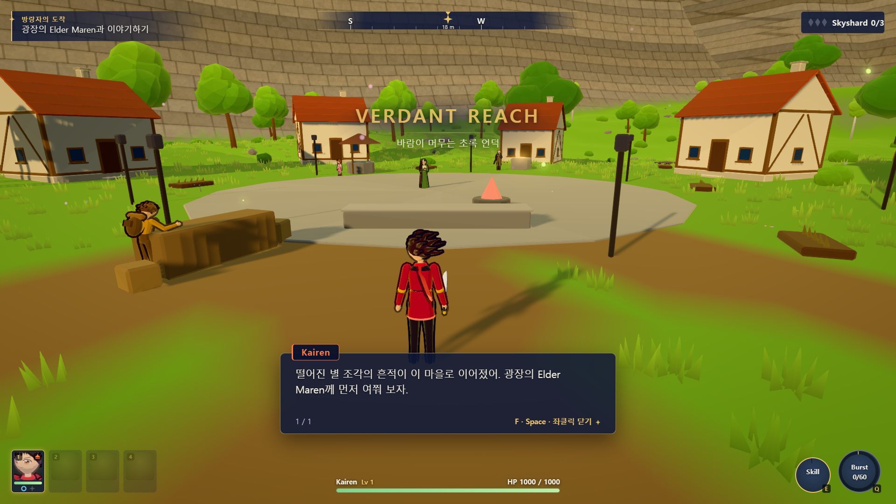
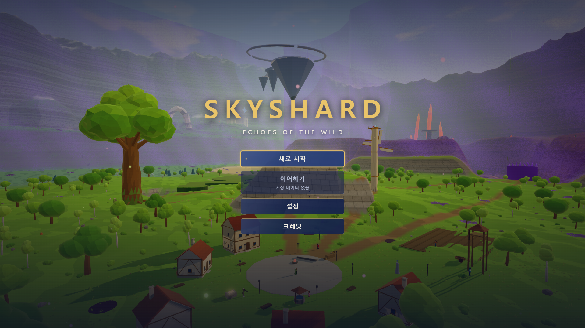
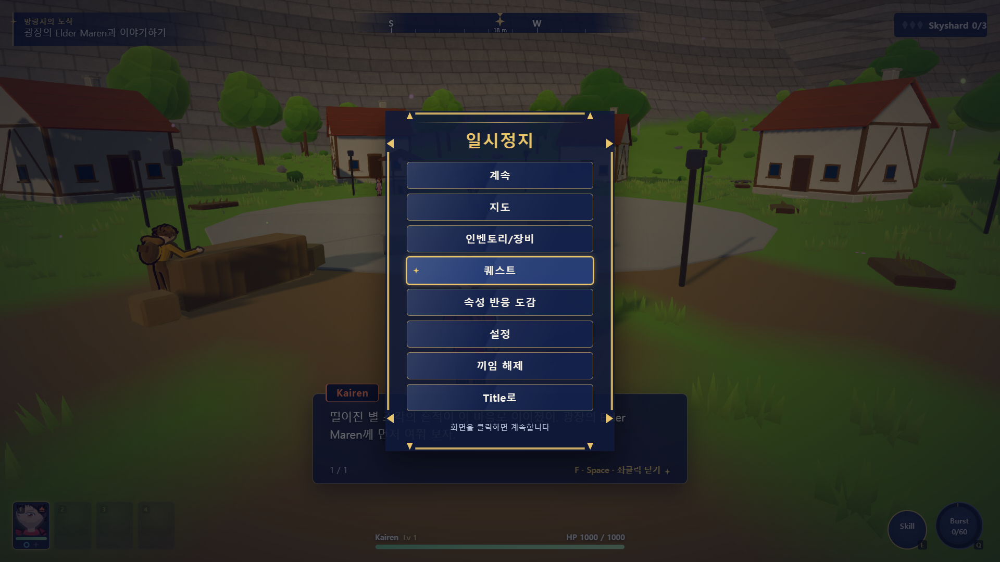
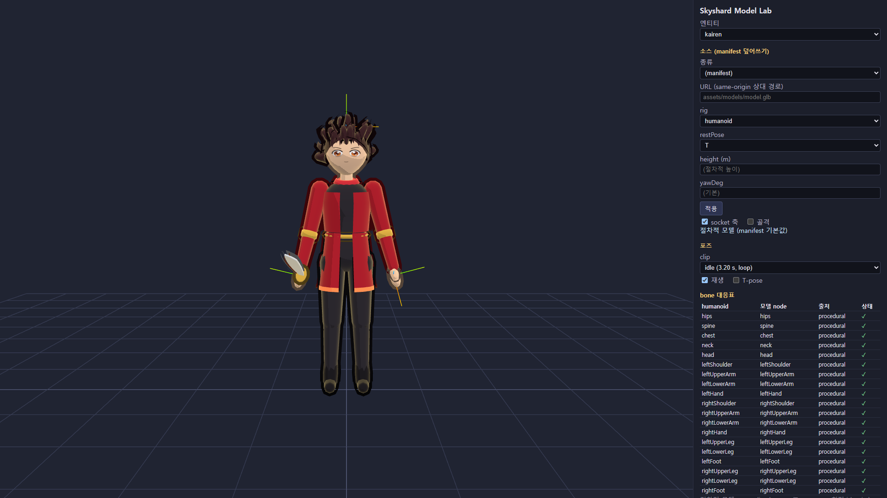

# Skyshard: Echoes of the Wild

> **Archived failure-case prototype.**
> This repository is intentionally public as a record of a project that consumed substantial implementation time but did not become a successful final product. It is kept for technical study, retrospective analysis, and as a reminder that broad implementation and test coverage do not automatically produce a good game.

## What this project tried to build

**Skyshard: Echoes of the Wild** is a browser-based 3D stylized anime-fantasy open-world action RPG built with TypeScript, Three.js, and Vite.

The target experience was a compact **20–30 minute complete adventure** that could run without installation in a modern desktop browser:

**Title → Thistlewick → Verdant Reach → Hollowroot Shrine → Skyshard 1 → Ember Ravine → Cinderspire → Skyshard 2 → Azure Highlands → Starfall Observatory → Skyshard 3 → Astral Sanctum → Caelith → Victory**

The player starts as **Kairen** and forms a four-character party with **Isla**, **Wren**, and **Talus**. Exploration combines normal traversal, climbing, gliding, landmark-based navigation, combat, puzzles, character switching, and elemental reactions.

### Intended core loop

- Explore a connected small open world rather than separate level-select stages.
- Discover distant landmarks and reach them through normal traversal, climbing, and gliding.
- Switch between four party members during combat and exploration.
- Combine **Ember**, **Tide**, **Gale**, and **Terra** effects to trigger reactions.
- Clear three major regional challenge areas and recover three Ancient Skyshards.
- Open the floating **Astral Sanctum** and fight the three-phase boss **Caelith**.
- Save progress locally and continue from milestone saves.

## Screenshots

These screenshots were captured from the repository's actual local build with Playwright on October 6, 2026. They are not mockups.

| Title screen | Gameplay |
| --- | --- |
|  |  |

| Pause / game menu | Model Lab |
| --- | --- |
|  |  |

## Game content

### World and progression

The world was designed around three main regions, each with a distinct challenge area:

| Region | Major challenge | Progression |
| --- | --- | --- |
| Verdant Reach | Hollowroot Shrine | Root / elemental puzzles, guardian, Skyshard 1 |
| Ember Ravine | Cinderspire | Vertical traversal, heat hazards, combat, Skyshard 2 |
| Azure Highlands | Starfall Observatory | Wind/glide traversal, constellation and elemental puzzles, Skyshard 3 |

After collecting all three shards, the route continues through the Resonance Altar and Starlit Stair into Astral Sanctum for the final Caelith encounter.

### Party and elements

- **Kairen** — starting character; introduces Ember combat and the first elemental setup.
- **Isla** — Tide archer; joins early and enables the first elemental reaction tutorials.
- **Wren** — Gale character focused on area control and traversal interactions.
- **Talus** — Terra defensive/support character used for shields, terrain interactions, and puzzle utility.

The combat system supports elemental marks and reactions rather than treating party members as cosmetic character swaps.

### Systems implemented in the codebase

- Fixed-step game simulation independent from render frame rate.
- Kinematic movement, collision handling, recovery, climbing, swimming, and gliding.
- Character switching, stamina, dodge, skills, burst actions, projectiles, hit shapes, and elemental reactions.
- Enemy AI, elite encounters, regional guardians, and the multi-phase Caelith boss.
- Quest progression, side quests, tutorials, puzzles, world gates, POIs, and milestone progression.
- Camera collision, lock-on, combat framing, landmark framing, shake, and title orbit.
- DOM-based HUD, dialogue, inventory, quest, map, codex, settings, pause, credits, and victory screens.
- Local save/continue flow with schema validation and recovery-oriented save handling.
- Procedural character/environment presentation with replaceable external-model support.
- Procedural music, ambience, synthesized SFX, spatial audio, and optional external asset overrides.
- A standalone **Model Lab** for character/model and animation inspection.

## Why this repository is kept as a failure case

The project has a large amount of code, specifications, automated tests, and supporting infrastructure. That is exactly why it is useful to keep.

The repository attempted a very wide surface area at once: a connected 3D world, four-character party, vertical traversal, elemental combat, three regional dungeons, a multi-stage final boss, progression, saving, UI, audio, procedural content, model replacement, and full-playthrough automation.

Despite that implementation effort, the project owner considers the resulting game a **failed outcome**, so this repository should not be read as a polished or production-ready game. It is an archive of the attempt.

The useful lesson is the gap between **engineering activity** and **product success**:

- A large specification does not guarantee a focused experience.
- Extensive systems do not guarantee that the combined game is compelling.
- Passing automated tests proves specific invariants; it does not prove that the final product is worth shipping.
- Building verification infrastructure can make a project more measurable without making the resulting product successful.

No single technical root cause is asserted here. The repository is published so the implementation, scope, and decisions can be inspected directly rather than reconstructed from a postmortem summary.

## Current verification state

As part of preparing this repository for publication on **October 6, 2026**:

- Vite/TypeScript production build completed successfully during the Playwright capture run.
- **231 Vitest files passed**.
- **1,957 unit/property tests passed**.
- The README screenshot Playwright flow passed against the built application.
- The repository includes a much larger input-only Playwright playthrough that targets Title → Victory, but that full 20–30 minute browser playthrough was not rerun as part of this publication pass.

This distinction is intentional: the repository is being published as a failure-case archive, not certified as a finished release.

## Tech stack

| Area | Technology |
| --- | --- |
| Language | TypeScript |
| Rendering | Three.js / WebGL2 |
| Character model support | @pixiv/three-vrm |
| Build tooling | Vite |
| Unit / property tests | Vitest, fast-check |
| Browser tests | Playwright |
| Persistence | localStorage |
| Audio | Web Audio API |

## Getting started

### Requirements

- Node.js
- npm
- A current desktop Chrome or Edge browser with WebGL2

### Install

~~~bash
npm ci
~~~

### Run

~~~bash
npm run dev
~~~

Open:

- Game: http://localhost:5173/
- Model Lab: http://localhost:5173/model-lab.html

On Windows, **run.bat** installs missing dependencies when necessary and starts the Vite development server:

~~~bat
run.bat
~~~

## Default controls

| Action | Input |
| --- | --- |
| Move | W / A / S / D |
| Jump | Space |
| Sprint | Left Shift |
| Attack | Left Mouse |
| Dodge | Right Mouse |
| Skill | E |
| Burst | Q |
| Switch character | 1 / 2 / 3 / 4 |
| Lock-on | Middle Mouse |
| Pause | Esc |

Most gameplay bindings are remappable in the settings UI. Some system/navigation inputs are intentionally fixed.

## Commands

| Command | Purpose |
| --- | --- |
| npm run dev | Start the Vite development server |
| npm run build | Type-check and create the static production build |
| npm run preview | Serve the production build locally |
| npm test | Run unit and property tests |
| npm run test:e2e | Run Playwright browser tests |
| npm run verify | Run build, Vitest, and Playwright verification |

## Repository structure

~~~text
Skyshard/
├─ .kiro/specs/             Requirements, design and implementation task history
├─ docs/screenshots/        Screenshots used by this README
├─ public/                  Optional/static assets and manifests
├─ scripts/                 Verification/support scripts
├─ src/
│  ├─ anim/                 Rigs, clips and procedural animation
│  ├─ audio/                Music, ambience, SFX and spatial audio
│  ├─ boss/                 Boss encounter logic
│  ├─ camera/               Camera, lock-on, collision and framing
│  ├─ cinematics/           Cinematic playback and overlays
│  ├─ combat/               Player combat and hit/projectile systems
│  ├─ core/                 Loop, events, math and shared primitives
│  ├─ data/                 Game content and configuration
│  └─ ...                   World, UI, quest, save, VFX and other systems
├─ tests/
│  ├─ unit/                 Unit tests
│  ├─ property/             Property-based tests
│  └─ e2e/                  Browser system tests and full-playthrough bot
├─ index.html               Main game entry
├─ model-lab.html           Model/animation inspection page
├─ playwright.config.ts
├─ vite.config.ts
└─ package.json
~~~

## Design documents

The original planning material is intentionally included instead of being cleaned away:

- .kiro/specs/skyshard-echoes-of-the-wild/requirements.md
- .kiro/specs/skyshard-echoes-of-the-wild/design.md
- .kiro/specs/skyshard-echoes-of-the-wild/tasks.md

They make it possible to compare the intended product with the implementation and are an important part of the failure-case record.

## Assets and credits

The project primarily generates its character, enemy, environment presentation, sound, and music content from code at runtime. Optional external assets can replace supported sounds, props, or visual models through manifests.

See [CREDITS.md](./CREDITS.md) for third-party library licenses and asset attribution.

## License

package.json currently declares **ISC**. Third-party libraries and optional assets retain their own licenses; see [CREDITS.md](./CREDITS.md).
